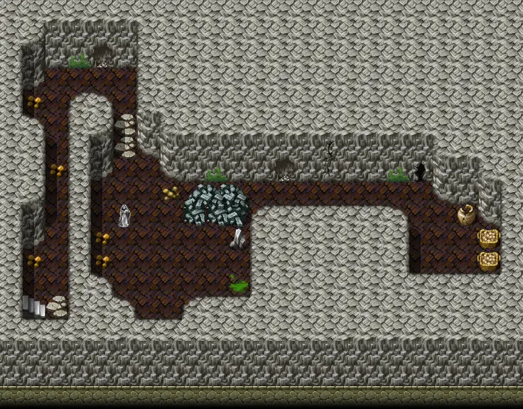

# Basiliskcave 2

| | |
|---|---|
| **Map ID** | `basiliskcave2` |
| **Type** | Indoors / underground |
| **Size** | 23×18 tiles |
| **Introduced** | [v0.7.11](../versions/0.7.11.md) |
| **Enemy types** | 3 |
| **Quests** | 1 |
| **Containers** | 2 |

**Basiliskcave 2** is an indoor map. It has no NPCs and 3 kinds of enemy. Exits lead to Basiliskcave 1 1 5.

## Map

<label class="lg"><input type="checkbox" data-t="spawn" checked><b>Red</b>&nbsp;Monsters / NPCs</label><label class="lg"><input type="checkbox" data-t="mapchange" checked><b>Blue</b>&nbsp;Exit to another map</label><label class="lg"><input type="checkbox" data-t="container" checked><b>Yellow</b>&nbsp;Container (click to see contents)</label><label class="lg"><input type="checkbox" data-t="sign" checked><b>Purple</b>&nbsp;Sign</label><label class="lg"><input type="checkbox" data-t="rest" checked><b>Green</b>&nbsp;Resting place</label><label class="lg"><input type="checkbox" data-t="key" checked><b>Orange dashed</b>&nbsp;Blocked until a quest step / item</label><label class="lg"><input type="checkbox" data-t="script"><b>Grey dotted</b>&nbsp;Scripted event</label><label class="lg"><input type="checkbox" data-t="replace"><b>White dotted</b>&nbsp;Changes during a quest</label><label class="lg"><input type="checkbox" data-t="pin" checked><b>Numbers</b>&nbsp;Numbered key points (see the key below the map)</label>

<a class="pin pin-exit" href="#key-1" style="left:6.522%;top:75.000%" title="Exit (west): to [Basiliskcave 1 1 5](basiliskcave1_1_5.md)">1</a><a class="pin pin-replace" href="#key-2" style="left:23.913%;top:52.778%" title="Changes during a quest: This area changes during the quest: hidden story flag “quick_glance_hidden_found_statue” (stage 20: “Removed Statue”)">2</a><a class="pin pin-container" href="#key-3" style="left:93.478%;top:63.889%" title="Container 1: Hand mirror">3</a><a class="pin pin-container" href="#key-4" style="left:93.478%;top:58.333%" title="Container 2: Gold coins">4</a><a class="pin pin-script" href="#key-5" style="left:45.652%;top:69.444%" title="Quest trigger: Scripted event: advances the quest: A quick glance to stage 80 (“I killed the Basilisk.”) (+1 more quest(s))">5</a><a class="pin pin-script" href="#key-6" style="left:28.261%;top:66.667%" title="Quest trigger: Scripted event: advances the quest: hidden story flag “quick_glance_hidden_position” to stage 110 (“Basilisk blocked”)">6</a><a class="pin pin-script" href="#key-6" style="left:28.547%;top:62.500%" title="Quest trigger: Scripted event: advances the quest: hidden story flag “quick_glance_hidden_position” to stage 110 (“Basilisk blocked”)">6</a><a class="pin pin-script" href="#key-6" style="left:32.609%;top:52.778%" title="Quest trigger: Scripted event: advances the quest: hidden story flag “quick_glance_hidden_position” to stage 110 (“Basilisk blocked”)">6</a><a class="pin pin-key" href="#key-7" style="left:24.199%;top:48.612%" title="Blocked passage: Unlocked during the quest: hidden story flag “quick_glance_hidden_found_statue” (stage 20: “Removed Statue”)">7</a><a class="pin pin-key" href="#key-8" style="left:36.957%;top:63.889%" title="Blocked passage: Closed off once you reach this point in the quest: hidden story flag “quick_glance_hidden_position” (stage 110: “Basilisk blocked”)">8</a>

??? abstract "Key to the numbers on the map"

    | # | What | Details |
    |---|---|---|
    | 1 | Exit (west) | to [Basiliskcave 1 1 5](basiliskcave1_1_5.md) |
    | 2 | Changes during a quest | This area changes during the quest: hidden story flag “quick_glance_hidden_found_statue” (stage 20: “Removed Statue”) |
    | 3 | Container 1 | Hand mirror |
    | 4 | Container 2 | Gold coins |
    | 5 | Quest trigger | Scripted event: advances the quest: A quick glance to stage 80 (“I killed the Basilisk.”) (+1 more quest(s)) |
    | 6 | Quest trigger | Scripted event: advances the quest: hidden story flag “quick_glance_hidden_position” to stage 110 (“Basilisk blocked”) |
    | 7 | Blocked passage | Unlocked during the quest: hidden story flag “quick_glance_hidden_found_statue” (stage 20: “Removed Statue”) |
    | 8 | Blocked passage | Closed off once you reach this point in the quest: hidden story flag “quick_glance_hidden_position” (stage 110: “Basilisk blocked”) |

Verified against v0.8.18 map data.

## Connections

| Direction | Leads to | Region there | Map # |
|---|---|---|---|
| West | [Basiliskcave 1 1 5](basiliskcave1_1_5.md) | – | 1 |

## Enemies

| Enemy | HP | Damage | Up to | Notes |
|---|---|---|---|---|
| [Venomous cave serpent](../monsters/venomous_cave_serpent.md) | 30 | 3–7 | 1 | shares spawn with Tough cave serpent |
| [Tough cave serpent](../monsters/tough_cave_serpent.md) | 40 | 3–9 | 1 | shares spawn with Venomous cave serpent |
| [Ancient basilisk](../monsters/old_basilisk.md) | 120 | 5–8 | 1 | – |

<small>“Up to” is the most that can be alive at once from the spawn areas on this map.</small>

## Items & containers

<b>Container 1</b><ul><li><a href="../../items/hand_mirror/">Hand mirror</a> <small>100%</small></li></ul>

<b>Container 2</b><ul><li><a href="../../items/gold/">Gold coins</a> <small>100% · ×2 to 20</small></li></ul>

## Quests

- [A quick glance](../quests/quick_glance.md): something on this map advances it; stepping on a trigger here sets stage 80; stepping on a trigger here sets stage 85
- [Quick glance: position (hidden flag)](../quests/quick_glance_hidden_position.md): blocked passage closes at stage 110; something on this map advances it; stepping on a trigger here sets stage 110
- [Quick glance: statue found (hidden flag)](../quests/quick_glance_hidden_found_statue.md): blocked passage opens at stage 20; part of the map changes at stage 20; something on this map advances it; stepping on a trigger here sets stage 20; stepping on a trigger here sets stage 30

## Points of interest

- **Changes during a quest** (#2): This area changes during the quest: hidden story flag “quick_glance_hidden_found_statue” (stage 20: “Removed Statue”)
- **Quest trigger** (#5): Scripted event: advances the quest: A quick glance to stage 80 (“I killed the Basilisk.”) (+1 more quest(s))
- **Quest trigger** (#6): Scripted event: advances the quest: hidden story flag “quick_glance_hidden_position” to stage 110 (“Basilisk blocked”)
- **Blocked passage** (#7): Unlocked during the quest: hidden story flag “quick_glance_hidden_found_statue” (stage 20: “Removed Statue”)
- **Blocked passage** (#8): Closed off once you reach this point in the quest: hidden story flag “quick_glance_hidden_position” (stage 110: “Basilisk blocked”)

## Version history

| Version | Change |
|---|---|
| [v0.7.11](../versions/0.7.11.md) | Added |
| [v0.8.2](../versions/0.8.2.md) | Map layout or objects changed |
| [v0.8.12.1](../versions/0.8.12.1.md) | Map layout or objects changed |

Verified against v0.8.18 and every earlier release back to v0.7.0 (game data compared release by release).

## Community notes

<small>Written by players, not generated from game data. **Observations**: what players notice in-game · **Lore**: the in-world story · **Trivia**: real-world facts, references, development history · **Theory / speculation**: unconfirmed ideas; may just be unfinished content</small>

### Observations

*No notes yet. Contributions are welcome: [add a note](https://github.com/asdfghjkl628/Andor-s-Trail-Wikiiii/new/main/notes/maps?filename=basiliskcave2.md&value=%23%23%20Observations%0A%0A%3C%21--%20what%20players%20notice%20in-game%20--%3E%0A%0A%23%23%20Lore%0A%0A%3C%21--%20the%20in-world%20story%20--%3E%0A%0A%23%23%20Trivia%0A%0A%3C%21--%20real-world%20facts%2C%20references%2C%20development%20history%20--%3E%0A%0A%23%23%20Theory%20/%20speculation%0A%0A%3C%21--%20unconfirmed%20ideas%3B%20may%20just%20be%20unfinished%20content%20--%3E%0A).*

### Lore

*No notes yet. Contributions are welcome: [add a note](https://github.com/asdfghjkl628/Andor-s-Trail-Wikiiii/new/main/notes/maps?filename=basiliskcave2.md&value=%23%23%20Observations%0A%0A%3C%21--%20what%20players%20notice%20in-game%20--%3E%0A%0A%23%23%20Lore%0A%0A%3C%21--%20the%20in-world%20story%20--%3E%0A%0A%23%23%20Trivia%0A%0A%3C%21--%20real-world%20facts%2C%20references%2C%20development%20history%20--%3E%0A%0A%23%23%20Theory%20/%20speculation%0A%0A%3C%21--%20unconfirmed%20ideas%3B%20may%20just%20be%20unfinished%20content%20--%3E%0A).*

### Trivia

*No notes yet. Contributions are welcome: [add a note](https://github.com/asdfghjkl628/Andor-s-Trail-Wikiiii/new/main/notes/maps?filename=basiliskcave2.md&value=%23%23%20Observations%0A%0A%3C%21--%20what%20players%20notice%20in-game%20--%3E%0A%0A%23%23%20Lore%0A%0A%3C%21--%20the%20in-world%20story%20--%3E%0A%0A%23%23%20Trivia%0A%0A%3C%21--%20real-world%20facts%2C%20references%2C%20development%20history%20--%3E%0A%0A%23%23%20Theory%20/%20speculation%0A%0A%3C%21--%20unconfirmed%20ideas%3B%20may%20just%20be%20unfinished%20content%20--%3E%0A).*

### Theory / speculation

*No notes yet. Contributions are welcome: [add a note](https://github.com/asdfghjkl628/Andor-s-Trail-Wikiiii/new/main/notes/maps?filename=basiliskcave2.md&value=%23%23%20Observations%0A%0A%3C%21--%20what%20players%20notice%20in-game%20--%3E%0A%0A%23%23%20Lore%0A%0A%3C%21--%20the%20in-world%20story%20--%3E%0A%0A%23%23%20Trivia%0A%0A%3C%21--%20real-world%20facts%2C%20references%2C%20development%20history%20--%3E%0A%0A%23%23%20Theory%20/%20speculation%0A%0A%3C%21--%20unconfirmed%20ideas%3B%20may%20just%20be%20unfinished%20content%20--%3E%0A).*

??? info "Technical information"

    | | |
    |---|---|
    | Map ID | `basiliskcave2` |
    | File | `res/xml/basiliskcave2.tmx` |
    | Size | 23×18 tiles (736×576 px) |
    | outdoors property | – |
    | Layers drawn | ground, objects, above |
    | Tilesets | map_bed_1, map_border_1, map_bridge_1, map_bridge_2, map_broken_1, map_cavewall_1, map_cavewall_2, map_cavewall_3, map_cavewall_4, map_chair_table_1, map_chair_table_2, map_crate_1, map_cupboard_1, map_curtain_1, map_entrance_1, map_entrance_2, map_fence_1, map_fence_2, map_fence_3, map_fence_4, map_ground_1, map_ground_2, map_ground_3, map_ground_4, map_ground_5, map_ground_6, map_ground_7, map_ground_8, map_house_1, map_house_2, map_indoor_1, map_indoor_2, map_kitchen_1, map_outdoor_1, map_pillar_1, map_pillar_2, map_plant_1, map_plant_2, map_rock_1, map_rock_2, map_roof_1, map_roof_2, map_roof_3, map_shop_1, map_sign_ladder_1, map_table_1, map_trail_1, map_transition_1, map_transition_2, map_transition_3, map_transition_4, map_transition_5, map_tree_1, map_tree_2, map_wall_1, map_wall_2, map_wall_3, map_wall_4, map_window_1, map_window_2 |
    | Map objects | script: 7, container: 2, spawn: 2, key: 2, replace: 1, mapchange: 1 |
    | World map position | – |

<small>Data from v0.8.18</small>
