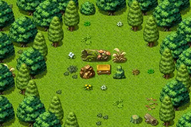
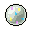

# Beekeeper2

| | |
|---|---|
| **Map ID** | `beekeeper2` |
| **Region** | Near Foaming Flask Tavern (other) |
| **Type** | Outdoors |
| **Size** | 12×8 tiles |
| **World map** | [World1](index.md) |
| **Introduced** | [v0.8.12.1](../versions/0.8.12.1.md) |
| **Enemy types** | 2 |
| **Quests** | 0 |
| **Containers** | 6 |

**Beekeeper2** is an outdoor map, near Foaming Flask Tavern (other). It has no NPCs and 2 kinds of enemy. Exits lead to Beekeeper1.

## Map

<label class="lg"><input type="checkbox" data-t="spawn" checked><b>Red</b>&nbsp;Monsters / NPCs</label><label class="lg"><input type="checkbox" data-t="mapchange" checked><b>Blue</b>&nbsp;Exit to another map</label><label class="lg"><input type="checkbox" data-t="container" checked><b>Yellow</b>&nbsp;Container (click to see contents)</label><label class="lg"><input type="checkbox" data-t="sign" checked><b>Purple</b>&nbsp;Sign</label><label class="lg"><input type="checkbox" data-t="rest" checked><b>Green</b>&nbsp;Resting place</label><label class="lg"><input type="checkbox" data-t="key" checked><b>Orange dashed</b>&nbsp;Blocked until a quest step / item</label><label class="lg"><input type="checkbox" data-t="script"><b>Grey dotted</b>&nbsp;Scripted event</label><label class="lg"><input type="checkbox" data-t="replace"><b>White dotted</b>&nbsp;Changes during a quest</label><label class="lg"><input type="checkbox" data-t="pin" checked><b>Numbers</b>&nbsp;Numbered key points (see the key below the map)</label>

<a class="pin pin-exit" href="#key-1" style="left:54.167%;top:93.750%" title="Exit (south): to [Beekeeper1](beekeeper1.md)">1</a><a class="pin pin-container" href="#key-2" style="left:45.833%;top:56.250%" title="Container 1: Gold coins, Hand carved snowball">2</a><a class="pin pin-container" href="#key-3" style="left:45.833%;top:43.750%" title="Container 2: Gold coins, Coconut">3</a><a class="pin pin-container" href="#key-4" style="left:54.167%;top:43.750%" title="Container 3: Gold coins, Cold Lava Rock">4</a><a class="pin pin-container" href="#key-5" style="left:62.500%;top:43.750%" title="Container 4: Gold coins, Mead, Red apple">5</a><a class="pin pin-container" href="#key-6" style="left:62.500%;top:56.250%" title="Container 5: Gold coins, Sparkling egg">6</a><a class="pin pin-container" href="#key-7" style="left:54.167%;top:56.250%" title="Container 6: Gold coins">7</a><a class="pin pin-key" href="#key-8" style="left:50.038%;top:64.476%" title="Blocked passage: Unlocked during the quest: hidden story flag “guynmart_nondisplay” (stage 51: “51=Clearing_winter”)">8</a><a class="pin pin-key" href="#key-9" style="left:46.382%;top:34.376%" title="Blocked passage: Unlocked during the quest: hidden story flag “guynmart_nondisplay” (stage 52: “52=Clearing_tropic”)">9</a><a class="pin pin-key" href="#key-10" style="left:54.715%;top:34.376%" title="Blocked passage: Unlocked during the quest: hidden story flag “guynmart_nondisplay” (stage 53: “53=Clearing_lava”)">10</a><a class="pin pin-key" href="#key-11" style="left:63.048%;top:34.376%" title="Blocked passage: Unlocked during the quest: hidden story flag “guynmart_nondisplay” (stage 54: “54=Clearing_abstract”)">11</a><a class="pin pin-key" href="#key-12" style="left:66.705%;top:64.476%" title="Blocked passage: Unlocked during the quest: hidden story flag “guynmart_nondisplay” (stage 55: “55=Clearing_inverted”)">12</a><a class="pin pin-key" href="#key-13" style="left:58.371%;top:64.476%" title="Blocked passage: Unlocked during the quest: hidden story flag “guynmart_nondisplay” (stage 59: “59=Clearing_normal”)">13</a>

??? abstract "Key to the numbers on the map"

    | # | What | Details |
    |---|---|---|
    | 1 | Exit (south) | to [Beekeeper1](beekeeper1.md) |
    | 2 | Container 1 | Gold coins, Hand carved snowball |
    | 3 | Container 2 | Gold coins, Coconut |
    | 4 | Container 3 | Gold coins, Cold Lava Rock |
    | 5 | Container 4 | Gold coins, Mead, Red apple |
    | 6 | Container 5 | Gold coins, Sparkling egg |
    | 7 | Container 6 | Gold coins |
    | 8 | Blocked passage | Unlocked during the quest: hidden story flag “guynmart_nondisplay” (stage 51: “51=Clearing_winter”) |
    | 9 | Blocked passage | Unlocked during the quest: hidden story flag “guynmart_nondisplay” (stage 52: “52=Clearing_tropic”) |
    | 10 | Blocked passage | Unlocked during the quest: hidden story flag “guynmart_nondisplay” (stage 53: “53=Clearing_lava”) |
    | 11 | Blocked passage | Unlocked during the quest: hidden story flag “guynmart_nondisplay” (stage 54: “54=Clearing_abstract”) |
    | 12 | Blocked passage | Unlocked during the quest: hidden story flag “guynmart_nondisplay” (stage 55: “55=Clearing_inverted”) |
    | 13 | Blocked passage | Unlocked during the quest: hidden story flag “guynmart_nondisplay” (stage 59: “59=Clearing_normal”) |

Verified against v0.8.18 map data.

## Connections

| Direction | Leads to | Region there | Map # |
|---|---|---|---|
| South | [Beekeeper1](beekeeper1.md) | Foaming Flask Tavern | 1 |

## Enemies

| Enemy | HP | Damage | Up to | Notes |
|---|---|---|---|---|
| [Forest beetle](../monsters/forest_beetle.md) | 14 | 2–4 | 1 | – |
| [Vicious hound](../monsters/vicious_hound.md) | 31 | 3–9 | 3 | – |

<small>“Up to” is the most that can be alive at once from the spawn areas on this map.</small>

## Items & containers

<b>Container 1</b><ul><li><a href="../../items/gold/">Gold coins</a> <small>100% · ×50 to 150</small></li><li><a href="../../items/handcarved_snowball/">Hand carved snowball</a> <small>100%</small></li></ul>

<b>Container 2</b><ul><li><a href="../../items/gold/">Gold coins</a> <small>100% · ×50 to 150</small></li><li><a href="../../items/coconut/">Coconut</a> <small>100%</small></li></ul>

<b>Container 3</b><ul><li><a href="../../items/gold/">Gold coins</a> <small>100% · ×50 to 150</small></li><li><a href="../../items/lava_rock_cold/">Cold Lava Rock</a> <small>100%</small></li></ul>

<b>Container 4</b><ul><li><a href="../../items/gold/">Gold coins</a> <small>100% · ×50 to 150</small></li><li><a href="../../items/mead/">Mead</a> <small>100% · ×10 to 15</small></li><li><a href="../../items/apple_red/">Red apple</a> <small>100% · ×1 to 2</small></li></ul>

<b>Container 5</b><ul><li><a href="../../items/gold/">Gold coins</a> <small>100% · ×-150 to -50</small></li><li><a href="../../items/clear_egg/">Sparkling egg</a> <small>100%</small></li></ul>

<b>Container 6</b><ul><li><a href="../../items/gold/">Gold coins</a> <small>100% · ×50 to 150</small></li></ul>

## Quests

- [guynmart nondisplay (hidden flag)](../quests/guynmart_nondisplay.md): blocked passage opens at stage 51; blocked passage opens at stage 52; blocked passage opens at stage 53; blocked passage opens at stage 54; blocked passage opens at stage 55; blocked passage opens at stage 59

## Points of interest

- **Blocked passage** (#8): Unlocked during the quest: hidden story flag “guynmart_nondisplay” (stage 51: “51=Clearing_winter”)
- **Blocked passage** (#9): Unlocked during the quest: hidden story flag “guynmart_nondisplay” (stage 52: “52=Clearing_tropic”)
- **Blocked passage** (#10): Unlocked during the quest: hidden story flag “guynmart_nondisplay” (stage 53: “53=Clearing_lava”)
- **Blocked passage** (#11): Unlocked during the quest: hidden story flag “guynmart_nondisplay” (stage 54: “54=Clearing_abstract”)
- **Blocked passage** (#12): Unlocked during the quest: hidden story flag “guynmart_nondisplay” (stage 55: “55=Clearing_inverted”)
- **Blocked passage** (#13): Unlocked during the quest: hidden story flag “guynmart_nondisplay” (stage 59: “59=Clearing_normal”)

## Version history

| Version | Change |
|---|---|
| [v0.8.12.1](../versions/0.8.12.1.md) | Added |

Verified against v0.8.18 and every earlier release back to v0.7.0 (game data compared release by release).

## Community notes

<small>Written by players, not generated from game data. **Observations**: what players notice in-game · **Lore**: the in-world story · **Trivia**: real-world facts, references, development history · **Theory / speculation**: unconfirmed ideas; may just be unfinished content</small>

### Observations

*No notes yet. Contributions are welcome: [add a note](https://github.com/asdfghjkl628/Andor-s-Trail-Wikiiii/new/main/notes/maps?filename=beekeeper2.md&value=%23%23%20Observations%0A%0A%3C%21--%20what%20players%20notice%20in-game%20--%3E%0A%0A%23%23%20Lore%0A%0A%3C%21--%20the%20in-world%20story%20--%3E%0A%0A%23%23%20Trivia%0A%0A%3C%21--%20real-world%20facts%2C%20references%2C%20development%20history%20--%3E%0A%0A%23%23%20Theory%20/%20speculation%0A%0A%3C%21--%20unconfirmed%20ideas%3B%20may%20just%20be%20unfinished%20content%20--%3E%0A).*

### Lore

*No notes yet. Contributions are welcome: [add a note](https://github.com/asdfghjkl628/Andor-s-Trail-Wikiiii/new/main/notes/maps?filename=beekeeper2.md&value=%23%23%20Observations%0A%0A%3C%21--%20what%20players%20notice%20in-game%20--%3E%0A%0A%23%23%20Lore%0A%0A%3C%21--%20the%20in-world%20story%20--%3E%0A%0A%23%23%20Trivia%0A%0A%3C%21--%20real-world%20facts%2C%20references%2C%20development%20history%20--%3E%0A%0A%23%23%20Theory%20/%20speculation%0A%0A%3C%21--%20unconfirmed%20ideas%3B%20may%20just%20be%20unfinished%20content%20--%3E%0A).*

### Trivia

*No notes yet. Contributions are welcome: [add a note](https://github.com/asdfghjkl628/Andor-s-Trail-Wikiiii/new/main/notes/maps?filename=beekeeper2.md&value=%23%23%20Observations%0A%0A%3C%21--%20what%20players%20notice%20in-game%20--%3E%0A%0A%23%23%20Lore%0A%0A%3C%21--%20the%20in-world%20story%20--%3E%0A%0A%23%23%20Trivia%0A%0A%3C%21--%20real-world%20facts%2C%20references%2C%20development%20history%20--%3E%0A%0A%23%23%20Theory%20/%20speculation%0A%0A%3C%21--%20unconfirmed%20ideas%3B%20may%20just%20be%20unfinished%20content%20--%3E%0A).*

### Theory / speculation

*No notes yet. Contributions are welcome: [add a note](https://github.com/asdfghjkl628/Andor-s-Trail-Wikiiii/new/main/notes/maps?filename=beekeeper2.md&value=%23%23%20Observations%0A%0A%3C%21--%20what%20players%20notice%20in-game%20--%3E%0A%0A%23%23%20Lore%0A%0A%3C%21--%20the%20in-world%20story%20--%3E%0A%0A%23%23%20Trivia%0A%0A%3C%21--%20real-world%20facts%2C%20references%2C%20development%20history%20--%3E%0A%0A%23%23%20Theory%20/%20speculation%0A%0A%3C%21--%20unconfirmed%20ideas%3B%20may%20just%20be%20unfinished%20content%20--%3E%0A).*

??? info "Technical information"

    | | |
    |---|---|
    | Map ID | `beekeeper2` |
    | File | `res/xml/beekeeper2.tmx` |
    | Size | 12×8 tiles (384×256 px) |
    | outdoors property | 1 |
    | Layers drawn | base, ground, objects, above |
    | Tilesets | map_bed_1, map_border_1, map_bridge_1, map_bridge_2, map_broken_1, map_cavewall_1, map_cavewall_2, map_cavewall_3, map_cavewall_4, map_chair_table_1, map_chair_table_2, map_crate_1, map_cupboard_1, map_curtain_1, map_entrance_1, map_entrance_2, map_fence_1, map_fence_2, map_fence_3, map_fence_4, map_ground_1, map_ground_2, map_ground_3, map_ground_4, map_ground_5, map_ground_6, map_ground_7, map_ground_8, map_guynmart, map_house_1, map_house_2, map_indoor_1, map_indoor_2, map_kitchen_1, map_outdoor_1, map_pillar_1, map_pillar_2, map_plant_1, map_plant_2, map_rock_1, map_rock_2, map_roof_1, map_roof_2, map_roof_3, map_shop_1, map_sign_ladder_1, map_table_1, map_trail_1, map_transition_1, map_transition_2, map_transition_3, map_transition_4, map_transition_5, map_tree_1, map_tree_2, map_tree_3, map_tree_4, map_wall_1, map_wall_2, map_wall_3, map_wall_4, map_window_1, map_window_2 |
    | Map objects | container: 6, key: 6, replace: 6, spawn: 2, mapchange: 1 |
    | World map position | segment `world1`, x 382, y 420 |

<small>Data from v0.8.18</small>
