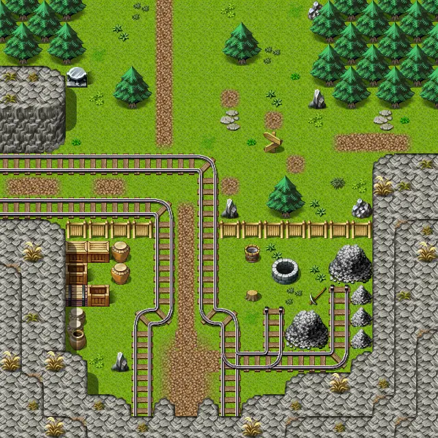

# Blackwater mountain10

20×20 tiles · outdoors · part of [World1](index.md)

<label class="lg lg-spawn"><input type="checkbox" data-t="spawn" checked> Monsters / NPCs</label><label class="lg lg-mapchange"><input type="checkbox" data-t="mapchange" checked> Exit to another map</label><label class="lg lg-container"><input type="checkbox" data-t="container" checked> Container</label><label class="lg lg-sign"><input type="checkbox" data-t="sign" checked> Sign</label><label class="lg lg-rest"><input type="checkbox" data-t="rest" checked> Resting place</label><label class="lg lg-key"><input type="checkbox" data-t="key" checked> Blocked / needs key or quest</label><label class="lg lg-script"><input type="checkbox" data-t="script"> Scripted event</label><label class="lg lg-replace"><input type="checkbox" data-t="replace"> Changes after a quest</label>

## Exits

- [Blackwater mountain11](blackwater_mountain11.md)
- [Blackwater mountain12](blackwater_mountain12.md)
- [Blackwater mountain14](blackwater_mountain14.md)
- [Blackwater mountain9](blackwater_mountain9.md)

## Monsters & NPCs here

| Name | HP |
|---|---|
| [Feygard patrol guard](../monsters/ortholion_guard3.md) | 0 |
| [Tonis](../monsters/tonis.md) | 0 |
| [Feygard scout](../monsters/ortholion_guard6.md) | 0 |
| [Feygard mountain scout](../monsters/ortholion_guard5.md) | 0 |
| [Vicious hound](../monsters/vicious_hound.md) | 31 |
| [Mountain wolf](../monsters/mountain_wolf.md) | 49 |

<small>Map ID: `blackwater_mountain10` · Data from v0.8.18</small>
