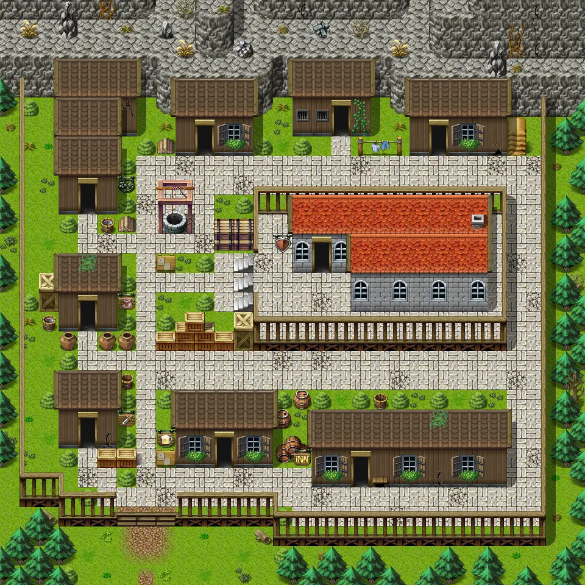

# Blackwater mountain11

30×30 tiles · outdoors · part of [World1](index.md)

<label class="lg lg-spawn"><input type="checkbox" data-t="spawn" checked> Monsters / NPCs</label><label class="lg lg-mapchange"><input type="checkbox" data-t="mapchange" checked> Exit to another map</label><label class="lg lg-container"><input type="checkbox" data-t="container" checked> Container</label><label class="lg lg-sign"><input type="checkbox" data-t="sign" checked> Sign</label><label class="lg lg-rest"><input type="checkbox" data-t="rest" checked> Resting place</label><label class="lg lg-key"><input type="checkbox" data-t="key" checked> Blocked / needs key or quest</label><label class="lg lg-script"><input type="checkbox" data-t="script"> Scripted event</label><label class="lg lg-replace"><input type="checkbox" data-t="replace"> Changes after a quest</label>

## Exits

- [Blackwater mountain10](blackwater_mountain10.md)
- [Blackwater mountain21](blackwater_mountain21.md)
- [Blackwater mountain22](blackwater_mountain22.md)
- [Blackwater mountain23](blackwater_mountain23.md)
- [Blackwater mountain24](blackwater_mountain24.md)
- [Blackwater mountain25](blackwater_mountain25.md)
- [Blackwater mountain26](blackwater_mountain26.md)
- [Blackwater mountain27](blackwater_mountain27.md)
- [Blackwater mountain28](blackwater_mountain28.md)
- [Blackwater mountain29](blackwater_mountain29.md)

## Monsters & NPCs here

| Name | HP |
|---|---|
| [General Ortholion](../monsters/ortholion_hidden.md) | 0 |
| [Moyra](../monsters/moyra.md) | 0 |
| [Prim resident](../monsters/prim_resident.md) | 0 |
| [Ehrenfest](../monsters/ehrenfest.md) | 0 |
| [Prim commoner](../monsters/prim_commoner.md) | 0 |
| [General's henchman](../monsters/ortholion_guard1.md) | 0 |
| [Prim evoker](../monsters/prim_evoker.md) | 0 |
| [Prim citizen](../monsters/prim_citizen.md) | 0 |
| [General's henchman](../monsters/ortholion_guard_hidden.md) | 0 |

<small>Map ID: `blackwater_mountain11` · Data from v0.8.18</small>
