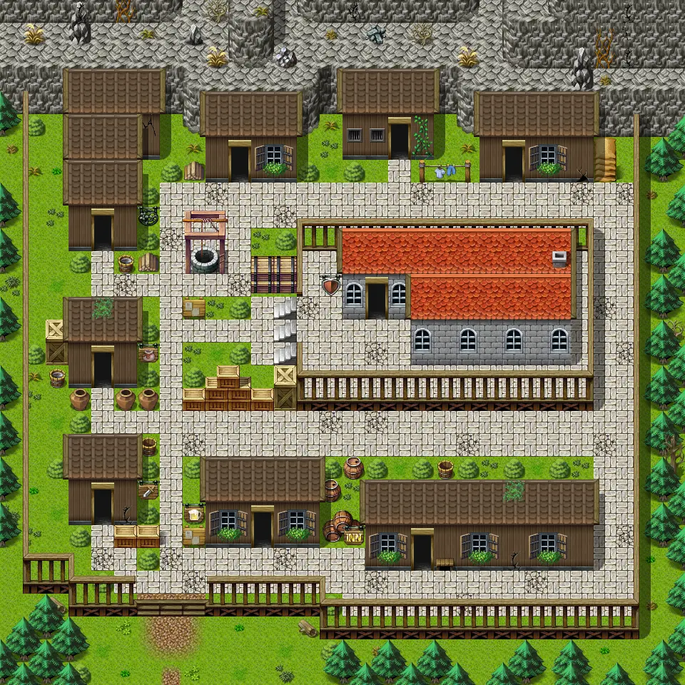

# Blackwater mountain11

| | |
|---|---|
| **Map ID** | `blackwater_mountain11` |
| **Region** | In Prim (settlement) |
| **Type** | Outdoors |
| **Size** | 30×30 tiles |
| **World map** | [World1](index.md) |
| **Introduced** | v0.7.0 or earlier |
| **NPCs** | 7 |
| **Enemy types** | 2 |
| **Quests** | 2 |

**Blackwater mountain11** is an outdoor map, in Prim (settlement). It has 7 NPCs and 2 kinds of enemy. Exits lead to Blackwater mountain10, Blackwater mountain21, Blackwater mountain22, Blackwater mountain23 and 6 more.

## Map

<label class="lg"><input type="checkbox" data-t="spawn" checked><b>Red</b>&nbsp;Monsters / NPCs</label><label class="lg"><input type="checkbox" data-t="mapchange" checked><b>Blue</b>&nbsp;Exit to another map</label><label class="lg"><input type="checkbox" data-t="container" checked><b>Yellow</b>&nbsp;Container (click to see contents)</label><label class="lg"><input type="checkbox" data-t="sign" checked><b>Purple</b>&nbsp;Sign</label><label class="lg"><input type="checkbox" data-t="rest" checked><b>Green</b>&nbsp;Resting place</label><label class="lg"><input type="checkbox" data-t="key" checked><b>Orange dashed</b>&nbsp;Blocked until a quest step / item</label><label class="lg"><input type="checkbox" data-t="script"><b>Grey dotted</b>&nbsp;Scripted event</label><label class="lg"><input type="checkbox" data-t="replace"><b>White dotted</b>&nbsp;Changes during a quest</label><label class="lg"><input type="checkbox" data-t="pin" checked><b>Numbers</b>&nbsp;Numbered key points (see the key below the map)</label>

<a class="pin pin-exit" href="#key-1" style="left:30.000%;top:98.333%" title="Exit (south): to [Blackwater mountain10](../blackwater_mountain10.md)">1</a><a class="pin pin-exit" href="#key-2" style="left:61.667%;top:81.667%" title="Exit (door): to [Blackwater mountain21](../blackwater_mountain21.md)">2</a><a class="pin pin-exit" href="#key-3" style="left:38.333%;top:78.333%" title="Exit (door): to [Blackwater mountain22](../blackwater_mountain22.md)">3</a><a class="pin pin-exit" href="#key-4" style="left:15.000%;top:75.000%" title="Exit (door): to [Blackwater mountain23](../blackwater_mountain23.md)">4</a><a class="pin pin-exit" href="#key-5" style="left:15.000%;top:55.000%" title="Exit (door): to [Blackwater mountain24](../blackwater_mountain24.md)">5</a><a class="pin pin-exit" href="#key-6" style="left:15.000%;top:35.000%" title="Exit (door): to [Blackwater mountain25](../blackwater_mountain25.md)">6</a><a class="pin pin-exit" href="#key-7" style="left:35.000%;top:25.000%" title="Exit (door): to [Blackwater mountain26](../blackwater_mountain26.md)">7</a><a class="pin pin-exit" href="#key-8" style="left:58.333%;top:21.667%" title="Exit (door): to [Blackwater mountain27](../blackwater_mountain27.md)">8</a><a class="pin pin-exit" href="#key-9" style="left:75.000%;top:25.000%" title="Exit (door): to [Blackwater mountain28](../blackwater_mountain28.md)">9</a><a class="pin pin-exit" href="#key-10" style="left:55.000%;top:45.000%" title="Exit (door): to [Blackwater mountain29](../blackwater_mountain29.md)">10</a><a class="pin pin-npc" href="#key-11" style="left:48.333%;top:48.333%" title="[Ehrenfest](../../monsters/ehrenfest.md): 1 quest">11</a><a class="pin pin-npc" href="#key-12" style="left:15.000%;top:91.667%" title="[General&#x27;s henchman](../../monsters/ortholion_guard1.md): shopkeeper">12</a><a class="pin pin-npc" href="#key-13" style="left:8.333%;top:21.667%" title="[Moyra](../../monsters/moyra.md): NPC">13</a><a class="pin pin-npc" href="#key-14" style="left:41.667%;top:85.000%" title="[Prim citizen](../../monsters/prim_citizen.md): 1 quest">14</a><a class="pin pin-npc" href="#key-15" style="left:45.000%;top:65.000%" title="[Prim commoner](../../monsters/prim_commoner.md): NPC">15</a><a class="pin pin-npc" href="#key-16" style="left:51.667%;top:31.667%" title="[Prim evoker](../../monsters/prim_evoker.md): NPC">16</a><a class="pin pin-npc" href="#key-17" style="left:28.333%;top:31.667%" title="[Prim resident](../../monsters/prim_resident.md): 1 quest">17</a><a class="pin pin-script" href="#key-18" style="left:38.333%;top:81.667%" title="Quest trigger: Scripted event: advances the quest: hidden story flag “quest_burhczyd_nd” to stage 59 (“59=show oven in Prim”)">18</a><a class="pin pin-sign" href="#key-19" style="left:28.333%;top:45.000%" title="Sign: “Notice to all citizens: No one is allowed to enter the mines at night! Furthermore, climbing the mountain side is strictly forbidden after the accident with Lorn.”">19</a><a class="pin pin-sign" href="#key-20" style="left:28.333%;top:78.333%" title="Sign: “Missing persons:
 - Duala
 - Lorn
 - Kamelio”">20</a><a class="pin pin-script" href="#key-21" style="left:45.000%;top:48.333%" title="Quest trigger: Scripted event: advances the quest: Climbing up is forbidden to stage 7 (“I ignored the advice of the strange guy that I almost stumbled over. I must see some guards.”) (+1 more quest(s))">21</a><a class="pin pin-script" href="#key-22" style="left:51.667%;top:51.667%" title="Quest trigger: Scripted event: advances the quest: hidden story flag “bwm72_beginning” to stage 17 (“Jern vs Guard Captain”)">22</a>

??? abstract "Key to the numbers on the map"

    | # | What | Details |
    |---|---|---|
    | 1 | Exit (south) | to [Blackwater mountain10](../blackwater_mountain10.md) |
    | 2 | Exit (door) | to [Blackwater mountain21](../blackwater_mountain21.md) |
    | 3 | Exit (door) | to [Blackwater mountain22](../blackwater_mountain22.md) |
    | 4 | Exit (door) | to [Blackwater mountain23](../blackwater_mountain23.md) |
    | 5 | Exit (door) | to [Blackwater mountain24](../blackwater_mountain24.md) |
    | 6 | Exit (door) | to [Blackwater mountain25](../blackwater_mountain25.md) |
    | 7 | Exit (door) | to [Blackwater mountain26](../blackwater_mountain26.md) |
    | 8 | Exit (door) | to [Blackwater mountain27](../blackwater_mountain27.md) |
    | 9 | Exit (door) | to [Blackwater mountain28](../blackwater_mountain28.md) |
    | 10 | Exit (door) | to [Blackwater mountain29](../blackwater_mountain29.md) |
    | 11 | [Ehrenfest](../monsters/ehrenfest.md) | 1 quest |
    | 12 | [General's henchman](../monsters/ortholion_guard1.md) | shopkeeper |
    | 13 | [Moyra](../monsters/moyra.md) | NPC |
    | 14 | [Prim citizen](../monsters/prim_citizen.md) | 1 quest |
    | 15 | [Prim commoner](../monsters/prim_commoner.md) | NPC |
    | 16 | [Prim evoker](../monsters/prim_evoker.md) | NPC |
    | 17 | [Prim resident](../monsters/prim_resident.md) | 1 quest |
    | 18 | Quest trigger | Scripted event: advances the quest: hidden story flag “quest_burhczyd_nd” to stage 59 (“59=show oven in Prim”) |
    | 19 | Sign | “Notice to all citizens: No one is allowed to enter the mines at night! Furthermore, climbing the mountain side is strictly forbidden after the accident with Lorn.” |
    | 20 | Sign | “Missing persons:  - Duala  - Lorn  - Kamelio” |
    | 21 | Quest trigger | Scripted event: advances the quest: Climbing up is forbidden to stage 7 (“I ignored the advice of the strange guy that I almost stumbled over. I must see some guards.”) (+1 more quest(s)) |
    | 22 | Quest trigger | Scripted event: advances the quest: hidden story flag “bwm72_beginning” to stage 17 (“Jern vs Guard Captain”) |

Verified against v0.8.18 map data.

## Connections

| Direction | Leads to | Region there | Map # |
|---|---|---|---|
| South | [Blackwater mountain10](blackwater_mountain10.md) | Prim | 1 |
| Door | [Blackwater mountain21](blackwater_mountain21.md) | Prim | 2 |
| Door | [Blackwater mountain22](blackwater_mountain22.md) | Prim | 3 |
| Door | [Blackwater mountain23](blackwater_mountain23.md) | Prim | 4 |
| Door | [Blackwater mountain24](blackwater_mountain24.md) | Prim | 5 |
| Door | [Blackwater mountain25](blackwater_mountain25.md) | Prim | 6 |
| Door | [Blackwater mountain26](blackwater_mountain26.md) | Prim | 7 |
| Door | [Blackwater mountain27](blackwater_mountain27.md) | Prim | 8 |
| Door | [Blackwater mountain28](blackwater_mountain28.md) | Prim | 9 |
| Door | [Blackwater mountain29](blackwater_mountain29.md) | Prim | 10 |

## NPCs

- [Ehrenfest](../monsters/ehrenfest.md) — quests: [Climbing up is forbidden](../quests/Omi2_bwm1.md) (#11)
- [General's henchman](../monsters/ortholion_guard1.md) — shopkeeper (#12)
- [Moyra](../monsters/moyra.md) (#13)
- [Prim citizen](../monsters/prim_citizen.md) — quests: [Clouded intent](../quests/prim_hunt.md) (#14)
- [Prim commoner](../monsters/prim_commoner.md) (#15)
- [Prim evoker](../monsters/prim_evoker.md) (#16)
- [Prim resident](../monsters/prim_resident.md) — quests: [Climbing up is forbidden](../quests/Omi2_bwm1.md) (#17)

## Enemies

| Enemy | HP | Damage | Up to | Notes |
|---|---|---|---|---|
| [General's henchman](../monsters/ortholion_guard_hidden.md) | 0 | 0–0 | 1 | – |
| [General Ortholion](../monsters/ortholion_hidden.md) | 0 | 0–0 | 1 | – |

<small>“Up to” is the most that can be alive at once from the spawn areas on this map.</small>

## Items & containers

**Shops:** [General's henchman](../monsters/ortholion_guard1.md)

## Quests

- [Climbing up is forbidden](../quests/Omi2_bwm1.md): [Ehrenfest](../monsters/ehrenfest.md) is involved; [Prim resident](../monsters/prim_resident.md) is involved; something on this map advances it; stepping on a trigger here sets stage 10; stepping on a trigger here sets stage 11; stepping on a trigger here sets stage 6; stepping on a trigger here sets stage 7
- [Clouded intent](../quests/prim_hunt.md): [Prim citizen](../monsters/prim_citizen.md) is involved
- [Hidden: events in bwm (hidden flag)](../quests/bwm72_beginning.md): [Ehrenfest](../monsters/ehrenfest.md) is involved; [Moyra](../monsters/moyra.md) is involved; [Prim evoker](../monsters/prim_evoker.md) is involved; something on this map advances it; stepping on a trigger here sets stage 17; stepping on a trigger here sets stage 5; stepping on a trigger here sets stage 6; stepping on a trigger here sets stage 7
- [Young merchant Non-displayed (hidden flag)](../quests/quest_burhczyd_nd.md): something on this map advances it; stepping on a trigger here sets stage 59

## Points of interest

- **Quest trigger** (#18): Scripted event: advances the quest: hidden story flag “quest_burhczyd_nd” to stage 59 (“59=show oven in Prim”)
- **Sign** (#19): “Notice to all citizens: No one is allowed to enter the mines at night! Furthermore, climbing the mountain side is strictly forbidden after the accident with Lorn.”
- **Sign** (#20): “Missing persons:  - Duala  - Lorn  - Kamelio”
- **Quest trigger** (#21): Scripted event: advances the quest: Climbing up is forbidden to stage 7 (“I ignored the advice of the strange guy that I almost stumbled over. I must see some guards.”) (+1 more quest(s))
- **Quest trigger** (#22): Scripted event: advances the quest: hidden story flag “bwm72_beginning” to stage 17 (“Jern vs Guard Captain”)

## Version history

| Version | Change |
|---|---|
| [v0.7.0](../versions/0.7.0.md) | Present in v0.7.0 (earliest release tracked) |
| [v0.7.1](../versions/0.7.1.md) | map layout or objects changed |
| [v0.7.2](../versions/0.7.2.md) | map layout or objects changed |
| [v0.7.11](../versions/0.7.11.md) | map layout or objects changed |
| [v0.7.14](../versions/0.7.14.md) | map layout or objects changed |

Verified against v0.8.18 and every earlier release back to v0.7.0 (game data compared release by release).

## Community notes

<small>Written by players, not generated from game data. **Observations**: what players notice in-game · **Lore**: the in-world story · **Trivia**: real-world facts, references, development history · **Theory / speculation**: unconfirmed ideas; may just be unfinished content</small>

### Observations

*Nothing here yet. Know something? [Add it](https://github.com/asdfghjkl628/Andor-s-Trail-Wikiiii/new/main/notes/maps?filename=blackwater_mountain11.md&value=%23%23%20Observations%0A%0A%3C%21--%20what%20players%20notice%20in-game%20--%3E%0A%0A%23%23%20Lore%0A%0A%3C%21--%20the%20in-world%20story%20--%3E%0A%0A%23%23%20Trivia%0A%0A%3C%21--%20real-world%20facts%2C%20references%2C%20development%20history%20--%3E%0A%0A%23%23%20Theory%20/%20speculation%0A%0A%3C%21--%20unconfirmed%20ideas%3B%20may%20just%20be%20unfinished%20content%20--%3E%0A).*

### Lore

*Nothing here yet. Know something? [Add it](https://github.com/asdfghjkl628/Andor-s-Trail-Wikiiii/new/main/notes/maps?filename=blackwater_mountain11.md&value=%23%23%20Observations%0A%0A%3C%21--%20what%20players%20notice%20in-game%20--%3E%0A%0A%23%23%20Lore%0A%0A%3C%21--%20the%20in-world%20story%20--%3E%0A%0A%23%23%20Trivia%0A%0A%3C%21--%20real-world%20facts%2C%20references%2C%20development%20history%20--%3E%0A%0A%23%23%20Theory%20/%20speculation%0A%0A%3C%21--%20unconfirmed%20ideas%3B%20may%20just%20be%20unfinished%20content%20--%3E%0A).*

### Trivia

*Nothing here yet. Know something? [Add it](https://github.com/asdfghjkl628/Andor-s-Trail-Wikiiii/new/main/notes/maps?filename=blackwater_mountain11.md&value=%23%23%20Observations%0A%0A%3C%21--%20what%20players%20notice%20in-game%20--%3E%0A%0A%23%23%20Lore%0A%0A%3C%21--%20the%20in-world%20story%20--%3E%0A%0A%23%23%20Trivia%0A%0A%3C%21--%20real-world%20facts%2C%20references%2C%20development%20history%20--%3E%0A%0A%23%23%20Theory%20/%20speculation%0A%0A%3C%21--%20unconfirmed%20ideas%3B%20may%20just%20be%20unfinished%20content%20--%3E%0A).*

### Theory / speculation

*Nothing here yet. Know something? [Add it](https://github.com/asdfghjkl628/Andor-s-Trail-Wikiiii/new/main/notes/maps?filename=blackwater_mountain11.md&value=%23%23%20Observations%0A%0A%3C%21--%20what%20players%20notice%20in-game%20--%3E%0A%0A%23%23%20Lore%0A%0A%3C%21--%20the%20in-world%20story%20--%3E%0A%0A%23%23%20Trivia%0A%0A%3C%21--%20real-world%20facts%2C%20references%2C%20development%20history%20--%3E%0A%0A%23%23%20Theory%20/%20speculation%0A%0A%3C%21--%20unconfirmed%20ideas%3B%20may%20just%20be%20unfinished%20content%20--%3E%0A).*

??? info "Technical information"

    | | |
    |---|---|
    | Map ID | `blackwater_mountain11` |
    | File | `res/xml/blackwater_mountain11.tmx` |
    | Size | 30×30 tiles (960×960 px) |
    | outdoors property | 1 |
    | Layers drawn | ground, objects, above, top |
    | Tilesets | map_bed_1, map_border_1, map_bridge_1, map_bridge_2, map_broken_1, map_cavewall_1, map_cavewall_2, map_cavewall_3, map_cavewall_4, map_chair_table_1, map_chair_table_2, map_crate_1, map_cupboard_1, map_curtain_1, map_entrance_1, map_entrance_2, map_fence_1, map_fence_2, map_fence_3, map_fence_4, map_ground_1, map_ground_2, map_ground_3, map_ground_4, map_ground_5, map_ground_6, map_ground_7, map_ground_8, map_house_1, map_house_2, map_indoor_1, map_indoor_2, map_kitchen_1, map_outdoor_1, map_pillar_1, map_pillar_2, map_plant_1, map_plant_2, map_rock_1, map_rock_2, map_roof_1, map_roof_2, map_roof_3, map_shop_1, map_sign_ladder_1, map_table_1, map_trail_1, map_transition_1, map_transition_2, map_transition_3, map_transition_4, map_transition_5, map_tree_1, map_tree_2, map_wall_1, map_wall_2, map_wall_3, map_wall_4, map_window_1, map_window_2 |
    | Map objects | mapchange: 10, spawn: 10, script: 3, sign: 2 |
    | World map position | segment `world1`, x 33, y 337 |

<small>Data from v0.8.18</small>
