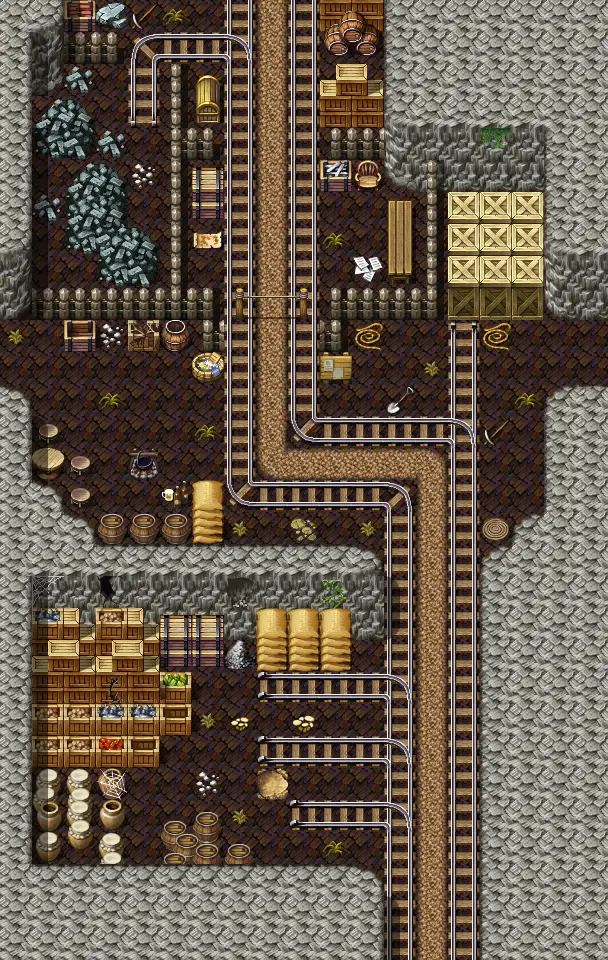

# Blackwater mountain13

| | |
|---|---|
| **Map ID** | `blackwater_mountain13` |
| **Region** | In Prim (settlement) |
| **Type** | Indoors / underground |
| **Size** | 19×30 tiles |
| **World map** | [Elmmine](index.md) |
| **Introduced** | v0.7.0 or earlier |
| **NPCs** | 1 |
| **Quests** | 1 |

**Blackwater mountain13** is an indoor map, in Prim (settlement). It has 1 NPC, and no enemies. Exits lead to Elm mine2, Elm mine1, Blackwater mountain12, Elm mine0.

## Map

<label class="lg"><input type="checkbox" data-t="spawn" checked><b>Red</b>&nbsp;Monsters / NPCs</label><label class="lg"><input type="checkbox" data-t="mapchange" checked><b>Blue</b>&nbsp;Exit to another map</label><label class="lg"><input type="checkbox" data-t="container" checked><b>Yellow</b>&nbsp;Container (click to see contents)</label><label class="lg"><input type="checkbox" data-t="sign" checked><b>Purple</b>&nbsp;Sign</label><label class="lg"><input type="checkbox" data-t="rest" checked><b>Green</b>&nbsp;Resting place</label><label class="lg"><input type="checkbox" data-t="key" checked><b>Orange dashed</b>&nbsp;Blocked until a quest step / item</label><label class="lg"><input type="checkbox" data-t="script"><b>Grey dotted</b>&nbsp;Scripted event</label><label class="lg"><input type="checkbox" data-t="replace"><b>White dotted</b>&nbsp;Changes during a quest</label><label class="lg"><input type="checkbox" data-t="pin" checked><b>Numbers</b>&nbsp;Numbered key points (see the key below the map)</label>

<a class="pin pin-exit" href="#key-1" style="left:39.474%;top:1.667%" title="Exit (north): to [Elm mine2](../elm_mine2.md)">1</a><a class="pin pin-exit" href="#key-2" style="left:97.368%;top:36.667%" title="Exit (east): to [Elm mine1](../elm_mine1.md)">2</a><a class="pin pin-exit" href="#key-3" style="left:71.053%;top:98.333%" title="Exit (south): to [Blackwater mountain12](../blackwater_mountain12.md)">3</a><a class="pin pin-exit" href="#key-4" style="left:2.632%;top:36.667%" title="Exit (west): to [Elm mine0](../elm_mine0.md)">4</a><a class="pin pin-npc" href="#key-5" style="left:18.421%;top:41.667%" title="[Arghest](../../monsters/arghest.md): 1 quest">5</a><a class="pin pin-sign" href="#key-6" style="left:55.263%;top:38.333%" title="Sign: “No entry allowed.
Signed by Guthbered of Prim.”">6</a><a class="pin pin-script" href="#key-7" style="left:86.842%;top:41.667%" title="Quest trigger: Scripted event: advances the quest: hidden story flag “bwm72_beginning” to stage 8 (“Ehrenfest notices your presence in the mine and calls you.”)">7</a><a class="pin pin-script" href="#key-8" style="left:92.105%;top:36.667%" title="Quest trigger: Scripted event: advances the quest: hidden story flag “bwm72_beginning” to stage 40 (“Celebration”)">8</a><a class="pin pin-replace" href="#key-9" style="left:44.737%;top:31.667%" title="Changes during a quest: This area changes during the quest: hidden story flag “bwm72_beginning” (stage 22: “Arghest small talk.”)">9</a>

??? abstract "Key to the numbers on the map"

    | # | What | Details |
    |---|---|---|
    | 1 | Exit (north) | to [Elm mine2](../elm_mine2.md) |
    | 2 | Exit (east) | to [Elm mine1](../elm_mine1.md) |
    | 3 | Exit (south) | to [Blackwater mountain12](../blackwater_mountain12.md) |
    | 4 | Exit (west) | to [Elm mine0](../elm_mine0.md) |
    | 5 | [Arghest](../monsters/arghest.md) | 1 quest |
    | 6 | Sign | “No entry allowed. Signed by Guthbered of Prim.” |
    | 7 | Quest trigger | Scripted event: advances the quest: hidden story flag “bwm72_beginning” to stage 8 (“Ehrenfest notices your presence in the mine and calls you.”) |
    | 8 | Quest trigger | Scripted event: advances the quest: hidden story flag “bwm72_beginning” to stage 40 (“Celebration”) |
    | 9 | Changes during a quest | This area changes during the quest: hidden story flag “bwm72_beginning” (stage 22: “Arghest small talk.”) |

Verified against v0.8.18 map data.

## Connections

| Direction | Leads to | Region there | Map # |
|---|---|---|---|
| North | [Elm mine2](elm_mine2.md) | – | 1 |
| East | [Elm mine1](elm_mine1.md) | – | 2 |
| South | [Blackwater mountain12](blackwater_mountain12.md) | Prim | 3 |
| West | [Elm mine0](elm_mine0.md) | – | 4 |

## NPCs

- [Arghest](../monsters/arghest.md) — quests: [Well rested](../quests/prim_innquest.md) (#5)

## Quests

- [Well rested](../quests/prim_innquest.md): [Arghest](../monsters/arghest.md) is involved
- [Hidden: events in bwm (hidden flag)](../quests/bwm72_beginning.md): [Arghest](../monsters/arghest.md) is involved; part of the map changes at stage 22; something on this map advances it; stepping on a trigger here sets stage 40; stepping on a trigger here sets stage 8

## Points of interest

- **Sign** (#6): “No entry allowed. Signed by Guthbered of Prim.”
- **Quest trigger** (#7): Scripted event: advances the quest: hidden story flag “bwm72_beginning” to stage 8 (“Ehrenfest notices your presence in the mine and calls you.”)
- **Quest trigger** (#8): Scripted event: advances the quest: hidden story flag “bwm72_beginning” to stage 40 (“Celebration”)
- **Changes during a quest** (#9): This area changes during the quest: hidden story flag “bwm72_beginning” (stage 22: “Arghest small talk.”)

## Version history

| Version | Change |
|---|---|
| [v0.7.0](../versions/0.7.0.md) | Present in v0.7.0 (earliest release tracked) |
| [v0.7.1](../versions/0.7.1.md) | map layout or objects changed |
| [v0.7.2](../versions/0.7.2.md) | map layout or objects changed |
| [v0.7.14](../versions/0.7.14.md) | map layout or objects changed |
| [v0.7.15](../versions/0.7.15.md) | map layout or objects changed |
| [v0.8.2](../versions/0.8.2.md) | map layout or objects changed |

Verified against v0.8.18 and every earlier release back to v0.7.0 (game data compared release by release).

## Community notes

<small>Written by players, not generated from game data. **Observations**: what players notice in-game · **Lore**: the in-world story · **Trivia**: real-world facts, references, development history · **Theory / speculation**: unconfirmed ideas; may just be unfinished content</small>

### Observations

*Nothing here yet. Know something? [Add it](https://github.com/asdfghjkl628/Andor-s-Trail-Wikiiii/new/main/notes/maps?filename=blackwater_mountain13.md&value=%23%23%20Observations%0A%0A%3C%21--%20what%20players%20notice%20in-game%20--%3E%0A%0A%23%23%20Lore%0A%0A%3C%21--%20the%20in-world%20story%20--%3E%0A%0A%23%23%20Trivia%0A%0A%3C%21--%20real-world%20facts%2C%20references%2C%20development%20history%20--%3E%0A%0A%23%23%20Theory%20/%20speculation%0A%0A%3C%21--%20unconfirmed%20ideas%3B%20may%20just%20be%20unfinished%20content%20--%3E%0A).*

### Lore

*Nothing here yet. Know something? [Add it](https://github.com/asdfghjkl628/Andor-s-Trail-Wikiiii/new/main/notes/maps?filename=blackwater_mountain13.md&value=%23%23%20Observations%0A%0A%3C%21--%20what%20players%20notice%20in-game%20--%3E%0A%0A%23%23%20Lore%0A%0A%3C%21--%20the%20in-world%20story%20--%3E%0A%0A%23%23%20Trivia%0A%0A%3C%21--%20real-world%20facts%2C%20references%2C%20development%20history%20--%3E%0A%0A%23%23%20Theory%20/%20speculation%0A%0A%3C%21--%20unconfirmed%20ideas%3B%20may%20just%20be%20unfinished%20content%20--%3E%0A).*

### Trivia

*Nothing here yet. Know something? [Add it](https://github.com/asdfghjkl628/Andor-s-Trail-Wikiiii/new/main/notes/maps?filename=blackwater_mountain13.md&value=%23%23%20Observations%0A%0A%3C%21--%20what%20players%20notice%20in-game%20--%3E%0A%0A%23%23%20Lore%0A%0A%3C%21--%20the%20in-world%20story%20--%3E%0A%0A%23%23%20Trivia%0A%0A%3C%21--%20real-world%20facts%2C%20references%2C%20development%20history%20--%3E%0A%0A%23%23%20Theory%20/%20speculation%0A%0A%3C%21--%20unconfirmed%20ideas%3B%20may%20just%20be%20unfinished%20content%20--%3E%0A).*

### Theory / speculation

*Nothing here yet. Know something? [Add it](https://github.com/asdfghjkl628/Andor-s-Trail-Wikiiii/new/main/notes/maps?filename=blackwater_mountain13.md&value=%23%23%20Observations%0A%0A%3C%21--%20what%20players%20notice%20in-game%20--%3E%0A%0A%23%23%20Lore%0A%0A%3C%21--%20the%20in-world%20story%20--%3E%0A%0A%23%23%20Trivia%0A%0A%3C%21--%20real-world%20facts%2C%20references%2C%20development%20history%20--%3E%0A%0A%23%23%20Theory%20/%20speculation%0A%0A%3C%21--%20unconfirmed%20ideas%3B%20may%20just%20be%20unfinished%20content%20--%3E%0A).*

??? info "Technical information"

    | | |
    |---|---|
    | Map ID | `blackwater_mountain13` |
    | File | `res/xml/blackwater_mountain13.tmx` |
    | Size | 19×30 tiles (608×960 px) |
    | outdoors property | – |
    | Layers drawn | ground, objects, above |
    | Tilesets | map_bed_1, map_border_1, map_bridge_1, map_broken_1, map_cavewall_1, map_cavewall_2, map_cavewall_3, map_chair_table_1, map_crate_1, map_cupboard_1, map_curtain_1, map_entrance_1, map_fence_1, map_fence_2, map_ground_1, map_ground_2, map_ground_3, map_ground_4, map_ground_5, map_ground_6, map_ground_7, map_ground_8, map_indoor_1, map_kitchen_1, map_outdoor_1, map_pillar_1, map_plant_1, map_rock_1, map_roof_1, map_roof_2, map_shop_1, map_sign_ladder_1, map_table_1, map_trail_1, map_tree_1, map_wall_1, map_wall_2, map_wall_3, map_window_1, map_window_2 |
    | Map objects | mapchange: 4, script: 2, sign: 1, spawn: 1, replace: 1 |
    | World map position | segment `elmmine`, x -13, y -19 |

<small>Data from v0.8.18</small>
