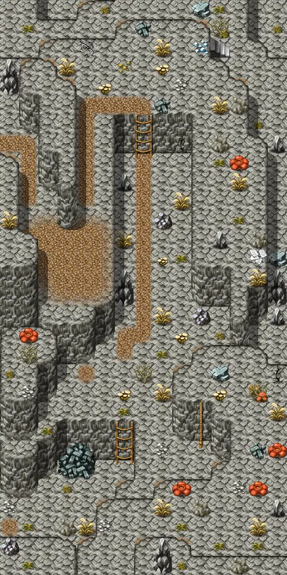

# Blackwater mountain16

15×30 tiles · outdoors · part of [World1](index.md)

<label class="lg lg-spawn"><input type="checkbox" data-t="spawn" checked> Monsters / NPCs</label><label class="lg lg-mapchange"><input type="checkbox" data-t="mapchange" checked> Exit to another map</label><label class="lg lg-container"><input type="checkbox" data-t="container" checked> Container</label><label class="lg lg-sign"><input type="checkbox" data-t="sign" checked> Sign</label><label class="lg lg-rest"><input type="checkbox" data-t="rest" checked> Resting place</label><label class="lg lg-key"><input type="checkbox" data-t="key" checked> Blocked / needs key or quest</label><label class="lg lg-script"><input type="checkbox" data-t="script"> Scripted event</label><label class="lg lg-replace"><input type="checkbox" data-t="replace"> Changes after a quest</label>

## Exits

- [Blackwater mountain15](blackwater_mountain15.md)
- [Blackwater mountain53](blackwater_mountain53.md)
- [Blackwater mountain56](blackwater_mountain56.md)
- [Bwmfill2](bwmfill2.md)
- [Bwmfill3](bwmfill3.md)

## Monsters & NPCs here

| Name | HP |
|---|---|
| [Scaled venomfang](../monsters/scaled_venomfang.md) | 35 |
| [Slithering venomfang](../monsters/slithering_venomfang.md) | 35 |
| [Young gornaud](../monsters/young_gornaud.md) | 70 |
| [Gornaud](../monsters/gornaud.md) | 95 |

<small>Map ID: `blackwater_mountain16` · Data from v0.8.18</small>
