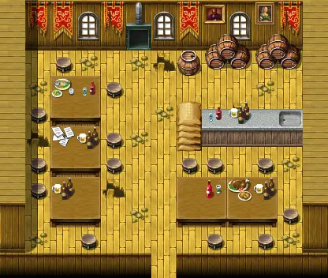

# Blackwater mountain22

13×11 tiles

<label class="lg lg-spawn"><input type="checkbox" data-t="spawn" checked> Monsters / NPCs</label><label class="lg lg-mapchange"><input type="checkbox" data-t="mapchange" checked> Exit to another map</label><label class="lg lg-container"><input type="checkbox" data-t="container" checked> Container</label><label class="lg lg-sign"><input type="checkbox" data-t="sign" checked> Sign</label><label class="lg lg-rest"><input type="checkbox" data-t="rest" checked> Resting place</label><label class="lg lg-key"><input type="checkbox" data-t="key" checked> Blocked / needs key or quest</label><label class="lg lg-script"><input type="checkbox" data-t="script"> Scripted event</label><label class="lg lg-replace"><input type="checkbox" data-t="replace"> Changes after a quest</label>

## Exits

- [Blackwater mountain11](blackwater_mountain11.md)

## Monsters & NPCs here

| Name | HP |
|---|---|
| [Prim bar guest](../monsters/prim_bar_guest.md) | 0 |
| [Birgil](../monsters/birgil.md) | 0 |
| [Burhczyd](../monsters/burhczyd9.md) | 0 |
| [Knight of Elythom](../monsters/burhczyd9e.md) | 0 |
| [Prim tavern regular](../monsters/prim_tavern_regular.md) | 0 |
| [Jern](../monsters/prim_bar_regular.md) | 0 |
| [Prim tavern guest](../monsters/prim_tavern_guest.md) | 0 |

<small>Map ID: `blackwater_mountain22` · Data from v0.8.18</small>
