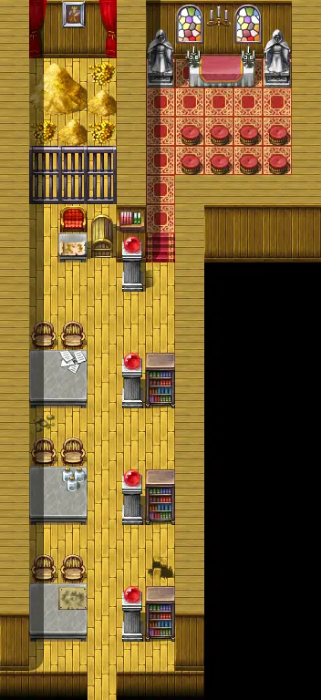

# Blackwater mountain25

11×24 tiles

<label class="lg lg-spawn"><input type="checkbox" data-t="spawn" checked> Monsters / NPCs</label><label class="lg lg-mapchange"><input type="checkbox" data-t="mapchange" checked> Exit to another map</label><label class="lg lg-container"><input type="checkbox" data-t="container" checked> Container</label><label class="lg lg-sign"><input type="checkbox" data-t="sign" checked> Sign</label><label class="lg lg-rest"><input type="checkbox" data-t="rest" checked> Resting place</label><label class="lg lg-key"><input type="checkbox" data-t="key" checked> Blocked / needs key or quest</label><label class="lg lg-script"><input type="checkbox" data-t="script"> Scripted event</label><label class="lg lg-replace"><input type="checkbox" data-t="replace"> Changes after a quest</label>

## Exits

- [Blackwater mountain11](blackwater_mountain11.md)

## Monsters & NPCs here

| Name | HP |
|---|---|
| [Prim pupil](../monsters/prim_pupil.md) | 0 |
| [Studying Prim pupil](../monsters/studying_prim_pupil.md) | 0 |
| [Prim priestly acolyte](../monsters/prim_priestly_acolyte.md) | 0 |
| [Reading Prim pupil](../monsters/reading_prim_pupil.md) | 0 |
| [Samar](../monsters/samar.md) | 0 |
| [Prim treasury guard](../monsters/prim_treasury_guard.md) | 60 |
| [Strong Prim treasury guard](../monsters/prim_treasury_guard2.md) | 160 |

<small>Map ID: `blackwater_mountain25` · Data from v0.8.18</small>
