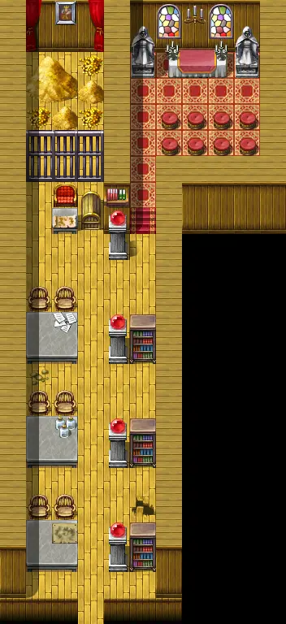

# Blackwater mountain25

| | |
|---|---|
| **Map ID** | `blackwater_mountain25` |
| **Region** | In Prim (settlement) |
| **Type** | Indoors / underground |
| **Size** | 11×24 tiles |
| **Introduced** | v0.7.0 or earlier |
| **NPCs** | 7 |
| **Quests** | 0 |
| **Containers** | 7 |

**Blackwater mountain25** is an indoor map, in Prim (settlement). It has 7 NPCs, and no enemies. Exits lead to Blackwater mountain11.

## Map

<label class="lg"><input type="checkbox" data-t="spawn" checked><b>Red</b>&nbsp;Monsters / NPCs</label><label class="lg"><input type="checkbox" data-t="mapchange" checked><b>Blue</b>&nbsp;Exit to another map</label><label class="lg"><input type="checkbox" data-t="container" checked><b>Yellow</b>&nbsp;Container (click to see contents)</label><label class="lg"><input type="checkbox" data-t="sign" checked><b>Purple</b>&nbsp;Sign</label><label class="lg"><input type="checkbox" data-t="rest" checked><b>Green</b>&nbsp;Resting place</label><label class="lg"><input type="checkbox" data-t="key" checked><b>Orange dashed</b>&nbsp;Blocked until a quest step / item</label><label class="lg"><input type="checkbox" data-t="script"><b>Grey dotted</b>&nbsp;Scripted event</label><label class="lg"><input type="checkbox" data-t="replace"><b>White dotted</b>&nbsp;Changes during a quest</label><label class="lg"><input type="checkbox" data-t="pin" checked><b>Numbers</b>&nbsp;Numbered key points (see the key below the map)</label>

<a class="pin pin-exit" href="#key-1" style="left:31.818%;top:97.917%" title="Exit (south): to [Blackwater mountain11](blackwater_mountain11.md)">1</a><a id="pin-npc-prim_priestly_acolyte" class="pin pin-npc" href="#key-2" style="left:68.182%;top:22.917%" title="[Prim priestly acolyte](../../monsters/prim_priestly_acolyte.md): NPC">2</a><a id="pin-npc-prim_pupil" class="pin pin-npc" href="#key-3" style="left:13.636%;top:81.250%" title="[Prim pupil](../../monsters/prim_pupil.md): NPC">3</a><a id="pin-npc-prim_treasury_guard" class="pin pin-npc" href="#key-4" style="left:13.636%;top:35.417%" title="[Prim treasury guard](../../monsters/prim_treasury_guard.md): NPC">4</a><a id="pin-npc-reading_prim_pupil" class="pin pin-npc" href="#key-5" style="left:50.000%;top:60.417%" title="[Reading Prim pupil](../../monsters/reading_prim_pupil.md): NPC">5</a><a id="pin-npc-samar" class="pin pin-npc" href="#key-6" style="left:68.182%;top:14.583%" title="[Samar](../../monsters/samar.md): shopkeeper">6</a><a id="pin-npc-prim_treasury_guard2" class="pin pin-npc" href="#key-7" style="left:14.235%;top:32.292%" title="[Strong Prim treasury guard](../../monsters/prim_treasury_guard2.md): NPC">7</a><a id="pin-npc-studying_prim_pupil" class="pin pin-npc" href="#key-8" style="left:22.727%;top:47.917%" title="[Studying Prim pupil](../../monsters/studying_prim_pupil.md): NPC">8</a><a class="pin pin-script" href="#key-9" style="left:18.780%;top:28.125%" title="Quest trigger: Scripted event: advances the quest: hidden story flag “nondisplay” to stage 83 (“prim_treasure_init”)">9</a><a class="pin pin-script" href="#key-10" style="left:22.727%;top:10.417%" title="Quest trigger: Scripted event: advances the quest: hidden story flag “nondisplay” to stage 81 (“prim_treasure_1”)">10</a><a class="pin pin-script" href="#key-11" style="left:22.727%;top:18.750%" title="Quest trigger: Scripted event: advances the quest: hidden story flag “nondisplay” to stage 82 (“prim_treasure_2”)">11</a><a class="pin pin-script" href="#key-12" style="left:23.326%;top:15.625%" title="Quest trigger: Scripted event: advances the quest: hidden story flag “nondisplay” to stage 84 (“prim_treasure_4 taken”)">12</a><a class="pin pin-script" href="#key-13" style="left:31.818%;top:14.583%" title="Quest trigger: Scripted event: advances the quest: hidden story flag “nondisplay” to stage 85 (“prim_treasure_5 taken”)">13</a><a class="pin pin-script" href="#key-14" style="left:31.818%;top:10.417%" title="Quest trigger: Scripted event: advances the quest: hidden story flag “nondisplay” to stage 87 (“prim_treasure_7 taken”)">14</a><a class="pin pin-script" href="#key-15" style="left:13.636%;top:18.750%" title="Quest trigger: Scripted event: advances the quest: hidden story flag “nondisplay” to stage 88 (“prim_treasure_8 taken”)">15</a><a class="pin pin-script" href="#key-16" style="left:31.818%;top:18.750%" title="Quest trigger: Scripted event: advances the quest: hidden story flag “nondisplay” to stage 89 (“prim_treasure_9 taken”)">16</a><a class="pin pin-container" href="#key-17" style="left:31.818%;top:31.250%" title="Container 1: Prim treasury key">17</a><a class="pin pin-container" href="#key-18" style="left:36.405%;top:21.492%" title="Container 2: Gold coins, Lesser shielding necklace">18</a><a class="pin pin-container" href="#key-19" style="left:14.235%;top:15.625%" title="Container 3: Gold coins, Glass gem, Polished sparkling gem, Sharpened gem">19</a><a class="pin pin-container" href="#key-20" style="left:32.416%;top:7.292%" title="Container 4: Gold coins, Ring of damage +1, Ring of damage +2">20</a><a class="pin pin-container" href="#key-21" style="left:13.636%;top:10.417%" title="Container 5: Gold coins, Jinxed ring of damage resistance">21</a><a class="pin pin-container" href="#key-22" style="left:39.109%;top:12.457%" title="Container 6: Gold coins">22</a><a class="pin pin-container" href="#key-23" style="left:27.314%;top:21.492%" title="Container 7: Gold coins">23</a><a class="pin pin-key" href="#key-24" style="left:23.326%;top:23.959%" title="Blocked passage: Unlocked during the quest: hidden story flag “nondisplay” (stage 80: “prim_treasure_door”)">24</a><a class="pin pin-key" href="#key-25" style="left:8.381%;top:11.980%" title="Blocked passage: Closed off once you reach this point in the quest: hidden story flag “nondisplay” (stage 80: “prim_treasure_door”)">25</a>

??? abstract "Key to the numbers on the map"

    | # | What | Details |
    |---|---|---|
    | 1 | Exit (south) | to [Blackwater mountain11](blackwater_mountain11.md) |
    | 2 | [Prim priestly acolyte](../monsters/prim_priestly_acolyte.md) | NPC |
    | 3 | [Prim pupil](../monsters/prim_pupil.md) | NPC |
    | 4 | [Prim treasury guard](../monsters/prim_treasury_guard.md) | NPC |
    | 5 | [Reading Prim pupil](../monsters/reading_prim_pupil.md) | NPC |
    | 6 | [Samar](../monsters/samar.md) | shopkeeper |
    | 7 | [Strong Prim treasury guard](../monsters/prim_treasury_guard2.md) | NPC |
    | 8 | [Studying Prim pupil](../monsters/studying_prim_pupil.md) | NPC |
    | 9 | Quest trigger | Scripted event: advances the quest: hidden story flag “nondisplay” to stage 83 (“prim_treasure_init”) |
    | 10 | Quest trigger | Scripted event: advances the quest: hidden story flag “nondisplay” to stage 81 (“prim_treasure_1”) |
    | 11 | Quest trigger | Scripted event: advances the quest: hidden story flag “nondisplay” to stage 82 (“prim_treasure_2”) |
    | 12 | Quest trigger | Scripted event: advances the quest: hidden story flag “nondisplay” to stage 84 (“prim_treasure_4 taken”) |
    | 13 | Quest trigger | Scripted event: advances the quest: hidden story flag “nondisplay” to stage 85 (“prim_treasure_5 taken”) |
    | 14 | Quest trigger | Scripted event: advances the quest: hidden story flag “nondisplay” to stage 87 (“prim_treasure_7 taken”) |
    | 15 | Quest trigger | Scripted event: advances the quest: hidden story flag “nondisplay” to stage 88 (“prim_treasure_8 taken”) |
    | 16 | Quest trigger | Scripted event: advances the quest: hidden story flag “nondisplay” to stage 89 (“prim_treasure_9 taken”) |
    | 17 | Container 1 | Prim treasury key |
    | 18 | Container 2 | Gold coins, Lesser shielding necklace |
    | 19 | Container 3 | Gold coins, Glass gem, Polished sparkling gem, Sharpened gem |
    | 20 | Container 4 | Gold coins, Ring of damage +1, Ring of damage +2 |
    | 21 | Container 5 | Gold coins, Jinxed ring of damage resistance |
    | 22 | Container 6 | Gold coins |
    | 23 | Container 7 | Gold coins |
    | 24 | Blocked passage | Unlocked during the quest: hidden story flag “nondisplay” (stage 80: “prim_treasure_door”) |
    | 25 | Blocked passage | Closed off once you reach this point in the quest: hidden story flag “nondisplay” (stage 80: “prim_treasure_door”) |

Verified against v0.8.18 map data.

## Connections

| Direction | Leads to | Region there | Map # |
|---|---|---|---|
| South | [Blackwater mountain11](blackwater_mountain11.md) | Prim | 1 |

## NPCs

- [Prim priestly acolyte](../monsters/prim_priestly_acolyte.md) (#2)
- [Prim pupil](../monsters/prim_pupil.md) (#3)
- [Prim treasury guard](../monsters/prim_treasury_guard.md) — can be fought (#4)
- [Reading Prim pupil](../monsters/reading_prim_pupil.md) (#5)
- [Samar](../monsters/samar.md) — shopkeeper (#6)
- [Strong Prim treasury guard](../monsters/prim_treasury_guard2.md) — can be fought (#7)
- [Studying Prim pupil](../monsters/studying_prim_pupil.md) (#8)

## Items & containers

**Shops:** [Samar](../monsters/samar.md)

<b>Container 1</b><ul><li><a href="../../items/prim_treasure_key/">Prim treasury key</a> <small>100%</small></li></ul>

<b>Container 2</b><ul><li><a href="../../items/gold/">Gold coins</a> <small>100% · ×10 to 20</small></li><li><a href="../../items/necklace_shield_0/">Lesser shielding necklace</a> <small>50%</small></li></ul>

<b>Container 3</b><ul><li><a href="../../items/gold/">Gold coins</a> <small>100% · ×20 to 40</small></li><li><a href="../../items/gem1/">Glass gem</a> <small>100% · ×1 to 2</small></li><li><a href="../../items/gem5/">Polished sparkling gem</a> <small>50%</small></li><li><a href="../../items/gem4/">Sharpened gem</a> <small>50%</small></li></ul>

<b>Container 4</b><ul><li><a href="../../items/gold/">Gold coins</a> <small>100% · ×200 to 300</small></li><li><a href="../../items/ring_dmg1/">Ring of damage +1</a> <small>33%</small></li><li><a href="../../items/ring_dmg2/">Ring of damage +2</a> <small>33%</small></li></ul>

<b>Container 5</b><ul><li><a href="../../items/gold/">Gold coins</a> <small>100% · ×500 to 900</small></li><li><a href="../../items/ring_jinxed1/">Jinxed ring of damage resistance</a> <small>100%</small></li></ul>

<b>Container 6</b><ul><li><a href="../../items/gold/">Gold coins</a> <small>100% · ×1800 to 2800</small></li></ul>

<b>Container 7</b><ul><li><a href="../../items/gold/">Gold coins</a> <small>100% · ×1500 to 2500</small></li></ul>

## Quests

- [Placeholder for hidden quest stages (not displayed) (hidden flag)](../quests/nondisplay.md): blocked passage closes at stage 80; blocked passage opens at stage 80; something on this map advances it; stepping on a trigger here sets stage 81; stepping on a trigger here sets stage 82; stepping on a trigger here sets stage 83; stepping on a trigger here sets stage 84; stepping on a trigger here sets stage 85; stepping on a trigger here sets stage 87; stepping on a trigger here sets stage 88; stepping on a trigger here sets stage 89

## Points of interest

- **Quest trigger** (#9): Scripted event: advances the quest: hidden story flag “nondisplay” to stage 83 (“prim_treasure_init”)
- **Quest trigger** (#10): Scripted event: advances the quest: hidden story flag “nondisplay” to stage 81 (“prim_treasure_1”)
- **Quest trigger** (#11): Scripted event: advances the quest: hidden story flag “nondisplay” to stage 82 (“prim_treasure_2”)
- **Quest trigger** (#12): Scripted event: advances the quest: hidden story flag “nondisplay” to stage 84 (“prim_treasure_4 taken”)
- **Quest trigger** (#13): Scripted event: advances the quest: hidden story flag “nondisplay” to stage 85 (“prim_treasure_5 taken”)
- **Quest trigger** (#14): Scripted event: advances the quest: hidden story flag “nondisplay” to stage 87 (“prim_treasure_7 taken”)
- **Quest trigger** (#15): Scripted event: advances the quest: hidden story flag “nondisplay” to stage 88 (“prim_treasure_8 taken”)
- **Quest trigger** (#16): Scripted event: advances the quest: hidden story flag “nondisplay” to stage 89 (“prim_treasure_9 taken”)
- **Blocked passage** (#24): Unlocked during the quest: hidden story flag “nondisplay” (stage 80: “prim_treasure_door”)
- **Blocked passage** (#25): Closed off once you reach this point in the quest: hidden story flag “nondisplay” (stage 80: “prim_treasure_door”)

## Version history

| Version | Change |
|---|---|
| [v0.7.0](../versions/0.7.0.md) | Present in v0.7.0 (earliest release tracked) |
| [v0.7.1](../versions/0.7.1.md) | Map layout or objects changed |
| [v0.7.2](../versions/0.7.2.md) | Map layout or objects changed |
| [v0.8.2](../versions/0.8.2.md) | Map layout or objects changed |
| [v0.8.15](../versions/0.8.15.md) | Map layout or objects changed |

Verified against v0.8.18 and every earlier release back to v0.7.0 (game data compared release by release).

## Community notes

<small>Written by players, not generated from game data. **Observations**: what players notice in-game · **Lore**: the in-world story · **Trivia**: real-world facts, references, development history · **Theory / speculation**: unconfirmed ideas; may just be unfinished content</small>

### Observations

*No notes yet. Contributions are welcome: [add a note](https://github.com/asdfghjkl628/Andor-s-Trail-Wikiiii/new/main/notes/maps?filename=blackwater_mountain25.md&value=%23%23%20Observations%0A%0A%3C%21--%20what%20players%20notice%20in-game%20--%3E%0A%0A%23%23%20Lore%0A%0A%3C%21--%20the%20in-world%20story%20--%3E%0A%0A%23%23%20Trivia%0A%0A%3C%21--%20real-world%20facts%2C%20references%2C%20development%20history%20--%3E%0A%0A%23%23%20Theory%20/%20speculation%0A%0A%3C%21--%20unconfirmed%20ideas%3B%20may%20just%20be%20unfinished%20content%20--%3E%0A).*

### Lore

*No notes yet. Contributions are welcome: [add a note](https://github.com/asdfghjkl628/Andor-s-Trail-Wikiiii/new/main/notes/maps?filename=blackwater_mountain25.md&value=%23%23%20Observations%0A%0A%3C%21--%20what%20players%20notice%20in-game%20--%3E%0A%0A%23%23%20Lore%0A%0A%3C%21--%20the%20in-world%20story%20--%3E%0A%0A%23%23%20Trivia%0A%0A%3C%21--%20real-world%20facts%2C%20references%2C%20development%20history%20--%3E%0A%0A%23%23%20Theory%20/%20speculation%0A%0A%3C%21--%20unconfirmed%20ideas%3B%20may%20just%20be%20unfinished%20content%20--%3E%0A).*

### Trivia

*No notes yet. Contributions are welcome: [add a note](https://github.com/asdfghjkl628/Andor-s-Trail-Wikiiii/new/main/notes/maps?filename=blackwater_mountain25.md&value=%23%23%20Observations%0A%0A%3C%21--%20what%20players%20notice%20in-game%20--%3E%0A%0A%23%23%20Lore%0A%0A%3C%21--%20the%20in-world%20story%20--%3E%0A%0A%23%23%20Trivia%0A%0A%3C%21--%20real-world%20facts%2C%20references%2C%20development%20history%20--%3E%0A%0A%23%23%20Theory%20/%20speculation%0A%0A%3C%21--%20unconfirmed%20ideas%3B%20may%20just%20be%20unfinished%20content%20--%3E%0A).*

### Theory / speculation

*No notes yet. Contributions are welcome: [add a note](https://github.com/asdfghjkl628/Andor-s-Trail-Wikiiii/new/main/notes/maps?filename=blackwater_mountain25.md&value=%23%23%20Observations%0A%0A%3C%21--%20what%20players%20notice%20in-game%20--%3E%0A%0A%23%23%20Lore%0A%0A%3C%21--%20the%20in-world%20story%20--%3E%0A%0A%23%23%20Trivia%0A%0A%3C%21--%20real-world%20facts%2C%20references%2C%20development%20history%20--%3E%0A%0A%23%23%20Theory%20/%20speculation%0A%0A%3C%21--%20unconfirmed%20ideas%3B%20may%20just%20be%20unfinished%20content%20--%3E%0A).*

??? info "Technical information"

    | | |
    |---|---|
    | Map ID | `blackwater_mountain25` |
    | File | `res/xml/blackwater_mountain25.tmx` |
    | Size | 11×24 tiles (352×768 px) |
    | outdoors property | – |
    | Layers drawn | ground, objects, above, top |
    | Tilesets | map_bed_1, map_border_1, map_bridge_1, map_bridge_2, map_broken_1, map_cavewall_1, map_cavewall_2, map_cavewall_3, map_cavewall_4, map_chair_table_1, map_chair_table_2, map_crate_1, map_cupboard_1, map_curtain_1, map_entrance_1, map_entrance_2, map_fence_1, map_fence_2, map_fence_3, map_fence_4, map_ground_1, map_ground_2, map_ground_3, map_ground_4, map_ground_5, map_ground_6, map_ground_7, map_ground_8, map_house_1, map_house_2, map_indoor_1, map_indoor_2, map_kitchen_1, map_outdoor_1, map_pillar_1, map_pillar_2, map_plant_1, map_plant_2, map_rock_1, map_rock_2, map_roof_1, map_roof_2, map_roof_3, map_shop_1, map_sign_ladder_1, map_table_1, map_trail_1, map_transition_1, map_transition_2, map_transition_3, map_transition_4, map_transition_5, map_tree_1, map_tree_2, map_wall_1, map_wall_2, map_wall_3, map_wall_4, map_window_1, map_window_2 |
    | Map objects | script: 8, container: 7, spawn: 7, replace: 6, key: 2, mapchange: 1 |
    | World map position | – |

<small>Data from v0.8.18</small>
