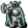
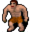

# Blackwater mountain29

22×16 tiles

<label class="lg"><input type="checkbox" data-t="spawn" checked><b>Red</b>&nbsp;Monsters / NPCs</label><label class="lg"><input type="checkbox" data-t="mapchange" checked><b>Blue</b>&nbsp;Exit to another map</label><label class="lg"><input type="checkbox" data-t="container" checked><b>Yellow</b>&nbsp;Container (click to see contents)</label><label class="lg"><input type="checkbox" data-t="sign" checked><b>Purple</b>&nbsp;Sign</label><label class="lg"><input type="checkbox" data-t="rest" checked><b>Green</b>&nbsp;Resting place</label><label class="lg"><input type="checkbox" data-t="key" checked><b>Orange dashed</b>&nbsp;Blocked until a quest step / item</label><label class="lg"><input type="checkbox" data-t="script"><b>Grey dotted</b>&nbsp;Scripted event</label><label class="lg"><input type="checkbox" data-t="replace"><b>White dotted</b>&nbsp;Changes during a quest</label>

## Exits

- [Blackwater mountain11](blackwater_mountain11.md)
- [Stoutford castle barrack2](stoutford_castle_barrack2.md)

## Monsters & NPCs here

| Name | HP |
|---|---|
| [General Ortholion](../monsters/ortholion.md) | 0 |
| [Jern](../monsters/prim_bar_regular.md) | 0 |
| [Feygard scout](../monsters/ortholion_guard2.md) | 0 |
| [Prim guard](../monsters/prim_guard6.md) | 0 |
| [Wounded Prim guard](../monsters/prim_guard7.md) | 0 |
| [General's henchman](../monsters/ortholion_guard1.md) | 0 |
| [Prim guard captain](../monsters/prim_guard5.md) | 0 |
| [Prim weapon guard](../monsters/prim_weapon_guard.md) | 60 |
| [Tired Prim guard](../monsters/tired_prim_guard.md) | 60 |
| [Prim sentry](../monsters/prim_sentry.md) | 60 |
| [Prim guard](../monsters/prim_guard.md) | 60 |
| [Guthbered's bodyguard](../monsters/guthbereds_bodyguard.md) | 60 |
| [Guthbered](../monsters/guthbered.md) | 80 |

<small>Map ID: `blackwater_mountain29` · Data from v0.8.18</small>
