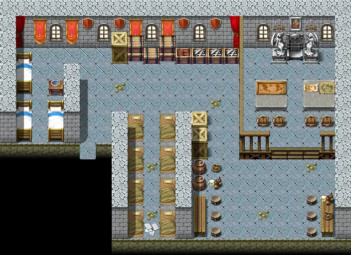

# Blackwater mountain29

22×16 tiles

<label class="lg lg-spawn"><input type="checkbox" data-t="spawn" checked> Monsters / NPCs</label><label class="lg lg-mapchange"><input type="checkbox" data-t="mapchange" checked> Exit to another map</label><label class="lg lg-container"><input type="checkbox" data-t="container" checked> Container</label><label class="lg lg-sign"><input type="checkbox" data-t="sign" checked> Sign</label><label class="lg lg-rest"><input type="checkbox" data-t="rest" checked> Resting place</label><label class="lg lg-key"><input type="checkbox" data-t="key" checked> Blocked / needs key or quest</label><label class="lg lg-script"><input type="checkbox" data-t="script"> Scripted event</label><label class="lg lg-replace"><input type="checkbox" data-t="replace"> Changes after a quest</label>

## Exits

- [Blackwater mountain11](blackwater_mountain11.md)
- [Stoutford castle barrack2](stoutford_castle_barrack2.md)

## Monsters & NPCs here

| Name | HP |
|---|---|
| [Feygard scout](../monsters/ortholion_guard2.md) | 0 |
| [Prim guard](../monsters/prim_guard6.md) | 0 |
| [Prim guard captain](../monsters/prim_guard5.md) | 0 |
| [General's henchman](../monsters/ortholion_guard1.md) | 0 |
| [Jern](../monsters/prim_bar_regular.md) | 0 |
| [Wounded Prim guard](../monsters/prim_guard7.md) | 0 |
| [General Ortholion](../monsters/ortholion.md) | 0 |
| [Prim guard](../monsters/prim_guard.md) | 60 |
| [Prim weapon guard](../monsters/prim_weapon_guard.md) | 60 |
| [Tired Prim guard](../monsters/tired_prim_guard.md) | 60 |
| [Guthbered's bodyguard](../monsters/guthbereds_bodyguard.md) | 60 |
| [Prim sentry](../monsters/prim_sentry.md) | 60 |
| [Guthbered](../monsters/guthbered.md) | 80 |

<small>Map ID: `blackwater_mountain29` · Data from v0.8.18</small>
