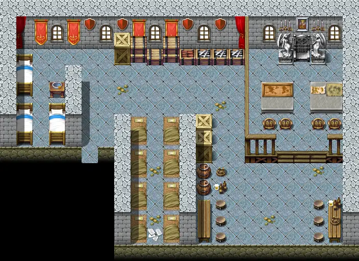
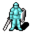
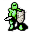

# Blackwater mountain 29

| | |
|---|---|
| **Map ID** | `blackwater_mountain29` |
| **Region** | In Prim (settlement) |
| **Type** | Indoors / underground |
| **Size** | 22×16 tiles |
| **Introduced** | v0.7.0 or earlier |
| **NPCs** | 13 |
| **Quests** | 4 |

**Blackwater mountain 29** is an indoor map, in Prim (settlement). It has 13 NPCs, and no enemies. Exits lead to Stoutford castle barrack 2, Blackwater mountain 11.

## Map

<label class="lg"><input type="checkbox" data-t="spawn" checked><b>Red</b>&nbsp;Monsters / NPCs</label><label class="lg"><input type="checkbox" data-t="mapchange" checked><b>Blue</b>&nbsp;Exit to another map</label><label class="lg"><input type="checkbox" data-t="container" checked><b>Yellow</b>&nbsp;Container (click to see contents)</label><label class="lg"><input type="checkbox" data-t="sign" checked><b>Purple</b>&nbsp;Sign</label><label class="lg"><input type="checkbox" data-t="rest" checked><b>Green</b>&nbsp;Resting place</label><label class="lg"><input type="checkbox" data-t="key" checked><b>Orange dashed</b>&nbsp;Blocked until a quest step / item</label><label class="lg"><input type="checkbox" data-t="script"><b>Grey dotted</b>&nbsp;Scripted event</label><label class="lg"><input type="checkbox" data-t="replace"><b>White dotted</b>&nbsp;Changes during a quest</label><label class="lg"><input type="checkbox" data-t="pin" checked><b>Numbers</b>&nbsp;Numbered key points (see the key below the map)</label>

<a class="pin pin-exit" href="#key-1" style="left:6.818%;top:46.875%" title="Exit (west): to [Stoutford castle barrack 2](stoutford_castle_barrack2.md)">1</a><a class="pin pin-exit" href="#key-2" style="left:25.000%;top:59.375%" title="Exit (exit outside): to [Blackwater mountain 11](blackwater_mountain11.md)">2</a><a id="pin-npc-ortholion_guard2" class="pin pin-npc" href="#key-3" style="left:25.000%;top:40.625%" title="[Feygard scout](../../monsters/feygard_scout.md#v-ortholion_guard2): NPC">3</a><a id="pin-npc-ortholion" class="pin pin-npc" href="#key-4" style="left:29.545%;top:34.375%" title="[General Ortholion](../../monsters/ortholion.md): 1 quest">4</a><a id="pin-npc-ortholion_guard1" class="pin pin-npc" href="#key-5" style="left:25.000%;top:28.125%" title="[General&#x27;s henchman](../../monsters/ortholion_guard1.md): shopkeeper">5</a><a id="pin-npc-guthbered" class="pin pin-npc" href="#key-6" style="left:84.091%;top:28.125%" title="[Guthbered](../../monsters/guthbered.md): 2 quests">6</a><a id="pin-npc-guthbereds_bodyguard" class="pin pin-npc" href="#key-7" style="left:79.545%;top:28.125%" title="[Guthbered&#x27;s bodyguard](../../monsters/guthbereds_bodyguard.md): NPC">7</a><a id="pin-npc-prim_bar_regular" class="pin pin-npc" href="#key-8" style="left:29.545%;top:28.125%" title="[Jern](../../monsters/prim_bar_regular.md): 1 quest">8</a><a id="pin-npc-prim_guard6" class="pin pin-npc" href="#key-9" style="left:34.091%;top:40.625%" title="[Prim guard](../../monsters/prim_guard.md#v-prim_guard6): NPC">9</a><a id="pin-npc-prim_guard" class="pin pin-npc" href="#key-10" style="left:29.545%;top:21.875%" title="[Prim guard](../../monsters/prim_guard.md): NPC">10</a><a id="pin-npc-prim_guard5" class="pin pin-npc" href="#key-11" style="left:34.091%;top:28.125%" title="[Prim guard captain](../../monsters/prim_guard5.md): 1 quest">11</a><a id="pin-npc-prim_sentry" class="pin pin-npc" href="#key-12" style="left:65.909%;top:90.625%" title="[Prim sentry](../../monsters/prim_sentry.md): NPC">12</a><a id="pin-npc-prim_weapon_guard" class="pin pin-npc" href="#key-13" style="left:47.727%;top:28.125%" title="[Prim weapon guard](../../monsters/prim_weapon_guard.md): NPC">13</a><a id="pin-npc-tired_prim_guard" class="pin pin-npc" href="#key-14" style="left:11.364%;top:53.125%" title="[Tired Prim guard](../../monsters/tired_prim_guard.md): NPC">14</a><a id="pin-npc-prim_guard7" class="pin pin-npc" href="#key-15" style="left:38.636%;top:78.125%" title="[Wounded Prim guard](../../monsters/prim_guard7.md): NPC">15</a><a class="pin pin-sign" href="#key-16" style="left:43.182%;top:90.625%" title="Sign: A sign">16</a><a class="pin pin-key" href="#key-17" style="left:7.117%;top:42.188%" title="Blocked passage: Unlocked during the quest: base_nondisplay (stage 1: “1=Developers Debug Version active”)">17</a><a class="pin pin-key" href="#key-18" style="left:27.273%;top:46.875%" title="Blocked passage: Closed off once you reach this point in the quest: hidden story flag “bwm72_beginning” (stage 5: “Keyfield on Bwm29”)">18</a><a class="pin pin-replace" href="#key-19" style="left:36.663%;top:35.938%" title="Changes during a quest: This area changes during the quest: Climbing up is forbidden (stage 36: “I talked again with Jern. Maybe the guards will be more reasonable if he leads the conversation instead of me.”)">19</a><a class="pin pin-replace" href="#key-19" style="left:38.935%;top:73.438%" title="Changes during a quest: This area changes during the quest: Climbing up is forbidden (stage 36: “I talked again with Jern. Maybe the guards will be more reasonable if he leads the conversation instead of me.”)">19</a>

??? abstract "Key to the numbers on the map"

    | # | What | Details |
    |---|---|---|
    | 1 | Exit (west) | to [Stoutford castle barrack 2](stoutford_castle_barrack2.md) |
    | 2 | Exit (exit outside) | to [Blackwater mountain 11](blackwater_mountain11.md) |
    | 3 | [Feygard scout](../monsters/feygard_scout.md#v-ortholion_guard2) | NPC |
    | 4 | [General Ortholion](../monsters/ortholion.md) | 1 quest |
    | 5 | [General's henchman](../monsters/ortholion_guard1.md) | shopkeeper |
    | 6 | [Guthbered](../monsters/guthbered.md) | 2 quests |
    | 7 | [Guthbered's bodyguard](../monsters/guthbereds_bodyguard.md) | NPC |
    | 8 | [Jern](../monsters/prim_bar_regular.md) | 1 quest |
    | 9 | [Prim guard](../monsters/prim_guard.md#v-prim_guard6) | NPC |
    | 10 | [Prim guard](../monsters/prim_guard.md) | NPC |
    | 11 | [Prim guard captain](../monsters/prim_guard5.md) | 1 quest |
    | 12 | [Prim sentry](../monsters/prim_sentry.md) | NPC |
    | 13 | [Prim weapon guard](../monsters/prim_weapon_guard.md) | NPC |
    | 14 | [Tired Prim guard](../monsters/tired_prim_guard.md) | NPC |
    | 15 | [Wounded Prim guard](../monsters/prim_guard7.md) | NPC |
    | 16 | Sign | A sign |
    | 17 | Blocked passage | Unlocked during the quest: base_nondisplay (stage 1: “1=Developers Debug Version active”) |
    | 18 | Blocked passage | Closed off once you reach this point in the quest: hidden story flag “bwm72_beginning” (stage 5: “Keyfield on Bwm29”) |
    | 19 | Changes during a quest | This area changes during the quest: Climbing up is forbidden (stage 36: “I talked again with Jern. Maybe the guards will be more reasonable if he leads the conversation instead of me.”) |

Verified against v0.8.18 map data.

## Connections

| Direction | Leads to | Region there | Map # |
|---|---|---|---|
| West | [Stoutford castle barrack 2](stoutford_castle_barrack2.md) | Prim | 1 |
| Exit outside | [Blackwater mountain 11](blackwater_mountain11.md) | Prim | 2 |

## NPCs

- [Feygard scout](../monsters/feygard_scout.md#v-ortholion_guard2) (#3)
- [General Ortholion](../monsters/ortholion.md) — quests: [Climbing up is forbidden](../quests/Omi2_bwm1.md) (#4)
- [General's henchman](../monsters/ortholion_guard1.md) — shopkeeper (#5)
- [Guthbered](../monsters/guthbered.md) — can be fought — quests: [Clouded intent](../quests/prim_hunt.md), [The agent and the beast](../quests/bwm_agent.md) (#6)
- [Guthbered's bodyguard](../monsters/guthbereds_bodyguard.md) — can be fought (#7)
- [Jern](../monsters/prim_bar_regular.md) — quests: [Climbing up is forbidden](../quests/Omi2_bwm1.md) (#8)
- [Prim guard](../monsters/prim_guard.md#v-prim_guard6) (#9)
- [Prim guard](../monsters/prim_guard.md) — can be fought (#10)
- [Prim guard captain](../monsters/prim_guard5.md) — quests: [Climbing up is forbidden](../quests/Omi2_bwm1.md) (#11)
- [Prim sentry](../monsters/prim_sentry.md) — can be fought (#12)
- [Prim weapon guard](../monsters/prim_weapon_guard.md) — can be fought (#13)
- [Tired Prim guard](../monsters/tired_prim_guard.md) — can be fought (#14)
- [Wounded Prim guard](../monsters/prim_guard7.md) (#15)

## Items & containers

**Shops:** [General's henchman](../monsters/ortholion_guard1.md)

## Quests

- [base_nondisplay](../quests/base_nondisplay.md): blocked passage opens at stage 1
- [Climbing up is forbidden](../quests/Omi2_bwm1.md): [General Ortholion](../monsters/ortholion.md) is involved; [Jern](../monsters/prim_bar_regular.md) is involved; [Prim guard captain](../monsters/prim_guard5.md) is involved; part of the map changes at stage 36; something on this map advances it
- [Clouded intent](../quests/prim_hunt.md): [Guthbered](../monsters/guthbered.md) is involved
- [The agent and the beast](../quests/bwm_agent.md): [Guthbered](../monsters/guthbered.md) is involved; something on this map advances it
- [Blackwater Mountain events (hidden flag)](../quests/bwm72_beginning.md): [General Ortholion](../monsters/ortholion.md) is involved; [Jern](../monsters/prim_bar_regular.md) is involved; [Prim guard captain](../monsters/prim_guard5.md) is involved; blocked passage closes at stage 5

## Points of interest

- **Sign** (#16): A sign
- **Blocked passage** (#17): Unlocked during the quest: base_nondisplay (stage 1: “1=Developers Debug Version active”)
- **Blocked passage** (#18): Closed off once you reach this point in the quest: hidden story flag “bwm72_beginning” (stage 5: “Keyfield on Bwm29”)
- **Changes during a quest** (#19): This area changes during the quest: Climbing up is forbidden (stage 36: “I talked again with Jern. Maybe the guards will be more reasonable if he leads the conversation instead of me.”)

## Version history

| Version | Change |
|---|---|
| [v0.7.0](../versions/0.7.0.md) | Present in v0.7.0 (earliest release tracked) |
| [v0.7.1](../versions/0.7.1.md) | Map layout or objects changed |
| [v0.7.2](../versions/0.7.2.md) | Map layout or objects changed |
| [v0.7.14](../versions/0.7.14.md) | Map layout or objects changed |

Verified against v0.8.18 and every earlier release back to v0.7.0 (game data compared release by release).

## Community notes

<small>Written by players, not generated from game data. **Observations**: what players notice in-game · **Lore**: the in-world story · **Trivia**: real-world facts, references, development history · **Theory / speculation**: unconfirmed ideas; may just be unfinished content</small>

### Observations

*No notes yet. Contributions are welcome: [add a note](https://github.com/asdfghjkl628/Andor-s-Trail-Wikiiii/new/main/notes/maps?filename=blackwater_mountain29.md&value=%23%23%20Observations%0A%0A%3C%21--%20what%20players%20notice%20in-game%20--%3E%0A%0A%23%23%20Lore%0A%0A%3C%21--%20the%20in-world%20story%20--%3E%0A%0A%23%23%20Trivia%0A%0A%3C%21--%20real-world%20facts%2C%20references%2C%20development%20history%20--%3E%0A%0A%23%23%20Theory%20/%20speculation%0A%0A%3C%21--%20unconfirmed%20ideas%3B%20may%20just%20be%20unfinished%20content%20--%3E%0A).*

### Lore

*No notes yet. Contributions are welcome: [add a note](https://github.com/asdfghjkl628/Andor-s-Trail-Wikiiii/new/main/notes/maps?filename=blackwater_mountain29.md&value=%23%23%20Observations%0A%0A%3C%21--%20what%20players%20notice%20in-game%20--%3E%0A%0A%23%23%20Lore%0A%0A%3C%21--%20the%20in-world%20story%20--%3E%0A%0A%23%23%20Trivia%0A%0A%3C%21--%20real-world%20facts%2C%20references%2C%20development%20history%20--%3E%0A%0A%23%23%20Theory%20/%20speculation%0A%0A%3C%21--%20unconfirmed%20ideas%3B%20may%20just%20be%20unfinished%20content%20--%3E%0A).*

### Trivia

*No notes yet. Contributions are welcome: [add a note](https://github.com/asdfghjkl628/Andor-s-Trail-Wikiiii/new/main/notes/maps?filename=blackwater_mountain29.md&value=%23%23%20Observations%0A%0A%3C%21--%20what%20players%20notice%20in-game%20--%3E%0A%0A%23%23%20Lore%0A%0A%3C%21--%20the%20in-world%20story%20--%3E%0A%0A%23%23%20Trivia%0A%0A%3C%21--%20real-world%20facts%2C%20references%2C%20development%20history%20--%3E%0A%0A%23%23%20Theory%20/%20speculation%0A%0A%3C%21--%20unconfirmed%20ideas%3B%20may%20just%20be%20unfinished%20content%20--%3E%0A).*

### Theory / speculation

*No notes yet. Contributions are welcome: [add a note](https://github.com/asdfghjkl628/Andor-s-Trail-Wikiiii/new/main/notes/maps?filename=blackwater_mountain29.md&value=%23%23%20Observations%0A%0A%3C%21--%20what%20players%20notice%20in-game%20--%3E%0A%0A%23%23%20Lore%0A%0A%3C%21--%20the%20in-world%20story%20--%3E%0A%0A%23%23%20Trivia%0A%0A%3C%21--%20real-world%20facts%2C%20references%2C%20development%20history%20--%3E%0A%0A%23%23%20Theory%20/%20speculation%0A%0A%3C%21--%20unconfirmed%20ideas%3B%20may%20just%20be%20unfinished%20content%20--%3E%0A).*

??? info "Technical information"

    | | |
    |---|---|
    | Map ID | `blackwater_mountain29` |
    | File | `res/xml/blackwater_mountain29.tmx` |
    | Size | 22×16 tiles (704×512 px) |
    | outdoors property | – |
    | Layers drawn | ground, objects, above |
    | Tilesets | map_bed_1, map_border_1, map_bridge_1, map_bridge_2, map_broken_1, map_cavewall_1, map_cavewall_2, map_cavewall_3, map_cavewall_4, map_chair_table_1, map_chair_table_2, map_crate_1, map_cupboard_1, map_curtain_1, map_entrance_1, map_entrance_2, map_fence_1, map_fence_2, map_fence_3, map_fence_4, map_ground_1, map_ground_2, map_ground_3, map_ground_4, map_ground_5, map_ground_6, map_ground_7, map_ground_8, map_house_1, map_house_2, map_indoor_1, map_indoor_2, map_kitchen_1, map_outdoor_1, map_pillar_1, map_pillar_2, map_plant_1, map_plant_2, map_rock_1, map_rock_2, map_roof_1, map_roof_2, map_roof_3, map_shop_1, map_sign_ladder_1, map_table_1, map_trail_1, map_transition_1, map_transition_2, map_transition_3, map_transition_4, map_transition_5, map_tree_1, map_tree_2, map_wall_1, map_wall_2, map_wall_3, map_wall_4, map_window_1, map_window_2 |
    | Map objects | spawn: 14, mapchange: 2, key: 2, replace: 2, sign: 1 |
    | World map position | – |

<small>Data from v0.8.18</small>
