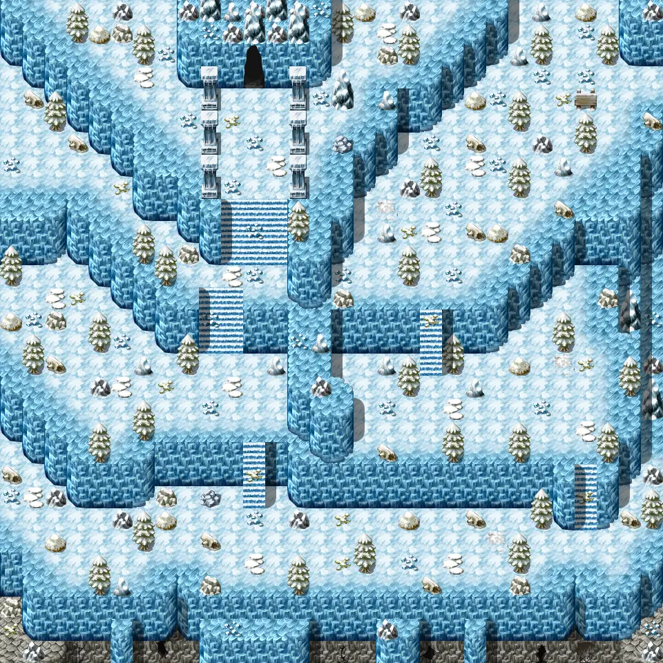
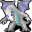

# Blackwater mountain32

30×30 tiles · outdoors · part of [World1](index.md)

<label class="lg"><input type="checkbox" data-t="spawn" checked><b>Red</b>&nbsp;Monsters / NPCs</label><label class="lg"><input type="checkbox" data-t="mapchange" checked><b>Blue</b>&nbsp;Exit to another map</label><label class="lg"><input type="checkbox" data-t="container" checked><b>Yellow</b>&nbsp;Container (click to see contents)</label><label class="lg"><input type="checkbox" data-t="sign" checked><b>Purple</b>&nbsp;Sign</label><label class="lg"><input type="checkbox" data-t="rest" checked><b>Green</b>&nbsp;Resting place</label><label class="lg"><input type="checkbox" data-t="key" checked><b>Orange dashed</b>&nbsp;Blocked until a quest step / item</label><label class="lg"><input type="checkbox" data-t="script"><b>Grey dotted</b>&nbsp;Scripted event</label><label class="lg"><input type="checkbox" data-t="replace"><b>White dotted</b>&nbsp;Changes during a quest</label>

## Exits

- [Blackwater mountain30](blackwater_mountain30.md)
- [Blackwater mountain36](blackwater_mountain36.md)
- [Blackwater mountain55](blackwater_mountain55.md)
- [Bwmfill4](bwmfill4.md)

## Monsters & NPCs here

| Name | HP |
|---|---|
| [Ice berries](../monsters/wild_berry2.md) | 0 |
| [Young white wyrm](../monsters/young_white_wyrm.md) | 47 |
| [White wyrm](../monsters/white_wyrm.md) | 55 |
| [Aulaeth](../monsters/aulaeth.md) | 120 |
| [Strong aulaeth](../monsters/strong_aulaeth.md) | 135 |
| [Subdued Feygard mountain scout](../monsters/ortholion_subdued.md) | 191 |

<small>Map ID: `blackwater_mountain32` · Data from v0.8.18</small>
