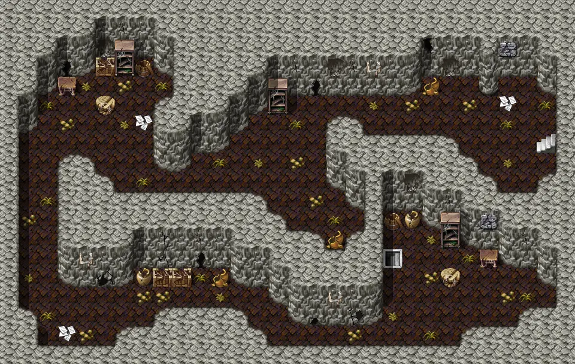

# Blackwater mountain38

| | |
|---|---|
| **Map ID** | `blackwater_mountain38` |
| **Region** | In Blackwater Mountain (other) |
| **Type** | Indoors / underground |
| **Size** | 30×19 tiles |
| **World map** | [Bwcave2](index.md) |
| **Introduced** | v0.7.0 or earlier |
| **NPCs** | 1 |
| **Enemy types** | 2 |
| **Quests** | 3 |

**Blackwater mountain38** is an indoor map, in Blackwater Mountain (other). It has 1 NPC and 2 kinds of enemy. Exits lead to Blackwater mountain37, Blackwater mountain43.

## Map

<label class="lg"><input type="checkbox" data-t="spawn" checked><b>Red</b>&nbsp;Monsters / NPCs</label><label class="lg"><input type="checkbox" data-t="mapchange" checked><b>Blue</b>&nbsp;Exit to another map</label><label class="lg"><input type="checkbox" data-t="container" checked><b>Yellow</b>&nbsp;Container (click to see contents)</label><label class="lg"><input type="checkbox" data-t="sign" checked><b>Purple</b>&nbsp;Sign</label><label class="lg"><input type="checkbox" data-t="rest" checked><b>Green</b>&nbsp;Resting place</label><label class="lg"><input type="checkbox" data-t="key" checked><b>Orange dashed</b>&nbsp;Blocked until a quest step / item</label><label class="lg"><input type="checkbox" data-t="script"><b>Grey dotted</b>&nbsp;Scripted event</label><label class="lg"><input type="checkbox" data-t="replace"><b>White dotted</b>&nbsp;Changes during a quest</label><label class="lg"><input type="checkbox" data-t="pin" checked><b>Numbers</b>&nbsp;Numbered key points (see the key below the map)</label>

<a class="pin pin-exit" href="#key-1" style="left:95.000%;top:39.474%" title="Exit (east): to [Blackwater mountain37](blackwater_mountain37.md)">1</a><a class="pin pin-exit" href="#key-2" style="left:68.333%;top:71.053%" title="Exit (stairs / passage): to [Blackwater mountain43](blackwater_mountain43.md)">2</a><a id="pin-npc-agent6" class="pin pin-npc" href="#key-3" style="left:81.667%;top:81.579%" title="[Agent](../../monsters/agent1.md#v-agent6): 1 quest">3</a><a class="pin pin-script" href="#key-4" style="left:70.219%;top:67.106%" title="Quest trigger: Scripted event: advances the quest: hidden story flag “quest_burhczyd_nd” to stage 56 (“56=show oven in BWM”)">4</a><a class="pin pin-sign" href="#key-5" style="left:88.333%;top:28.947%" title="Sign: A sign">5</a><a class="pin pin-sign" href="#key-5" style="left:25.000%;top:34.211%" title="Sign: A sign">5</a><a class="pin pin-sign" href="#key-5" style="left:11.667%;top:92.105%" title="Sign: A sign">5</a><a class="pin pin-key" href="#key-6" style="left:71.682%;top:74.516%" title="Blocked passage: Unlocked during the quest: The agent and the beast (stage 60: “I have reached the Blackwater mountain settlement. I should find and talk to their battle master, Harlenn.”)">6</a>

??? abstract "Key to the numbers on the map"

    | # | What | Details |
    |---|---|---|
    | 1 | Exit (east) | to [Blackwater mountain37](blackwater_mountain37.md) |
    | 2 | Exit (stairs / passage) | to [Blackwater mountain43](blackwater_mountain43.md) |
    | 3 | [Agent](../monsters/agent1.md#v-agent6) | 1 quest |
    | 4 | Quest trigger | Scripted event: advances the quest: hidden story flag “quest_burhczyd_nd” to stage 56 (“56=show oven in BWM”) |
    | 5 | Sign | A sign |
    | 6 | Blocked passage | Unlocked during the quest: The agent and the beast (stage 60: “I have reached the Blackwater mountain settlement. I should find and talk to their battle master, Harlenn.”) |

Verified against v0.8.18 map data.

## Connections

| Direction | Leads to | Region there | Map # |
|---|---|---|---|
| East | [Blackwater mountain37](blackwater_mountain37.md) | Blackwater Mountain | 1 |
| Stairs / passage | [Blackwater mountain43](blackwater_mountain43.md) | – | 2 |

## NPCs

- [Agent](../monsters/agent1.md#v-agent6) — quests: [The agent and the beast](../quests/bwm_agent.md) (#3)

## Enemies

| Enemy | HP | Damage | Up to | Notes |
|---|---|---|---|---|
| [Wyrm apprentice](../monsters/wyrm_apprentice.md) | 69 | 2–9 | 4 | shares spawn with Wyrm trainer |
| [Wyrm trainer](../monsters/wyrm_trainer.md) | 69 | 2–9 | 4 | shares spawn with Wyrm apprentice |

<small>“Up to” is the most that can be alive at once from the spawn areas on this map.</small>

## Quests

- [Climbing up is forbidden](../quests/Omi2_bwm1.md): a scripted event can trigger here from stage 34; a scripted event can trigger here from stage 41
- [Lights in the dark](../quests/kazaul.md): something on this map advances it
- [The agent and the beast](../quests/bwm_agent.md): [Agent](../monsters/agent1.md#v-agent6) is involved; blocked passage opens at stage 60
- [Young merchant Non-displayed (hidden flag)](../quests/quest_burhczyd_nd.md): something on this map advances it; stepping on a trigger here sets stage 56

## Points of interest

- **Quest trigger** (#4): Scripted event: advances the quest: hidden story flag “quest_burhczyd_nd” to stage 56 (“56=show oven in BWM”)
- **Sign** (#5): A sign
- **Blocked passage** (#6): Unlocked during the quest: The agent and the beast (stage 60: “I have reached the Blackwater mountain settlement. I should find and talk to their battle master, Harlenn.”)

## Version history

| Version | Change |
|---|---|
| [v0.7.0](../versions/0.7.0.md) | Present in v0.7.0 (earliest release tracked) |
| [v0.7.1](../versions/0.7.1.md) | Map layout or objects changed |
| [v0.7.2](../versions/0.7.2.md) | Map layout or objects changed |
| [v0.7.11](../versions/0.7.11.md) | Map layout or objects changed |
| [v0.7.14](../versions/0.7.14.md) | Map layout or objects changed |
| [v0.8.2](../versions/0.8.2.md) | Map layout or objects changed |

Verified against v0.8.18 and every earlier release back to v0.7.0 (game data compared release by release).

## Community notes

<small>Written by players, not generated from game data. **Observations**: what players notice in-game · **Lore**: the in-world story · **Trivia**: real-world facts, references, development history · **Theory / speculation**: unconfirmed ideas; may just be unfinished content</small>

### Observations

*No notes yet. Contributions are welcome: [add a note](https://github.com/asdfghjkl628/Andor-s-Trail-Wikiiii/new/main/notes/maps?filename=blackwater_mountain38.md&value=%23%23%20Observations%0A%0A%3C%21--%20what%20players%20notice%20in-game%20--%3E%0A%0A%23%23%20Lore%0A%0A%3C%21--%20the%20in-world%20story%20--%3E%0A%0A%23%23%20Trivia%0A%0A%3C%21--%20real-world%20facts%2C%20references%2C%20development%20history%20--%3E%0A%0A%23%23%20Theory%20/%20speculation%0A%0A%3C%21--%20unconfirmed%20ideas%3B%20may%20just%20be%20unfinished%20content%20--%3E%0A).*

### Lore

*No notes yet. Contributions are welcome: [add a note](https://github.com/asdfghjkl628/Andor-s-Trail-Wikiiii/new/main/notes/maps?filename=blackwater_mountain38.md&value=%23%23%20Observations%0A%0A%3C%21--%20what%20players%20notice%20in-game%20--%3E%0A%0A%23%23%20Lore%0A%0A%3C%21--%20the%20in-world%20story%20--%3E%0A%0A%23%23%20Trivia%0A%0A%3C%21--%20real-world%20facts%2C%20references%2C%20development%20history%20--%3E%0A%0A%23%23%20Theory%20/%20speculation%0A%0A%3C%21--%20unconfirmed%20ideas%3B%20may%20just%20be%20unfinished%20content%20--%3E%0A).*

### Trivia

*No notes yet. Contributions are welcome: [add a note](https://github.com/asdfghjkl628/Andor-s-Trail-Wikiiii/new/main/notes/maps?filename=blackwater_mountain38.md&value=%23%23%20Observations%0A%0A%3C%21--%20what%20players%20notice%20in-game%20--%3E%0A%0A%23%23%20Lore%0A%0A%3C%21--%20the%20in-world%20story%20--%3E%0A%0A%23%23%20Trivia%0A%0A%3C%21--%20real-world%20facts%2C%20references%2C%20development%20history%20--%3E%0A%0A%23%23%20Theory%20/%20speculation%0A%0A%3C%21--%20unconfirmed%20ideas%3B%20may%20just%20be%20unfinished%20content%20--%3E%0A).*

### Theory / speculation

*No notes yet. Contributions are welcome: [add a note](https://github.com/asdfghjkl628/Andor-s-Trail-Wikiiii/new/main/notes/maps?filename=blackwater_mountain38.md&value=%23%23%20Observations%0A%0A%3C%21--%20what%20players%20notice%20in-game%20--%3E%0A%0A%23%23%20Lore%0A%0A%3C%21--%20the%20in-world%20story%20--%3E%0A%0A%23%23%20Trivia%0A%0A%3C%21--%20real-world%20facts%2C%20references%2C%20development%20history%20--%3E%0A%0A%23%23%20Theory%20/%20speculation%0A%0A%3C%21--%20unconfirmed%20ideas%3B%20may%20just%20be%20unfinished%20content%20--%3E%0A).*

??? info "Technical information"

    | | |
    |---|---|
    | Map ID | `blackwater_mountain38` |
    | File | `res/xml/blackwater_mountain38.tmx` |
    | Size | 30×19 tiles (960×608 px) |
    | outdoors property | – |
    | Layers drawn | ground, objects, above |
    | Tilesets | map_bed_1, map_border_1, map_bridge_1, map_bridge_2, map_broken_1, map_cavewall_1, map_cavewall_2, map_cavewall_3, map_cavewall_4, map_chair_table_1, map_chair_table_2, map_crate_1, map_cupboard_1, map_curtain_1, map_entrance_1, map_entrance_2, map_fence_1, map_fence_2, map_fence_3, map_fence_4, map_ground_1, map_ground_2, map_ground_3, map_ground_4, map_ground_5, map_ground_6, map_ground_7, map_ground_8, map_house_1, map_house_2, map_indoor_1, map_indoor_2, map_kitchen_1, map_outdoor_1, map_pillar_1, map_pillar_2, map_plant_1, map_plant_2, map_rock_1, map_rock_2, map_roof_1, map_roof_2, map_roof_3, map_shop_1, map_sign_ladder_1, map_table_1, map_trail_1, map_transition_1, map_transition_2, map_transition_3, map_transition_4, map_transition_5, map_tree_1, map_tree_2, map_wall_1, map_wall_2, map_wall_3, map_wall_4, map_window_1, map_window_2 |
    | Map objects | spawn: 5, sign: 3, mapchange: 2, script: 2, key: 1 |
    | World map position | segment `bwcave2`, x 51, y 431 |

<small>Data from v0.8.18</small>
