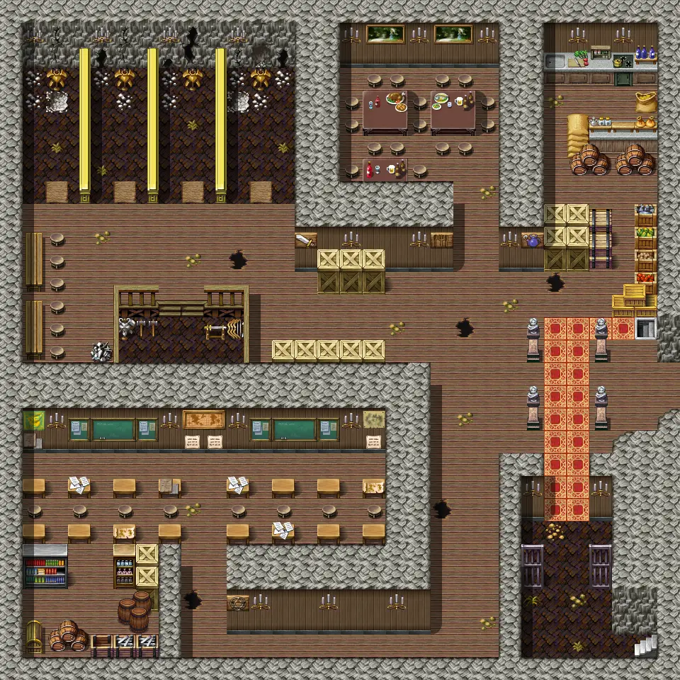

# Blackwater mountain43

30×30 tiles · part of [Bwsettlement](index.md)

<label class="lg lg-spawn"><input type="checkbox" data-t="spawn" checked> Monsters / NPCs</label><label class="lg lg-mapchange"><input type="checkbox" data-t="mapchange" checked> Exit to another map</label><label class="lg lg-container"><input type="checkbox" data-t="container" checked> Container</label><label class="lg lg-sign"><input type="checkbox" data-t="sign" checked> Sign</label><label class="lg lg-rest"><input type="checkbox" data-t="rest" checked> Resting place</label><label class="lg lg-key"><input type="checkbox" data-t="key" checked> Blocked / needs key or quest</label><label class="lg lg-script"><input type="checkbox" data-t="script"> Scripted event</label><label class="lg lg-replace"><input type="checkbox" data-t="replace"> Changes after a quest</label>

## Exits

- [Blackwater mountain38](blackwater_mountain38.md)
- [Blackwater mountain44](blackwater_mountain44.md)
- [Blackwater mountain52](blackwater_mountain52.md)

## Monsters & NPCs here

| Name | HP |
|---|---|
| [Blackwater cook](../monsters/blackwater_cook.md) | 0 |
| [Mazeg](../monsters/mazeg.md) | 0 |
| [General Ortholion](../monsters/ortholion.md) | 0 |
| [Ungorm](../monsters/ungorm.md) | 0 |
| [Burhczyd](../monsters/burhczyd6.md) | 0 |
| [Ehrenfest](../monsters/ehrenfest.md) | 0 |
| [Keneg](../monsters/keneg.md) | 0 |
| [Blackwater fighter](../monsters/blackwater_fighter.md) | 0 |
| [Waeges](../monsters/waeges.md) | 0 |
| [Blackwater pupil](../monsters/blackwater_pupil.md) | 0 |
| [Knight of Elythom](../monsters/burhczyd6e.md) | 0 |
| [Studying Blackwater priest](../monsters/studying_blackwater_priest.md) | 0 |
| [Blackwater inhabitant](../monsters/blackwater_inhabitant.md) | 10 |
| [Blackwater dinner guest](../monsters/blackwater_dinner_guest.md) | 20 |
| [Blackwater entrance guard](../monsters/blackwater_entrance_guard.md) | 60 |

<small>Map ID: `blackwater_mountain43` · Data from v0.8.18</small>
