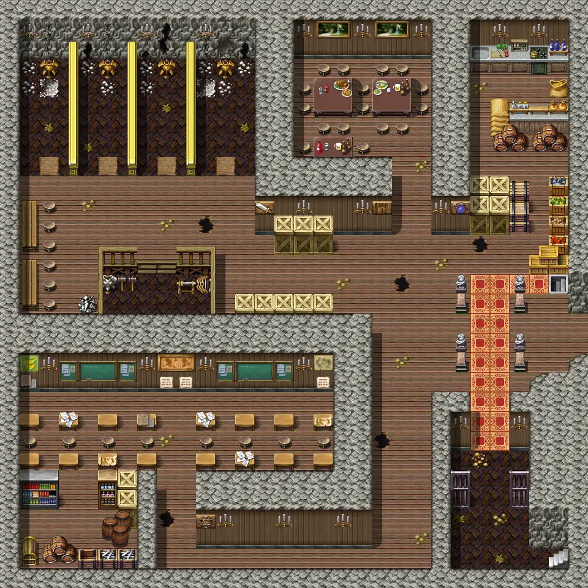

# Blackwater mountain43

| | |
|---|---|
| **Map ID** | `blackwater_mountain43` |
| **Type** | Indoors / underground |
| **Size** | 30×30 tiles |
| **World map** | [Bwsettlement](index.md) |
| **Introduced** | v0.7.0 or earlier |
| **NPCs** | 15 |
| **Quests** | 4 |

**Blackwater mountain43** is an indoor map. It has 15 NPCs, and no enemies. Exits lead to Blackwater mountain44, Blackwater mountain52, Blackwater mountain38.

## Map

<label class="lg"><input type="checkbox" data-t="spawn" checked><b>Red</b>&nbsp;Monsters / NPCs</label><label class="lg"><input type="checkbox" data-t="mapchange" checked><b>Blue</b>&nbsp;Exit to another map</label><label class="lg"><input type="checkbox" data-t="container" checked><b>Yellow</b>&nbsp;Container (click to see contents)</label><label class="lg"><input type="checkbox" data-t="sign" checked><b>Purple</b>&nbsp;Sign</label><label class="lg"><input type="checkbox" data-t="rest" checked><b>Green</b>&nbsp;Resting place</label><label class="lg"><input type="checkbox" data-t="key" checked><b>Orange dashed</b>&nbsp;Blocked until a quest step / item</label><label class="lg"><input type="checkbox" data-t="script"><b>Grey dotted</b>&nbsp;Scripted event</label><label class="lg"><input type="checkbox" data-t="replace"><b>White dotted</b>&nbsp;Changes during a quest</label><label class="lg"><input type="checkbox" data-t="pin" checked><b>Numbers</b>&nbsp;Numbered key points (see the key below the map)</label>

<a class="pin pin-exit" href="#key-1" style="left:95.000%;top:48.333%" title="Exit (east): to [Blackwater mountain44](blackwater_mountain44.md)">1</a><a class="pin pin-exit" href="#key-2" style="left:98.333%;top:56.667%" title="Exit (east): to [Blackwater mountain52](blackwater_mountain52.md)">2</a><a class="pin pin-exit" href="#key-3" style="left:95.000%;top:95.000%" title="Exit (southeast): to [Blackwater mountain38](blackwater_mountain38.md)">3</a><a id="pin-npc-blackwater_cook" class="pin pin-npc" href="#key-4" style="left:88.333%;top:15.000%" title="[Blackwater cook](../../monsters/blackwater_cook.md): NPC">4</a><a id="pin-npc-blackwater_dinner_guest" class="pin pin-npc" href="#key-5" style="left:61.667%;top:11.667%" title="[Blackwater dinner guest](../../monsters/blackwater_dinner_guest.md): NPC">5</a><a id="pin-npc-blackwater_entrance_guard" class="pin pin-npc" href="#key-6" style="left:75.000%;top:78.333%" title="[Blackwater entrance guard](../../monsters/blackwater_entrance_guard.md): NPC">6</a><a id="pin-npc-blackwater_fighter" class="pin pin-npc" href="#key-7" style="left:18.333%;top:31.667%" title="[Blackwater fighter](../../monsters/blackwater_fighter.md): NPC">7</a><a id="pin-npc-blackwater_inhabitant" class="pin pin-npc" href="#key-8" style="left:58.333%;top:21.667%" title="[Blackwater inhabitant](../../monsters/blackwater_inhabitant.md): NPC">8</a><a id="pin-npc-blackwater_pupil" class="pin pin-npc" href="#key-9" style="left:18.333%;top:75.000%" title="[Blackwater pupil](../../monsters/blackwater_pupil.md): NPC">9</a><a id="pin-npc-burhczyd6" class="pin pin-npc" href="#key-10" style="left:51.667%;top:15.000%" title="[Burhczyd](../../monsters/burhczyd1.md#v-burhczyd6): 1 quest">10</a><a id="pin-npc-ehrenfest" class="pin pin-npc" href="#key-11" style="left:68.333%;top:25.000%" title="[Ehrenfest](../../monsters/ehrenfest.md): 1 quest">11</a><a id="pin-npc-ortholion" class="pin pin-npc" href="#key-12" style="left:68.333%;top:21.667%" title="[General Ortholion](../../monsters/ortholion.md): 1 quest">12</a><a id="pin-npc-keneg" class="pin pin-npc" href="#key-13" style="left:61.667%;top:51.667%" title="[Keneg](../../monsters/keneg.md): NPC">13</a><a id="pin-npc-burhczyd6e" class="pin pin-npc" href="#key-14" style="left:51.667%;top:18.333%" title="[Knight of Elythom](../../monsters/burhczyd1e.md#v-burhczyd6e): 1 quest">14</a><a id="pin-npc-mazeg" class="pin pin-npc" href="#key-15" style="left:88.333%;top:45.000%" title="[Mazeg](../../monsters/mazeg.md): shopkeeper, 1 quest">15</a><a id="pin-npc-studying_blackwater_priest" class="pin pin-npc" href="#key-16" style="left:35.000%;top:75.000%" title="[Studying Blackwater priest](../../monsters/studying_blackwater_priest.md): NPC">16</a><a id="pin-npc-ungorm" class="pin pin-npc" href="#key-17" style="left:15.000%;top:68.333%" title="[Ungorm](../../monsters/ungorm.md): NPC">17</a><a id="pin-npc-waeges" class="pin pin-npc" href="#key-18" style="left:28.333%;top:48.333%" title="[Waeges](../../monsters/waeges.md): shopkeeper">18</a><a class="pin pin-key" href="#key-19" style="left:65.400%;top:22.814%" title="Blocked passage: Unlocked during the quest: Search for Andor (stage 1: “My father Mikhail says that Andor has not been home since yesterday. I should go look for him in the village.”)">19</a>

??? abstract "Key to the numbers on the map"

    | # | What | Details |
    |---|---|---|
    | 1 | Exit (east) | to [Blackwater mountain44](blackwater_mountain44.md) |
    | 2 | Exit (east) | to [Blackwater mountain52](blackwater_mountain52.md) |
    | 3 | Exit (southeast) | to [Blackwater mountain38](blackwater_mountain38.md) |
    | 4 | [Blackwater cook](../monsters/blackwater_cook.md) | NPC |
    | 5 | [Blackwater dinner guest](../monsters/blackwater_dinner_guest.md) | NPC |
    | 6 | [Blackwater entrance guard](../monsters/blackwater_entrance_guard.md) | NPC |
    | 7 | [Blackwater fighter](../monsters/blackwater_fighter.md) | NPC |
    | 8 | [Blackwater inhabitant](../monsters/blackwater_inhabitant.md) | NPC |
    | 9 | [Blackwater pupil](../monsters/blackwater_pupil.md) | NPC |
    | 10 | [Burhczyd](../monsters/burhczyd1.md#v-burhczyd6) | 1 quest |
    | 11 | [Ehrenfest](../monsters/ehrenfest.md) | 1 quest |
    | 12 | [General Ortholion](../monsters/ortholion.md) | 1 quest |
    | 13 | [Keneg](../monsters/keneg.md) | NPC |
    | 14 | [Knight of Elythom](../monsters/burhczyd1e.md#v-burhczyd6e) | 1 quest |
    | 15 | [Mazeg](../monsters/mazeg.md) | shopkeeper, 1 quest |
    | 16 | [Studying Blackwater priest](../monsters/studying_blackwater_priest.md) | NPC |
    | 17 | [Ungorm](../monsters/ungorm.md) | NPC |
    | 18 | [Waeges](../monsters/waeges.md) | shopkeeper |
    | 19 | Blocked passage | Unlocked during the quest: Search for Andor (stage 1: “My father Mikhail says that Andor has not been home since yesterday. I should go look for him in the village.”) |

Verified against v0.8.18 map data.

## Connections

| Direction | Leads to | Region there | Map # |
|---|---|---|---|
| East | [Blackwater mountain44](blackwater_mountain44.md) | – | 1 |
| East | [Blackwater mountain52](blackwater_mountain52.md) | Blackwater Mountain | 2 |
| Southeast | [Blackwater mountain38](blackwater_mountain38.md) | Blackwater Mountain | 3 |

## NPCs

- [Blackwater cook](../monsters/blackwater_cook.md) (#4)
- [Blackwater dinner guest](../monsters/blackwater_dinner_guest.md) (#5)
- [Blackwater entrance guard](../monsters/blackwater_entrance_guard.md) — can be fought (#6)
- [Blackwater fighter](../monsters/blackwater_fighter.md) (#7)
- [Blackwater inhabitant](../monsters/blackwater_inhabitant.md) (#8)
- [Blackwater pupil](../monsters/blackwater_pupil.md) (#9)
- [Burhczyd](../monsters/burhczyd1.md#v-burhczyd6) — quests: [Young merchant](../quests/quest_burhczyd.md) (#10)
- [Ehrenfest](../monsters/ehrenfest.md) — quests: [Climbing up is forbidden](../quests/Omi2_bwm1.md) (#11)
- [General Ortholion](../monsters/ortholion.md) — quests: [Climbing up is forbidden](../quests/Omi2_bwm1.md) (#12)
- [Keneg](../monsters/keneg.md) (#13)
- [Knight of Elythom](../monsters/burhczyd1e.md#v-burhczyd6e) — quests: [Young merchant](../quests/quest_burhczyd.md) (#14)
- [Mazeg](../monsters/mazeg.md) — shopkeeper — quests: [A difference of opinion](../quests/sisterfight.md) (#15)
- [Studying Blackwater priest](../monsters/studying_blackwater_priest.md) (#16)
- [Ungorm](../monsters/ungorm.md) (#17)
- [Waeges](../monsters/waeges.md) — shopkeeper (#18)

## Items & containers

**Shops:** [Mazeg](../monsters/mazeg.md), [Waeges](../monsters/waeges.md)

## Quests

- [A difference of opinion](../quests/sisterfight.md): [Mazeg](../monsters/mazeg.md) is involved
- [Climbing up is forbidden](../quests/Omi2_bwm1.md): [Ehrenfest](../monsters/ehrenfest.md) is involved; [General Ortholion](../monsters/ortholion.md) is involved; a scripted event can trigger here from stage 46; a scripted event can trigger here from stage 47
- [Search for Andor](../quests/andor.md): blocked passage opens at stage 1
- [Young merchant](../quests/quest_burhczyd.md): [Burhczyd](../monsters/burhczyd1.md#v-burhczyd6) is involved; [Knight of Elythom](../monsters/burhczyd1e.md#v-burhczyd6e) is involved
- [Hidden: events in bwm (hidden flag)](../quests/bwm72_beginning.md): [Ehrenfest](../monsters/ehrenfest.md) is involved; [General Ortholion](../monsters/ortholion.md) is involved
- [Young merchant Non-displayed (hidden flag)](../quests/quest_burhczyd_nd.md): [Burhczyd](../monsters/burhczyd1.md#v-burhczyd6) is involved; [Knight of Elythom](../monsters/burhczyd1e.md#v-burhczyd6e) is involved

## Points of interest

- **Blocked passage** (#19): Unlocked during the quest: Search for Andor (stage 1: “My father Mikhail says that Andor has not been home since yesterday. I should go look for him in the village.”)

## Version history

| Version | Change |
|---|---|
| [v0.7.0](../versions/0.7.0.md) | Present in v0.7.0 (earliest release tracked) |
| [v0.7.1](../versions/0.7.1.md) | Map layout or objects changed |
| [v0.7.2](../versions/0.7.2.md) | Map layout or objects changed |
| [v0.7.8](../versions/0.7.8.md) | Map layout or objects changed |
| [v0.7.11](../versions/0.7.11.md) | Map layout or objects changed |
| [v0.7.14](../versions/0.7.14.md) | Map layout or objects changed |
| [v0.7.15](../versions/0.7.15.md) | Map layout or objects changed |

Verified against v0.8.18 and every earlier release back to v0.7.0 (game data compared release by release).

## Community notes

<small>Written by players, not generated from game data. **Observations**: what players notice in-game · **Lore**: the in-world story · **Trivia**: real-world facts, references, development history · **Theory / speculation**: unconfirmed ideas; may just be unfinished content</small>

### Observations

*No notes yet. Contributions are welcome: [add a note](https://github.com/asdfghjkl628/Andor-s-Trail-Wikiiii/new/main/notes/maps?filename=blackwater_mountain43.md&value=%23%23%20Observations%0A%0A%3C%21--%20what%20players%20notice%20in-game%20--%3E%0A%0A%23%23%20Lore%0A%0A%3C%21--%20the%20in-world%20story%20--%3E%0A%0A%23%23%20Trivia%0A%0A%3C%21--%20real-world%20facts%2C%20references%2C%20development%20history%20--%3E%0A%0A%23%23%20Theory%20/%20speculation%0A%0A%3C%21--%20unconfirmed%20ideas%3B%20may%20just%20be%20unfinished%20content%20--%3E%0A).*

### Lore

*No notes yet. Contributions are welcome: [add a note](https://github.com/asdfghjkl628/Andor-s-Trail-Wikiiii/new/main/notes/maps?filename=blackwater_mountain43.md&value=%23%23%20Observations%0A%0A%3C%21--%20what%20players%20notice%20in-game%20--%3E%0A%0A%23%23%20Lore%0A%0A%3C%21--%20the%20in-world%20story%20--%3E%0A%0A%23%23%20Trivia%0A%0A%3C%21--%20real-world%20facts%2C%20references%2C%20development%20history%20--%3E%0A%0A%23%23%20Theory%20/%20speculation%0A%0A%3C%21--%20unconfirmed%20ideas%3B%20may%20just%20be%20unfinished%20content%20--%3E%0A).*

### Trivia

*No notes yet. Contributions are welcome: [add a note](https://github.com/asdfghjkl628/Andor-s-Trail-Wikiiii/new/main/notes/maps?filename=blackwater_mountain43.md&value=%23%23%20Observations%0A%0A%3C%21--%20what%20players%20notice%20in-game%20--%3E%0A%0A%23%23%20Lore%0A%0A%3C%21--%20the%20in-world%20story%20--%3E%0A%0A%23%23%20Trivia%0A%0A%3C%21--%20real-world%20facts%2C%20references%2C%20development%20history%20--%3E%0A%0A%23%23%20Theory%20/%20speculation%0A%0A%3C%21--%20unconfirmed%20ideas%3B%20may%20just%20be%20unfinished%20content%20--%3E%0A).*

### Theory / speculation

*No notes yet. Contributions are welcome: [add a note](https://github.com/asdfghjkl628/Andor-s-Trail-Wikiiii/new/main/notes/maps?filename=blackwater_mountain43.md&value=%23%23%20Observations%0A%0A%3C%21--%20what%20players%20notice%20in-game%20--%3E%0A%0A%23%23%20Lore%0A%0A%3C%21--%20the%20in-world%20story%20--%3E%0A%0A%23%23%20Trivia%0A%0A%3C%21--%20real-world%20facts%2C%20references%2C%20development%20history%20--%3E%0A%0A%23%23%20Theory%20/%20speculation%0A%0A%3C%21--%20unconfirmed%20ideas%3B%20may%20just%20be%20unfinished%20content%20--%3E%0A).*

??? info "Technical information"

    | | |
    |---|---|
    | Map ID | `blackwater_mountain43` |
    | File | `res/xml/blackwater_mountain43.tmx` |
    | Size | 30×30 tiles (960×960 px) |
    | outdoors property | – |
    | Layers drawn | ground, objects, above |
    | Tilesets | map_bed_1, map_border_1, map_bridge_1, map_bridge_2, map_broken_1, map_cavewall_1, map_cavewall_2, map_cavewall_3, map_cavewall_4, map_chair_table_1, map_chair_table_2, map_crate_1, map_cupboard_1, map_curtain_1, map_entrance_1, map_entrance_2, map_fence_1, map_fence_2, map_fence_3, map_fence_4, map_ground_1, map_ground_2, map_ground_3, map_ground_4, map_ground_5, map_ground_6, map_ground_7, map_ground_8, map_house_1, map_house_2, map_indoor_1, map_indoor_2, map_kitchen_1, map_outdoor_1, map_pillar_1, map_pillar_2, map_plant_1, map_plant_2, map_rock_1, map_rock_2, map_roof_1, map_roof_2, map_roof_3, map_shop_1, map_sign_ladder_1, map_table_1, map_trail_1, map_transition_1, map_transition_2, map_transition_3, map_transition_4, map_transition_5, map_tree_1, map_tree_2, map_wall_1, map_wall_2, map_wall_3, map_wall_4, map_window_1, map_window_2 |
    | Map objects | spawn: 18, mapchange: 3, script: 1, key: 1 |
    | World map position | segment `bwsettlement`, x 37, y 414 |

<small>Data from v0.8.18</small>
