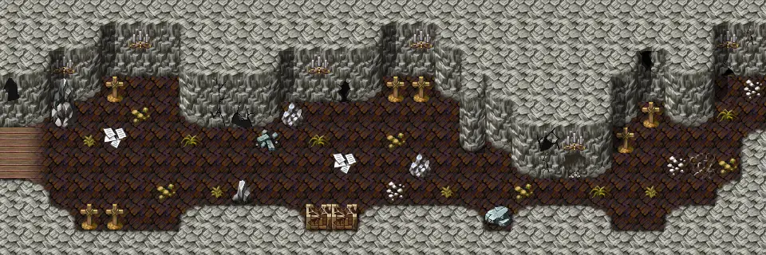
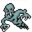

# Blackwater mountain52

| | |
|---|---|
| **Map ID** | `blackwater_mountain52` |
| **Region** | In Blackwater Mountain (other) |
| **Type** | Indoors / underground |
| **Size** | 30×10 tiles |
| **World map** | [Bwsettlement](index.md) |
| **Introduced** | v0.7.0 or earlier |
| **NPCs** | 1 |
| **Enemy types** | 2 |
| **Quests** | 0 |

**Blackwater mountain52** is an indoor map, in Blackwater Mountain (other). It has 1 NPC and 2 kinds of enemy. Exits lead to Blackwater mountain51, Blackwater mountain43.

## Map

<label class="lg"><input type="checkbox" data-t="spawn" checked><b>Red</b>&nbsp;Monsters / NPCs</label><label class="lg"><input type="checkbox" data-t="mapchange" checked><b>Blue</b>&nbsp;Exit to another map</label><label class="lg"><input type="checkbox" data-t="container" checked><b>Yellow</b>&nbsp;Container (click to see contents)</label><label class="lg"><input type="checkbox" data-t="sign" checked><b>Purple</b>&nbsp;Sign</label><label class="lg"><input type="checkbox" data-t="rest" checked><b>Green</b>&nbsp;Resting place</label><label class="lg"><input type="checkbox" data-t="key" checked><b>Orange dashed</b>&nbsp;Blocked until a quest step / item</label><label class="lg"><input type="checkbox" data-t="script"><b>Grey dotted</b>&nbsp;Scripted event</label><label class="lg"><input type="checkbox" data-t="replace"><b>White dotted</b>&nbsp;Changes during a quest</label><label class="lg"><input type="checkbox" data-t="pin" checked><b>Numbers</b>&nbsp;Numbered key points (see the key below the map)</label>

<a class="pin pin-exit" href="#key-1" style="left:98.333%;top:40.000%" title="Exit (east): to [Blackwater mountain51](blackwater_mountain51.md)">1</a><a class="pin pin-exit" href="#key-2" style="left:1.667%;top:60.000%" title="Exit (west): to [Blackwater mountain43](blackwater_mountain43.md)">2</a><a id="pin-npc-blackwater_border_patrol" class="pin pin-npc" href="#key-3" style="left:15.000%;top:75.000%" title="[Blackwater border patrol](../../monsters/blackwater_border_patrol.md): NPC">3</a><a class="pin pin-sign" href="#key-4" style="left:11.667%;top:75.000%" title="Sign: “The cross reads: Here lies Magnir the trader. Another casualty of those beasts.”">4</a><a class="pin pin-sign" href="#key-5" style="left:15.000%;top:45.000%" title="Sign: “The grave looks like it has been recently dug.”">5</a><a class="pin pin-sign" href="#key-6" style="left:15.219%;top:67.501%" title="Sign: “The cross reads: Here lies Torkurt, loyal servant of the Blackwater mountain settlement.”">6</a><a class="pin pin-sign" href="#key-7" style="left:85.000%;top:55.000%" title="Sign: “The cross reads: Here lies o&#x27;Rani, the most fierce warrior on this side of the mountain. May she rest in peace.”">7</a><a class="pin pin-sign" href="#key-8" style="left:81.667%;top:65.000%" title="Sign: “The cross reads: Unnamed traveller. Found on the cliff-side, killed by one of those beasts.”">8</a><a class="pin pin-sign" href="#key-9" style="left:51.667%;top:45.000%" title="Sign: “The cross reads: Here lies Trombul, the famous potion maker.”">9</a><a class="pin pin-sign" href="#key-10" style="left:55.000%;top:45.000%" title="Sign: “The cross reads: Here lies the remains of Antagnart, loved by none but remembered by everyone.”">10</a><a class="pin pin-sign" href="#key-11" style="left:45.000%;top:65.000%" title="Sign: “On the floor is what looks like some torn out pages from a book.”">11</a><a class="pin pin-sign" href="#key-12" style="left:15.000%;top:55.000%" title="Sign: “You find a crude drawing of one of the white wyrms, but you decide not to keep it since it must belong to someone.”">12</a>

??? abstract "Key to the numbers on the map"

    | # | What | Details |
    |---|---|---|
    | 1 | Exit (east) | to [Blackwater mountain51](blackwater_mountain51.md) |
    | 2 | Exit (west) | to [Blackwater mountain43](blackwater_mountain43.md) |
    | 3 | [Blackwater border patrol](../monsters/blackwater_border_patrol.md) | NPC |
    | 4 | Sign | “The cross reads: Here lies Magnir the trader. Another casualty of those beasts.” |
    | 5 | Sign | “The grave looks like it has been recently dug.” |
    | 6 | Sign | “The cross reads: Here lies Torkurt, loyal servant of the Blackwater mountain settlement.” |
    | 7 | Sign | “The cross reads: Here lies o'Rani, the most fierce warrior on this side of the mountain. May she rest in peace.” |
    | 8 | Sign | “The cross reads: Unnamed traveller. Found on the cliff-side, killed by one of those beasts.” |
    | 9 | Sign | “The cross reads: Here lies Trombul, the famous potion maker.” |
    | 10 | Sign | “The cross reads: Here lies the remains of Antagnart, loved by none but remembered by everyone.” |
    | 11 | Sign | “On the floor is what looks like some torn out pages from a book.” |
    | 12 | Sign | “You find a crude drawing of one of the white wyrms, but you decide not to keep it since it must belong to someone.” |

Verified against v0.8.18 map data.

## Connections

| Direction | Leads to | Region there | Map # |
|---|---|---|---|
| East | [Blackwater mountain51](blackwater_mountain51.md) | Blackwater Mountain | 1 |
| West | [Blackwater mountain43](blackwater_mountain43.md) | – | 2 |

## NPCs

- [Blackwater border patrol](../monsters/blackwater_border_patrol.md) — can be fought (#3)

## Enemies

| Enemy | HP | Damage | Up to | Notes |
|---|---|---|---|---|
| [Restless dead](../monsters/restless_dead.md) | 25 | 0–3 | 4 | shares spawn with Grave spawn |
| [Grave spawn](../monsters/grave_spawn.md) | 45 | 2–5 | 4 | shares spawn with Restless dead |

<small>“Up to” is the most that can be alive at once from the spawn areas on this map.</small>

## Points of interest

- **Sign** (#4): “The cross reads: Here lies Magnir the trader. Another casualty of those beasts.”
- **Sign** (#5): “The grave looks like it has been recently dug.”
- **Sign** (#6): “The cross reads: Here lies Torkurt, loyal servant of the Blackwater mountain settlement.”
- **Sign** (#7): “The cross reads: Here lies o'Rani, the most fierce warrior on this side of the mountain. May she rest in peace.”
- **Sign** (#8): “The cross reads: Unnamed traveller. Found on the cliff-side, killed by one of those beasts.”
- **Sign** (#9): “The cross reads: Here lies Trombul, the famous potion maker.”
- **Sign** (#10): “The cross reads: Here lies the remains of Antagnart, loved by none but remembered by everyone.”
- **Sign** (#11): “On the floor is what looks like some torn out pages from a book.”
- **Sign** (#12): “You find a crude drawing of one of the white wyrms, but you decide not to keep it since it must belong to someone.”

## Version history

| Version | Change |
|---|---|
| [v0.7.0](../versions/0.7.0.md) | Present in v0.7.0 (earliest release tracked) |
| [v0.7.1](../versions/0.7.1.md) | Map layout or objects changed |
| [v0.7.2](../versions/0.7.2.md) | Map layout or objects changed |
| [v0.8.2](../versions/0.8.2.md) | Map layout or objects changed |

Verified against v0.8.18 and every earlier release back to v0.7.0 (game data compared release by release).

## Community notes

<small>Written by players, not generated from game data. **Observations**: what players notice in-game · **Lore**: the in-world story · **Trivia**: real-world facts, references, development history · **Theory / speculation**: unconfirmed ideas; may just be unfinished content</small>

### Observations

*No notes yet. Contributions are welcome: [add a note](https://github.com/asdfghjkl628/Andor-s-Trail-Wikiiii/new/main/notes/maps?filename=blackwater_mountain52.md&value=%23%23%20Observations%0A%0A%3C%21--%20what%20players%20notice%20in-game%20--%3E%0A%0A%23%23%20Lore%0A%0A%3C%21--%20the%20in-world%20story%20--%3E%0A%0A%23%23%20Trivia%0A%0A%3C%21--%20real-world%20facts%2C%20references%2C%20development%20history%20--%3E%0A%0A%23%23%20Theory%20/%20speculation%0A%0A%3C%21--%20unconfirmed%20ideas%3B%20may%20just%20be%20unfinished%20content%20--%3E%0A).*

### Lore

*No notes yet. Contributions are welcome: [add a note](https://github.com/asdfghjkl628/Andor-s-Trail-Wikiiii/new/main/notes/maps?filename=blackwater_mountain52.md&value=%23%23%20Observations%0A%0A%3C%21--%20what%20players%20notice%20in-game%20--%3E%0A%0A%23%23%20Lore%0A%0A%3C%21--%20the%20in-world%20story%20--%3E%0A%0A%23%23%20Trivia%0A%0A%3C%21--%20real-world%20facts%2C%20references%2C%20development%20history%20--%3E%0A%0A%23%23%20Theory%20/%20speculation%0A%0A%3C%21--%20unconfirmed%20ideas%3B%20may%20just%20be%20unfinished%20content%20--%3E%0A).*

### Trivia

*No notes yet. Contributions are welcome: [add a note](https://github.com/asdfghjkl628/Andor-s-Trail-Wikiiii/new/main/notes/maps?filename=blackwater_mountain52.md&value=%23%23%20Observations%0A%0A%3C%21--%20what%20players%20notice%20in-game%20--%3E%0A%0A%23%23%20Lore%0A%0A%3C%21--%20the%20in-world%20story%20--%3E%0A%0A%23%23%20Trivia%0A%0A%3C%21--%20real-world%20facts%2C%20references%2C%20development%20history%20--%3E%0A%0A%23%23%20Theory%20/%20speculation%0A%0A%3C%21--%20unconfirmed%20ideas%3B%20may%20just%20be%20unfinished%20content%20--%3E%0A).*

### Theory / speculation

*No notes yet. Contributions are welcome: [add a note](https://github.com/asdfghjkl628/Andor-s-Trail-Wikiiii/new/main/notes/maps?filename=blackwater_mountain52.md&value=%23%23%20Observations%0A%0A%3C%21--%20what%20players%20notice%20in-game%20--%3E%0A%0A%23%23%20Lore%0A%0A%3C%21--%20the%20in-world%20story%20--%3E%0A%0A%23%23%20Trivia%0A%0A%3C%21--%20real-world%20facts%2C%20references%2C%20development%20history%20--%3E%0A%0A%23%23%20Theory%20/%20speculation%0A%0A%3C%21--%20unconfirmed%20ideas%3B%20may%20just%20be%20unfinished%20content%20--%3E%0A).*

??? info "Technical information"

    | | |
    |---|---|
    | Map ID | `blackwater_mountain52` |
    | File | `res/xml/blackwater_mountain52.tmx` |
    | Size | 30×10 tiles (960×320 px) |
    | outdoors property | – |
    | Layers drawn | ground, objects, above |
    | Tilesets | map_bed_1, map_border_1, map_bridge_1, map_bridge_2, map_broken_1, map_cavewall_1, map_cavewall_2, map_cavewall_3, map_cavewall_4, map_chair_table_1, map_chair_table_2, map_crate_1, map_cupboard_1, map_curtain_1, map_entrance_1, map_entrance_2, map_fence_1, map_fence_2, map_fence_3, map_fence_4, map_ground_1, map_ground_2, map_ground_3, map_ground_4, map_ground_5, map_ground_6, map_ground_7, map_ground_8, map_house_1, map_house_2, map_indoor_1, map_indoor_2, map_kitchen_1, map_outdoor_1, map_pillar_1, map_pillar_2, map_plant_1, map_plant_2, map_rock_1, map_rock_2, map_roof_1, map_roof_2, map_roof_3, map_shop_1, map_sign_ladder_1, map_table_1, map_trail_1, map_transition_1, map_transition_2, map_transition_3, map_transition_4, map_transition_5, map_tree_1, map_tree_2, map_wall_1, map_wall_2, map_wall_3, map_wall_4, map_window_1, map_window_2 |
    | Map objects | sign: 9, spawn: 3, mapchange: 2 |
    | World map position | segment `bwsettlement`, x 68, y 425 |

<small>Data from v0.8.18</small>
