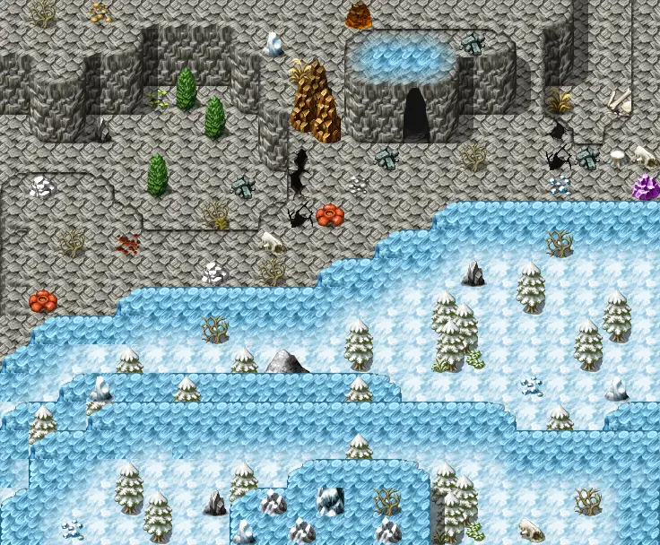
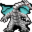
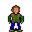
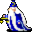
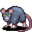

# Blackwater mountain 55

| | |
|---|---|
| **Map ID** | `blackwater_mountain55` |
| **Region** | In Blackwater Mountain (other) |
| **Type** | Outdoors |
| **Size** | 23×19 tiles |
| **World map** | [World 1](index.md) |
| **Introduced** | [v0.7.12](../versions/0.7.12.md) |
| **NPCs** | 5 |
| **Enemy types** | 5 |
| **Quests** | 2 |

**Blackwater mountain 55** is an outdoor map, in Blackwater Mountain (other). It has 5 NPCs and 5 kinds of enemy. Exits lead to Blackwater mountain 56, Blackwater mountain 32, Ratdom maze 455a.

## Map

<label class="lg"><input type="checkbox" data-t="spawn" checked><b>Red</b>&nbsp;Monsters / NPCs</label><label class="lg"><input type="checkbox" data-t="mapchange" checked><b>Blue</b>&nbsp;Exit to another map</label><label class="lg"><input type="checkbox" data-t="container" checked><b>Yellow</b>&nbsp;Container (click to see contents)</label><label class="lg"><input type="checkbox" data-t="sign" checked><b>Purple</b>&nbsp;Sign</label><label class="lg"><input type="checkbox" data-t="rest" checked><b>Green</b>&nbsp;Resting place</label><label class="lg"><input type="checkbox" data-t="key" checked><b>Orange dashed</b>&nbsp;Blocked until a quest step / item</label><label class="lg"><input type="checkbox" data-t="script"><b>Grey dotted</b>&nbsp;Scripted event</label><label class="lg"><input type="checkbox" data-t="replace"><b>White dotted</b>&nbsp;Changes during a quest</label><label class="lg"><input type="checkbox" data-t="pin" checked><b>Numbers</b>&nbsp;Numbered key points (see the key below the map)</label>

<a class="pin pin-exit" href="#key-1" style="left:76.087%;top:2.632%" title="Exit (north): to [Blackwater mountain 56](blackwater_mountain56.md)">1</a><a class="pin pin-exit" href="#key-2" style="left:19.565%;top:97.368%" title="Exit (south): to [Blackwater mountain 32](blackwater_mountain32.md)">2</a><a class="pin pin-exit" href="#key-2" style="left:84.783%;top:97.368%" title="Exit (south): to [Blackwater mountain 32](blackwater_mountain32.md)">2</a><a class="pin pin-exit" href="#key-3" style="left:63.043%;top:23.684%" title="Exit (door): to [Ratdom maze 455a](ratdom_maze_455a.md)">3</a><a id="pin-npc-ratdom_rat" class="pin pin-npc" href="#key-4" style="left:58.696%;top:13.158%" title="[Clevred](../../monsters/ratdom_rat.md): 1 quest">4</a><a id="pin-npc-hettar" class="pin pin-npc" href="#key-5" style="left:84.783%;top:81.579%" title="[Little Hettar](../../monsters/hettar.md): 1 quest">5</a><a id="pin-npc-whootibarfag" class="pin pin-npc" href="#key-6" style="left:50.000%;top:34.211%" title="[Whootibarfag](../../monsters/whootibarfag.md): shopkeeper, 1 quest">6</a><a id="pin-npc-hettar_dog" class="pin pin-npc" href="#key-7" style="left:89.130%;top:18.421%" title="[Wolfhound](../../monsters/hettar_dog.md): 1 quest">7</a><a id="pin-npc-hettar_dog2" class="pin pin-npc" href="#key-8" style="left:80.435%;top:81.579%" title="[Wolfhound](../../monsters/hettar_dog.md#v-hettar_dog2): NPC">8</a><a class="pin pin-script" href="#key-9" style="left:93.478%;top:18.421%" title="Quest trigger: Scripted event: advances the quest: hidden story flag “hettar_dog_nd” to stage 1 (“1=found dog”)">9</a>

??? abstract "Key to the numbers on the map"

    | # | What | Details |
    |---|---|---|
    | 1 | Exit (north) | to [Blackwater mountain 56](blackwater_mountain56.md) |
    | 2 | Exit (south) | to [Blackwater mountain 32](blackwater_mountain32.md) |
    | 3 | Exit (door) | to [Ratdom maze 455a](ratdom_maze_455a.md) |
    | 4 | [Clevred](../monsters/ratdom_rat.md) | 1 quest |
    | 5 | [Little Hettar](../monsters/hettar.md) | 1 quest |
    | 6 | [Whootibarfag](../monsters/whootibarfag.md) | shopkeeper, 1 quest |
    | 7 | [Wolfhound](../monsters/hettar_dog.md) | 1 quest |
    | 8 | [Wolfhound](../monsters/hettar_dog.md#v-hettar_dog2) | NPC |
    | 9 | Quest trigger | Scripted event: advances the quest: hidden story flag “hettar_dog_nd” to stage 1 (“1=found dog”) |

Verified against v0.8.18 map data.

## Connections

| Direction | Leads to | Region there | Map # |
|---|---|---|---|
| North | [Blackwater mountain 56](blackwater_mountain56.md) | Blackwater Mountain | 1 |
| South | [Blackwater mountain 32](blackwater_mountain32.md) | Blackwater Mountain | 2 |
| Door | [Ratdom maze 455a](ratdom_maze_455a.md) | Blackwater Mountain | 3 |

## NPCs

- [Clevred](../monsters/ratdom_rat.md) — quests: [Yellow is it](../quests/ratdom_quest.md) (#4)
- [Little Hettar](../monsters/hettar.md) — quests: [Where is Norry?](../quests/hettar_dog.md) (#5)
- [Whootibarfag](../monsters/whootibarfag.md) — shopkeeper — quests: [Yellow is it](../quests/ratdom_quest.md) (#6)
- [Wolfhound](../monsters/hettar_dog.md) — quests: [Where is Norry?](../quests/hettar_dog.md) (#7)
- [Wolfhound](../monsters/hettar_dog.md#v-hettar_dog2) (#8)

## Enemies

| Enemy | HP | Damage | Up to | Notes |
|---|---|---|---|---|
| [Wolfhound](../monsters/hettar_dog.md#v-hettar_dog3) | 40 | 1–8 | 1 | appears later, during a quest |
| [Young white wyrm](../monsters/young_white_wyrm.md) | 47 | 4–10 | 4 | shares spawn with Aulaeth |
| [White wyrm](../monsters/white_wyrm.md) | 55 | 4–10 | 5 | shares spawn with Strong aulaeth |
| [Aulaeth](../monsters/aulaeth.md) | 120 | 0–5 | 4 | shares spawn with Young white wyrm |
| [Strong aulaeth](../monsters/strong_aulaeth.md) | 135 | 0–5 | 5 | shares spawn with White wyrm |

<small>“Up to” is the most that can be alive at once from the spawn areas on this map.</small>

## Items & containers

**Shops:** [Whootibarfag](../monsters/whootibarfag.md)

## Quests

- [Where is Norry?](../quests/hettar_dog.md): [Little Hettar](../monsters/hettar.md) is involved; [Wolfhound](../monsters/hettar_dog.md) is involved
- [Yellow is it](../quests/ratdom_quest.md): [Clevred](../monsters/ratdom_rat.md) is involved; [Whootibarfag](../monsters/whootibarfag.md) is involved
- [Hettar dog story flags (hidden flag)](../quests/hettar_dog_nd.md): [Wolfhound](../monsters/hettar_dog.md) is involved; something on this map advances it; stepping on a trigger here sets stage 1; stepping on a trigger here sets stage 2
- [Ratdom story flags (hidden flag)](../quests/ratdom_nondisplay.md): [Clevred](../monsters/ratdom_rat.md) is involved; [Whootibarfag](../monsters/whootibarfag.md) is involved

## Points of interest

- **Quest trigger** (#9): Scripted event: advances the quest: hidden story flag “hettar_dog_nd” to stage 1 (“1=found dog”)

## Version history

| Version | Change |
|---|---|
| [v0.7.12](../versions/0.7.12.md) | Added |
| [v0.7.13](../versions/0.7.13.md) | Map layout or objects changed |
| [v0.8.5](../versions/0.8.5.md) | Map layout or objects changed |
| [v0.8.10](../versions/0.8.10.md) | Map layout or objects changed |
| [v0.8.14](../versions/0.8.14.md) | Map layout or objects changed |

Verified against v0.8.18 and every earlier release back to v0.7.0 (game data compared release by release).

## Community notes

<small>Written by players, not generated from game data. **Observations**: what players notice in-game · **Lore**: the in-world story · **Trivia**: real-world facts, references, development history · **Theory / speculation**: unconfirmed ideas; may just be unfinished content</small>

### Observations

*No notes yet. Contributions are welcome: [add a note](https://github.com/asdfghjkl628/Andor-s-Trail-Wikiiii/new/main/notes/maps?filename=blackwater_mountain55.md&value=%23%23%20Observations%0A%0A%3C%21--%20what%20players%20notice%20in-game%20--%3E%0A%0A%23%23%20Lore%0A%0A%3C%21--%20the%20in-world%20story%20--%3E%0A%0A%23%23%20Trivia%0A%0A%3C%21--%20real-world%20facts%2C%20references%2C%20development%20history%20--%3E%0A%0A%23%23%20Theory%20/%20speculation%0A%0A%3C%21--%20unconfirmed%20ideas%3B%20may%20just%20be%20unfinished%20content%20--%3E%0A).*

### Lore

*No notes yet. Contributions are welcome: [add a note](https://github.com/asdfghjkl628/Andor-s-Trail-Wikiiii/new/main/notes/maps?filename=blackwater_mountain55.md&value=%23%23%20Observations%0A%0A%3C%21--%20what%20players%20notice%20in-game%20--%3E%0A%0A%23%23%20Lore%0A%0A%3C%21--%20the%20in-world%20story%20--%3E%0A%0A%23%23%20Trivia%0A%0A%3C%21--%20real-world%20facts%2C%20references%2C%20development%20history%20--%3E%0A%0A%23%23%20Theory%20/%20speculation%0A%0A%3C%21--%20unconfirmed%20ideas%3B%20may%20just%20be%20unfinished%20content%20--%3E%0A).*

### Trivia

*No notes yet. Contributions are welcome: [add a note](https://github.com/asdfghjkl628/Andor-s-Trail-Wikiiii/new/main/notes/maps?filename=blackwater_mountain55.md&value=%23%23%20Observations%0A%0A%3C%21--%20what%20players%20notice%20in-game%20--%3E%0A%0A%23%23%20Lore%0A%0A%3C%21--%20the%20in-world%20story%20--%3E%0A%0A%23%23%20Trivia%0A%0A%3C%21--%20real-world%20facts%2C%20references%2C%20development%20history%20--%3E%0A%0A%23%23%20Theory%20/%20speculation%0A%0A%3C%21--%20unconfirmed%20ideas%3B%20may%20just%20be%20unfinished%20content%20--%3E%0A).*

### Theory / speculation

*No notes yet. Contributions are welcome: [add a note](https://github.com/asdfghjkl628/Andor-s-Trail-Wikiiii/new/main/notes/maps?filename=blackwater_mountain55.md&value=%23%23%20Observations%0A%0A%3C%21--%20what%20players%20notice%20in-game%20--%3E%0A%0A%23%23%20Lore%0A%0A%3C%21--%20the%20in-world%20story%20--%3E%0A%0A%23%23%20Trivia%0A%0A%3C%21--%20real-world%20facts%2C%20references%2C%20development%20history%20--%3E%0A%0A%23%23%20Theory%20/%20speculation%0A%0A%3C%21--%20unconfirmed%20ideas%3B%20may%20just%20be%20unfinished%20content%20--%3E%0A).*

??? info "Technical information"

    | | |
    |---|---|
    | Map ID | `blackwater_mountain55` |
    | File | `res/xml/blackwater_mountain55.tmx` |
    | Size | 23×19 tiles (736×608 px) |
    | outdoors property | 1 |
    | Layers drawn | ground, objects, above, top |
    | Tilesets | map_bed_1, map_border_1, map_bridge_1, map_bridge_2, map_broken_1, map_cavewall_1, map_cavewall_2, map_cavewall_3, map_cavewall_4, map_chair_table_1, map_chair_table_2, map_crate_1, map_cupboard_1, map_curtain_1, map_entrance_1, map_entrance_2, map_fence_1, map_fence_2, map_fence_3, map_fence_4, map_ground_1, map_ground_2, map_ground_3, map_ground_4, map_ground_5, map_ground_6, map_ground_7, map_ground_8, map_house_1, map_house_2, map_indoor_1, map_indoor_2, map_kitchen_1, map_outdoor_1, map_pillar_1, map_pillar_2, map_plant_1, map_plant_2, map_rock_1, map_rock_2, map_roof_1, map_roof_2, map_roof_3, map_shop_1, map_sign_ladder_1, map_table_1, map_trail_1, map_transition_1, map_transition_2, map_transition_3, map_transition_4, map_transition_5, map_tree_1, map_tree_2, map_wall_1, map_wall_2, map_wall_3, map_wall_4, map_window_1, map_window_2 |
    | Map objects | spawn: 10, mapchange: 4, script: 1 |
    | World map position | segment `world1`, x 83, y 389 |

<small>Data from v0.8.18</small>
