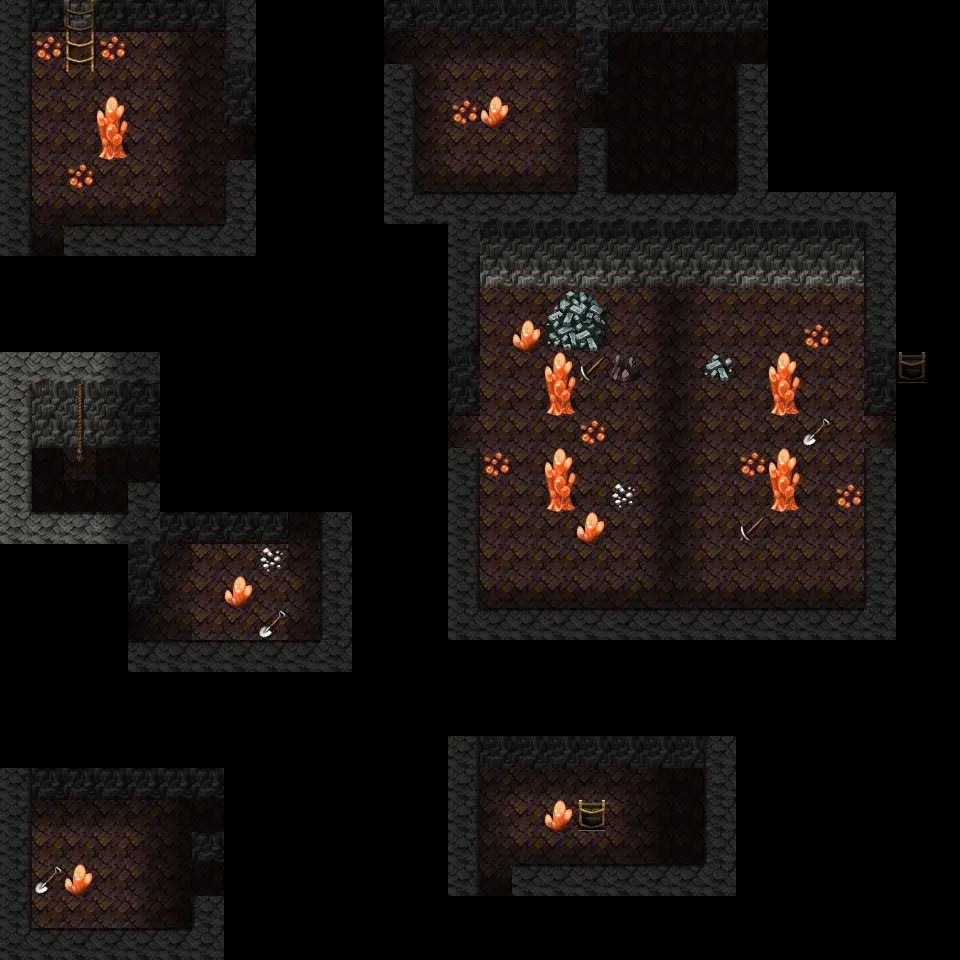

# Blackwater mountain7

| | |
|---|---|
| **Map ID** | `blackwater_mountain7` |
| **Region** | In Prim (settlement) |
| **Type** | Indoors / underground |
| **Size** | 30×30 tiles |
| **World map** | [Bwentry2](index.md) |
| **Introduced** | v0.7.0 or earlier |
| **Enemy types** | 2 |
| **Quests** | 0 |

**Blackwater mountain7** is an indoor map, in Prim (settlement). It has no NPCs and 2 kinds of enemy. Exits lead to Blackwater mountain9, Blackwater mountain8, Blackwater mountain6.

## Map

<label class="lg"><input type="checkbox" data-t="spawn" checked><b>Red</b>&nbsp;Monsters / NPCs</label><label class="lg"><input type="checkbox" data-t="mapchange" checked><b>Blue</b>&nbsp;Exit to another map</label><label class="lg"><input type="checkbox" data-t="container" checked><b>Yellow</b>&nbsp;Container (click to see contents)</label><label class="lg"><input type="checkbox" data-t="sign" checked><b>Purple</b>&nbsp;Sign</label><label class="lg"><input type="checkbox" data-t="rest" checked><b>Green</b>&nbsp;Resting place</label><label class="lg"><input type="checkbox" data-t="key" checked><b>Orange dashed</b>&nbsp;Blocked until a quest step / item</label><label class="lg"><input type="checkbox" data-t="script"><b>Grey dotted</b>&nbsp;Scripted event</label><label class="lg"><input type="checkbox" data-t="replace"><b>White dotted</b>&nbsp;Changes during a quest</label><label class="lg"><input type="checkbox" data-t="pin" checked><b>Numbers</b>&nbsp;Numbered key points (see the key below the map)</label>

<a class="pin pin-exit" href="#key-1" style="left:8.333%;top:5.000%" title="Exit (north): to [Blackwater mountain9](blackwater_mountain9.md)">1</a><a class="pin pin-exit" href="#key-2" style="left:95.000%;top:38.333%" title="Exit (east): to [Blackwater mountain8](blackwater_mountain8.md)">2</a><a class="pin pin-exit" href="#key-3" style="left:8.333%;top:48.333%" title="Exit (stairs / passage): to [Blackwater mountain6](blackwater_mountain6.md)">3</a><a class="pin pin-exit" href="#key-4" style="left:61.667%;top:85.000%" title="Exit (stairs / passage): to [Blackwater mountain8](blackwater_mountain8.md)">4</a><a class="pin pin-replace" href="#key-5" style="left:50.000%;top:50.000%" title="Changes during a quest: This area changes during the quest: hidden story flag “stn_nondisplay” (stage 82: “82=bwm_7 maze 2”)">5</a><a class="pin pin-replace" href="#key-6" style="left:50.219%;top:47.500%" title="Changes during a quest: This area changes during the quest: hidden story flag “stn_nondisplay” (stage 83: “83=bwm_7 maze 3”)">6</a><a class="pin pin-replace" href="#key-7" style="left:51.682%;top:52.194%" title="Changes during a quest: This area changes during the quest: hidden story flag “stn_nondisplay” (stage 84: “84=bwm_7 maze 4”)">7</a><a class="pin pin-replace" href="#key-8" style="left:47.066%;top:49.481%" title="Changes during a quest: This area changes during the quest: hidden story flag “stn_nondisplay” (stage 85: “85=bwm_7 maze 5”)">8</a><a class="pin pin-replace" href="#key-9" style="left:52.673%;top:48.299%" title="Changes during a quest: This area changes during the quest: hidden story flag “stn_nondisplay” (stage 86: “86=bwm_7 maze 6”)">9</a>

??? abstract "Key to the numbers on the map"

    | # | What | Details |
    |---|---|---|
    | 1 | Exit (north) | to [Blackwater mountain9](blackwater_mountain9.md) |
    | 2 | Exit (east) | to [Blackwater mountain8](blackwater_mountain8.md) |
    | 3 | Exit (stairs / passage) | to [Blackwater mountain6](blackwater_mountain6.md) |
    | 4 | Exit (stairs / passage) | to [Blackwater mountain8](blackwater_mountain8.md) |
    | 5 | Changes during a quest | This area changes during the quest: hidden story flag “stn_nondisplay” (stage 82: “82=bwm_7 maze 2”) |
    | 6 | Changes during a quest | This area changes during the quest: hidden story flag “stn_nondisplay” (stage 83: “83=bwm_7 maze 3”) |
    | 7 | Changes during a quest | This area changes during the quest: hidden story flag “stn_nondisplay” (stage 84: “84=bwm_7 maze 4”) |
    | 8 | Changes during a quest | This area changes during the quest: hidden story flag “stn_nondisplay” (stage 85: “85=bwm_7 maze 5”) |
    | 9 | Changes during a quest | This area changes during the quest: hidden story flag “stn_nondisplay” (stage 86: “86=bwm_7 maze 6”) |

Verified against v0.8.18 map data.

## Connections

| Direction | Leads to | Region there | Map # |
|---|---|---|---|
| North | [Blackwater mountain9](blackwater_mountain9.md) | Prim | 1 |
| East | [Blackwater mountain8](blackwater_mountain8.md) | – | 2 |
| Stairs / passage | [Blackwater mountain6](blackwater_mountain6.md) | – | 3 |
| Stairs / passage | [Blackwater mountain8](blackwater_mountain8.md) | – | 4 |

## Enemies

| Enemy | HP | Damage | Up to | Notes |
|---|---|---|---|---|
| [Slithering venomfang](../monsters/slithering_venomfang.md) | 35 | 1–2 | 5 | shares spawn with Young gornaud |
| [Young gornaud](../monsters/young_gornaud.md) | 70 | 0–15 | 5 | shares spawn with Slithering venomfang |

<small>“Up to” is the most that can be alive at once from the spawn areas on this map.</small>

## Quests

- [stn_nondisplay (hidden flag)](../quests/stn_nondisplay.md): part of the map changes at stage 82; part of the map changes at stage 83; part of the map changes at stage 84; part of the map changes at stage 85; part of the map changes at stage 86

## Points of interest

- **Changes during a quest** (#5): This area changes during the quest: hidden story flag “stn_nondisplay” (stage 82: “82=bwm_7 maze 2”)
- **Changes during a quest** (#6): This area changes during the quest: hidden story flag “stn_nondisplay” (stage 83: “83=bwm_7 maze 3”)
- **Changes during a quest** (#7): This area changes during the quest: hidden story flag “stn_nondisplay” (stage 84: “84=bwm_7 maze 4”)
- **Changes during a quest** (#8): This area changes during the quest: hidden story flag “stn_nondisplay” (stage 85: “85=bwm_7 maze 5”)
- **Changes during a quest** (#9): This area changes during the quest: hidden story flag “stn_nondisplay” (stage 86: “86=bwm_7 maze 6”)

## Version history

| Version | Change |
|---|---|
| [v0.7.0](../versions/0.7.0.md) | Present in v0.7.0 (earliest release tracked) |
| [v0.7.1](../versions/0.7.1.md) | Map layout or objects changed |
| [v0.7.2](../versions/0.7.2.md) | Map layout or objects changed |
| [v0.7.8](../versions/0.7.8.md) | Map layout or objects changed |
| [v0.7.15](../versions/0.7.15.md) | Map layout or objects changed |

Verified against v0.8.18 and every earlier release back to v0.7.0 (game data compared release by release).

## Community notes

<small>Written by players, not generated from game data. **Observations**: what players notice in-game · **Lore**: the in-world story · **Trivia**: real-world facts, references, development history · **Theory / speculation**: unconfirmed ideas; may just be unfinished content</small>

### Observations

*No notes yet. Contributions are welcome: [add a note](https://github.com/asdfghjkl628/Andor-s-Trail-Wikiiii/new/main/notes/maps?filename=blackwater_mountain7.md&value=%23%23%20Observations%0A%0A%3C%21--%20what%20players%20notice%20in-game%20--%3E%0A%0A%23%23%20Lore%0A%0A%3C%21--%20the%20in-world%20story%20--%3E%0A%0A%23%23%20Trivia%0A%0A%3C%21--%20real-world%20facts%2C%20references%2C%20development%20history%20--%3E%0A%0A%23%23%20Theory%20/%20speculation%0A%0A%3C%21--%20unconfirmed%20ideas%3B%20may%20just%20be%20unfinished%20content%20--%3E%0A).*

### Lore

*No notes yet. Contributions are welcome: [add a note](https://github.com/asdfghjkl628/Andor-s-Trail-Wikiiii/new/main/notes/maps?filename=blackwater_mountain7.md&value=%23%23%20Observations%0A%0A%3C%21--%20what%20players%20notice%20in-game%20--%3E%0A%0A%23%23%20Lore%0A%0A%3C%21--%20the%20in-world%20story%20--%3E%0A%0A%23%23%20Trivia%0A%0A%3C%21--%20real-world%20facts%2C%20references%2C%20development%20history%20--%3E%0A%0A%23%23%20Theory%20/%20speculation%0A%0A%3C%21--%20unconfirmed%20ideas%3B%20may%20just%20be%20unfinished%20content%20--%3E%0A).*

### Trivia

*No notes yet. Contributions are welcome: [add a note](https://github.com/asdfghjkl628/Andor-s-Trail-Wikiiii/new/main/notes/maps?filename=blackwater_mountain7.md&value=%23%23%20Observations%0A%0A%3C%21--%20what%20players%20notice%20in-game%20--%3E%0A%0A%23%23%20Lore%0A%0A%3C%21--%20the%20in-world%20story%20--%3E%0A%0A%23%23%20Trivia%0A%0A%3C%21--%20real-world%20facts%2C%20references%2C%20development%20history%20--%3E%0A%0A%23%23%20Theory%20/%20speculation%0A%0A%3C%21--%20unconfirmed%20ideas%3B%20may%20just%20be%20unfinished%20content%20--%3E%0A).*

### Theory / speculation

*No notes yet. Contributions are welcome: [add a note](https://github.com/asdfghjkl628/Andor-s-Trail-Wikiiii/new/main/notes/maps?filename=blackwater_mountain7.md&value=%23%23%20Observations%0A%0A%3C%21--%20what%20players%20notice%20in-game%20--%3E%0A%0A%23%23%20Lore%0A%0A%3C%21--%20the%20in-world%20story%20--%3E%0A%0A%23%23%20Trivia%0A%0A%3C%21--%20real-world%20facts%2C%20references%2C%20development%20history%20--%3E%0A%0A%23%23%20Theory%20/%20speculation%0A%0A%3C%21--%20unconfirmed%20ideas%3B%20may%20just%20be%20unfinished%20content%20--%3E%0A).*

??? info "Technical information"

    | | |
    |---|---|
    | Map ID | `blackwater_mountain7` |
    | File | `res/xml/blackwater_mountain7.tmx` |
    | Size | 30×30 tiles (960×960 px) |
    | outdoors property | – |
    | Layers drawn | ground, objects, above |
    | Tilesets | map_bed_1, map_border_1, map_bridge_1, map_broken_1, map_cavewall_1, map_cavewall_2, map_cavewall_3, map_chair_table_1, map_crate_1, map_cupboard_1, map_curtain_1, map_entrance_1, map_fence_1, map_fence_2, map_ground_1, map_ground_2, map_ground_3, map_ground_4, map_ground_5, map_ground_6, map_ground_7, map_ground_8, map_indoor_1, map_kitchen_1, map_outdoor_1, map_pillar_1, map_plant_1, map_rock_1, map_roof_1, map_roof_2, map_shop_1, map_sign_ladder_1, map_table_1, map_trail_1, map_transition_1, map_transition_2, map_transition_3, map_transition_4, map_transition_5, map_tree_1, map_wall_1, map_wall_2, map_wall_3, map_window_1, map_window_2 |
    | Map objects | spawn: 5, replace: 5, mapchange: 4 |
    | World map position | segment `bwentry2`, x 47, y 368 |

<small>Data from v0.8.18</small>
