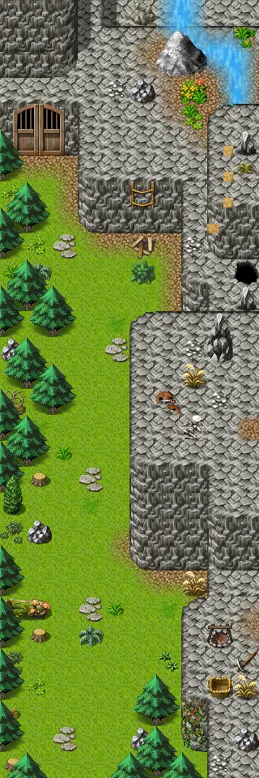

# Blackwater mountain70

| | |
|---|---|
| **Map ID** | `blackwater_mountain70` |
| **Region** | In Blackwater Mountain (other) |
| **Type** | Indoors / underground |
| **Size** | 10×30 tiles |
| **World map** | [World1](index.md) |
| **Introduced** | [v0.7.14](../versions/0.7.14.md) |
| **NPCs** | 1 |
| **Enemy types** | 4 |
| **Quests** | 0 |

**Blackwater mountain70** is an indoor map, in Blackwater Mountain (other). It has 1 NPC and 4 kinds of enemy. Exits lead to Blackwater mountain15, Blackwater mountain71, Blackwater mountain14.

## Map

<label class="lg"><input type="checkbox" data-t="spawn" checked><b>Red</b>&nbsp;Monsters / NPCs</label><label class="lg"><input type="checkbox" data-t="mapchange" checked><b>Blue</b>&nbsp;Exit to another map</label><label class="lg"><input type="checkbox" data-t="container" checked><b>Yellow</b>&nbsp;Container (click to see contents)</label><label class="lg"><input type="checkbox" data-t="sign" checked><b>Purple</b>&nbsp;Sign</label><label class="lg"><input type="checkbox" data-t="rest" checked><b>Green</b>&nbsp;Resting place</label><label class="lg"><input type="checkbox" data-t="key" checked><b>Orange dashed</b>&nbsp;Blocked until a quest step / item</label><label class="lg"><input type="checkbox" data-t="script"><b>Grey dotted</b>&nbsp;Scripted event</label><label class="lg"><input type="checkbox" data-t="replace"><b>White dotted</b>&nbsp;Changes during a quest</label><label class="lg"><input type="checkbox" data-t="pin" checked><b>Numbers</b>&nbsp;Numbered key points (see the key below the map)</label>

<a class="pin pin-exit" href="#key-1" style="left:95.000%;top:55.000%" title="Exit (east): to [Blackwater mountain15](blackwater_mountain15.md)">1</a><a class="pin pin-exit" href="#key-1" style="left:95.000%;top:78.333%" title="Exit (east): to [Blackwater mountain15](blackwater_mountain15.md)">1</a><a class="pin pin-exit" href="#key-2" style="left:95.000%;top:35.000%" title="Exit (east): to [Blackwater mountain71](blackwater_mountain71.md)">2</a><a class="pin pin-exit" href="#key-3" style="left:30.000%;top:98.333%" title="Exit (south): to [Blackwater mountain14](blackwater_mountain14.md)">3</a><a id="pin-npc-bwm17_worker" class="pin pin-npc" href="#key-4" style="left:45.000%;top:31.667%" title="[Casterod](../../monsters/bwm17_worker.md): NPC">4</a><a class="pin pin-script" href="#key-5" style="left:85.000%;top:85.000%" title="Quest trigger: Scripted event: advances the quest: hidden story flag “bwm17_vine” to stage 1 (“Vine taken.”)">5</a><a class="pin pin-script" href="#key-6" style="left:30.000%;top:95.000%" title="Quest trigger: Scripted event: advances the quest: hidden story flag “bwm17_heights” to stage 1 (“Level 0”)">6</a><a class="pin pin-script" href="#key-7" style="left:85.000%;top:55.000%" title="Quest trigger: Scripted event: advances the quest: hidden story flag “bwm17_heights” to stage 2 (“Level 1”)">7</a><a class="pin pin-script" href="#key-7" style="left:55.000%;top:21.667%" title="Quest trigger: Scripted event: advances the quest: hidden story flag “bwm17_heights” to stage 2 (“Level 1”)">7</a><a class="pin pin-script" href="#key-6" style="left:55.000%;top:28.333%" title="Quest trigger: Scripted event: advances the quest: hidden story flag “bwm17_heights” to stage 1 (“Level 0”)">6</a><a class="pin pin-script" href="#key-7" style="left:85.000%;top:81.667%" title="Quest trigger: Scripted event: advances the quest: hidden story flag “bwm17_heights” to stage 2 (“Level 1”)">7</a><a class="pin pin-key" href="#key-8" style="left:95.658%;top:32.500%" title="Blocked passage: Unlocked during the quest: hidden story flag “bwm17_vine” (stage 2: “Vine placed.”)">8</a><a class="pin pin-key" href="#key-9" style="left:60.046%;top:32.194%" title="Blocked passage: Unlocked during the quest: hidden story flag “bwm17_vine” (stage 3: “Quest Climbing forbidden enabled.”)">9</a><a class="pin pin-replace" href="#key-10" style="left:85.000%;top:88.333%" title="Changes during a quest: This area changes during the quest: hidden story flag “bwm17_vine” (stage 3: “Quest Climbing forbidden enabled.”)">10</a><a class="pin pin-replace" href="#key-11" style="left:50.000%;top:50.000%" title="Changes during a quest: This area changes during the quest: hidden story flag “bwm17_heights” (stage 1: “Level 0”)">11</a><a class="pin pin-replace" href="#key-12" style="left:50.658%;top:47.500%" title="Changes during a quest: This area changes back during the quest: hidden story flag “bwm17_heights” (stage 1: “Level 0”)">12</a><a class="pin pin-replace" href="#key-12" style="left:95.658%;top:50.834%" title="Changes during a quest: This area changes back during the quest: hidden story flag “bwm17_heights” (stage 1: “Level 0”)">12</a><a class="pin pin-replace" href="#key-11" style="left:84.219%;top:51.251%" title="Changes during a quest: This area changes during the quest: hidden story flag “bwm17_heights” (stage 1: “Level 0”)">11</a><a class="pin pin-replace" href="#key-10" style="left:50.658%;top:25.834%" title="Changes during a quest: This area changes during the quest: hidden story flag “bwm17_vine” (stage 3: “Quest Climbing forbidden enabled.”)">10</a>

??? abstract "Key to the numbers on the map"

    | # | What | Details |
    |---|---|---|
    | 1 | Exit (east) | to [Blackwater mountain15](blackwater_mountain15.md) |
    | 2 | Exit (east) | to [Blackwater mountain71](blackwater_mountain71.md) |
    | 3 | Exit (south) | to [Blackwater mountain14](blackwater_mountain14.md) |
    | 4 | [Casterod](../monsters/bwm17_worker.md) | NPC |
    | 5 | Quest trigger | Scripted event: advances the quest: hidden story flag “bwm17_vine” to stage 1 (“Vine taken.”) |
    | 6 | Quest trigger | Scripted event: advances the quest: hidden story flag “bwm17_heights” to stage 1 (“Level 0”) |
    | 7 | Quest trigger | Scripted event: advances the quest: hidden story flag “bwm17_heights” to stage 2 (“Level 1”) |
    | 8 | Blocked passage | Unlocked during the quest: hidden story flag “bwm17_vine” (stage 2: “Vine placed.”) |
    | 9 | Blocked passage | Unlocked during the quest: hidden story flag “bwm17_vine” (stage 3: “Quest Climbing forbidden enabled.”) |
    | 10 | Changes during a quest | This area changes during the quest: hidden story flag “bwm17_vine” (stage 3: “Quest Climbing forbidden enabled.”) |
    | 11 | Changes during a quest | This area changes during the quest: hidden story flag “bwm17_heights” (stage 1: “Level 0”) |
    | 12 | Changes during a quest | This area changes back during the quest: hidden story flag “bwm17_heights” (stage 1: “Level 0”) |

Verified against v0.8.18 map data.

## Connections

| Direction | Leads to | Region there | Map # |
|---|---|---|---|
| East | [Blackwater mountain15](blackwater_mountain15.md) | Blackwater Mountain | 1 |
| East | [Blackwater mountain71](blackwater_mountain71.md) | Blackwater Mountain | 2 |
| South | [Blackwater mountain14](blackwater_mountain14.md) | Blackwater Mountain | 3 |

## NPCs

- [Casterod](../monsters/bwm17_worker.md) (#4)

## Enemies

| Enemy | HP | Damage | Up to | Notes |
|---|---|---|---|---|
| [Vicious hound](../monsters/vicious_hound.md) | 31 | 3–9 | 3 | – |
| [Scaled venomfang](../monsters/scaled_venomfang.md) | 35 | 2–4 | 2 | shares spawn with Gornaud |
| [Trained mountain wolf](../monsters/mountain_wolf_2.md) | 61 | 5–11 | 1 | – |
| [Gornaud](../monsters/gornaud.md) | 95 | 0–15 | 2 | shares spawn with Scaled venomfang |

<small>“Up to” is the most that can be alive at once from the spawn areas on this map.</small>

## Quests

- [Heights change in bwm_17 (Actually 70) (hidden flag)](../quests/bwm17_heights.md): part of the map changes at stage 1; something on this map advances it; stepping on a trigger here sets stage 1; stepping on a trigger here sets stage 2
- [Vines in bwm_17 (hidden flag)](../quests/bwm17_vine.md): blocked passage opens at stage 2; blocked passage opens at stage 3; part of the map changes at stage 3; something on this map advances it; stepping on a trigger here sets stage 1

## Points of interest

- **Quest trigger** (#5): Scripted event: advances the quest: hidden story flag “bwm17_vine” to stage 1 (“Vine taken.”)
- **Quest trigger** (#6): Scripted event: advances the quest: hidden story flag “bwm17_heights” to stage 1 (“Level 0”)
- **Quest trigger** (#7): Scripted event: advances the quest: hidden story flag “bwm17_heights” to stage 2 (“Level 1”)
- **Blocked passage** (#8): Unlocked during the quest: hidden story flag “bwm17_vine” (stage 2: “Vine placed.”)
- **Blocked passage** (#9): Unlocked during the quest: hidden story flag “bwm17_vine” (stage 3: “Quest Climbing forbidden enabled.”)
- **Changes during a quest** (#10): This area changes during the quest: hidden story flag “bwm17_vine” (stage 3: “Quest Climbing forbidden enabled.”)
- **Changes during a quest** (#11): This area changes during the quest: hidden story flag “bwm17_heights” (stage 1: “Level 0”)
- **Changes during a quest** (#12): This area changes back during the quest: hidden story flag “bwm17_heights” (stage 1: “Level 0”)

## Version history

| Version | Change |
|---|---|
| [v0.7.14](../versions/0.7.14.md) | Added |
| [v0.7.17](../versions/0.7.17.md) | map layout or objects changed |
| [v0.8.2](../versions/0.8.2.md) | map layout or objects changed |
| [v0.8.7](../versions/0.8.7.md) | map layout or objects changed |
| [v0.8.9](../versions/0.8.9.md) | map layout or objects changed |
| [v0.8.11](../versions/0.8.11.md) | map layout or objects changed |
| [v0.8.12.1](../versions/0.8.12.1.md) | map layout or objects changed |
| [v0.8.18](../versions/0.8.18.md) | map layout or objects changed |

Verified against v0.8.18 and every earlier release back to v0.7.0 (game data compared release by release).

## Community notes

<small>Written by players, not generated from game data. **Observations**: what players notice in-game · **Lore**: the in-world story · **Trivia**: real-world facts, references, development history · **Theory / speculation**: unconfirmed ideas; may just be unfinished content</small>

### Observations

*No notes yet. Contributions are welcome: [add a note](https://github.com/asdfghjkl628/Andor-s-Trail-Wikiiii/new/main/notes/maps?filename=blackwater_mountain70.md&value=%23%23%20Observations%0A%0A%3C%21--%20what%20players%20notice%20in-game%20--%3E%0A%0A%23%23%20Lore%0A%0A%3C%21--%20the%20in-world%20story%20--%3E%0A%0A%23%23%20Trivia%0A%0A%3C%21--%20real-world%20facts%2C%20references%2C%20development%20history%20--%3E%0A%0A%23%23%20Theory%20/%20speculation%0A%0A%3C%21--%20unconfirmed%20ideas%3B%20may%20just%20be%20unfinished%20content%20--%3E%0A).*

### Lore

*No notes yet. Contributions are welcome: [add a note](https://github.com/asdfghjkl628/Andor-s-Trail-Wikiiii/new/main/notes/maps?filename=blackwater_mountain70.md&value=%23%23%20Observations%0A%0A%3C%21--%20what%20players%20notice%20in-game%20--%3E%0A%0A%23%23%20Lore%0A%0A%3C%21--%20the%20in-world%20story%20--%3E%0A%0A%23%23%20Trivia%0A%0A%3C%21--%20real-world%20facts%2C%20references%2C%20development%20history%20--%3E%0A%0A%23%23%20Theory%20/%20speculation%0A%0A%3C%21--%20unconfirmed%20ideas%3B%20may%20just%20be%20unfinished%20content%20--%3E%0A).*

### Trivia

*No notes yet. Contributions are welcome: [add a note](https://github.com/asdfghjkl628/Andor-s-Trail-Wikiiii/new/main/notes/maps?filename=blackwater_mountain70.md&value=%23%23%20Observations%0A%0A%3C%21--%20what%20players%20notice%20in-game%20--%3E%0A%0A%23%23%20Lore%0A%0A%3C%21--%20the%20in-world%20story%20--%3E%0A%0A%23%23%20Trivia%0A%0A%3C%21--%20real-world%20facts%2C%20references%2C%20development%20history%20--%3E%0A%0A%23%23%20Theory%20/%20speculation%0A%0A%3C%21--%20unconfirmed%20ideas%3B%20may%20just%20be%20unfinished%20content%20--%3E%0A).*

### Theory / speculation

*No notes yet. Contributions are welcome: [add a note](https://github.com/asdfghjkl628/Andor-s-Trail-Wikiiii/new/main/notes/maps?filename=blackwater_mountain70.md&value=%23%23%20Observations%0A%0A%3C%21--%20what%20players%20notice%20in-game%20--%3E%0A%0A%23%23%20Lore%0A%0A%3C%21--%20the%20in-world%20story%20--%3E%0A%0A%23%23%20Trivia%0A%0A%3C%21--%20real-world%20facts%2C%20references%2C%20development%20history%20--%3E%0A%0A%23%23%20Theory%20/%20speculation%0A%0A%3C%21--%20unconfirmed%20ideas%3B%20may%20just%20be%20unfinished%20content%20--%3E%0A).*

??? info "Technical information"

    | | |
    |---|---|
    | Map ID | `blackwater_mountain70` |
    | File | `res/xml/blackwater_mountain70.tmx` |
    | Size | 10×30 tiles (320×960 px) |
    | outdoors property | – |
    | Layers drawn | base, ground, objects, above, top |
    | Tilesets | map_bed_1, map_border_1, map_bridge_1, map_bridge_2, map_broken_1, map_cavewall_1, map_cavewall_2, map_cavewall_3, map_cavewall_4, map_chair_table_1, map_chair_table_2, map_crate_1, map_cupboard_1, map_curtain_1, map_entrance_1, map_entrance_2, map_fence_1, map_fence_2, map_fence_3, map_fence_4, map_ground_1, map_ground_2, map_ground_3, map_ground_4, map_ground_5, map_ground_6, map_ground_7, map_ground_8, map_house_1, map_house_2, map_indoor_1, map_indoor_2, map_kitchen_1, map_outdoor_1, map_pillar_1, map_pillar_2, map_plant_1, map_plant_2, map_rock_1, map_rock_2, map_roof_1, map_roof_2, map_roof_3, map_shop_1, map_sign_ladder_1, map_table_1, map_trail_1, map_transition_1, map_transition_2, map_transition_3, map_transition_4, map_transition_6, map_tree_1, map_tree_2, map_wall_1, map_wall_2, map_wall_3, map_wall_4, map_window_1, map_window_2 |
    | Map objects | script: 8, replace: 8, spawn: 6, mapchange: 4, key: 2 |
    | World map position | segment `world1`, x 64, y 337 |

<small>Data from v0.8.18</small>
