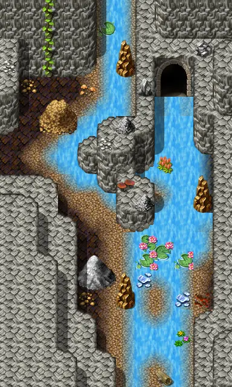

# Blackwater mountain71

| | |
|---|---|
| **Map ID** | `blackwater_mountain71` |
| **Region** | In Blackwater Mountain (other) |
| **Type** | Indoors / underground |
| **Size** | 12×20 tiles |
| **World map** | [Omi2 bwmhole](index.md) |
| **Introduced** | [v0.7.14](../versions/0.7.14.md) |
| **Enemy types** | 2 |
| **Quests** | 0 |
| **Containers** | 2 |

**Blackwater mountain71** is an indoor map, in Blackwater Mountain (other). It has no NPCs and 2 kinds of enemy. Exits lead to Blackwater mountain70, Blackwater mountain73, Blackwater mountain72.

## Map

<label class="lg"><input type="checkbox" data-t="spawn" checked><b>Red</b>&nbsp;Monsters / NPCs</label><label class="lg"><input type="checkbox" data-t="mapchange" checked><b>Blue</b>&nbsp;Exit to another map</label><label class="lg"><input type="checkbox" data-t="container" checked><b>Yellow</b>&nbsp;Container (click to see contents)</label><label class="lg"><input type="checkbox" data-t="sign" checked><b>Purple</b>&nbsp;Sign</label><label class="lg"><input type="checkbox" data-t="rest" checked><b>Green</b>&nbsp;Resting place</label><label class="lg"><input type="checkbox" data-t="key" checked><b>Orange dashed</b>&nbsp;Blocked until a quest step / item</label><label class="lg"><input type="checkbox" data-t="script"><b>Grey dotted</b>&nbsp;Scripted event</label><label class="lg"><input type="checkbox" data-t="replace"><b>White dotted</b>&nbsp;Changes during a quest</label><label class="lg"><input type="checkbox" data-t="pin" checked><b>Numbers</b>&nbsp;Numbered key points (see the key below the map)</label>

<a class="pin pin-exit" href="#key-1" style="left:20.833%;top:2.500%" title="Exit (north): to [Blackwater mountain70](../blackwater_mountain70.md)">1</a><a class="pin pin-exit" href="#key-2" style="left:58.333%;top:97.500%" title="Exit (south): to [Blackwater mountain73](../blackwater_mountain73.md)">2</a><a class="pin pin-exit" href="#key-3" style="left:4.167%;top:40.000%" title="Exit (west): to [Blackwater mountain72](../blackwater_mountain72.md)">3</a><a class="pin pin-container" href="#key-4" style="left:37.500%;top:77.500%" title="Container 1: Gold coins, Raw inkyfish">4</a><a class="pin pin-container" href="#key-5" style="left:87.500%;top:77.500%" title="Container 2: Raw inkyfish, Bone, Small rock, Gold coins, Azure gem, Mundane ring">5</a>

??? abstract "Key to the numbers on the map"

    | # | What | Details |
    |---|---|---|
    | 1 | Exit (north) | to [Blackwater mountain70](../blackwater_mountain70.md) |
    | 2 | Exit (south) | to [Blackwater mountain73](../blackwater_mountain73.md) |
    | 3 | Exit (west) | to [Blackwater mountain72](../blackwater_mountain72.md) |
    | 4 | Container 1 | Gold coins, Raw inkyfish |
    | 5 | Container 2 | Raw inkyfish, Bone, Small rock, Gold coins, Azure gem, Mundane ring |

Verified against v0.8.18 map data.

## Connections

| Direction | Leads to | Region there | Map # |
|---|---|---|---|
| North | [Blackwater mountain70](blackwater_mountain70.md) | Blackwater Mountain | 1 |
| South | [Blackwater mountain73](blackwater_mountain73.md) | Blackwater Mountain | 2 |
| West | [Blackwater mountain72](blackwater_mountain72.md) | Blackwater Mountain | 3 |

## Enemies

| Enemy | HP | Damage | Up to | Notes |
|---|---|---|---|---|
| [Scaled venomfang](../monsters/scaled_venomfang.md) | 35 | 2–4 | 6 | – |
| [Tough venomfang](../monsters/tough_venomfang.md) | 41 | 2–5 | 1 | – |

<small>“Up to” is the most that can be alive at once from the spawn areas on this map.</small>

## Items & containers

<b>Container 1</b><ul><li><a href="../../items/gold/">Gold coins</a> <small>100% · ×12 to 21</small></li><li><a href="../../items/bwm_fish/">Raw inkyfish</a> <small>100%</small></li></ul>

<b>Container 2</b><ul><li><a href="../../items/bwm_fish/">Raw inkyfish</a> <small>100% · ×1 to 3</small></li><li><a href="../../items/bone/">Bone</a> <small>80% · ×1 to 4</small></li><li><a href="../../items/rock/">Small rock</a> <small>70% · ×1 to 10</small></li><li><a href="../../items/gold/">Gold coins</a> <small>50% · ×0 to 25</small></li><li><a href="../../items/gem6/">Azure gem</a> <small>10% · ×1 to 2</small></li><li><a href="../../items/ring1/">Mundane ring</a> <small>5%</small></li><li><a href="../../items/junk_necklace0/">Mundane necklace</a> <small>5%</small></li><li><a href="../../items/ring_rough_life/">Rough ring of life force</a> <small>100%</small></li><li><a href="../../items/necklace_shield2/">Shielding necklace</a> <small>0.4%</small></li></ul>

## Version history

| Version | Change |
|---|---|
| [v0.7.14](../versions/0.7.14.md) | Added |

Verified against v0.8.18 and every earlier release back to v0.7.0 (game data compared release by release).

## Community notes

<small>Written by players, not generated from game data. **Observations**: what players notice in-game · **Lore**: the in-world story · **Trivia**: real-world facts, references, development history · **Theory / speculation**: unconfirmed ideas; may just be unfinished content</small>

### Observations

*Nothing here yet. Know something? [Add it](https://github.com/asdfghjkl628/Andor-s-Trail-Wikiiii/new/main/notes/maps?filename=blackwater_mountain71.md&value=%23%23%20Observations%0A%0A%3C%21--%20what%20players%20notice%20in-game%20--%3E%0A%0A%23%23%20Lore%0A%0A%3C%21--%20the%20in-world%20story%20--%3E%0A%0A%23%23%20Trivia%0A%0A%3C%21--%20real-world%20facts%2C%20references%2C%20development%20history%20--%3E%0A%0A%23%23%20Theory%20/%20speculation%0A%0A%3C%21--%20unconfirmed%20ideas%3B%20may%20just%20be%20unfinished%20content%20--%3E%0A).*

### Lore

*Nothing here yet. Know something? [Add it](https://github.com/asdfghjkl628/Andor-s-Trail-Wikiiii/new/main/notes/maps?filename=blackwater_mountain71.md&value=%23%23%20Observations%0A%0A%3C%21--%20what%20players%20notice%20in-game%20--%3E%0A%0A%23%23%20Lore%0A%0A%3C%21--%20the%20in-world%20story%20--%3E%0A%0A%23%23%20Trivia%0A%0A%3C%21--%20real-world%20facts%2C%20references%2C%20development%20history%20--%3E%0A%0A%23%23%20Theory%20/%20speculation%0A%0A%3C%21--%20unconfirmed%20ideas%3B%20may%20just%20be%20unfinished%20content%20--%3E%0A).*

### Trivia

*Nothing here yet. Know something? [Add it](https://github.com/asdfghjkl628/Andor-s-Trail-Wikiiii/new/main/notes/maps?filename=blackwater_mountain71.md&value=%23%23%20Observations%0A%0A%3C%21--%20what%20players%20notice%20in-game%20--%3E%0A%0A%23%23%20Lore%0A%0A%3C%21--%20the%20in-world%20story%20--%3E%0A%0A%23%23%20Trivia%0A%0A%3C%21--%20real-world%20facts%2C%20references%2C%20development%20history%20--%3E%0A%0A%23%23%20Theory%20/%20speculation%0A%0A%3C%21--%20unconfirmed%20ideas%3B%20may%20just%20be%20unfinished%20content%20--%3E%0A).*

### Theory / speculation

*Nothing here yet. Know something? [Add it](https://github.com/asdfghjkl628/Andor-s-Trail-Wikiiii/new/main/notes/maps?filename=blackwater_mountain71.md&value=%23%23%20Observations%0A%0A%3C%21--%20what%20players%20notice%20in-game%20--%3E%0A%0A%23%23%20Lore%0A%0A%3C%21--%20the%20in-world%20story%20--%3E%0A%0A%23%23%20Trivia%0A%0A%3C%21--%20real-world%20facts%2C%20references%2C%20development%20history%20--%3E%0A%0A%23%23%20Theory%20/%20speculation%0A%0A%3C%21--%20unconfirmed%20ideas%3B%20may%20just%20be%20unfinished%20content%20--%3E%0A).*

??? info "Technical information"

    | | |
    |---|---|
    | Map ID | `blackwater_mountain71` |
    | File | `res/xml/blackwater_mountain71.tmx` |
    | Size | 12×20 tiles (384×640 px) |
    | outdoors property | – |
    | Layers drawn | base, ground, objects, above, top |
    | Tilesets | map_bed_1, map_border_1, map_bridge_1, map_bridge_2, map_broken_1, map_cavewall_1, map_cavewall_2, map_cavewall_3, map_cavewall_4, map_chair_table_1, map_chair_table_2, map_crate_1, map_cupboard_1, map_curtain_1, map_entrance_1, map_entrance_2, map_fence_1, map_fence_2, map_fence_3, map_fence_4, map_ground_1, map_ground_2, map_ground_3, map_ground_4, map_ground_5, map_ground_6, map_ground_7, map_ground_8, map_house_1, map_house_2, map_indoor_1, map_indoor_2, map_kitchen_1, map_outdoor_1, map_pillar_1, map_pillar_2, map_plant_1, map_plant_2, map_rock_1, map_rock_2, map_roof_1, map_roof_2, map_roof_3, map_shop_1, map_sign_ladder_1, map_table_1, map_trail_1, map_transition_1, map_transition_2, map_transition_3, map_transition_4, map_transition_6, map_tree_1, map_tree_2, map_wall_1, map_wall_2, map_wall_3, map_wall_4, map_window_1, map_window_2 |
    | Map objects | spawn: 4, mapchange: 3, container: 2 |
    | World map position | segment `omi2_bwmhole`, x 11, y 50 |

<small>Data from v0.8.18</small>
