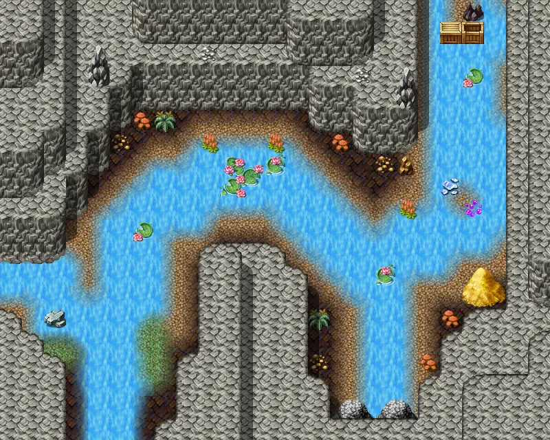

# Blackwater mountain73

25×20 tiles · part of [Omi2 bwmhole](index.md)

<label class="lg"><input type="checkbox" data-t="spawn" checked><b>Red</b>&nbsp;Monsters / NPCs</label><label class="lg"><input type="checkbox" data-t="mapchange" checked><b>Blue</b>&nbsp;Exit to another map</label><label class="lg"><input type="checkbox" data-t="container" checked><b>Yellow</b>&nbsp;Container (click to see contents)</label><label class="lg"><input type="checkbox" data-t="sign" checked><b>Purple</b>&nbsp;Sign</label><label class="lg"><input type="checkbox" data-t="rest" checked><b>Green</b>&nbsp;Resting place</label><label class="lg"><input type="checkbox" data-t="key" checked><b>Orange dashed</b>&nbsp;Blocked until a quest step / item</label><label class="lg"><input type="checkbox" data-t="script"><b>Grey dotted</b>&nbsp;Scripted event</label><label class="lg"><input type="checkbox" data-t="replace"><b>White dotted</b>&nbsp;Changes during a quest</label>

## Containers

<b>Container 1</b><ul><li><a href="../../items/bwm_fish/">Raw inkyfish</a> <small>100% · ×1 to 3</small></li><li><a href="../../items/bone/">Bone</a> <small>80% · ×1 to 4</small></li><li><a href="../../items/rock/">Small rock</a> <small>70% · ×1 to 10</small></li><li><a href="../../items/gold/">Gold coins</a> <small>50% · ×0 to 25</small></li><li><a href="../../items/gem6/">Azure gem</a> <small>10% · ×1 to 2</small></li><li><a href="../../items/ring1/">Mundane ring</a> <small>5%</small></li><li><a href="../../items/junk_necklace0/">Mundane necklace</a> <small>5%</small></li><li><a href="../../items/ring_rough_life/">Rough ring of life force</a> <small>100%</small></li><li><a href="../../items/necklace_shield2/">Shielding necklace</a> <small>0.4%</small></li></ul>

<b>Container 2</b><ul><li><a href="../../items/bwm_fish/">Raw inkyfish</a> <small>100% · ×1 to 3</small></li><li><a href="../../items/bone/">Bone</a> <small>80% · ×1 to 4</small></li><li><a href="../../items/rock/">Small rock</a> <small>70% · ×1 to 10</small></li><li><a href="../../items/gold/">Gold coins</a> <small>50% · ×0 to 25</small></li><li><a href="../../items/gem6/">Azure gem</a> <small>10% · ×1 to 2</small></li><li><a href="../../items/ring1/">Mundane ring</a> <small>5%</small></li><li><a href="../../items/junk_necklace0/">Mundane necklace</a> <small>5%</small></li><li><a href="../../items/ring_rough_life/">Rough ring of life force</a> <small>100%</small></li><li><a href="../../items/necklace_shield2/">Shielding necklace</a> <small>0.4%</small></li></ul>

<b>Container 3</b><ul><li><a href="../../items/bwm_fish/">Raw inkyfish</a> <small>100% · ×1 to 3</small></li><li><a href="../../items/bone/">Bone</a> <small>80% · ×1 to 4</small></li><li><a href="../../items/rock/">Small rock</a> <small>70% · ×1 to 10</small></li><li><a href="../../items/gold/">Gold coins</a> <small>50% · ×0 to 25</small></li><li><a href="../../items/gem6/">Azure gem</a> <small>10% · ×1 to 2</small></li><li><a href="../../items/ring1/">Mundane ring</a> <small>5%</small></li><li><a href="../../items/junk_necklace0/">Mundane necklace</a> <small>5%</small></li><li><a href="../../items/ring_rough_life/">Rough ring of life force</a> <small>100%</small></li><li><a href="../../items/necklace_shield2/">Shielding necklace</a> <small>0.4%</small></li></ul>

## Exits

- [Blackwater mountain71](blackwater_mountain71.md)
- [Blackwater mountain74](blackwater_mountain74.md)
- [Blackwater mountain75](blackwater_mountain75.md)

## Monsters & NPCs here

| Name | HP |
|---|---|
| [Slippery Venomfang](../monsters/slippery_venomfang.md) | 38 |
| [Tough venomfang](../monsters/tough_venomfang.md) | 41 |
| [Noxious venomfang](../monsters/noxious_venomfang.md) | 44 |

<small>Map ID: `blackwater_mountain73` · Data from v0.8.18</small>
