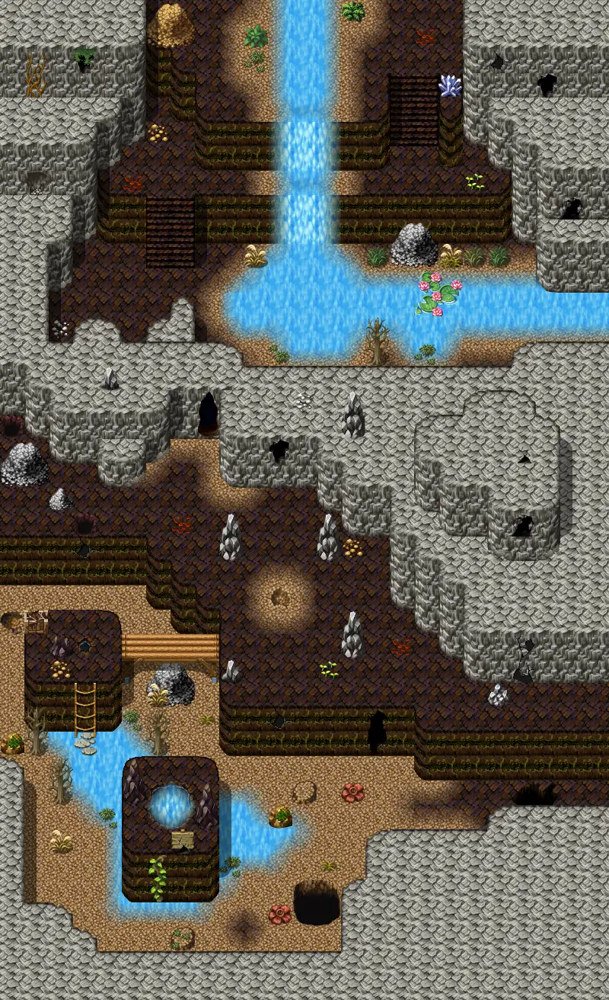

# Blackwater mountain75

25×41 tiles · part of [Omi2 bwmhole](index.md)

<label class="lg lg-spawn"><input type="checkbox" data-t="spawn" checked> Monsters / NPCs</label><label class="lg lg-mapchange"><input type="checkbox" data-t="mapchange" checked> Exit to another map</label><label class="lg lg-container"><input type="checkbox" data-t="container" checked> Container</label><label class="lg lg-sign"><input type="checkbox" data-t="sign" checked> Sign</label><label class="lg lg-rest"><input type="checkbox" data-t="rest" checked> Resting place</label><label class="lg lg-key"><input type="checkbox" data-t="key" checked> Blocked / needs key or quest</label><label class="lg lg-script"><input type="checkbox" data-t="script"> Scripted event</label><label class="lg lg-replace"><input type="checkbox" data-t="replace"> Changes after a quest</label>

## Exits

- [Blackwater mountain73](blackwater_mountain73.md)
- [Blackwater mountain74](blackwater_mountain74.md)
- [Blackwater mountain75](blackwater_mountain75.md)
- [Blackwater mountain76](blackwater_mountain76.md)

## Monsters & NPCs here

| Name | HP |
|---|---|
| [Slippery Venomfang](../monsters/slippery_venomfang.md) | 38 |
| [Noxious venomfang](../monsters/noxious_venomfang.md) | 44 |
| [Dun olm](../monsters/bwm_olm1.md) | 61 |
| [Albino olm](../monsters/bwm_olm2.md) | 66 |
| [Hard-skinned olm](../monsters/bwm_olm3.md) | 68 |
| [Blackened olm](../monsters/bwm_olm4.md) | 75 |

<small>Map ID: `blackwater_mountain75` · Data from v0.8.18</small>
