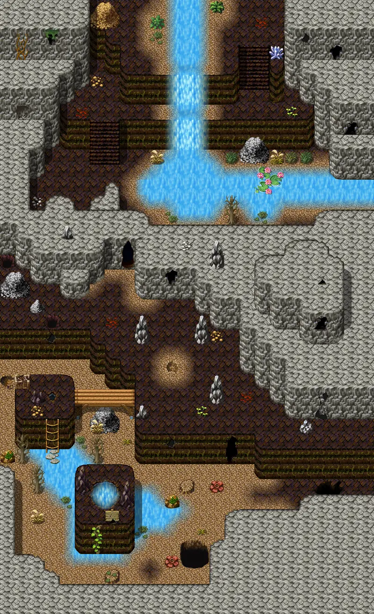

# Blackwater mountain75

| | |
|---|---|
| **Map ID** | `blackwater_mountain75` |
| **Type** | Indoors / underground |
| **Size** | 25×41 tiles |
| **World map** | [Omi2 bwmhole](index.md) |
| **Introduced** | [v0.7.14](../versions/0.7.14.md) |
| **Enemy types** | 6 |
| **Quests** | 1 |
| **Containers** | 3 |

**Blackwater mountain75** is an indoor map. It has no NPCs and 6 kinds of enemy. Exits lead to Blackwater mountain76, Blackwater mountain73, Blackwater mountain74, Blackwater mountain75.

## Map

<label class="lg"><input type="checkbox" data-t="spawn" checked><b>Red</b>&nbsp;Monsters / NPCs</label><label class="lg"><input type="checkbox" data-t="mapchange" checked><b>Blue</b>&nbsp;Exit to another map</label><label class="lg"><input type="checkbox" data-t="container" checked><b>Yellow</b>&nbsp;Container (click to see contents)</label><label class="lg"><input type="checkbox" data-t="sign" checked><b>Purple</b>&nbsp;Sign</label><label class="lg"><input type="checkbox" data-t="rest" checked><b>Green</b>&nbsp;Resting place</label><label class="lg"><input type="checkbox" data-t="key" checked><b>Orange dashed</b>&nbsp;Blocked until a quest step / item</label><label class="lg"><input type="checkbox" data-t="script"><b>Grey dotted</b>&nbsp;Scripted event</label><label class="lg"><input type="checkbox" data-t="replace"><b>White dotted</b>&nbsp;Changes during a quest</label><label class="lg"><input type="checkbox" data-t="pin" checked><b>Numbers</b>&nbsp;Numbered key points (see the key below the map)</label>

<a class="pin pin-exit" href="#key-1" style="left:68.000%;top:1.220%" title="Exit (north): to [Blackwater mountain76](../blackwater_mountain76.md)">1</a><a class="pin pin-exit" href="#key-1" style="left:38.000%;top:1.220%" title="Exit (north): to [Blackwater mountain76](../blackwater_mountain76.md)">1</a><a class="pin pin-exit" href="#key-2" style="left:98.000%;top:32.927%" title="Exit (east): to [Blackwater mountain73](../blackwater_mountain73.md)">2</a><a class="pin pin-exit" href="#key-3" style="left:98.000%;top:70.732%" title="Exit (east): to [Blackwater mountain74](../blackwater_mountain74.md)">3</a><a class="pin pin-exit" href="#key-4" style="left:46.000%;top:18.293%" title="Exit (stairs / passage): to [Blackwater mountain75](../blackwater_mountain75.md)">4</a><a class="pin pin-exit" href="#key-4" style="left:46.000%;top:10.976%" title="Exit (stairs / passage): to [Blackwater mountain75](../blackwater_mountain75.md)">4</a><a class="pin pin-exit" href="#key-4" style="left:54.000%;top:18.293%" title="Exit (stairs / passage): to [Blackwater mountain75](../blackwater_mountain75.md)">4</a><a class="pin pin-exit" href="#key-4" style="left:54.000%;top:10.976%" title="Exit (stairs / passage): to [Blackwater mountain75](../blackwater_mountain75.md)">4</a><a class="pin pin-container" href="#key-5" style="left:10.000%;top:67.073%" title="Container 1: Raw inkyfish, Bone, Small rock, Gold coins, Azure gem, Mundane ring">5</a><a class="pin pin-container" href="#key-6" style="left:10.000%;top:32.927%" title="Container 2: Raw inkyfish, Bone, Small rock, Gold coins, Azure gem, Mundane ring">6</a><a class="pin pin-sign" href="#key-7" style="left:30.000%;top:84.146%" title="Sign: “There&#x27;s nothing written here anymore. The wood is rotten, dried, and cracked, the borders of the sign are eroded and a dense layer of grime covers its top. 
It must have been ages since someone put it here.”">7</a><a class="pin pin-container" href="#key-8" style="left:70.000%;top:35.366%" title="Container 3: Raw inkyfish, Bone, Small rock, Gold coins, Azure gem, Mundane ring">8</a><a class="pin pin-key" href="#key-9" style="left:28.000%;top:81.707%" title="Blocked passage: Unlocked during the quest: hidden story flag “bwm72_beginning” (stage 11: “Wellspring dialogue &amp; hole. (Never-true condition)”)">9</a>

??? abstract "Key to the numbers on the map"

    | # | What | Details |
    |---|---|---|
    | 1 | Exit (north) | to [Blackwater mountain76](../blackwater_mountain76.md) |
    | 2 | Exit (east) | to [Blackwater mountain73](../blackwater_mountain73.md) |
    | 3 | Exit (east) | to [Blackwater mountain74](../blackwater_mountain74.md) |
    | 4 | Exit (stairs / passage) | to [Blackwater mountain75](../blackwater_mountain75.md) |
    | 5 | Container 1 | Raw inkyfish, Bone, Small rock, Gold coins, Azure gem, Mundane ring |
    | 6 | Container 2 | Raw inkyfish, Bone, Small rock, Gold coins, Azure gem, Mundane ring |
    | 7 | Sign | “There's nothing written here anymore. The wood is rotten, dried, and cracked, the borders of the sign are eroded and a dense layer of grime covers its top.  It must have been ages since someone put it here.” |
    | 8 | Container 3 | Raw inkyfish, Bone, Small rock, Gold coins, Azure gem, Mundane ring |
    | 9 | Blocked passage | Unlocked during the quest: hidden story flag “bwm72_beginning” (stage 11: “Wellspring dialogue & hole. (Never-true condition)”) |

Verified against v0.8.18 map data.

## Connections

| Direction | Leads to | Region there | Map # |
|---|---|---|---|
| North | [Blackwater mountain76](blackwater_mountain76.md) | – | 1 |
| East | [Blackwater mountain73](blackwater_mountain73.md) | Blackwater Mountain | 2 |
| East | [Blackwater mountain74](blackwater_mountain74.md) | – | 3 |
| Stairs / passage | [Blackwater mountain75](blackwater_mountain75.md) | – | 4 |

## Enemies

| Enemy | HP | Damage | Up to | Notes |
|---|---|---|---|---|
| [Slippery Venomfang](../monsters/slippery_venomfang.md) | 38 | 3–6 | 7 | shares spawn with Noxious venomfang |
| [Noxious venomfang](../monsters/noxious_venomfang.md) | 44 | 3–6 | 7 | shares spawn with Slippery Venomfang |
| [Dun olm](../monsters/bwm_olm1.md) | 61 | 5–10 | 8 | shares spawn with Albino olm |
| [Albino olm](../monsters/bwm_olm2.md) | 66 | 7–10 | 8 | shares spawn with Dun olm |
| [Hard-skinned olm](../monsters/bwm_olm3.md) | 68 | 5–10 | 11 | shares spawn with Blackened olm |
| [Blackened olm](../monsters/bwm_olm4.md) | 75 | 8–11 | 11 | shares spawn with Hard-skinned olm |

<small>“Up to” is the most that can be alive at once from the spawn areas on this map.</small>

## Items & containers

<b>Container 1</b><ul><li><a href="../../items/bwm_fish/">Raw inkyfish</a> <small>100% · ×1 to 3</small></li><li><a href="../../items/bone/">Bone</a> <small>80% · ×1 to 4</small></li><li><a href="../../items/rock/">Small rock</a> <small>70% · ×1 to 10</small></li><li><a href="../../items/gold/">Gold coins</a> <small>50% · ×0 to 25</small></li><li><a href="../../items/gem6/">Azure gem</a> <small>10% · ×1 to 2</small></li><li><a href="../../items/ring1/">Mundane ring</a> <small>5%</small></li><li><a href="../../items/junk_necklace0/">Mundane necklace</a> <small>5%</small></li><li><a href="../../items/ring_rough_life/">Rough ring of life force</a> <small>100%</small></li><li><a href="../../items/necklace_shield2/">Shielding necklace</a> <small>0.4%</small></li></ul>

<b>Container 2</b><ul><li><a href="../../items/bwm_fish/">Raw inkyfish</a> <small>100% · ×1 to 3</small></li><li><a href="../../items/bone/">Bone</a> <small>80% · ×1 to 4</small></li><li><a href="../../items/rock/">Small rock</a> <small>70% · ×1 to 10</small></li><li><a href="../../items/gold/">Gold coins</a> <small>50% · ×0 to 25</small></li><li><a href="../../items/gem6/">Azure gem</a> <small>10% · ×1 to 2</small></li><li><a href="../../items/ring1/">Mundane ring</a> <small>5%</small></li><li><a href="../../items/junk_necklace0/">Mundane necklace</a> <small>5%</small></li><li><a href="../../items/ring_rough_life/">Rough ring of life force</a> <small>100%</small></li><li><a href="../../items/necklace_shield2/">Shielding necklace</a> <small>0.4%</small></li></ul>

<b>Container 3</b><ul><li><a href="../../items/bwm_fish/">Raw inkyfish</a> <small>100% · ×1 to 3</small></li><li><a href="../../items/bone/">Bone</a> <small>80% · ×1 to 4</small></li><li><a href="../../items/rock/">Small rock</a> <small>70% · ×1 to 10</small></li><li><a href="../../items/gold/">Gold coins</a> <small>50% · ×0 to 25</small></li><li><a href="../../items/gem6/">Azure gem</a> <small>10% · ×1 to 2</small></li><li><a href="../../items/ring1/">Mundane ring</a> <small>5%</small></li><li><a href="../../items/junk_necklace0/">Mundane necklace</a> <small>5%</small></li><li><a href="../../items/ring_rough_life/">Rough ring of life force</a> <small>100%</small></li><li><a href="../../items/necklace_shield2/">Shielding necklace</a> <small>0.4%</small></li></ul>

## Quests

- [Climbing up is forbidden](../quests/Omi2_bwm1.md): something on this map advances it
- [Hidden: events in bwm (hidden flag)](../quests/bwm72_beginning.md): blocked passage opens at stage 11; something on this map advances it

## Points of interest

- **Sign** (#7): “There's nothing written here anymore. The wood is rotten, dried, and cracked, the borders of the sign are eroded and a dense layer of grime covers its top.  It must have been ages since someone put it here.”
- **Blocked passage** (#9): Unlocked during the quest: hidden story flag “bwm72_beginning” (stage 11: “Wellspring dialogue & hole. (Never-true condition)”)

## Version history

| Version | Change |
|---|---|
| [v0.7.14](../versions/0.7.14.md) | Added |
| [v0.8.18](../versions/0.8.18.md) | map layout or objects changed |

Verified against v0.8.18 and every earlier release back to v0.7.0 (game data compared release by release).

## Community notes

<small>Written by players, not generated from game data. **Observations**: what players notice in-game · **Lore**: the in-world story · **Trivia**: real-world facts, references, development history · **Theory / speculation**: unconfirmed ideas; may just be unfinished content</small>

### Observations

*Nothing here yet. Know something? [Add it](https://github.com/asdfghjkl628/Andor-s-Trail-Wikiiii/new/main/notes/maps?filename=blackwater_mountain75.md&value=%23%23%20Observations%0A%0A%3C%21--%20what%20players%20notice%20in-game%20--%3E%0A%0A%23%23%20Lore%0A%0A%3C%21--%20the%20in-world%20story%20--%3E%0A%0A%23%23%20Trivia%0A%0A%3C%21--%20real-world%20facts%2C%20references%2C%20development%20history%20--%3E%0A%0A%23%23%20Theory%20/%20speculation%0A%0A%3C%21--%20unconfirmed%20ideas%3B%20may%20just%20be%20unfinished%20content%20--%3E%0A).*

### Lore

*Nothing here yet. Know something? [Add it](https://github.com/asdfghjkl628/Andor-s-Trail-Wikiiii/new/main/notes/maps?filename=blackwater_mountain75.md&value=%23%23%20Observations%0A%0A%3C%21--%20what%20players%20notice%20in-game%20--%3E%0A%0A%23%23%20Lore%0A%0A%3C%21--%20the%20in-world%20story%20--%3E%0A%0A%23%23%20Trivia%0A%0A%3C%21--%20real-world%20facts%2C%20references%2C%20development%20history%20--%3E%0A%0A%23%23%20Theory%20/%20speculation%0A%0A%3C%21--%20unconfirmed%20ideas%3B%20may%20just%20be%20unfinished%20content%20--%3E%0A).*

### Trivia

*Nothing here yet. Know something? [Add it](https://github.com/asdfghjkl628/Andor-s-Trail-Wikiiii/new/main/notes/maps?filename=blackwater_mountain75.md&value=%23%23%20Observations%0A%0A%3C%21--%20what%20players%20notice%20in-game%20--%3E%0A%0A%23%23%20Lore%0A%0A%3C%21--%20the%20in-world%20story%20--%3E%0A%0A%23%23%20Trivia%0A%0A%3C%21--%20real-world%20facts%2C%20references%2C%20development%20history%20--%3E%0A%0A%23%23%20Theory%20/%20speculation%0A%0A%3C%21--%20unconfirmed%20ideas%3B%20may%20just%20be%20unfinished%20content%20--%3E%0A).*

### Theory / speculation

*Nothing here yet. Know something? [Add it](https://github.com/asdfghjkl628/Andor-s-Trail-Wikiiii/new/main/notes/maps?filename=blackwater_mountain75.md&value=%23%23%20Observations%0A%0A%3C%21--%20what%20players%20notice%20in-game%20--%3E%0A%0A%23%23%20Lore%0A%0A%3C%21--%20the%20in-world%20story%20--%3E%0A%0A%23%23%20Trivia%0A%0A%3C%21--%20real-world%20facts%2C%20references%2C%20development%20history%20--%3E%0A%0A%23%23%20Theory%20/%20speculation%0A%0A%3C%21--%20unconfirmed%20ideas%3B%20may%20just%20be%20unfinished%20content%20--%3E%0A).*

??? info "Technical information"

    | | |
    |---|---|
    | Map ID | `blackwater_mountain75` |
    | File | `res/xml/blackwater_mountain75.tmx` |
    | Size | 25×41 tiles (800×1312 px) |
    | outdoors property | – |
    | Layers drawn | base, ground, objects, above, top |
    | Tilesets | map_bed_1, map_border_1, map_bridge_1, map_bridge_2, map_broken_1, map_cavewall_1, map_cavewall_2, map_cavewall_3, map_cavewall_4, map_cavewall_5, map_chair_table_1, map_chair_table_2, map_crate_1, map_cupboard_1, map_curtain_1, map_entrance_1, map_entrance_2, map_fence_1, map_fence_2, map_fence_3, map_fence_4, map_ground_1, map_ground_2, map_ground_3, map_ground_4, map_ground_5, map_ground_6, map_ground_7, map_ground_8, map_house_1, map_house_2, map_indoor_1, map_indoor_2, map_kitchen_1, map_outdoor_1, map_pillar_1, map_pillar_2, map_plant_1, map_plant_2, map_rock_1, map_rock_2, map_roof_1, map_roof_2, map_roof_3, map_shop_1, map_sign_ladder_1, map_table_1, map_trail_1, map_transition_1, map_transition_2, map_transition_3, map_transition_4, map_transition_6, map_tree_1, map_tree_2, map_wall_1, map_wall_2, map_wall_3, map_wall_4, map_window_1, map_window_2 |
    | Map objects | spawn: 10, mapchange: 8, container: 3, sign: 1, key: 1 |
    | World map position | segment `omi2_bwmhole`, x -28, y 71 |

<small>Data from v0.8.18</small>
