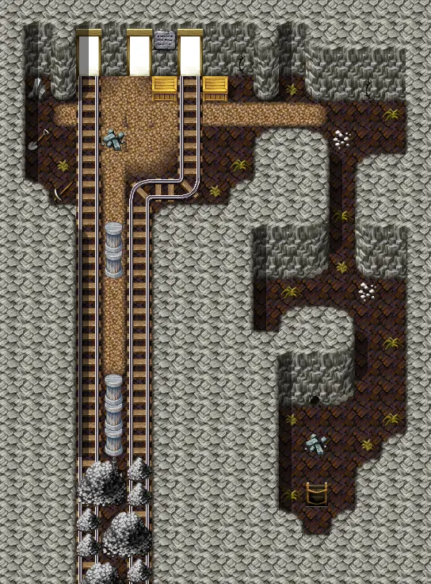

# Blackwater mountain 9

| | |
|---|---|
| **Map ID** | `blackwater_mountain9` |
| **Region** | In Prim (settlement) |
| **Type** | Indoors / underground |
| **Size** | 17×23 tiles |
| **World map** | [Bwentry](index.md) |
| **Introduced** | v0.7.0 or earlier |
| **NPCs** | 1 |
| **Enemy types** | 2 |
| **Quests** | 1 |

**Blackwater mountain 9** is an indoor map, in Prim (settlement). It has 1 NPC and 2 kinds of enemy. Exits lead to Blackwater mountain 10, Blackwater mountain 7.

## Map

<label class="lg"><input type="checkbox" data-t="spawn" checked><b>Red</b>&nbsp;Monsters / NPCs</label><label class="lg"><input type="checkbox" data-t="mapchange" checked><b>Blue</b>&nbsp;Exit to another map</label><label class="lg"><input type="checkbox" data-t="container" checked><b>Yellow</b>&nbsp;Container (click to see contents)</label><label class="lg"><input type="checkbox" data-t="sign" checked><b>Purple</b>&nbsp;Sign</label><label class="lg"><input type="checkbox" data-t="rest" checked><b>Green</b>&nbsp;Resting place</label><label class="lg"><input type="checkbox" data-t="key" checked><b>Orange dashed</b>&nbsp;Blocked until a quest step / item</label><label class="lg"><input type="checkbox" data-t="script"><b>Grey dotted</b>&nbsp;Scripted event</label><label class="lg"><input type="checkbox" data-t="replace"><b>White dotted</b>&nbsp;Changes during a quest</label><label class="lg"><input type="checkbox" data-t="pin" checked><b>Numbers</b>&nbsp;Numbered key points (see the key below the map)</label>

<a class="pin pin-exit" href="#key-1" style="left:20.588%;top:10.870%" title="Exit (exit outside): to [Blackwater mountain 10](blackwater_mountain10.md)">1</a><a class="pin pin-exit" href="#key-1" style="left:32.353%;top:10.870%" title="Exit (exit outside): to [Blackwater mountain 10](blackwater_mountain10.md)">1</a><a class="pin pin-exit" href="#key-1" style="left:44.118%;top:10.870%" title="Exit (exit outside): to [Blackwater mountain 10](blackwater_mountain10.md)">1</a><a class="pin pin-exit" href="#key-2" style="left:73.529%;top:84.783%" title="Exit (stairs / passage): to [Blackwater mountain 7](blackwater_mountain7.md)">2</a><a id="pin-npc-agent2" class="pin pin-npc" href="#key-3" style="left:61.765%;top:19.565%" title="[Agent](../../monsters/agent1.md#v-agent2): 1 quest">3</a>

??? abstract "Key to the numbers on the map"

    | # | What | Details |
    |---|---|---|
    | 1 | Exit (exit outside) | to [Blackwater mountain 10](blackwater_mountain10.md) |
    | 2 | Exit (stairs / passage) | to [Blackwater mountain 7](blackwater_mountain7.md) |
    | 3 | [Agent](../monsters/agent1.md#v-agent2) | 1 quest |

Verified against v0.8.18 map data.

## Connections

| Direction | Leads to | Region there | Map # |
|---|---|---|---|
| Exit outside | [Blackwater mountain 10](blackwater_mountain10.md) | Prim | 1 |
| Stairs / passage | [Blackwater mountain 7](blackwater_mountain7.md) | Prim | 2 |

## NPCs

- [Agent](../monsters/agent1.md#v-agent2) — quests: [The agent and the beast](../quests/bwm_agent.md) (#3)

## Enemies

| Enemy | HP | Damage | Up to | Notes |
|---|---|---|---|---|
| [Slithering venomfang](../monsters/slithering_venomfang.md) | 35 | 1–2 | 2 | shares spawn with Young gornaud |
| [Young gornaud](../monsters/young_gornaud.md) | 70 | 0–15 | 2 | shares spawn with Slithering venomfang |

<small>“Up to” is the most that can be alive at once from the spawn areas on this map.</small>

## Quests

- [The agent and the beast](../quests/bwm_agent.md): [Agent](../monsters/agent1.md#v-agent2) is involved

## Version history

| Version | Change |
|---|---|
| [v0.7.0](../versions/0.7.0.md) | Present in v0.7.0 (earliest release tracked) |
| [v0.7.1](../versions/0.7.1.md) | Map layout or objects changed |
| [v0.7.2](../versions/0.7.2.md) | Map layout or objects changed |

Verified against v0.8.18 and every earlier release back to v0.7.0 (game data compared release by release).

## Community notes

<small>Written by players, not generated from game data. **Observations**: what players notice in-game · **Lore**: the in-world story · **Trivia**: real-world facts, references, development history · **Theory / speculation**: unconfirmed ideas; may just be unfinished content</small>

### Observations

*No notes yet. Contributions are welcome: [add a note](https://github.com/asdfghjkl628/Andor-s-Trail-Wikiiii/new/main/notes/maps?filename=blackwater_mountain9.md&value=%23%23%20Observations%0A%0A%3C%21--%20what%20players%20notice%20in-game%20--%3E%0A%0A%23%23%20Lore%0A%0A%3C%21--%20the%20in-world%20story%20--%3E%0A%0A%23%23%20Trivia%0A%0A%3C%21--%20real-world%20facts%2C%20references%2C%20development%20history%20--%3E%0A%0A%23%23%20Theory%20/%20speculation%0A%0A%3C%21--%20unconfirmed%20ideas%3B%20may%20just%20be%20unfinished%20content%20--%3E%0A).*

### Lore

*No notes yet. Contributions are welcome: [add a note](https://github.com/asdfghjkl628/Andor-s-Trail-Wikiiii/new/main/notes/maps?filename=blackwater_mountain9.md&value=%23%23%20Observations%0A%0A%3C%21--%20what%20players%20notice%20in-game%20--%3E%0A%0A%23%23%20Lore%0A%0A%3C%21--%20the%20in-world%20story%20--%3E%0A%0A%23%23%20Trivia%0A%0A%3C%21--%20real-world%20facts%2C%20references%2C%20development%20history%20--%3E%0A%0A%23%23%20Theory%20/%20speculation%0A%0A%3C%21--%20unconfirmed%20ideas%3B%20may%20just%20be%20unfinished%20content%20--%3E%0A).*

### Trivia

*No notes yet. Contributions are welcome: [add a note](https://github.com/asdfghjkl628/Andor-s-Trail-Wikiiii/new/main/notes/maps?filename=blackwater_mountain9.md&value=%23%23%20Observations%0A%0A%3C%21--%20what%20players%20notice%20in-game%20--%3E%0A%0A%23%23%20Lore%0A%0A%3C%21--%20the%20in-world%20story%20--%3E%0A%0A%23%23%20Trivia%0A%0A%3C%21--%20real-world%20facts%2C%20references%2C%20development%20history%20--%3E%0A%0A%23%23%20Theory%20/%20speculation%0A%0A%3C%21--%20unconfirmed%20ideas%3B%20may%20just%20be%20unfinished%20content%20--%3E%0A).*

### Theory / speculation

*No notes yet. Contributions are welcome: [add a note](https://github.com/asdfghjkl628/Andor-s-Trail-Wikiiii/new/main/notes/maps?filename=blackwater_mountain9.md&value=%23%23%20Observations%0A%0A%3C%21--%20what%20players%20notice%20in-game%20--%3E%0A%0A%23%23%20Lore%0A%0A%3C%21--%20the%20in-world%20story%20--%3E%0A%0A%23%23%20Trivia%0A%0A%3C%21--%20real-world%20facts%2C%20references%2C%20development%20history%20--%3E%0A%0A%23%23%20Theory%20/%20speculation%0A%0A%3C%21--%20unconfirmed%20ideas%3B%20may%20just%20be%20unfinished%20content%20--%3E%0A).*

??? info "Technical information"

    | | |
    |---|---|
    | Map ID | `blackwater_mountain9` |
    | File | `res/xml/blackwater_mountain9.tmx` |
    | Size | 17×23 tiles (544×736 px) |
    | outdoors property | – |
    | Layers drawn | ground, objects, above, top |
    | Tilesets | map_bed_1, map_border_1, map_bridge_1, map_broken_1, map_cavewall_1, map_cavewall_2, map_cavewall_3, map_chair_table_1, map_crate_1, map_cupboard_1, map_curtain_1, map_entrance_1, map_fence_1, map_fence_2, map_ground_1, map_ground_2, map_ground_3, map_ground_4, map_ground_5, map_ground_6, map_ground_7, map_ground_8, map_indoor_1, map_kitchen_1, map_outdoor_1, map_pillar_1, map_plant_1, map_rock_1, map_roof_1, map_roof_2, map_shop_1, map_sign_ladder_1, map_table_1, map_trail_1, map_tree_1, map_wall_1, map_wall_2, map_wall_3, map_window_1, map_window_2 |
    | Map objects | mapchange: 4, spawn: 3 |
    | World map position | segment `bwentry`, x 53, y 361 |

<small>Data from v0.8.18</small>
