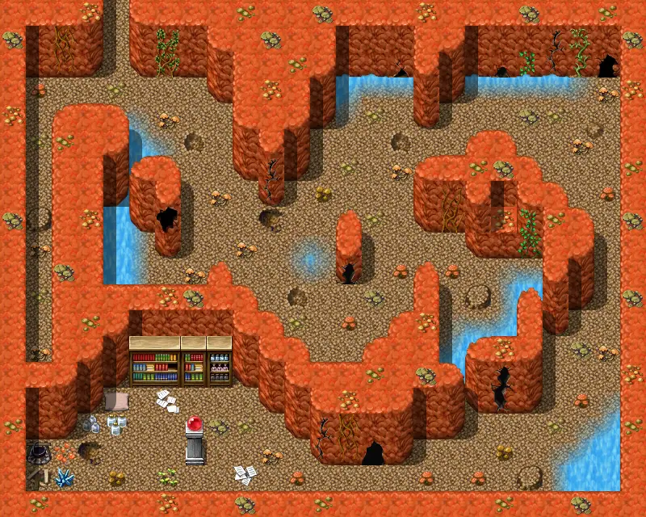

# Bogsten4

25×20 tiles · part of [Fungi panic](index.md)

<label class="lg"><input type="checkbox" data-t="spawn" checked><b>Red</b>&nbsp;Monsters / NPCs</label><label class="lg"><input type="checkbox" data-t="mapchange" checked><b>Blue</b>&nbsp;Exit to another map</label><label class="lg"><input type="checkbox" data-t="container" checked><b>Yellow</b>&nbsp;Container (click to see contents)</label><label class="lg"><input type="checkbox" data-t="sign" checked><b>Purple</b>&nbsp;Sign</label><label class="lg"><input type="checkbox" data-t="rest" checked><b>Green</b>&nbsp;Resting place</label><label class="lg"><input type="checkbox" data-t="key" checked><b>Orange dashed</b>&nbsp;Blocked until a quest step / item</label><label class="lg"><input type="checkbox" data-t="script"><b>Grey dotted</b>&nbsp;Scripted event</label><label class="lg"><input type="checkbox" data-t="replace"><b>White dotted</b>&nbsp;Changes during a quest</label>

## Exits

- [Bogsten3](bogsten3.md)
- [Mushroom m2 1](mushroom_m2_1.md)

## Monsters & NPCs here

| Name | HP |
|---|---|
| [Black fog](../monsters/zuul_khan1_blocker.md) | 0 |
| [Fungi](../monsters/mid_fungi.md) | 25 |
| [Lombric ball](../monsters/lombric_ball.md) | 30 |
| [Lombric beast](../monsters/lombric_beast.md) | 30 |
| [Dangerous fungi](../monsters/dangerous_fungi.md) | 55 |
| [Zuul'khan](../monsters/zuul_khan.md) | 175 |

<small>Map ID: `bogsten4` · Data from v0.8.18</small>
