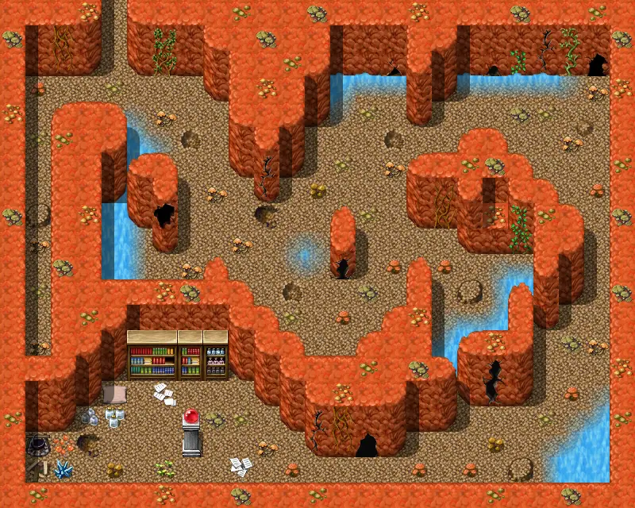
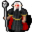

# Bogsten 4

| | |
|---|---|
| **Map ID** | `bogsten4` |
| **Type** | Indoors / underground |
| **Size** | 25×20 tiles |
| **World map** | [Fungi panic](index.md) |
| **Introduced** | [v0.7.13](../versions/0.7.13.md) |
| **NPCs** | 2 |
| **Enemy types** | 4 |
| **Quests** | 1 |

**Bogsten 4** is an indoor map. It has 2 NPCs and 4 kinds of enemy. Exits lead to Mushroom m 2 1, Bogsten 3.

## Map

<label class="lg"><input type="checkbox" data-t="spawn" checked><b>Red</b>&nbsp;Monsters / NPCs</label><label class="lg"><input type="checkbox" data-t="mapchange" checked><b>Blue</b>&nbsp;Exit to another map</label><label class="lg"><input type="checkbox" data-t="container" checked><b>Yellow</b>&nbsp;Container (click to see contents)</label><label class="lg"><input type="checkbox" data-t="sign" checked><b>Purple</b>&nbsp;Sign</label><label class="lg"><input type="checkbox" data-t="rest" checked><b>Green</b>&nbsp;Resting place</label><label class="lg"><input type="checkbox" data-t="key" checked><b>Orange dashed</b>&nbsp;Blocked until a quest step / item</label><label class="lg"><input type="checkbox" data-t="script"><b>Grey dotted</b>&nbsp;Scripted event</label><label class="lg"><input type="checkbox" data-t="replace"><b>White dotted</b>&nbsp;Changes during a quest</label><label class="lg"><input type="checkbox" data-t="pin" checked><b>Numbers</b>&nbsp;Numbered key points (see the key below the map)</label>

<a class="pin pin-exit" href="#key-1" style="left:18.000%;top:2.500%" title="Exit (north): to [Mushroom m 2 1](mushroom_m2_1.md)">1</a><a class="pin pin-exit" href="#key-2" style="left:2.000%;top:67.500%" title="Exit (west): to [Bogsten 3](bogsten3.md)">2</a><a id="pin-npc-zuul_khan1_blocker" class="pin pin-npc" href="#key-3" style="left:18.000%;top:12.500%" title="[Black fog](../../monsters/zuul_khan1_blocker.md): 1 quest">3</a><a id="pin-npc-zuul_khan" class="pin pin-npc" href="#key-4" style="left:22.000%;top:77.500%" title="[Zuul&#x27;khan](../../monsters/zuul_khan.md): 1 quest">4</a><a class="pin pin-script" href="#key-5" style="left:6.000%;top:62.500%" title="Quest trigger: Scripted event: advances the quest: hidden story flag “fungi_panic_nondisplayed” to stage 60 (“60=Cave wall open”)">5</a><a class="pin pin-script" href="#key-6" style="left:22.000%;top:85.000%" title="Quest trigger: Scripted event: advances the quest: Fungi panic to stage 90 (“I defeated Zuul&#x27;khan, but he was not dead. He disappeared into the ground.”)">6</a><a class="pin pin-replace" href="#key-7" style="left:4.263%;top:58.750%" title="Changes during a quest: This area changes during the quest: hidden story flag “fungi_panic_nondisplayed” (stage 60: “60=Cave wall open”)">7</a><a class="pin pin-replace" href="#key-8" style="left:1.250%;top:61.722%" title="Changes during a quest: This area changes back during the quest: hidden story flag “fungi_panic_nondisplayed” (stage 60: “60=Cave wall open”)">8</a>

??? abstract "Key to the numbers on the map"

    | # | What | Details |
    |---|---|---|
    | 1 | Exit (north) | to [Mushroom m 2 1](mushroom_m2_1.md) |
    | 2 | Exit (west) | to [Bogsten 3](bogsten3.md) |
    | 3 | [Black fog](../monsters/zuul_khan1_blocker.md) | 1 quest |
    | 4 | [Zuul'khan](../monsters/zuul_khan.md) | 1 quest |
    | 5 | Quest trigger | Scripted event: advances the quest: hidden story flag “fungi_panic_nondisplayed” to stage 60 (“60=Cave wall open”) |
    | 6 | Quest trigger | Scripted event: advances the quest: Fungi panic to stage 90 (“I defeated Zuul'khan, but he was not dead. He disappeared into the ground.”) |
    | 7 | Changes during a quest | This area changes during the quest: hidden story flag “fungi_panic_nondisplayed” (stage 60: “60=Cave wall open”) |
    | 8 | Changes during a quest | This area changes back during the quest: hidden story flag “fungi_panic_nondisplayed” (stage 60: “60=Cave wall open”) |

Verified against v0.8.18 map data.

## Connections

| Direction | Leads to | Region there | Map # |
|---|---|---|---|
| North | [Mushroom m 2 1](mushroom_m2_1.md) | – | 1 |
| West | [Bogsten 3](bogsten3.md) | – | 2 |

## NPCs

- [Black fog](../monsters/zuul_khan1_blocker.md) — quests: [Fungi panic](../quests/fungi_panic.md) (#3)
- [Zuul'khan](../monsters/zuul_khan.md) — can be fought — quests: [Fungi panic](../quests/fungi_panic.md) (#4)

## Enemies

| Enemy | HP | Damage | Up to | Notes |
|---|---|---|---|---|
| [Fungi](../monsters/mid_fungi.md) | 25 | 2–3 | 7 | – |
| [Lombric beast](../monsters/lombric_beast.md) | 30 | 3–10 | 6 | – |
| [Lombric ball](../monsters/lombric_ball.md) | 30 | 1–15 | 7 | – |
| [Dangerous fungi](../monsters/dangerous_fungi.md) | 55 | 2–5 | 8 | – |

<small>“Up to” is the most that can be alive at once from the spawn areas on this map.</small>

## Quests

- [Fungi panic](../quests/fungi_panic.md): [Black fog](../monsters/zuul_khan1_blocker.md) is involved; [Zuul'khan](../monsters/zuul_khan.md) is involved; something on this map advances it; stepping on a trigger here sets stage 90
- [Fungi Panic story flags (hidden flag)](../quests/fungi_panic_nondisplayed.md): part of the map changes at stage 60; something on this map advances it; stepping on a trigger here sets stage 60

## Points of interest

- **Quest trigger** (#5): Scripted event: advances the quest: hidden story flag “fungi_panic_nondisplayed” to stage 60 (“60=Cave wall open”)
- **Quest trigger** (#6): Scripted event: advances the quest: Fungi panic to stage 90 (“I defeated Zuul'khan, but he was not dead. He disappeared into the ground.”)
- **Changes during a quest** (#7): This area changes during the quest: hidden story flag “fungi_panic_nondisplayed” (stage 60: “60=Cave wall open”)
- **Changes during a quest** (#8): This area changes back during the quest: hidden story flag “fungi_panic_nondisplayed” (stage 60: “60=Cave wall open”)

## Version history

| Version | Change |
|---|---|
| [v0.7.13](../versions/0.7.13.md) | Added |
| [v0.8.2](../versions/0.8.2.md) | Map layout or objects changed |

Verified against v0.8.18 and every earlier release back to v0.7.0 (game data compared release by release).

## Community notes

<small>Written by players, not generated from game data. **Observations**: what players notice in-game · **Lore**: the in-world story · **Trivia**: real-world facts, references, development history · **Theory / speculation**: unconfirmed ideas; may just be unfinished content</small>

### Observations

*No notes yet. Contributions are welcome: [add a note](https://github.com/asdfghjkl628/Andor-s-Trail-Wikiiii/new/main/notes/maps?filename=bogsten4.md&value=%23%23%20Observations%0A%0A%3C%21--%20what%20players%20notice%20in-game%20--%3E%0A%0A%23%23%20Lore%0A%0A%3C%21--%20the%20in-world%20story%20--%3E%0A%0A%23%23%20Trivia%0A%0A%3C%21--%20real-world%20facts%2C%20references%2C%20development%20history%20--%3E%0A%0A%23%23%20Theory%20/%20speculation%0A%0A%3C%21--%20unconfirmed%20ideas%3B%20may%20just%20be%20unfinished%20content%20--%3E%0A).*

### Lore

*No notes yet. Contributions are welcome: [add a note](https://github.com/asdfghjkl628/Andor-s-Trail-Wikiiii/new/main/notes/maps?filename=bogsten4.md&value=%23%23%20Observations%0A%0A%3C%21--%20what%20players%20notice%20in-game%20--%3E%0A%0A%23%23%20Lore%0A%0A%3C%21--%20the%20in-world%20story%20--%3E%0A%0A%23%23%20Trivia%0A%0A%3C%21--%20real-world%20facts%2C%20references%2C%20development%20history%20--%3E%0A%0A%23%23%20Theory%20/%20speculation%0A%0A%3C%21--%20unconfirmed%20ideas%3B%20may%20just%20be%20unfinished%20content%20--%3E%0A).*

### Trivia

*No notes yet. Contributions are welcome: [add a note](https://github.com/asdfghjkl628/Andor-s-Trail-Wikiiii/new/main/notes/maps?filename=bogsten4.md&value=%23%23%20Observations%0A%0A%3C%21--%20what%20players%20notice%20in-game%20--%3E%0A%0A%23%23%20Lore%0A%0A%3C%21--%20the%20in-world%20story%20--%3E%0A%0A%23%23%20Trivia%0A%0A%3C%21--%20real-world%20facts%2C%20references%2C%20development%20history%20--%3E%0A%0A%23%23%20Theory%20/%20speculation%0A%0A%3C%21--%20unconfirmed%20ideas%3B%20may%20just%20be%20unfinished%20content%20--%3E%0A).*

### Theory / speculation

*No notes yet. Contributions are welcome: [add a note](https://github.com/asdfghjkl628/Andor-s-Trail-Wikiiii/new/main/notes/maps?filename=bogsten4.md&value=%23%23%20Observations%0A%0A%3C%21--%20what%20players%20notice%20in-game%20--%3E%0A%0A%23%23%20Lore%0A%0A%3C%21--%20the%20in-world%20story%20--%3E%0A%0A%23%23%20Trivia%0A%0A%3C%21--%20real-world%20facts%2C%20references%2C%20development%20history%20--%3E%0A%0A%23%23%20Theory%20/%20speculation%0A%0A%3C%21--%20unconfirmed%20ideas%3B%20may%20just%20be%20unfinished%20content%20--%3E%0A).*

??? info "Technical information"

    | | |
    |---|---|
    | Map ID | `bogsten4` |
    | File | `res/xml/bogsten4.tmx` |
    | Size | 25×20 tiles (800×640 px) |
    | outdoors property | – |
    | Layers drawn | ground, objects, above |
    | Tilesets | map_bed_1, map_border_1, map_bridge_1, map_broken_1, map_cavewall_1, map_cavewall_2, map_cavewall_3, map_chair_table_1, map_crate_1, map_cupboard_1, map_curtain_1, map_entrance_1, map_fence_1, map_fence_2, map_ground_1, map_ground_2, map_ground_3, map_ground_4, map_ground_5, map_ground_6, map_ground_7, map_ground_8, map_indoor_1, map_kitchen_1, map_outdoor_1, map_pillar_1, map_plant_1, map_rock_1, map_roof_1, map_roof_2, map_shop_1, map_sign_ladder_1, map_table_1, map_trail_1, map_tree_1, map_wall_1, map_wall_2, map_wall_3, map_window_1, map_window_2 |
    | Map objects | spawn: 11, mapchange: 2, script: 2, replace: 2 |
    | World map position | segment `fungi_panic`, x 333, y 477 |

<small>Data from v0.8.18</small>
