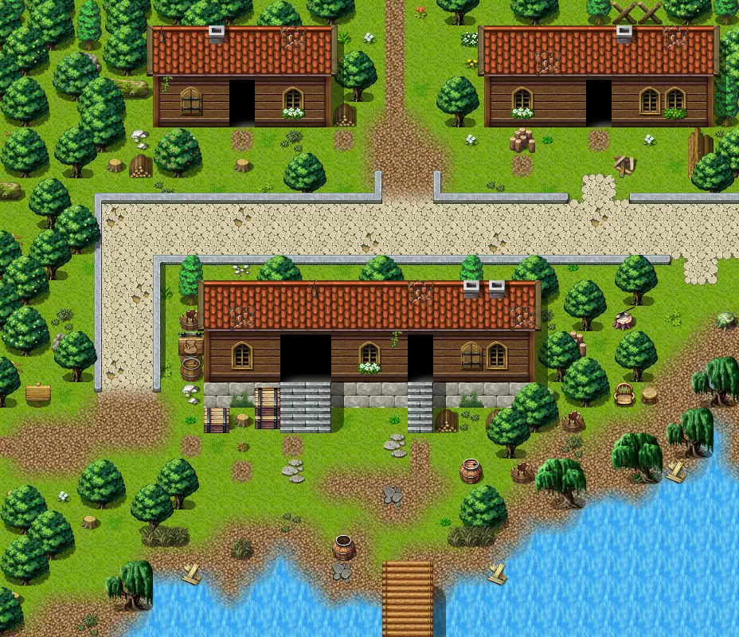
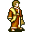

# Brightport1

29×25 tiles · outdoors · part of [World1](index.md)

<label class="lg"><input type="checkbox" data-t="spawn" checked><b>Red</b>&nbsp;Monsters / NPCs</label><label class="lg"><input type="checkbox" data-t="mapchange" checked><b>Blue</b>&nbsp;Exit to another map</label><label class="lg"><input type="checkbox" data-t="container" checked><b>Yellow</b>&nbsp;Container (click to see contents)</label><label class="lg"><input type="checkbox" data-t="sign" checked><b>Purple</b>&nbsp;Sign</label><label class="lg"><input type="checkbox" data-t="rest" checked><b>Green</b>&nbsp;Resting place</label><label class="lg"><input type="checkbox" data-t="key" checked><b>Orange dashed</b>&nbsp;Blocked until a quest step / item</label><label class="lg"><input type="checkbox" data-t="script"><b>Grey dotted</b>&nbsp;Scripted event</label><label class="lg"><input type="checkbox" data-t="replace"><b>White dotted</b>&nbsp;Changes during a quest</label>

## Exits

- [Brightport2](brightport2.md)
- [Brightport3](brightport3.md)
- [Brightport house](brightport_house.md)
- [Brightport stanwick](brightport_stanwick.md)
- [Brightport thievesguild](brightport_thievesguild.md)
- [Waytobrightport17](waytobrightport17.md)
- [Waytobrightport20](waytobrightport20.md)

## Monsters & NPCs here

| Name | HP |
|---|---|
| [Brightport guard](../monsters/brightportguard.md) | 0 |
| [Richimor](../monsters/brightportnpc2.md) | 0 |
| [Brightport commoner](../monsters/brightportcitizen.md) | 0 |
| [Silvear](../monsters/brightportthieves1.md) | 0 |

<small>Map ID: `brightport1` · Data from v0.8.18</small>
