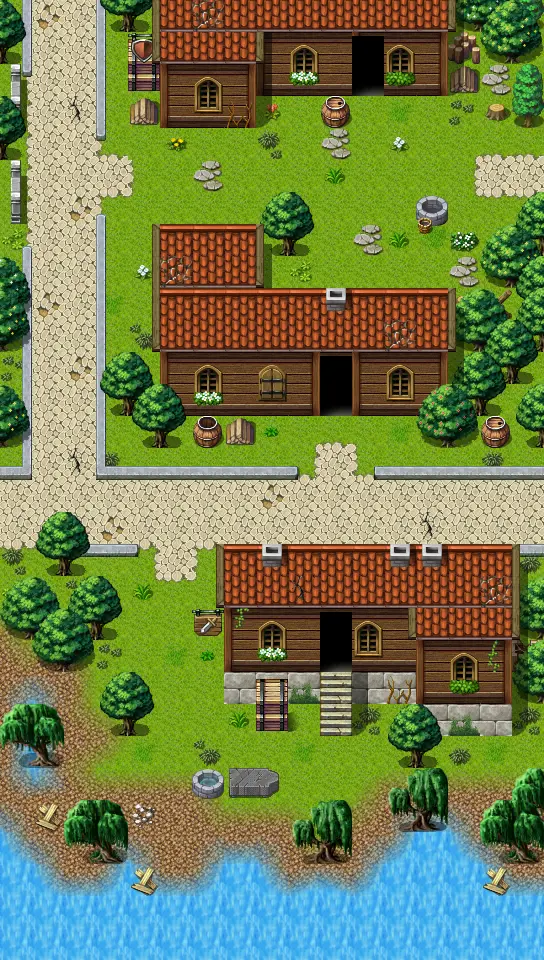

# Brightport3

| | |
|---|---|
| **Map ID** | `brightport3` |
| **Region** | In Brightport (settlement) |
| **Type** | Indoors / underground |
| **Size** | 17×30 tiles |
| **World map** | [World1](index.md) |
| **Introduced** | [v0.8.16.1](../versions/0.8.16.1.md) |
| **NPCs** | 1 |
| **Quests** | 0 |

**Brightport3** is an indoor map, in Brightport (settlement). It has 1 NPC, and no enemies. Exits lead to Brightport5, Brightport1, Brightport4, Brightport armorer and 2 more.

## Map

<label class="lg"><input type="checkbox" data-t="spawn" checked><b>Red</b>&nbsp;Monsters / NPCs</label><label class="lg"><input type="checkbox" data-t="mapchange" checked><b>Blue</b>&nbsp;Exit to another map</label><label class="lg"><input type="checkbox" data-t="container" checked><b>Yellow</b>&nbsp;Container (click to see contents)</label><label class="lg"><input type="checkbox" data-t="sign" checked><b>Purple</b>&nbsp;Sign</label><label class="lg"><input type="checkbox" data-t="rest" checked><b>Green</b>&nbsp;Resting place</label><label class="lg"><input type="checkbox" data-t="key" checked><b>Orange dashed</b>&nbsp;Blocked until a quest step / item</label><label class="lg"><input type="checkbox" data-t="script"><b>Grey dotted</b>&nbsp;Scripted event</label><label class="lg"><input type="checkbox" data-t="replace"><b>White dotted</b>&nbsp;Changes during a quest</label><label class="lg"><input type="checkbox" data-t="pin" checked><b>Numbers</b>&nbsp;Numbered key points (see the key below the map)</label>

<a class="pin pin-exit" href="#key-1" style="left:97.059%;top:46.667%" title="Exit (east): to [Brightport5](../brightport5.md)">1</a><a class="pin pin-exit" href="#key-2" style="left:2.941%;top:61.667%" title="Exit (west): to [Brightport1](../brightport1.md)">2</a><a class="pin pin-exit" href="#key-3" style="left:11.765%;top:1.667%" title="Exit (northwest): to [Brightport4](../brightport4.md)">3</a><a class="pin pin-exit" href="#key-4" style="left:67.647%;top:8.333%" title="Exit (stairs / passage): to [Brightport armorer](../brightport_armorer.md)">4</a><a class="pin pin-exit" href="#key-5" style="left:61.765%;top:41.667%" title="Exit (stairs / passage): to [Brightport forenza](../brightport_forenza.md)">5</a><a class="pin pin-exit" href="#key-6" style="left:61.765%;top:68.333%" title="Exit (stairs / passage): to [Brightport weapon](../brightport_weapon.md)">6</a><a class="pin pin-npc" href="#key-7" style="left:14.706%;top:35.000%" title="[Brightport commoner](../../monsters/brightportcitizen.md): NPC">7</a><a class="pin pin-script" href="#key-8" style="left:11.765%;top:5.000%" title="Quest trigger: Scripted event: advances the quest: hidden story flag “brightport_nondisplay” to stage 250 (“guard north exit”)">8</a>

??? abstract "Key to the numbers on the map"

    | # | What | Details |
    |---|---|---|
    | 1 | Exit (east) | to [Brightport5](../brightport5.md) |
    | 2 | Exit (west) | to [Brightport1](../brightport1.md) |
    | 3 | Exit (northwest) | to [Brightport4](../brightport4.md) |
    | 4 | Exit (stairs / passage) | to [Brightport armorer](../brightport_armorer.md) |
    | 5 | Exit (stairs / passage) | to [Brightport forenza](../brightport_forenza.md) |
    | 6 | Exit (stairs / passage) | to [Brightport weapon](../brightport_weapon.md) |
    | 7 | [Brightport commoner](../monsters/brightportcitizen.md) | NPC |
    | 8 | Quest trigger | Scripted event: advances the quest: hidden story flag “brightport_nondisplay” to stage 250 (“guard north exit”) |

Verified against v0.8.18 map data.

## Connections

| Direction | Leads to | Region there | Map # |
|---|---|---|---|
| East | [Brightport5](brightport5.md) | Brightport | 1 |
| West | [Brightport1](brightport1.md) | Brightport | 2 |
| Northwest | [Brightport4](brightport4.md) | Brightport | 3 |
| Stairs / passage | [Brightport armorer](brightport_armorer.md) | Brightport | 4 |
| Stairs / passage | [Brightport forenza](brightport_forenza.md) | Brightport | 5 |
| Stairs / passage | [Brightport weapon](brightport_weapon.md) | Brightport | 6 |

## NPCs

- [Brightport commoner](../monsters/brightportcitizen.md) (#7)

## Quests

- [brightport_nondisplay (hidden flag)](../quests/brightport_nondisplay.md): something on this map advances it; stepping on a trigger here sets stage 250

## Points of interest

- **Quest trigger** (#8): Scripted event: advances the quest: hidden story flag “brightport_nondisplay” to stage 250 (“guard north exit”)

## Version history

| Version | Change |
|---|---|
| [v0.8.16.1](../versions/0.8.16.1.md) | Added |

Verified against v0.8.18 and every earlier release back to v0.7.0 (game data compared release by release).

## Community notes

<small>Written by players, not generated from game data. **Observations**: what players notice in-game · **Lore**: the in-world story · **Trivia**: real-world facts, references, development history · **Theory / speculation**: unconfirmed ideas; may just be unfinished content</small>

### Observations

*Nothing here yet. Know something? [Add it](https://github.com/asdfghjkl628/Andor-s-Trail-Wikiiii/new/main/notes/maps?filename=brightport3.md&value=%23%23%20Observations%0A%0A%3C%21--%20what%20players%20notice%20in-game%20--%3E%0A%0A%23%23%20Lore%0A%0A%3C%21--%20the%20in-world%20story%20--%3E%0A%0A%23%23%20Trivia%0A%0A%3C%21--%20real-world%20facts%2C%20references%2C%20development%20history%20--%3E%0A%0A%23%23%20Theory%20/%20speculation%0A%0A%3C%21--%20unconfirmed%20ideas%3B%20may%20just%20be%20unfinished%20content%20--%3E%0A).*

### Lore

*Nothing here yet. Know something? [Add it](https://github.com/asdfghjkl628/Andor-s-Trail-Wikiiii/new/main/notes/maps?filename=brightport3.md&value=%23%23%20Observations%0A%0A%3C%21--%20what%20players%20notice%20in-game%20--%3E%0A%0A%23%23%20Lore%0A%0A%3C%21--%20the%20in-world%20story%20--%3E%0A%0A%23%23%20Trivia%0A%0A%3C%21--%20real-world%20facts%2C%20references%2C%20development%20history%20--%3E%0A%0A%23%23%20Theory%20/%20speculation%0A%0A%3C%21--%20unconfirmed%20ideas%3B%20may%20just%20be%20unfinished%20content%20--%3E%0A).*

### Trivia

*Nothing here yet. Know something? [Add it](https://github.com/asdfghjkl628/Andor-s-Trail-Wikiiii/new/main/notes/maps?filename=brightport3.md&value=%23%23%20Observations%0A%0A%3C%21--%20what%20players%20notice%20in-game%20--%3E%0A%0A%23%23%20Lore%0A%0A%3C%21--%20the%20in-world%20story%20--%3E%0A%0A%23%23%20Trivia%0A%0A%3C%21--%20real-world%20facts%2C%20references%2C%20development%20history%20--%3E%0A%0A%23%23%20Theory%20/%20speculation%0A%0A%3C%21--%20unconfirmed%20ideas%3B%20may%20just%20be%20unfinished%20content%20--%3E%0A).*

### Theory / speculation

*Nothing here yet. Know something? [Add it](https://github.com/asdfghjkl628/Andor-s-Trail-Wikiiii/new/main/notes/maps?filename=brightport3.md&value=%23%23%20Observations%0A%0A%3C%21--%20what%20players%20notice%20in-game%20--%3E%0A%0A%23%23%20Lore%0A%0A%3C%21--%20the%20in-world%20story%20--%3E%0A%0A%23%23%20Trivia%0A%0A%3C%21--%20real-world%20facts%2C%20references%2C%20development%20history%20--%3E%0A%0A%23%23%20Theory%20/%20speculation%0A%0A%3C%21--%20unconfirmed%20ideas%3B%20may%20just%20be%20unfinished%20content%20--%3E%0A).*

??? info "Technical information"

    | | |
    |---|---|
    | Map ID | `brightport3` |
    | File | `res/xml/brightport3.tmx` |
    | Size | 17×30 tiles (544×960 px) |
    | outdoors property | – |
    | Layers drawn | base, ground, objects, above, top |
    | Tilesets | map_bed_1, map_border_1, map_bridge_1, map_bridge_2, map_brightport, map_broken_1, map_cavewall_1, map_cavewall_2, map_cavewall_3, map_cavewall_4, map_chair_table_1, map_chair_table_2, map_crate_1, map_cupboard_1, map_curtain_1, map_entrance_1, map_entrance_2, map_fence_1, map_fence_2, map_fence_3, map_fence_4, map_ground_1, map_ground_2, map_ground_3, map_ground_4, map_ground_5, map_ground_6, map_ground_7, map_ground_8, map_house_1, map_house_2, map_indoor_1, map_indoor_2, map_kitchen_1, map_outdoor_1, map_pillar_1, map_pillar_2, map_plant_1, map_plant_2, map_rock_1, map_rock_2, map_roof_1, map_roof_2, map_roof_3, map_shop_1, map_sign_ladder_1, map_table_1, map_trail_1, map_transition_1, map_transition_2, map_transition_3, map_transition_4, map_transition_5, map_tree_1, map_tree_2, map_tree_3, map_wall_1, map_wall_2, map_wall_3, map_wall_4, map_window_1, map_window_2 |
    | Map objects | mapchange: 6, spawn: 2, script: 1 |
    | World map position | segment `world1`, x 612, y 341 |

<small>Data from v0.8.18</small>
