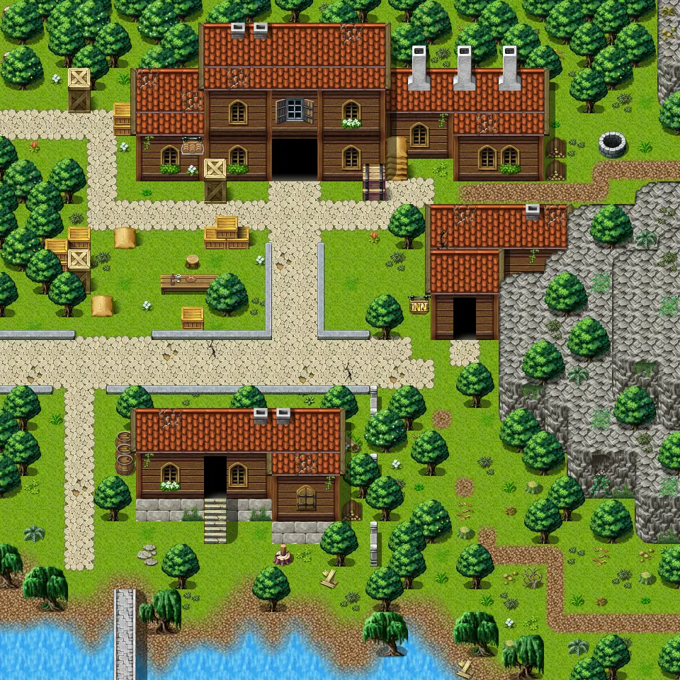

# Brightport5

30×30 tiles · outdoors · part of [World1](index.md)

<label class="lg lg-spawn"><input type="checkbox" data-t="spawn" checked> Monsters / NPCs</label><label class="lg lg-mapchange"><input type="checkbox" data-t="mapchange" checked> Exit to another map</label><label class="lg lg-container"><input type="checkbox" data-t="container" checked> Container</label><label class="lg lg-sign"><input type="checkbox" data-t="sign" checked> Sign</label><label class="lg lg-rest"><input type="checkbox" data-t="rest" checked> Resting place</label><label class="lg lg-key"><input type="checkbox" data-t="key" checked> Blocked / needs key or quest</label><label class="lg lg-script"><input type="checkbox" data-t="script"> Scripted event</label><label class="lg lg-replace"><input type="checkbox" data-t="replace"> Changes after a quest</label>

## Exits

- [Brightport3](brightport3.md)
- [Brightport6](brightport6.md)
- [Brightport7](brightport7.md)
- [Brightport8](brightport8.md)
- [Brightport9](brightport9.md)
- [Brightport bakery](brightport_bakery.md)
- [Brightport inn](brightport_inn.md)
- [Brightport temple1](brightport_temple1.md)

## Monsters & NPCs here

| Name | HP |
|---|---|
| [Brightport guard](../monsters/brightportguard.md) | 0 |
| [Brightport commoner](../monsters/brightportcitizen1.md) | 0 |
| [Brightport guard](../monsters/brightportguard2.md) | 0 |
| [Laborer](../monsters/brightportbakeryoutside2.md) | 0 |
| [Eatloni](../monsters/brightportbakeryoutside.md) | 0 |

<small>Map ID: `brightport5` · Data from v0.8.18</small>
