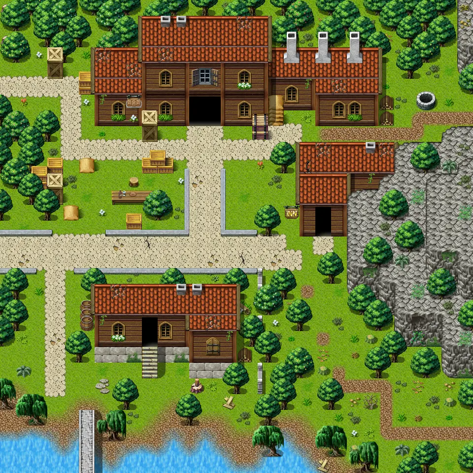

# Brightport 5

| | |
|---|---|
| **Map ID** | `brightport5` |
| **Region** | In Brightport (settlement) |
| **Type** | Outdoors |
| **Size** | 30×30 tiles |
| **World map** | [World 1](index.md) |
| **Introduced** | [v0.8.16.1](../versions/0.8.16.1.md) |
| **NPCs** | 5 |
| **Quests** | 1 |

**Brightport 5** is an outdoor map, in Brightport (settlement). It has 5 NPCs, and no enemies. Exits lead to Brightport 6, Brightport 8, Brightport 9, Brightport 7 and 4 more.

## Map

<label class="lg"><input type="checkbox" data-t="spawn" checked><b>Red</b>&nbsp;Monsters / NPCs</label><label class="lg"><input type="checkbox" data-t="mapchange" checked><b>Blue</b>&nbsp;Exit to another map</label><label class="lg"><input type="checkbox" data-t="container" checked><b>Yellow</b>&nbsp;Container (click to see contents)</label><label class="lg"><input type="checkbox" data-t="sign" checked><b>Purple</b>&nbsp;Sign</label><label class="lg"><input type="checkbox" data-t="rest" checked><b>Green</b>&nbsp;Resting place</label><label class="lg"><input type="checkbox" data-t="key" checked><b>Orange dashed</b>&nbsp;Blocked until a quest step / item</label><label class="lg"><input type="checkbox" data-t="script"><b>Grey dotted</b>&nbsp;Scripted event</label><label class="lg"><input type="checkbox" data-t="replace"><b>White dotted</b>&nbsp;Changes during a quest</label><label class="lg"><input type="checkbox" data-t="pin" checked><b>Numbers</b>&nbsp;Numbered key points (see the key below the map)</label>

<a class="pin pin-exit" href="#key-1" style="left:75.000%;top:1.667%" title="Exit (north): to [Brightport 6](brightport6.md)">1</a><a class="pin pin-exit" href="#key-2" style="left:98.333%;top:91.667%" title="Exit (east): to [Brightport 8](brightport8.md)">2</a><a class="pin pin-exit" href="#key-3" style="left:98.333%;top:23.333%" title="Exit (east): to [Brightport 9](brightport9.md)">3</a><a class="pin pin-exit" href="#key-4" style="left:95.000%;top:98.333%" title="Exit (southeast): to [Brightport 7](brightport7.md)">4</a><a class="pin pin-exit" href="#key-5" style="left:18.333%;top:98.333%" title="Exit (south): to [Brightport 7](brightport7.md)">5</a><a class="pin pin-exit" href="#key-5" style="left:81.667%;top:98.333%" title="Exit (south): to [Brightport 7](brightport7.md)">5</a><a class="pin pin-exit" href="#key-6" style="left:1.667%;top:46.667%" title="Exit (west): to [Brightport 3](brightport3.md)">6</a><a class="pin pin-exit" href="#key-7" style="left:43.333%;top:25.000%" title="Exit (door): to [Brightport bakery](brightport_bakery.md)">7</a><a class="pin pin-exit" href="#key-8" style="left:68.333%;top:48.333%" title="Exit (door): to [Brightport inn](brightport_inn.md)">8</a><a class="pin pin-exit" href="#key-9" style="left:31.667%;top:71.667%" title="Exit (door): to [Brightport temple 1](brightport_temple1.md)">9</a><a id="pin-npc-brightportcitizen1" class="pin pin-npc" href="#key-10" style="left:55.000%;top:38.333%" title="[Brightport commoner](../../monsters/brightportcitizen.md#v-brightportcitizen1): NPC">10</a><a id="pin-npc-brightportguard2" class="pin pin-npc" href="#key-11" style="left:68.333%;top:65.000%" title="[Brightport guard](../../monsters/brightportguard.md#v-brightportguard2): NPC">11</a><a id="pin-npc-brightportguard" class="pin pin-npc" href="#key-12" style="left:38.333%;top:31.667%" title="[Brightport guard](../../monsters/brightportguard.md): NPC">12</a><a id="pin-npc-brightportbakeryoutside" class="pin pin-npc" href="#key-13" style="left:28.333%;top:38.333%" title="[Eatloni](../../monsters/brightportbakeryoutside.md): 1 quest">13</a><a id="pin-npc-brightportbakeryoutside2" class="pin pin-npc" href="#key-14" style="left:18.333%;top:31.667%" title="[Laborer](../../monsters/brightportbakeryoutside2.md): NPC">14</a><a class="pin pin-script" href="#key-15" style="left:43.333%;top:28.333%" title="Quest trigger: Scripted event: advances the quest: hidden story flag “quest_burhczyd_nd” to stage 514 (“514=show oven in Brightport bakery”)">15</a><a class="pin pin-script" href="#key-16" style="left:38.333%;top:45.000%" title="Quest trigger: Scripted event: advances the quest: hidden story flag “brightport_nondisplay” to stage 153 (“new commander script”)">16</a><a class="pin pin-script" href="#key-15" style="left:45.015%;top:30.527%" title="Quest trigger: Scripted event: advances the quest: hidden story flag “quest_burhczyd_nd” to stage 514 (“514=show oven in Brightport bakery”)">15</a>

??? abstract "Key to the numbers on the map"

    | # | What | Details |
    |---|---|---|
    | 1 | Exit (north) | to [Brightport 6](brightport6.md) |
    | 2 | Exit (east) | to [Brightport 8](brightport8.md) |
    | 3 | Exit (east) | to [Brightport 9](brightport9.md) |
    | 4 | Exit (southeast) | to [Brightport 7](brightport7.md) |
    | 5 | Exit (south) | to [Brightport 7](brightport7.md) |
    | 6 | Exit (west) | to [Brightport 3](brightport3.md) |
    | 7 | Exit (door) | to [Brightport bakery](brightport_bakery.md) |
    | 8 | Exit (door) | to [Brightport inn](brightport_inn.md) |
    | 9 | Exit (door) | to [Brightport temple 1](brightport_temple1.md) |
    | 10 | [Brightport commoner](../monsters/brightportcitizen.md#v-brightportcitizen1) | NPC |
    | 11 | [Brightport guard](../monsters/brightportguard.md#v-brightportguard2) | NPC |
    | 12 | [Brightport guard](../monsters/brightportguard.md) | NPC |
    | 13 | [Eatloni](../monsters/brightportbakeryoutside.md) | 1 quest |
    | 14 | [Laborer](../monsters/brightportbakeryoutside2.md) | NPC |
    | 15 | Quest trigger | Scripted event: advances the quest: hidden story flag “quest_burhczyd_nd” to stage 514 (“514=show oven in Brightport bakery”) |
    | 16 | Quest trigger | Scripted event: advances the quest: hidden story flag “brightport_nondisplay” to stage 153 (“new commander script”) |

Verified against v0.8.18 map data.

## Connections

| Direction | Leads to | Region there | Map # |
|---|---|---|---|
| North | [Brightport 6](brightport6.md) | Brightport | 1 |
| East | [Brightport 8](brightport8.md) | Brightport | 2 |
| East | [Brightport 9](brightport9.md) | Brightport | 3 |
| Southeast | [Brightport 7](brightport7.md) | Brightport | 4 |
| South | [Brightport 7](brightport7.md) | Brightport | 5 |
| West | [Brightport 3](brightport3.md) | Brightport | 6 |
| Door | [Brightport bakery](brightport_bakery.md) | Brightport | 7 |
| Door | [Brightport inn](brightport_inn.md) | Brightport | 8 |
| Door | [Brightport temple 1](brightport_temple1.md) | Brightport | 9 |

## NPCs

- [Brightport commoner](../monsters/brightportcitizen.md#v-brightportcitizen1) (#10)
- [Brightport guard](../monsters/brightportguard.md#v-brightportguard2) (#11)
- [Brightport guard](../monsters/brightportguard.md) (#12)
- [Eatloni](../monsters/brightportbakeryoutside.md) — quests: [Bread and circus](../quests/brightport_bakery.md) (#13)
- [Laborer](../monsters/brightportbakeryoutside2.md) (#14)

## Quests

- [Bread and circus](../quests/brightport_bakery.md): [Eatloni](../monsters/brightportbakeryoutside.md) is involved
- [Brightport story flags (hidden flag)](../quests/brightport_nondisplay.md): [Brightport guard](../monsters/brightportguard.md#v-brightportguard2) is involved; [Eatloni](../monsters/brightportbakeryoutside.md) is involved; something on this map advances it; stepping on a trigger here sets stage 153
- [Young merchant story flags (hidden flag)](../quests/quest_burhczyd_nd.md): something on this map advances it; stepping on a trigger here sets stage 514

## Points of interest

- **Quest trigger** (#15): Scripted event: advances the quest: hidden story flag “quest_burhczyd_nd” to stage 514 (“514=show oven in Brightport bakery”)
- **Quest trigger** (#16): Scripted event: advances the quest: hidden story flag “brightport_nondisplay” to stage 153 (“new commander script”)

## Version history

| Version | Change |
|---|---|
| [v0.8.16.1](../versions/0.8.16.1.md) | Added |
| [v0.8.18](../versions/0.8.18.md) | Map layout or objects changed |

Verified against v0.8.18 and every earlier release back to v0.7.0 (game data compared release by release).

## Community notes

<small>Written by players, not generated from game data. **Observations**: what players notice in-game · **Lore**: the in-world story · **Trivia**: real-world facts, references, development history · **Theory / speculation**: unconfirmed ideas; may just be unfinished content</small>

### Observations

*No notes yet. Contributions are welcome: [add a note](https://github.com/asdfghjkl628/Andor-s-Trail-Wikiiii/new/main/notes/maps?filename=brightport5.md&value=%23%23%20Observations%0A%0A%3C%21--%20what%20players%20notice%20in-game%20--%3E%0A%0A%23%23%20Lore%0A%0A%3C%21--%20the%20in-world%20story%20--%3E%0A%0A%23%23%20Trivia%0A%0A%3C%21--%20real-world%20facts%2C%20references%2C%20development%20history%20--%3E%0A%0A%23%23%20Theory%20/%20speculation%0A%0A%3C%21--%20unconfirmed%20ideas%3B%20may%20just%20be%20unfinished%20content%20--%3E%0A).*

### Lore

*No notes yet. Contributions are welcome: [add a note](https://github.com/asdfghjkl628/Andor-s-Trail-Wikiiii/new/main/notes/maps?filename=brightport5.md&value=%23%23%20Observations%0A%0A%3C%21--%20what%20players%20notice%20in-game%20--%3E%0A%0A%23%23%20Lore%0A%0A%3C%21--%20the%20in-world%20story%20--%3E%0A%0A%23%23%20Trivia%0A%0A%3C%21--%20real-world%20facts%2C%20references%2C%20development%20history%20--%3E%0A%0A%23%23%20Theory%20/%20speculation%0A%0A%3C%21--%20unconfirmed%20ideas%3B%20may%20just%20be%20unfinished%20content%20--%3E%0A).*

### Trivia

*No notes yet. Contributions are welcome: [add a note](https://github.com/asdfghjkl628/Andor-s-Trail-Wikiiii/new/main/notes/maps?filename=brightport5.md&value=%23%23%20Observations%0A%0A%3C%21--%20what%20players%20notice%20in-game%20--%3E%0A%0A%23%23%20Lore%0A%0A%3C%21--%20the%20in-world%20story%20--%3E%0A%0A%23%23%20Trivia%0A%0A%3C%21--%20real-world%20facts%2C%20references%2C%20development%20history%20--%3E%0A%0A%23%23%20Theory%20/%20speculation%0A%0A%3C%21--%20unconfirmed%20ideas%3B%20may%20just%20be%20unfinished%20content%20--%3E%0A).*

### Theory / speculation

*No notes yet. Contributions are welcome: [add a note](https://github.com/asdfghjkl628/Andor-s-Trail-Wikiiii/new/main/notes/maps?filename=brightport5.md&value=%23%23%20Observations%0A%0A%3C%21--%20what%20players%20notice%20in-game%20--%3E%0A%0A%23%23%20Lore%0A%0A%3C%21--%20the%20in-world%20story%20--%3E%0A%0A%23%23%20Trivia%0A%0A%3C%21--%20real-world%20facts%2C%20references%2C%20development%20history%20--%3E%0A%0A%23%23%20Theory%20/%20speculation%0A%0A%3C%21--%20unconfirmed%20ideas%3B%20may%20just%20be%20unfinished%20content%20--%3E%0A).*

??? info "Technical information"

    | | |
    |---|---|
    | Map ID | `brightport5` |
    | File | `res/xml/brightport5.tmx` |
    | Size | 30×30 tiles (960×960 px) |
    | outdoors property | 1 |
    | Layers drawn | base, ground, objects, above, top |
    | Tilesets | map_bed_1, map_border_1, map_bridge_1, map_bridge_2, map_brightport, map_broken_1, map_cavewall_1, map_cavewall_2, map_cavewall_3, map_cavewall_4, map_chair_table_1, map_chair_table_2, map_crate_1, map_cupboard_1, map_curtain_1, map_entrance_1, map_entrance_2, map_fence_1, map_fence_2, map_fence_3, map_fence_4, map_ground_1, map_ground_2, map_ground_3, map_ground_4, map_ground_5, map_ground_6, map_ground_7, map_ground_8, map_house_1, map_house_2, map_indoor_1, map_indoor_2, map_kitchen_1, map_outdoor_1, map_pillar_1, map_pillar_2, map_plant_1, map_plant_2, map_rock_1, map_rock_2, map_roof_1, map_roof_2, map_roof_3, map_shop_1, map_sign_ladder_1, map_table_1, map_trail_1, map_transition_1, map_transition_2, map_transition_3, map_transition_4, map_transition_5, map_tree_1, map_tree_2, map_tree_3, map_wall_1, map_wall_2, map_wall_3, map_wall_4, map_window_1, map_window_2 |
    | Map objects | mapchange: 10, spawn: 6, script: 3 |
    | World map position | segment `world1`, x 630, y 341 |

<small>Data from v0.8.18</small>
