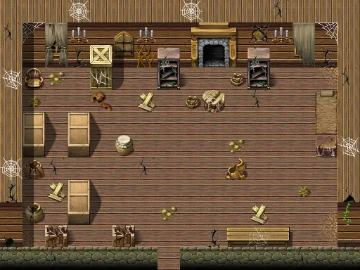

# Brightport abandoned

| | |
|---|---|
| **Map ID** | `brightport_abandoned` |
| **Region** | In Brightport (settlement) |
| **Type** | Indoors / underground |
| **Size** | 16×12 tiles |
| **Introduced** | [v0.8.16.1](../versions/0.8.16.1.md) |
| **NPCs** | 2 |
| **Enemy types** | 2 |
| **Quests** | 3 |

**Brightport abandoned** is an indoor map, in Brightport (settlement). It has 2 NPCs and 2 kinds of enemy. Exits lead to Brightport8.

## Map

<label class="lg"><input type="checkbox" data-t="spawn" checked><b>Red</b>&nbsp;Monsters / NPCs</label><label class="lg"><input type="checkbox" data-t="mapchange" checked><b>Blue</b>&nbsp;Exit to another map</label><label class="lg"><input type="checkbox" data-t="container" checked><b>Yellow</b>&nbsp;Container (click to see contents)</label><label class="lg"><input type="checkbox" data-t="sign" checked><b>Purple</b>&nbsp;Sign</label><label class="lg"><input type="checkbox" data-t="rest" checked><b>Green</b>&nbsp;Resting place</label><label class="lg"><input type="checkbox" data-t="key" checked><b>Orange dashed</b>&nbsp;Blocked until a quest step / item</label><label class="lg"><input type="checkbox" data-t="script"><b>Grey dotted</b>&nbsp;Scripted event</label><label class="lg"><input type="checkbox" data-t="replace"><b>White dotted</b>&nbsp;Changes during a quest</label><label class="lg"><input type="checkbox" data-t="pin" checked><b>Numbers</b>&nbsp;Numbered key points (see the key below the map)</label>

<a class="pin pin-exit" href="#key-1" style="left:46.875%;top:95.833%" title="Exit (south): to [Brightport8](brightport8.md)">1</a><a id="pin-npc-brightport_guardcrate" class="pin pin-npc" href="#key-2" style="left:46.875%;top:79.167%" title="[Brightport guard](../../monsters/brightportguard.md#v-brightport_guardcrate): 1 quest">2</a><a id="pin-npc-brightport_agent" class="pin pin-npc" href="#key-3" style="left:84.375%;top:45.833%" title="[Nor agent](../../monsters/brightport_agent.md): 1 quest">3</a><a class="pin pin-script" href="#key-4" style="left:12.500%;top:58.333%" title="Quest trigger: Scripted event: advances the quest: hidden story flag “brightport_nondisplay” to stage 140 (“sequence check gufnryk”)">4</a><a class="pin pin-script" href="#key-5" style="left:50.000%;top:83.333%" title="Quest trigger: Scripted event: advances the quest: Priceful vengeance to stage 70 (“I ambushed and killed Gunfryk in the house to the east, along with the two guards he brought.”)">5</a><a class="pin pin-script" href="#key-6" style="left:50.000%;top:58.333%" title="Quest trigger: Scripted event: advances the quest: hidden story flag “brightport_nondisplay” to stage 145 (“caught outside”)">6</a><a class="pin pin-key" href="#key-7" style="left:21.875%;top:70.833%" title="Blocked passage: Closed off once you reach this point in the quest: Search for Andor (stage 1: “My father Mikhail says that Andor has not been home since yesterday. I should go look for him in the village.”)">7</a><a class="pin pin-key" href="#key-7" style="left:59.375%;top:20.833%" title="Blocked passage: Closed off once you reach this point in the quest: Search for Andor (stage 1: “My father Mikhail says that Andor has not been home since yesterday. I should go look for him in the village.”)">7</a><a class="pin pin-key" href="#key-7" style="left:21.875%;top:54.167%" title="Blocked passage: Closed off once you reach this point in the quest: Search for Andor (stage 1: “My father Mikhail says that Andor has not been home since yesterday. I should go look for him in the village.”)">7</a><a class="pin pin-key" href="#key-7" style="left:9.375%;top:54.167%" title="Blocked passage: Closed off once you reach this point in the quest: Search for Andor (stage 1: “My father Mikhail says that Andor has not been home since yesterday. I should go look for him in the village.”)">7</a><a class="pin pin-key" href="#key-8" style="left:47.286%;top:89.584%" title="Blocked passage: Closed off once you reach this point in the quest: hidden story flag “brightport_nondisplay” (stage 158: “locked the door for the crate quest”)">8</a>

??? abstract "Key to the numbers on the map"

    | # | What | Details |
    |---|---|---|
    | 1 | Exit (south) | to [Brightport8](brightport8.md) |
    | 2 | [Brightport guard](../monsters/brightportguard.md#v-brightport_guardcrate) | 1 quest |
    | 3 | [Nor agent](../monsters/brightport_agent.md) | 1 quest |
    | 4 | Quest trigger | Scripted event: advances the quest: hidden story flag “brightport_nondisplay” to stage 140 (“sequence check gufnryk”) |
    | 5 | Quest trigger | Scripted event: advances the quest: Priceful vengeance to stage 70 (“I ambushed and killed Gunfryk in the house to the east, along with the two guards he brought.”) |
    | 6 | Quest trigger | Scripted event: advances the quest: hidden story flag “brightport_nondisplay” to stage 145 (“caught outside”) |
    | 7 | Blocked passage | Closed off once you reach this point in the quest: Search for Andor (stage 1: “My father Mikhail says that Andor has not been home since yesterday. I should go look for him in the village.”) |
    | 8 | Blocked passage | Closed off once you reach this point in the quest: hidden story flag “brightport_nondisplay” (stage 158: “locked the door for the crate quest”) |

Verified against v0.8.18 map data.

## Connections

| Direction | Leads to | Region there | Map # |
|---|---|---|---|
| South | [Brightport8](brightport8.md) | Brightport | 1 |

## NPCs

- [Brightport guard](../monsters/brightportguard.md#v-brightport_guardcrate) — quests: [Boxed in](../quests/brightport_thieves.md) (#2)
- [Nor agent](../monsters/brightport_agent.md) — quests: [Boxed in](../quests/brightport_thieves.md) (#3)

## Enemies

| Enemy | HP | Damage | Up to | Notes |
|---|---|---|---|---|
| [Brightport guard](../monsters/brightportguard.md#v-brightport_guardfight) | 120 | 10–25 | 2 | appears later, during a quest |
| [Gunfryk](../monsters/brightportguardcaptain.md) | 300 | 12–30 | 1 | appears later, during a quest |

<small>“Up to” is the most that can be alive at once from the spawn areas on this map.</small>

## Quests

- [Boxed in](../quests/brightport_thieves.md): [Brightport guard](../monsters/brightportguard.md#v-brightport_guardcrate) is involved; [Nor agent](../monsters/brightport_agent.md) is involved
- [Priceful vengeance](../quests/brightport_goons.md): something on this map advances it; stepping on a trigger here sets stage 70
- [Search for Andor](../quests/andor.md): blocked passage closes at stage 1
- [brightport_nondisplay (hidden flag)](../quests/brightport_nondisplay.md): [Brightport guard](../monsters/brightportguard.md#v-brightport_guardcrate) is involved; [Nor agent](../monsters/brightport_agent.md) is involved; a scripted event can trigger here from stage 137; blocked passage closes at stage 158; something on this map advances it; stepping on a trigger here sets stage 138; stepping on a trigger here sets stage 140; stepping on a trigger here sets stage 145

## Points of interest

- **Quest trigger** (#4): Scripted event: advances the quest: hidden story flag “brightport_nondisplay” to stage 140 (“sequence check gufnryk”)
- **Quest trigger** (#5): Scripted event: advances the quest: Priceful vengeance to stage 70 (“I ambushed and killed Gunfryk in the house to the east, along with the two guards he brought.”)
- **Quest trigger** (#6): Scripted event: advances the quest: hidden story flag “brightport_nondisplay” to stage 145 (“caught outside”)
- **Blocked passage** (#7): Closed off once you reach this point in the quest: Search for Andor (stage 1: “My father Mikhail says that Andor has not been home since yesterday. I should go look for him in the village.”)
- **Blocked passage** (#8): Closed off once you reach this point in the quest: hidden story flag “brightport_nondisplay” (stage 158: “locked the door for the crate quest”)

## Version history

| Version | Change |
|---|---|
| [v0.8.16.1](../versions/0.8.16.1.md) | Added |

Verified against v0.8.18 and every earlier release back to v0.7.0 (game data compared release by release).

## Community notes

<small>Written by players, not generated from game data. **Observations**: what players notice in-game · **Lore**: the in-world story · **Trivia**: real-world facts, references, development history · **Theory / speculation**: unconfirmed ideas; may just be unfinished content</small>

### Observations

*No notes yet. Contributions are welcome: [add a note](https://github.com/asdfghjkl628/Andor-s-Trail-Wikiiii/new/main/notes/maps?filename=brightport_abandoned.md&value=%23%23%20Observations%0A%0A%3C%21--%20what%20players%20notice%20in-game%20--%3E%0A%0A%23%23%20Lore%0A%0A%3C%21--%20the%20in-world%20story%20--%3E%0A%0A%23%23%20Trivia%0A%0A%3C%21--%20real-world%20facts%2C%20references%2C%20development%20history%20--%3E%0A%0A%23%23%20Theory%20/%20speculation%0A%0A%3C%21--%20unconfirmed%20ideas%3B%20may%20just%20be%20unfinished%20content%20--%3E%0A).*

### Lore

*No notes yet. Contributions are welcome: [add a note](https://github.com/asdfghjkl628/Andor-s-Trail-Wikiiii/new/main/notes/maps?filename=brightport_abandoned.md&value=%23%23%20Observations%0A%0A%3C%21--%20what%20players%20notice%20in-game%20--%3E%0A%0A%23%23%20Lore%0A%0A%3C%21--%20the%20in-world%20story%20--%3E%0A%0A%23%23%20Trivia%0A%0A%3C%21--%20real-world%20facts%2C%20references%2C%20development%20history%20--%3E%0A%0A%23%23%20Theory%20/%20speculation%0A%0A%3C%21--%20unconfirmed%20ideas%3B%20may%20just%20be%20unfinished%20content%20--%3E%0A).*

### Trivia

*No notes yet. Contributions are welcome: [add a note](https://github.com/asdfghjkl628/Andor-s-Trail-Wikiiii/new/main/notes/maps?filename=brightport_abandoned.md&value=%23%23%20Observations%0A%0A%3C%21--%20what%20players%20notice%20in-game%20--%3E%0A%0A%23%23%20Lore%0A%0A%3C%21--%20the%20in-world%20story%20--%3E%0A%0A%23%23%20Trivia%0A%0A%3C%21--%20real-world%20facts%2C%20references%2C%20development%20history%20--%3E%0A%0A%23%23%20Theory%20/%20speculation%0A%0A%3C%21--%20unconfirmed%20ideas%3B%20may%20just%20be%20unfinished%20content%20--%3E%0A).*

### Theory / speculation

*No notes yet. Contributions are welcome: [add a note](https://github.com/asdfghjkl628/Andor-s-Trail-Wikiiii/new/main/notes/maps?filename=brightport_abandoned.md&value=%23%23%20Observations%0A%0A%3C%21--%20what%20players%20notice%20in-game%20--%3E%0A%0A%23%23%20Lore%0A%0A%3C%21--%20the%20in-world%20story%20--%3E%0A%0A%23%23%20Trivia%0A%0A%3C%21--%20real-world%20facts%2C%20references%2C%20development%20history%20--%3E%0A%0A%23%23%20Theory%20/%20speculation%0A%0A%3C%21--%20unconfirmed%20ideas%3B%20may%20just%20be%20unfinished%20content%20--%3E%0A).*

??? info "Technical information"

    | | |
    |---|---|
    | Map ID | `brightport_abandoned` |
    | File | `res/xml/brightport_abandoned.tmx` |
    | Size | 16×12 tiles (512×384 px) |
    | outdoors property | – |
    | Layers drawn | ground, objects, above, top |
    | Tilesets | map_bed_1, map_border_1, map_bridge_1, map_bridge_2, map_brightport, map_broken_1, map_cavewall_1, map_cavewall_2, map_cavewall_3, map_cavewall_4, map_chair_table_1, map_chair_table_2, map_crate_1, map_cupboard_1, map_curtain_1, map_entrance_1, map_entrance_2, map_fence_1, map_fence_2, map_fence_3, map_fence_4, map_ground_1, map_ground_2, map_ground_3, map_ground_4, map_ground_5, map_ground_6, map_ground_7, map_ground_8, map_house_1, map_house_2, map_indoor_1, map_indoor_2, map_kitchen_1, map_outdoor_1, map_pillar_1, map_pillar_2, map_plant_1, map_plant_2, map_rock_1, map_rock_2, map_roof_1, map_roof_2, map_roof_3, map_shop_1, map_sign_ladder_1, map_table_1, map_trail_1, map_transition_1, map_transition_2, map_transition_3, map_transition_4, map_transition_5, map_tree_1, map_tree_2, map_wall_1, map_wall_2, map_wall_3, map_wall_4, map_window_1, map_window_2 |
    | Map objects | key: 5, script: 4, spawn: 4, mapchange: 3 |
    | World map position | – |

<small>Data from v0.8.18</small>
