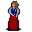
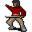
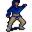

# Brightport bakery

25×12 tiles

<label class="lg"><input type="checkbox" data-t="spawn" checked><b>Red</b>&nbsp;Monsters / NPCs</label><label class="lg"><input type="checkbox" data-t="mapchange" checked><b>Blue</b>&nbsp;Exit to another map</label><label class="lg"><input type="checkbox" data-t="container" checked><b>Yellow</b>&nbsp;Container (click to see contents)</label><label class="lg"><input type="checkbox" data-t="sign" checked><b>Purple</b>&nbsp;Sign</label><label class="lg"><input type="checkbox" data-t="rest" checked><b>Green</b>&nbsp;Resting place</label><label class="lg"><input type="checkbox" data-t="key" checked><b>Orange dashed</b>&nbsp;Blocked until a quest step / item</label><label class="lg"><input type="checkbox" data-t="script"><b>Grey dotted</b>&nbsp;Scripted event</label><label class="lg"><input type="checkbox" data-t="replace"><b>White dotted</b>&nbsp;Changes during a quest</label>

## Exits

- [Brightport5](brightport5.md)
- [Brightport bakery1](brightport_bakery1.md)
- [Brightport bakery2](brightport_bakery2.md)

## Monsters & NPCs here

| Name | HP |
|---|---|
| [Hortensia](../monsters/brightportbakery.md) | 0 |
| [Burhczyd](../monsters/burhczyd14.md) | 0 |
| [Garvhel](../monsters/brightport_newcommander.md) | 0 |
| [Effa](../monsters/brightportbakery2.md) | 0 |
| [Jannus](../monsters/brightportbakery1.md) | 0 |
| [Knight of Elythom](../monsters/burhczyd14e.md) | 0 |
| [Gunfryk](../monsters/brightport_gunfrykstill.md) | 0 |
| [Gunther](../monsters/brightportbakery3.md) | 0 |
| [Digiani](../monsters/brightportbakeryvisitor.md) | 0 |

<small>Map ID: `brightport_bakery` · Data from v0.8.18</small>
