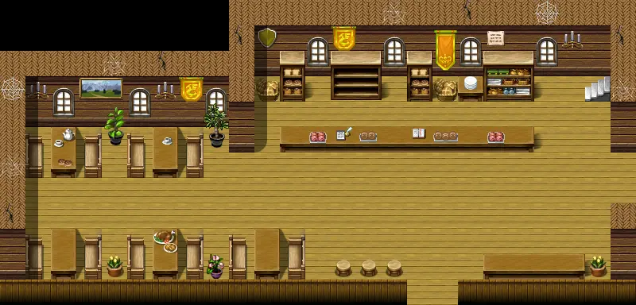

# Brightport bakery

25×12 tiles

<label class="lg lg-spawn"><input type="checkbox" data-t="spawn" checked> Monsters / NPCs</label><label class="lg lg-mapchange"><input type="checkbox" data-t="mapchange" checked> Exit to another map</label><label class="lg lg-container"><input type="checkbox" data-t="container" checked> Container</label><label class="lg lg-sign"><input type="checkbox" data-t="sign" checked> Sign</label><label class="lg lg-rest"><input type="checkbox" data-t="rest" checked> Resting place</label><label class="lg lg-key"><input type="checkbox" data-t="key" checked> Blocked / needs key or quest</label><label class="lg lg-script"><input type="checkbox" data-t="script"> Scripted event</label><label class="lg lg-replace"><input type="checkbox" data-t="replace"> Changes after a quest</label>

## Exits

- [Brightport5](brightport5.md)
- [Brightport bakery1](brightport_bakery1.md)
- [Brightport bakery2](brightport_bakery2.md)

## Monsters & NPCs here

| Name | HP |
|---|---|
| [Jannus](../monsters/brightportbakery1.md) | 0 |
| [Effa](../monsters/brightportbakery2.md) | 0 |
| [Gunther](../monsters/brightportbakery3.md) | 0 |
| [Digiani](../monsters/brightportbakeryvisitor.md) | 0 |
| [Knight of Elythom](../monsters/burhczyd14e.md) | 0 |
| [Burhczyd](../monsters/burhczyd14.md) | 0 |
| [Hortensia](../monsters/brightportbakery.md) | 0 |
| [Gunfryk](../monsters/brightport_gunfrykstill.md) | 0 |
| [Garvhel](../monsters/brightport_newcommander.md) | 0 |

<small>Map ID: `brightport_bakery` · Data from v0.8.18</small>
