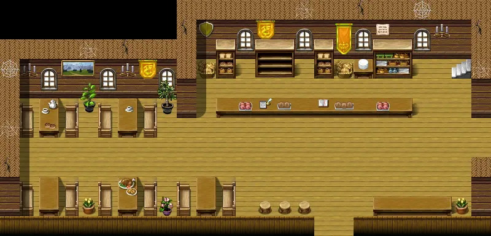

# Brightport bakery

| | |
|---|---|
| **Map ID** | `brightport_bakery` |
| **Region** | In Brightport (settlement) |
| **Type** | Indoors / underground |
| **Size** | 25×12 tiles |
| **Introduced** | [v0.8.16.1](../versions/0.8.16.1.md) |
| **NPCs** | 9 |
| **Quests** | 4 |

**Brightport bakery** is an indoor map, in Brightport (settlement). It has 9 NPCs, and no enemies. Exits lead to Brightport bakery 1, Brightport bakery 2, Brightport 5.

## Map

<label class="lg"><input type="checkbox" data-t="spawn" checked><b>Red</b>&nbsp;Monsters / NPCs</label><label class="lg"><input type="checkbox" data-t="mapchange" checked><b>Blue</b>&nbsp;Exit to another map</label><label class="lg"><input type="checkbox" data-t="container" checked><b>Yellow</b>&nbsp;Container (click to see contents)</label><label class="lg"><input type="checkbox" data-t="sign" checked><b>Purple</b>&nbsp;Sign</label><label class="lg"><input type="checkbox" data-t="rest" checked><b>Green</b>&nbsp;Resting place</label><label class="lg"><input type="checkbox" data-t="key" checked><b>Orange dashed</b>&nbsp;Blocked until a quest step / item</label><label class="lg"><input type="checkbox" data-t="script"><b>Grey dotted</b>&nbsp;Scripted event</label><label class="lg"><input type="checkbox" data-t="replace"><b>White dotted</b>&nbsp;Changes during a quest</label><label class="lg"><input type="checkbox" data-t="pin" checked><b>Numbers</b>&nbsp;Numbered key points (see the key below the map)</label>

<a class="pin pin-exit" href="#key-1" style="left:98.000%;top:58.333%" title="Exit (east): to [Brightport bakery 1](brightport_bakery1.md)">1</a><a class="pin pin-exit" href="#key-2" style="left:94.000%;top:29.167%" title="Exit (east): to [Brightport bakery 2](brightport_bakery2.md)">2</a><a class="pin pin-exit" href="#key-3" style="left:68.000%;top:95.833%" title="Exit (south): to [Brightport 5](brightport5.md)">3</a><a id="pin-npc-burhczyd14" class="pin pin-npc" href="#key-4" style="left:6.000%;top:79.167%" title="[Burhczyd](../../monsters/burhczyd1.md#v-burhczyd14): 1 quest">4</a><a id="pin-npc-brightportbakeryvisitor" class="pin pin-npc" href="#key-5" style="left:22.000%;top:79.167%" title="[Digiani](../../monsters/brightportbakeryvisitor.md): NPC">5</a><a id="pin-npc-brightportbakery2" class="pin pin-npc" href="#key-6" style="left:74.000%;top:37.500%" title="[Effa](../../monsters/brightportbakery2.md): shopkeeper">6</a><a id="pin-npc-brightport_newcommander" class="pin pin-npc" href="#key-7" style="left:90.000%;top:70.833%" title="[Garvhel](../../monsters/brightport_newcommander.md): NPC">7</a><a id="pin-npc-brightport_gunfrykstill" class="pin pin-npc" href="#key-8" style="left:82.000%;top:79.167%" title="[Gunfryk](../../monsters/brightportguardcaptain.md#v-brightport_gunfrykstill): 2 quests">8</a><a id="pin-npc-brightportbakery3" class="pin pin-npc" href="#key-9" style="left:54.000%;top:37.500%" title="[Gunther](../../monsters/brightportbakery3.md): shopkeeper">9</a><a id="pin-npc-brightportbakery" class="pin pin-npc" href="#key-10" style="left:22.000%;top:54.167%" title="[Hortensia](../../monsters/brightportbakery.md): NPC">10</a><a id="pin-npc-brightportbakery1" class="pin pin-npc" href="#key-11" style="left:6.000%;top:45.833%" title="[Jannus](../../monsters/brightportbakery1.md): NPC">11</a><a id="pin-npc-burhczyd14e" class="pin pin-npc" href="#key-12" style="left:6.263%;top:72.917%" title="[Knight of Elythom](../../monsters/burhczyd1e.md#v-burhczyd14e): 1 quest">12</a><a class="pin pin-script" href="#key-13" style="left:82.000%;top:37.500%" title="Quest trigger: Scripted event: advances the quest: hidden story flag “brightport_nondisplay” to stage 246 (“behind counter”)">13</a><a class="pin pin-script" href="#key-13" style="left:46.000%;top:37.500%" title="Quest trigger: Scripted event: advances the quest: hidden story flag “brightport_nondisplay” to stage 246 (“behind counter”)">13</a><a class="pin pin-key" href="#key-14" style="left:54.000%;top:45.833%" title="Blocked passage: Closed off once you reach this point in the quest: Search for Andor (stage 1: “My father Mikhail says that Andor has not been home since yesterday. I should go look for him in the village.”)">14</a><a class="pin pin-key" href="#key-14" style="left:72.000%;top:45.833%" title="Blocked passage: Closed off once you reach this point in the quest: Search for Andor (stage 1: “My father Mikhail says that Andor has not been home since yesterday. I should go look for him in the village.”)">14</a><a class="pin pin-replace" href="#key-15" style="left:10.000%;top:79.167%" title="Changes during a quest: This area changes during the quest: hidden story flag “quest_burhczyd_nd” (stage 514: “514=show oven in Brightport bakery”)">15</a>

??? abstract "Key to the numbers on the map"

    | # | What | Details |
    |---|---|---|
    | 1 | Exit (east) | to [Brightport bakery 1](brightport_bakery1.md) |
    | 2 | Exit (east) | to [Brightport bakery 2](brightport_bakery2.md) |
    | 3 | Exit (south) | to [Brightport 5](brightport5.md) |
    | 4 | [Burhczyd](../monsters/burhczyd1.md#v-burhczyd14) | 1 quest |
    | 5 | [Digiani](../monsters/brightportbakeryvisitor.md) | NPC |
    | 6 | [Effa](../monsters/brightportbakery2.md) | shopkeeper |
    | 7 | [Garvhel](../monsters/brightport_newcommander.md) | NPC |
    | 8 | [Gunfryk](../monsters/brightportguardcaptain.md#v-brightport_gunfrykstill) | 2 quests |
    | 9 | [Gunther](../monsters/brightportbakery3.md) | shopkeeper |
    | 10 | [Hortensia](../monsters/brightportbakery.md) | NPC |
    | 11 | [Jannus](../monsters/brightportbakery1.md) | NPC |
    | 12 | [Knight of Elythom](../monsters/burhczyd1e.md#v-burhczyd14e) | 1 quest |
    | 13 | Quest trigger | Scripted event: advances the quest: hidden story flag “brightport_nondisplay” to stage 246 (“behind counter”) |
    | 14 | Blocked passage | Closed off once you reach this point in the quest: Search for Andor (stage 1: “My father Mikhail says that Andor has not been home since yesterday. I should go look for him in the village.”) |
    | 15 | Changes during a quest | This area changes during the quest: hidden story flag “quest_burhczyd_nd” (stage 514: “514=show oven in Brightport bakery”) |

Verified against v0.8.18 map data.

## Connections

| Direction | Leads to | Region there | Map # |
|---|---|---|---|
| East | [Brightport bakery 1](brightport_bakery1.md) | Brightport | 1 |
| East | [Brightport bakery 2](brightport_bakery2.md) | Brightport | 2 |
| South | [Brightport 5](brightport5.md) | Brightport | 3 |

## NPCs

- [Burhczyd](../monsters/burhczyd1.md#v-burhczyd14) — quests: [Young merchant](../quests/quest_burhczyd.md) (#4)
- [Digiani](../monsters/brightportbakeryvisitor.md) (#5)
- [Effa](../monsters/brightportbakery2.md) — shopkeeper (#6)
- [Garvhel](../monsters/brightport_newcommander.md) (#7)
- [Gunfryk](../monsters/brightportguardcaptain.md#v-brightport_gunfrykstill) — quests: [Boxed in](../quests/brightport_thieves.md), [Priceful vengeance](../quests/brightport_goons.md) (#8)
- [Gunther](../monsters/brightportbakery3.md) — shopkeeper (#9)
- [Hortensia](../monsters/brightportbakery.md) (#10)
- [Jannus](../monsters/brightportbakery1.md) (#11)
- [Knight of Elythom](../monsters/burhczyd1e.md#v-burhczyd14e) — quests: [Young merchant](../quests/quest_burhczyd.md) (#12)

## Items & containers

**Shops:** [Effa](../monsters/brightportbakery2.md), [Gunther](../monsters/brightportbakery3.md)

## Quests

- [Boxed in](../quests/brightport_thieves.md): [Gunfryk](../monsters/brightportguardcaptain.md#v-brightport_gunfrykstill) is involved
- [Priceful vengeance](../quests/brightport_goons.md): [Gunfryk](../monsters/brightportguardcaptain.md#v-brightport_gunfrykstill) is involved
- [Search for Andor](../quests/andor.md): blocked passage closes at stage 1
- [Young merchant](../quests/quest_burhczyd.md): [Burhczyd](../monsters/burhczyd1.md#v-burhczyd14) is involved; [Knight of Elythom](../monsters/burhczyd1e.md#v-burhczyd14e) is involved
- [Brightport story flags (hidden flag)](../quests/brightport_nondisplay.md): [Garvhel](../monsters/brightport_newcommander.md) is involved; [Gunfryk](../monsters/brightportguardcaptain.md#v-brightport_gunfrykstill) is involved; [Hortensia](../monsters/brightportbakery.md) is involved; a scripted event can trigger here from stage 246; something on this map advances it; stepping on a trigger here sets stage 246
- [Young merchant story flags (hidden flag)](../quests/quest_burhczyd_nd.md): [Burhczyd](../monsters/burhczyd1.md#v-burhczyd14) is involved; [Knight of Elythom](../monsters/burhczyd1e.md#v-burhczyd14e) is involved; part of the map changes at stage 514

## Points of interest

- **Quest trigger** (#13): Scripted event: advances the quest: hidden story flag “brightport_nondisplay” to stage 246 (“behind counter”)
- **Blocked passage** (#14): Closed off once you reach this point in the quest: Search for Andor (stage 1: “My father Mikhail says that Andor has not been home since yesterday. I should go look for him in the village.”)
- **Changes during a quest** (#15): This area changes during the quest: hidden story flag “quest_burhczyd_nd” (stage 514: “514=show oven in Brightport bakery”)

## Version history

| Version | Change |
|---|---|
| [v0.8.16.1](../versions/0.8.16.1.md) | Added |

Verified against v0.8.18 and every earlier release back to v0.7.0 (game data compared release by release).

## Community notes

<small>Written by players, not generated from game data. **Observations**: what players notice in-game · **Lore**: the in-world story · **Trivia**: real-world facts, references, development history · **Theory / speculation**: unconfirmed ideas; may just be unfinished content</small>

### Observations

*No notes yet. Contributions are welcome: [add a note](https://github.com/asdfghjkl628/Andor-s-Trail-Wikiiii/new/main/notes/maps?filename=brightport_bakery.md&value=%23%23%20Observations%0A%0A%3C%21--%20what%20players%20notice%20in-game%20--%3E%0A%0A%23%23%20Lore%0A%0A%3C%21--%20the%20in-world%20story%20--%3E%0A%0A%23%23%20Trivia%0A%0A%3C%21--%20real-world%20facts%2C%20references%2C%20development%20history%20--%3E%0A%0A%23%23%20Theory%20/%20speculation%0A%0A%3C%21--%20unconfirmed%20ideas%3B%20may%20just%20be%20unfinished%20content%20--%3E%0A).*

### Lore

*No notes yet. Contributions are welcome: [add a note](https://github.com/asdfghjkl628/Andor-s-Trail-Wikiiii/new/main/notes/maps?filename=brightport_bakery.md&value=%23%23%20Observations%0A%0A%3C%21--%20what%20players%20notice%20in-game%20--%3E%0A%0A%23%23%20Lore%0A%0A%3C%21--%20the%20in-world%20story%20--%3E%0A%0A%23%23%20Trivia%0A%0A%3C%21--%20real-world%20facts%2C%20references%2C%20development%20history%20--%3E%0A%0A%23%23%20Theory%20/%20speculation%0A%0A%3C%21--%20unconfirmed%20ideas%3B%20may%20just%20be%20unfinished%20content%20--%3E%0A).*

### Trivia

*No notes yet. Contributions are welcome: [add a note](https://github.com/asdfghjkl628/Andor-s-Trail-Wikiiii/new/main/notes/maps?filename=brightport_bakery.md&value=%23%23%20Observations%0A%0A%3C%21--%20what%20players%20notice%20in-game%20--%3E%0A%0A%23%23%20Lore%0A%0A%3C%21--%20the%20in-world%20story%20--%3E%0A%0A%23%23%20Trivia%0A%0A%3C%21--%20real-world%20facts%2C%20references%2C%20development%20history%20--%3E%0A%0A%23%23%20Theory%20/%20speculation%0A%0A%3C%21--%20unconfirmed%20ideas%3B%20may%20just%20be%20unfinished%20content%20--%3E%0A).*

### Theory / speculation

*No notes yet. Contributions are welcome: [add a note](https://github.com/asdfghjkl628/Andor-s-Trail-Wikiiii/new/main/notes/maps?filename=brightport_bakery.md&value=%23%23%20Observations%0A%0A%3C%21--%20what%20players%20notice%20in-game%20--%3E%0A%0A%23%23%20Lore%0A%0A%3C%21--%20the%20in-world%20story%20--%3E%0A%0A%23%23%20Trivia%0A%0A%3C%21--%20real-world%20facts%2C%20references%2C%20development%20history%20--%3E%0A%0A%23%23%20Theory%20/%20speculation%0A%0A%3C%21--%20unconfirmed%20ideas%3B%20may%20just%20be%20unfinished%20content%20--%3E%0A).*

??? info "Technical information"

    | | |
    |---|---|
    | Map ID | `brightport_bakery` |
    | File | `res/xml/brightport_bakery.tmx` |
    | Size | 25×12 tiles (800×384 px) |
    | outdoors property | – |
    | Layers drawn | base, ground, objects, above, top |
    | Tilesets | map_bed_1, map_border_1, map_bridge_1, map_bridge_2, map_brightport, map_broken_1, map_cavewall_1, map_cavewall_2, map_cavewall_3, map_cavewall_4, map_chair_table_1, map_chair_table_2, map_crate_1, map_cupboard_1, map_curtain_1, map_entrance_1, map_entrance_2, map_fence_1, map_fence_2, map_fence_3, map_fence_4, map_ground_1, map_ground_2, map_ground_3, map_ground_4, map_ground_5, map_ground_6, map_ground_7, map_ground_8, map_house_1, map_house_2, map_indoor_1, map_indoor_2, map_kitchen_1, map_outdoor_1, map_painting_1, map_pillar_1, map_pillar_2, map_plant_1, map_plant_2, map_rock_1, map_rock_2, map_roof_1, map_roof_2, map_roof_3, map_shop_1, map_sign_ladder_1, map_table_1, map_trail_1, map_transition_1, map_transition_2, map_transition_3, map_transition_4, map_transition_5, map_tree_1, map_tree_2, map_wall_1, map_wall_2, map_wall_3, map_wall_4, map_window_1, map_window_2 |
    | Map objects | spawn: 9, script: 4, mapchange: 3, key: 2, replace: 1 |
    | World map position | – |

<small>Data from v0.8.18</small>
