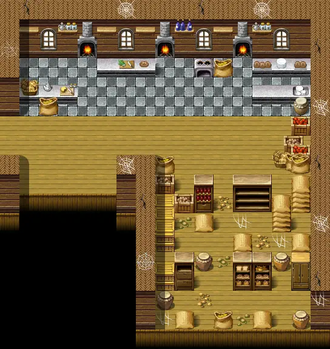

# Brightport bakery1

| | |
|---|---|
| **Map ID** | `brightport_bakery1` |
| **Region** | In Brightport (settlement) |
| **Type** | Indoors / underground |
| **Size** | 17×18 tiles |
| **Introduced** | [v0.8.16.1](../versions/0.8.16.1.md) |
| **NPCs** | 4 |
| **Quests** | 2 |

**Brightport bakery1** is an indoor map, in Brightport (settlement). It has 4 NPCs, and no enemies. Exits lead to Brightport bakery.

## Map

<label class="lg"><input type="checkbox" data-t="spawn" checked><b>Red</b>&nbsp;Monsters / NPCs</label><label class="lg"><input type="checkbox" data-t="mapchange" checked><b>Blue</b>&nbsp;Exit to another map</label><label class="lg"><input type="checkbox" data-t="container" checked><b>Yellow</b>&nbsp;Container (click to see contents)</label><label class="lg"><input type="checkbox" data-t="sign" checked><b>Purple</b>&nbsp;Sign</label><label class="lg"><input type="checkbox" data-t="rest" checked><b>Green</b>&nbsp;Resting place</label><label class="lg"><input type="checkbox" data-t="key" checked><b>Orange dashed</b>&nbsp;Blocked until a quest step / item</label><label class="lg"><input type="checkbox" data-t="script"><b>Grey dotted</b>&nbsp;Scripted event</label><label class="lg"><input type="checkbox" data-t="replace"><b>White dotted</b>&nbsp;Changes during a quest</label><label class="lg"><input type="checkbox" data-t="pin" checked><b>Numbers</b>&nbsp;Numbered key points (see the key below the map)</label>

<a class="pin pin-exit" href="#key-1" style="left:2.941%;top:38.889%" title="Exit (west): to [Brightport bakery](../brightport_bakery.md)">1</a><a class="pin pin-npc" href="#key-2" style="left:73.529%;top:41.667%" title="[Allares](../../monsters/brightportstoragenpc.md): 1 quest">2</a><a class="pin pin-npc" href="#key-3" style="left:73.529%;top:25.000%" title="[Androni](../../monsters/brightport_chef.md): NPC">3</a><a class="pin pin-npc" href="#key-4" style="left:38.235%;top:25.000%" title="[Crescenzio](../../monsters/brightport_chef2.md): NPC">4</a><a class="pin pin-npc" href="#key-5" style="left:79.412%;top:86.111%" title="[Delon](../../monsters/brightportnpc10.md): 1 quest">5</a><a class="pin pin-script" href="#key-6" style="left:67.647%;top:58.333%" title="Quest trigger: Scripted event: advances the quest: hidden story flag “brightport_nondisplay” to stage 167 (“sweep 1”) (+1 more quest(s))">6</a><a class="pin pin-script" href="#key-7" style="left:79.412%;top:69.444%" title="Quest trigger: Scripted event: advances the quest: hidden story flag “brightport_nondisplay” to stage 166 (“sweep 2”) (+1 more quest(s))">7</a><a class="pin pin-script" href="#key-8" style="left:61.765%;top:86.111%" title="Quest trigger: Scripted event: advances the quest: hidden story flag “brightport_nondisplay” to stage 165 (“sweep 3”) (+1 more quest(s))">8</a><a class="pin pin-key" href="#key-9" style="left:67.647%;top:91.667%" title="Blocked passage: Closed off once you reach this point in the quest: Search for Andor (stage 1: “My father Mikhail says that Andor has not been home since yesterday. I should go look for him in the village.”)">9</a><a class="pin pin-replace" href="#key-10" style="left:64.706%;top:61.111%" title="Changes during a quest: This area changes during the quest: hidden story flag “brightport_nondisplay” (stage 164: “dirt removed 1”)">10</a><a class="pin pin-replace" href="#key-11" style="left:76.471%;top:72.222%" title="Changes during a quest: This area changes during the quest: hidden story flag “brightport_nondisplay” (stage 163: “dirt removed 2”)">11</a><a class="pin pin-replace" href="#key-12" style="left:58.932%;top:91.340%" title="Changes during a quest: This area changes during the quest: hidden story flag “brightport_nondisplay” (stage 162: “dirt removed 3”)">12</a>

??? abstract "Key to the numbers on the map"

    | # | What | Details |
    |---|---|---|
    | 1 | Exit (west) | to [Brightport bakery](../brightport_bakery.md) |
    | 2 | [Allares](../monsters/brightportstoragenpc.md) | 1 quest |
    | 3 | [Androni](../monsters/brightport_chef.md) | NPC |
    | 4 | [Crescenzio](../monsters/brightport_chef2.md) | NPC |
    | 5 | [Delon](../monsters/brightportnpc10.md) | 1 quest |
    | 6 | Quest trigger | Scripted event: advances the quest: hidden story flag “brightport_nondisplay” to stage 167 (“sweep 1”) (+1 more quest(s)) |
    | 7 | Quest trigger | Scripted event: advances the quest: hidden story flag “brightport_nondisplay” to stage 166 (“sweep 2”) (+1 more quest(s)) |
    | 8 | Quest trigger | Scripted event: advances the quest: hidden story flag “brightport_nondisplay” to stage 165 (“sweep 3”) (+1 more quest(s)) |
    | 9 | Blocked passage | Closed off once you reach this point in the quest: Search for Andor (stage 1: “My father Mikhail says that Andor has not been home since yesterday. I should go look for him in the village.”) |
    | 10 | Changes during a quest | This area changes during the quest: hidden story flag “brightport_nondisplay” (stage 164: “dirt removed 1”) |
    | 11 | Changes during a quest | This area changes during the quest: hidden story flag “brightport_nondisplay” (stage 163: “dirt removed 2”) |
    | 12 | Changes during a quest | This area changes during the quest: hidden story flag “brightport_nondisplay” (stage 162: “dirt removed 3”) |

Verified against v0.8.18 map data.

## Connections

| Direction | Leads to | Region there | Map # |
|---|---|---|---|
| West | [Brightport bakery](brightport_bakery.md) | Brightport | 1 |

## NPCs

- [Allares](../monsters/brightportstoragenpc.md) — quests: [Bread and circus](../quests/brightport_bakery.md) (#2)
- [Androni](../monsters/brightport_chef.md) (#3)
- [Crescenzio](../monsters/brightport_chef2.md) (#4)
- [Delon](../monsters/brightportnpc10.md) — quests: [Bread and circus](../quests/brightport_bakery.md) (#5)

## Quests

- [Bread and circus](../quests/brightport_bakery.md): [Allares](../monsters/brightportstoragenpc.md) is involved; [Delon](../monsters/brightportnpc10.md) is involved; something on this map advances it; stepping on a trigger here sets stage 15
- [Search for Andor](../quests/andor.md): blocked passage closes at stage 1
- [brightport_nondisplay (hidden flag)](../quests/brightport_nondisplay.md): [Androni](../monsters/brightport_chef.md) is involved; [Crescenzio](../monsters/brightport_chef2.md) is involved; part of the map changes at stage 162; part of the map changes at stage 163; part of the map changes at stage 164; something on this map advances it; stepping on a trigger here sets stage 162; stepping on a trigger here sets stage 163; stepping on a trigger here sets stage 164; stepping on a trigger here sets stage 165; stepping on a trigger here sets stage 166; stepping on a trigger here sets stage 167; stepping on a trigger here sets stage 190; stepping on a trigger here sets stage 191; stepping on a trigger here sets stage 192; stepping on a trigger here sets stage 193; stepping on a trigger here sets stage 194; stepping on a trigger here sets stage 195; stepping on a trigger here sets stage 207; stepping on a trigger here sets stage 243

## Points of interest

- **Quest trigger** (#6): Scripted event: advances the quest: hidden story flag “brightport_nondisplay” to stage 167 (“sweep 1”) (+1 more quest(s))
- **Quest trigger** (#7): Scripted event: advances the quest: hidden story flag “brightport_nondisplay” to stage 166 (“sweep 2”) (+1 more quest(s))
- **Quest trigger** (#8): Scripted event: advances the quest: hidden story flag “brightport_nondisplay” to stage 165 (“sweep 3”) (+1 more quest(s))
- **Blocked passage** (#9): Closed off once you reach this point in the quest: Search for Andor (stage 1: “My father Mikhail says that Andor has not been home since yesterday. I should go look for him in the village.”)
- **Changes during a quest** (#10): This area changes during the quest: hidden story flag “brightport_nondisplay” (stage 164: “dirt removed 1”)
- **Changes during a quest** (#11): This area changes during the quest: hidden story flag “brightport_nondisplay” (stage 163: “dirt removed 2”)
- **Changes during a quest** (#12): This area changes during the quest: hidden story flag “brightport_nondisplay” (stage 162: “dirt removed 3”)

## Version history

| Version | Change |
|---|---|
| [v0.8.16.1](../versions/0.8.16.1.md) | Added |

Verified against v0.8.18 and every earlier release back to v0.7.0 (game data compared release by release).

## Community notes

<small>Written by players, not generated from game data. **Observations**: what players notice in-game · **Lore**: the in-world story · **Trivia**: real-world facts, references, development history · **Theory / speculation**: unconfirmed ideas; may just be unfinished content</small>

### Observations

*Nothing here yet. Know something? [Add it](https://github.com/asdfghjkl628/Andor-s-Trail-Wikiiii/new/main/notes/maps?filename=brightport_bakery1.md&value=%23%23%20Observations%0A%0A%3C%21--%20what%20players%20notice%20in-game%20--%3E%0A%0A%23%23%20Lore%0A%0A%3C%21--%20the%20in-world%20story%20--%3E%0A%0A%23%23%20Trivia%0A%0A%3C%21--%20real-world%20facts%2C%20references%2C%20development%20history%20--%3E%0A%0A%23%23%20Theory%20/%20speculation%0A%0A%3C%21--%20unconfirmed%20ideas%3B%20may%20just%20be%20unfinished%20content%20--%3E%0A).*

### Lore

*Nothing here yet. Know something? [Add it](https://github.com/asdfghjkl628/Andor-s-Trail-Wikiiii/new/main/notes/maps?filename=brightport_bakery1.md&value=%23%23%20Observations%0A%0A%3C%21--%20what%20players%20notice%20in-game%20--%3E%0A%0A%23%23%20Lore%0A%0A%3C%21--%20the%20in-world%20story%20--%3E%0A%0A%23%23%20Trivia%0A%0A%3C%21--%20real-world%20facts%2C%20references%2C%20development%20history%20--%3E%0A%0A%23%23%20Theory%20/%20speculation%0A%0A%3C%21--%20unconfirmed%20ideas%3B%20may%20just%20be%20unfinished%20content%20--%3E%0A).*

### Trivia

*Nothing here yet. Know something? [Add it](https://github.com/asdfghjkl628/Andor-s-Trail-Wikiiii/new/main/notes/maps?filename=brightport_bakery1.md&value=%23%23%20Observations%0A%0A%3C%21--%20what%20players%20notice%20in-game%20--%3E%0A%0A%23%23%20Lore%0A%0A%3C%21--%20the%20in-world%20story%20--%3E%0A%0A%23%23%20Trivia%0A%0A%3C%21--%20real-world%20facts%2C%20references%2C%20development%20history%20--%3E%0A%0A%23%23%20Theory%20/%20speculation%0A%0A%3C%21--%20unconfirmed%20ideas%3B%20may%20just%20be%20unfinished%20content%20--%3E%0A).*

### Theory / speculation

*Nothing here yet. Know something? [Add it](https://github.com/asdfghjkl628/Andor-s-Trail-Wikiiii/new/main/notes/maps?filename=brightport_bakery1.md&value=%23%23%20Observations%0A%0A%3C%21--%20what%20players%20notice%20in-game%20--%3E%0A%0A%23%23%20Lore%0A%0A%3C%21--%20the%20in-world%20story%20--%3E%0A%0A%23%23%20Trivia%0A%0A%3C%21--%20real-world%20facts%2C%20references%2C%20development%20history%20--%3E%0A%0A%23%23%20Theory%20/%20speculation%0A%0A%3C%21--%20unconfirmed%20ideas%3B%20may%20just%20be%20unfinished%20content%20--%3E%0A).*

??? info "Technical information"

    | | |
    |---|---|
    | Map ID | `brightport_bakery1` |
    | File | `res/xml/brightport_bakery1.tmx` |
    | Size | 17×18 tiles (544×576 px) |
    | outdoors property | – |
    | Layers drawn | base, ground, objects, above, top |
    | Tilesets | map_bed_1, map_border_1, map_bridge_1, map_bridge_2, map_brightport, map_broken_1, map_cavewall_1, map_cavewall_2, map_cavewall_3, map_cavewall_4, map_chair_table_1, map_chair_table_2, map_crate_1, map_cupboard_1, map_curtain_1, map_entrance_1, map_entrance_2, map_fence_1, map_fence_2, map_fence_3, map_fence_4, map_ground_1, map_ground_2, map_ground_3, map_ground_4, map_ground_5, map_ground_6, map_ground_7, map_ground_8, map_house_1, map_house_2, map_indoor_1, map_indoor_2, map_kitchen_1, map_outdoor_1, map_pillar_1, map_pillar_2, map_plant_1, map_plant_2, map_rock_1, map_rock_2, map_roof_1, map_roof_2, map_roof_3, map_shop_1, map_sign_ladder_1, map_table_1, map_trail_1, map_transition_1, map_transition_2, map_transition_3, map_transition_4, map_transition_5, map_tree_1, map_tree_2, map_wall_1, map_wall_2, map_wall_3, map_wall_4, map_window_1, map_window_2 |
    | Map objects | spawn: 4, script: 3, replace: 3, mapchange: 1, key: 1 |
    | World map position | – |

<small>Data from v0.8.18</small>
