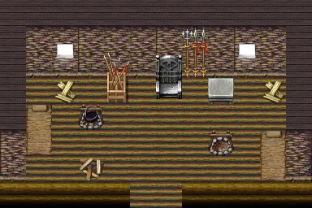

# Brightport lizard1

12×8 tiles

<label class="lg lg-spawn"><input type="checkbox" data-t="spawn" checked> Monsters / NPCs</label><label class="lg lg-mapchange"><input type="checkbox" data-t="mapchange" checked> Exit to another map</label><label class="lg lg-container"><input type="checkbox" data-t="container" checked> Container</label><label class="lg lg-sign"><input type="checkbox" data-t="sign" checked> Sign</label><label class="lg lg-rest"><input type="checkbox" data-t="rest" checked> Resting place</label><label class="lg lg-key"><input type="checkbox" data-t="key" checked> Blocked / needs key or quest</label><label class="lg lg-script"><input type="checkbox" data-t="script"> Scripted event</label><label class="lg lg-replace"><input type="checkbox" data-t="replace"> Changes after a quest</label>

## Exits

- [Brightport cave17](brightport_cave17.md)

## Monsters & NPCs here

| Name | HP |
|---|---|
| [Tail-swing-tyliad](../monsters/brightport_lizardadvisor.md) | 160 |
| [Three-head-arminio](../monsters/brightport_lizard1.md) | 250 |
| [Green-blade-remio](../monsters/brightport_lizard3.md) | 250 |
| [Lizard warrior](../monsters/brightport_lizard00.md) | 250 |
| [Three-fang-elyzard](../monsters/brightport_lizardking.md) | 400 |

<small>Map ID: `brightport_lizard1` · Data from v0.8.18</small>
