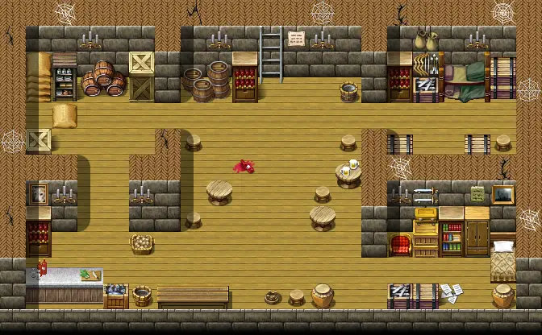
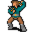

# Brightport thieves

| | |
|---|---|
| **Map ID** | `brightport_thieves` |
| **Region** | In Brightport (settlement) |
| **Type** | Indoors / underground |
| **Size** | 21×13 tiles |
| **Introduced** | [v0.8.16.1](../versions/0.8.16.1.md) |
| **NPCs** | 7 |
| **Quests** | 3 |

**Brightport thieves** is an indoor map, in Brightport (settlement). It has 7 NPCs, and no enemies. Exits lead to Brightport thievesguild.

## Map

<label class="lg"><input type="checkbox" data-t="spawn" checked><b>Red</b>&nbsp;Monsters / NPCs</label><label class="lg"><input type="checkbox" data-t="mapchange" checked><b>Blue</b>&nbsp;Exit to another map</label><label class="lg"><input type="checkbox" data-t="container" checked><b>Yellow</b>&nbsp;Container (click to see contents)</label><label class="lg"><input type="checkbox" data-t="sign" checked><b>Purple</b>&nbsp;Sign</label><label class="lg"><input type="checkbox" data-t="rest" checked><b>Green</b>&nbsp;Resting place</label><label class="lg"><input type="checkbox" data-t="key" checked><b>Orange dashed</b>&nbsp;Blocked until a quest step / item</label><label class="lg"><input type="checkbox" data-t="script"><b>Grey dotted</b>&nbsp;Scripted event</label><label class="lg"><input type="checkbox" data-t="replace"><b>White dotted</b>&nbsp;Changes during a quest</label><label class="lg"><input type="checkbox" data-t="pin" checked><b>Numbers</b>&nbsp;Numbered key points (see the key below the map)</label>

<a class="pin pin-exit" href="#key-1" style="left:50.000%;top:11.538%" title="Exit (north): to [Brightport thievesguild](brightport_thievesguild.md)">1</a><a id="pin-npc-brightportthieves2" class="pin pin-npc" href="#key-2" style="left:92.857%;top:34.615%" title="[Counterfeit](../../monsters/brightportthieves2.md): 1 quest">2</a><a id="pin-npc-brightportthieves6" class="pin pin-npc" href="#key-3" style="left:83.333%;top:80.769%" title="[Elysa](../../monsters/brightportthieves6.md): 2 quests">3</a><a id="pin-npc-brightportthieves" class="pin pin-npc" href="#key-4" style="left:64.286%;top:42.308%" title="[Loudmouth](../../monsters/brightportthieves.md): NPC">4</a><a id="pin-npc-brightport_huntingdog" class="pin pin-npc" href="#key-5" style="left:26.190%;top:80.769%" title="[Mordred](../../monsters/brightport_huntingdog.md): NPC">5</a><a id="pin-npc-Brightportthieves5" class="pin pin-npc" href="#key-6" style="left:16.667%;top:73.077%" title="[Oseanpry](../../monsters/Brightportthieves5.md): shopkeeper">6</a><a id="pin-npc-brightportthieves3" class="pin pin-npc" href="#key-7" style="left:59.524%;top:57.692%" title="[Rowdy thief](../../monsters/brightportthieves3.md): NPC">7</a><a id="pin-npc-brightportthieves4" class="pin pin-npc" href="#key-8" style="left:16.667%;top:34.615%" title="[Watchdog](../../monsters/brightportthieves4.md): NPC">8</a>

??? abstract "Key to the numbers on the map"

    | # | What | Details |
    |---|---|---|
    | 1 | Exit (north) | to [Brightport thievesguild](brightport_thievesguild.md) |
    | 2 | [Counterfeit](../monsters/brightportthieves2.md) | 1 quest |
    | 3 | [Elysa](../monsters/brightportthieves6.md) | 2 quests |
    | 4 | [Loudmouth](../monsters/brightportthieves.md) | NPC |
    | 5 | [Mordred](../monsters/brightport_huntingdog.md) | NPC |
    | 6 | [Oseanpry](../monsters/Brightportthieves5.md) | shopkeeper |
    | 7 | [Rowdy thief](../monsters/brightportthieves3.md) | NPC |
    | 8 | [Watchdog](../monsters/brightportthieves4.md) | NPC |

Verified against v0.8.18 map data.

## Connections

| Direction | Leads to | Region there | Map # |
|---|---|---|---|
| North | [Brightport thievesguild](brightport_thievesguild.md) | Brightport | 1 |

## NPCs

- [Counterfeit](../monsters/brightportthieves2.md) — quests: [No rest for the wicked](../quests/Stanwickquest.md) (#2)
- [Elysa](../monsters/brightportthieves6.md) — quests: [Boxed in](../quests/brightport_thieves.md), [Search for Andor](../quests/andor.md) (#3)
- [Loudmouth](../monsters/brightportthieves.md) (#4)
- [Mordred](../monsters/brightport_huntingdog.md) (#5)
- [Oseanpry](../monsters/Brightportthieves5.md) — shopkeeper (#6)
- [Rowdy thief](../monsters/brightportthieves3.md) (#7)
- [Watchdog](../monsters/brightportthieves4.md) (#8)

## Items & containers

**Shops:** [Oseanpry](../monsters/Brightportthieves5.md)

## Quests

- [Boxed in](../quests/brightport_thieves.md): [Elysa](../monsters/brightportthieves6.md) is involved
- [No rest for the wicked](../quests/Stanwickquest.md): [Counterfeit](../monsters/brightportthieves2.md) is involved
- [Search for Andor](../quests/andor.md): [Elysa](../monsters/brightportthieves6.md) is involved
- [brightport_nondisplay (hidden flag)](../quests/brightport_nondisplay.md): [Elysa](../monsters/brightportthieves6.md) is involved; [Mordred](../monsters/brightport_huntingdog.md) is involved; [Oseanpry](../monsters/Brightportthieves5.md) is involved

## Version history

| Version | Change |
|---|---|
| [v0.8.16.1](../versions/0.8.16.1.md) | Added |

Verified against v0.8.18 and every earlier release back to v0.7.0 (game data compared release by release).

## Community notes

<small>Written by players, not generated from game data. **Observations**: what players notice in-game · **Lore**: the in-world story · **Trivia**: real-world facts, references, development history · **Theory / speculation**: unconfirmed ideas; may just be unfinished content</small>

### Observations

*No notes yet. Contributions are welcome: [add a note](https://github.com/asdfghjkl628/Andor-s-Trail-Wikiiii/new/main/notes/maps?filename=brightport_thieves.md&value=%23%23%20Observations%0A%0A%3C%21--%20what%20players%20notice%20in-game%20--%3E%0A%0A%23%23%20Lore%0A%0A%3C%21--%20the%20in-world%20story%20--%3E%0A%0A%23%23%20Trivia%0A%0A%3C%21--%20real-world%20facts%2C%20references%2C%20development%20history%20--%3E%0A%0A%23%23%20Theory%20/%20speculation%0A%0A%3C%21--%20unconfirmed%20ideas%3B%20may%20just%20be%20unfinished%20content%20--%3E%0A).*

### Lore

*No notes yet. Contributions are welcome: [add a note](https://github.com/asdfghjkl628/Andor-s-Trail-Wikiiii/new/main/notes/maps?filename=brightport_thieves.md&value=%23%23%20Observations%0A%0A%3C%21--%20what%20players%20notice%20in-game%20--%3E%0A%0A%23%23%20Lore%0A%0A%3C%21--%20the%20in-world%20story%20--%3E%0A%0A%23%23%20Trivia%0A%0A%3C%21--%20real-world%20facts%2C%20references%2C%20development%20history%20--%3E%0A%0A%23%23%20Theory%20/%20speculation%0A%0A%3C%21--%20unconfirmed%20ideas%3B%20may%20just%20be%20unfinished%20content%20--%3E%0A).*

### Trivia

*No notes yet. Contributions are welcome: [add a note](https://github.com/asdfghjkl628/Andor-s-Trail-Wikiiii/new/main/notes/maps?filename=brightport_thieves.md&value=%23%23%20Observations%0A%0A%3C%21--%20what%20players%20notice%20in-game%20--%3E%0A%0A%23%23%20Lore%0A%0A%3C%21--%20the%20in-world%20story%20--%3E%0A%0A%23%23%20Trivia%0A%0A%3C%21--%20real-world%20facts%2C%20references%2C%20development%20history%20--%3E%0A%0A%23%23%20Theory%20/%20speculation%0A%0A%3C%21--%20unconfirmed%20ideas%3B%20may%20just%20be%20unfinished%20content%20--%3E%0A).*

### Theory / speculation

*No notes yet. Contributions are welcome: [add a note](https://github.com/asdfghjkl628/Andor-s-Trail-Wikiiii/new/main/notes/maps?filename=brightport_thieves.md&value=%23%23%20Observations%0A%0A%3C%21--%20what%20players%20notice%20in-game%20--%3E%0A%0A%23%23%20Lore%0A%0A%3C%21--%20the%20in-world%20story%20--%3E%0A%0A%23%23%20Trivia%0A%0A%3C%21--%20real-world%20facts%2C%20references%2C%20development%20history%20--%3E%0A%0A%23%23%20Theory%20/%20speculation%0A%0A%3C%21--%20unconfirmed%20ideas%3B%20may%20just%20be%20unfinished%20content%20--%3E%0A).*

??? info "Technical information"

    | | |
    |---|---|
    | Map ID | `brightport_thieves` |
    | File | `res/xml/brightport_thieves.tmx` |
    | Size | 21×13 tiles (672×416 px) |
    | outdoors property | – |
    | Layers drawn | base, ground, objects, above, top |
    | Tilesets | map_bed_1, map_border_1, map_bridge_1, map_bridge_2, map_brightport, map_broken_1, map_cavewall_1, map_cavewall_2, map_cavewall_3, map_cavewall_4, map_chair_table_1, map_chair_table_2, map_crate_1, map_cupboard_1, map_curtain_1, map_entrance_1, map_entrance_2, map_fence_1, map_fence_2, map_fence_3, map_fence_4, map_ground_1, map_ground_2, map_ground_3, map_ground_4, map_ground_5, map_ground_6, map_ground_7, map_ground_8, map_house_1, map_house_2, map_indoor_1, map_indoor_2, map_kitchen_1, map_outdoor_1, map_painting_1, map_pillar_1, map_pillar_2, map_plant_1, map_plant_2, map_rock_1, map_rock_2, map_roof_1, map_roof_2, map_roof_3, map_shop_1, map_sign_ladder_1, map_table_1, map_trail_1, map_transition_1, map_transition_2, map_transition_3, map_transition_4, map_transition_5, map_tree_1, map_tree_2, map_wall_1, map_wall_2, map_wall_3, map_wall_4, map_window_1, map_window_2 |
    | Map objects | spawn: 7, mapchange: 1 |
    | World map position | – |

<small>Data from v0.8.18</small>
