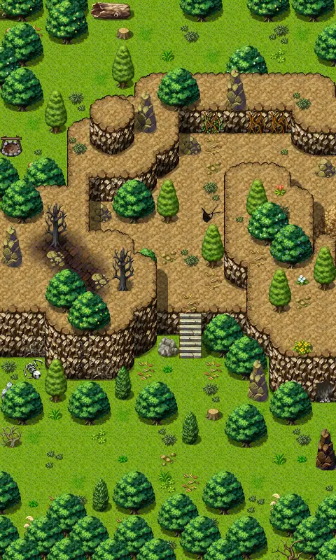

# Brightportwild 1

| | |
|---|---|
| **Map ID** | `brightportwild1` |
| **Type** | Indoors / underground |
| **Size** | 15×25 tiles |
| **World map** | [World 1](index.md) |
| **Introduced** | [v0.8.16.1](../versions/0.8.16.1.md) |
| **Enemy types** | 2 |
| **Quests** | 1 |

**Brightportwild 1** is an indoor map. It has no NPCs and 2 kinds of enemy. Exits lead to Waytobrightport 13, Brightportwild 2, Waytobrightport 11, Waytobrightport 6.

## Map

<label class="lg"><input type="checkbox" data-t="spawn" checked><b>Red</b>&nbsp;Monsters / NPCs</label><label class="lg"><input type="checkbox" data-t="mapchange" checked><b>Blue</b>&nbsp;Exit to another map</label><label class="lg"><input type="checkbox" data-t="container" checked><b>Yellow</b>&nbsp;Container (click to see contents)</label><label class="lg"><input type="checkbox" data-t="sign" checked><b>Purple</b>&nbsp;Sign</label><label class="lg"><input type="checkbox" data-t="rest" checked><b>Green</b>&nbsp;Resting place</label><label class="lg"><input type="checkbox" data-t="key" checked><b>Orange dashed</b>&nbsp;Blocked until a quest step / item</label><label class="lg"><input type="checkbox" data-t="script"><b>Grey dotted</b>&nbsp;Scripted event</label><label class="lg"><input type="checkbox" data-t="replace"><b>White dotted</b>&nbsp;Changes during a quest</label><label class="lg"><input type="checkbox" data-t="pin" checked><b>Numbers</b>&nbsp;Numbered key points (see the key below the map)</label>

<a class="pin pin-exit" href="#key-1" style="left:56.667%;top:2.000%" title="Exit (north): to [Waytobrightport 13](waytobrightport13.md)">1</a><a class="pin pin-exit" href="#key-2" style="left:96.667%;top:6.000%" title="Exit (northeast): to [Brightportwild 2](brightportwild2.md)">2</a><a class="pin pin-exit" href="#key-3" style="left:96.667%;top:64.000%" title="Exit (east): to [Brightportwild 2](brightportwild2.md)">3</a><a class="pin pin-exit" href="#key-4" style="left:3.333%;top:66.000%" title="Exit (west): to [Waytobrightport 11](waytobrightport11.md)">4</a><a class="pin pin-exit" href="#key-5" style="left:3.333%;top:88.000%" title="Exit (west): to [Waytobrightport 6](waytobrightport6.md)">5</a><a class="pin pin-replace" href="#key-6" style="left:76.667%;top:26.000%" title="Changes during a quest: This area changes during the quest: Bread and circus (stage 25: “According to Eatloni, the order of 30 apples never arrived. I should visit Deebo&#x27;s Orchard to check if the order had been picked up.”)">6</a><a class="pin pin-replace" href="#key-6" style="left:30.000%;top:82.000%" title="Changes during a quest: This area changes during the quest: Bread and circus (stage 25: “According to Eatloni, the order of 30 apples never arrived. I should visit Deebo&#x27;s Orchard to check if the order had been picked up.”)">6</a>

??? abstract "Key to the numbers on the map"

    | # | What | Details |
    |---|---|---|
    | 1 | Exit (north) | to [Waytobrightport 13](waytobrightport13.md) |
    | 2 | Exit (northeast) | to [Brightportwild 2](brightportwild2.md) |
    | 3 | Exit (east) | to [Brightportwild 2](brightportwild2.md) |
    | 4 | Exit (west) | to [Waytobrightport 11](waytobrightport11.md) |
    | 5 | Exit (west) | to [Waytobrightport 6](waytobrightport6.md) |
    | 6 | Changes during a quest | This area changes during the quest: Bread and circus (stage 25: “According to Eatloni, the order of 30 apples never arrived. I should visit Deebo's Orchard to check if the order had been picked up.”) |

Verified against v0.8.18 map data.

## Connections

| Direction | Leads to | Region there | Map # |
|---|---|---|---|
| North | [Waytobrightport 13](waytobrightport13.md) | – | 1 |
| Northeast | [Brightportwild 2](brightportwild2.md) | – | 2 |
| East | [Brightportwild 2](brightportwild2.md) | – | 3 |
| West | [Waytobrightport 11](waytobrightport11.md) | – | 4 |
| West | [Waytobrightport 6](waytobrightport6.md) | – | 5 |

## Enemies

| Enemy | HP | Damage | Up to | Notes |
|---|---|---|---|---|
| [Duleian mountain cat](../monsters/duleian_mountain_cat.md) | 97 | 7–19 | 7 | – |
| [Virulent forest deer](../monsters/brightport_deer.md) | 240 | 8–19 | 2 | – |

<small>“Up to” is the most that can be alive at once from the spawn areas on this map.</small>

## Quests

- [Bread and circus](../quests/brightport_bakery.md): part of the map changes at stage 25

## Points of interest

- **Changes during a quest** (#6): This area changes during the quest: Bread and circus (stage 25: “According to Eatloni, the order of 30 apples never arrived. I should visit Deebo's Orchard to check if the order had been picked up.”)

## Version history

| Version | Change |
|---|---|
| [v0.8.16.1](../versions/0.8.16.1.md) | Added |
| [v0.8.18](../versions/0.8.18.md) | Map layout or objects changed |

Verified against v0.8.18 and every earlier release back to v0.7.0 (game data compared release by release).

## Community notes

<small>Written by players, not generated from game data. **Observations**: what players notice in-game · **Lore**: the in-world story · **Trivia**: real-world facts, references, development history · **Theory / speculation**: unconfirmed ideas; may just be unfinished content</small>

### Observations

*No notes yet. Contributions are welcome: [add a note](https://github.com/asdfghjkl628/Andor-s-Trail-Wikiiii/new/main/notes/maps?filename=brightportwild1.md&value=%23%23%20Observations%0A%0A%3C%21--%20what%20players%20notice%20in-game%20--%3E%0A%0A%23%23%20Lore%0A%0A%3C%21--%20the%20in-world%20story%20--%3E%0A%0A%23%23%20Trivia%0A%0A%3C%21--%20real-world%20facts%2C%20references%2C%20development%20history%20--%3E%0A%0A%23%23%20Theory%20/%20speculation%0A%0A%3C%21--%20unconfirmed%20ideas%3B%20may%20just%20be%20unfinished%20content%20--%3E%0A).*

### Lore

*No notes yet. Contributions are welcome: [add a note](https://github.com/asdfghjkl628/Andor-s-Trail-Wikiiii/new/main/notes/maps?filename=brightportwild1.md&value=%23%23%20Observations%0A%0A%3C%21--%20what%20players%20notice%20in-game%20--%3E%0A%0A%23%23%20Lore%0A%0A%3C%21--%20the%20in-world%20story%20--%3E%0A%0A%23%23%20Trivia%0A%0A%3C%21--%20real-world%20facts%2C%20references%2C%20development%20history%20--%3E%0A%0A%23%23%20Theory%20/%20speculation%0A%0A%3C%21--%20unconfirmed%20ideas%3B%20may%20just%20be%20unfinished%20content%20--%3E%0A).*

### Trivia

*No notes yet. Contributions are welcome: [add a note](https://github.com/asdfghjkl628/Andor-s-Trail-Wikiiii/new/main/notes/maps?filename=brightportwild1.md&value=%23%23%20Observations%0A%0A%3C%21--%20what%20players%20notice%20in-game%20--%3E%0A%0A%23%23%20Lore%0A%0A%3C%21--%20the%20in-world%20story%20--%3E%0A%0A%23%23%20Trivia%0A%0A%3C%21--%20real-world%20facts%2C%20references%2C%20development%20history%20--%3E%0A%0A%23%23%20Theory%20/%20speculation%0A%0A%3C%21--%20unconfirmed%20ideas%3B%20may%20just%20be%20unfinished%20content%20--%3E%0A).*

### Theory / speculation

*No notes yet. Contributions are welcome: [add a note](https://github.com/asdfghjkl628/Andor-s-Trail-Wikiiii/new/main/notes/maps?filename=brightportwild1.md&value=%23%23%20Observations%0A%0A%3C%21--%20what%20players%20notice%20in-game%20--%3E%0A%0A%23%23%20Lore%0A%0A%3C%21--%20the%20in-world%20story%20--%3E%0A%0A%23%23%20Trivia%0A%0A%3C%21--%20real-world%20facts%2C%20references%2C%20development%20history%20--%3E%0A%0A%23%23%20Theory%20/%20speculation%0A%0A%3C%21--%20unconfirmed%20ideas%3B%20may%20just%20be%20unfinished%20content%20--%3E%0A).*

??? info "Technical information"

    | | |
    |---|---|
    | Map ID | `brightportwild1` |
    | File | `res/xml/brightportwild1.tmx` |
    | Size | 15×25 tiles (480×800 px) |
    | outdoors property | – |
    | Layers drawn | base, ground, objects, above, top |
    | Tilesets | map_bed_1, map_border_1, map_bridge_1, map_bridge_2, map_broken_1, map_cavewall_1, map_cavewall_2, map_cavewall_3, map_cavewall_4, map_chair_table_1, map_chair_table_2, map_crate_1, map_cupboard_1, map_curtain_1, map_entrance_1, map_entrance_2, map_fence_1, map_fence_2, map_fence_3, map_fence_4, map_ground_1, map_ground_2, map_ground_3, map_ground_4, map_ground_5, map_ground_6, map_ground_7, map_ground_8, map_house_1, map_house_2, map_indoor_1, map_indoor_2, map_kitchen_1, map_outdoor_1, map_pillar_1, map_pillar_2, map_plant_1, map_plant_2, map_rock_1, map_rock_2, map_roof_1, map_roof_2, map_roof_3, map_shop_1, map_sign_ladder_1, map_table_1, map_trail_1, map_transition_1, map_transition_2, map_transition_3, map_transition_4, map_transition_5, map_tree_1, map_tree_2, map_wall_1, map_wall_2, map_wall_3, map_wall_4, map_window_1, map_window_2 |
    | Map objects | spawn: 6, mapchange: 5, replace: 2 |
    | World map position | segment `world1`, x 503, y 420 |

<small>Data from v0.8.18</small>
