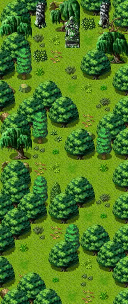

# Brightportwild19

8×19 tiles · part of [World1](index.md)

<label class="lg lg-spawn"><input type="checkbox" data-t="spawn" checked> Monsters / NPCs</label><label class="lg lg-mapchange"><input type="checkbox" data-t="mapchange" checked> Exit to another map</label><label class="lg lg-container"><input type="checkbox" data-t="container" checked> Container</label><label class="lg lg-sign"><input type="checkbox" data-t="sign" checked> Sign</label><label class="lg lg-rest"><input type="checkbox" data-t="rest" checked> Resting place</label><label class="lg lg-key"><input type="checkbox" data-t="key" checked> Blocked / needs key or quest</label><label class="lg lg-script"><input type="checkbox" data-t="script"> Scripted event</label><label class="lg lg-replace"><input type="checkbox" data-t="replace"> Changes after a quest</label>

## Exits

- [Brightportwild18](brightportwild18.md)

## Monsters & NPCs here

| Name | HP |
|---|---|
| [Muskrat](../monsters/brightport_squirrel.md) | 100 |
| [Rash Muskrat](../monsters/brightport_squirrel2.md) | 140 |
| [Virulent forest deer](../monsters/brightport_deer.md) | 240 |
| [Elder deer](../monsters/brightport_elderdeer.md) | 293 |

<small>Map ID: `brightportwild19` · Data from v0.8.18</small>
