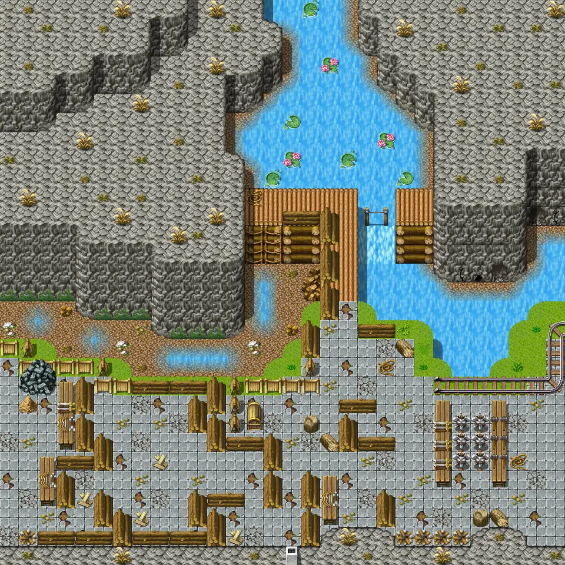
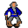
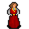

# Brimhaven1

| | |
|---|---|
| **Map ID** | `brimhaven1` |
| **Region** | In Brimhaven (settlement) |
| **Type** | Indoors / underground |
| **Size** | 30×30 tiles |
| **World map** | [World1](index.md) |
| **Introduced** | [v0.7.11](../versions/0.7.11.md) |
| **NPCs** | 5 |
| **Quests** | 3 |

**Brimhaven1** is an indoor map, in Brimhaven (settlement). It has 5 NPCs, and no enemies. Exits lead to Brimhaven3, Brimhaven4.

## Map

<label class="lg"><input type="checkbox" data-t="spawn" checked><b>Red</b>&nbsp;Monsters / NPCs</label><label class="lg"><input type="checkbox" data-t="mapchange" checked><b>Blue</b>&nbsp;Exit to another map</label><label class="lg"><input type="checkbox" data-t="container" checked><b>Yellow</b>&nbsp;Container (click to see contents)</label><label class="lg"><input type="checkbox" data-t="sign" checked><b>Purple</b>&nbsp;Sign</label><label class="lg"><input type="checkbox" data-t="rest" checked><b>Green</b>&nbsp;Resting place</label><label class="lg"><input type="checkbox" data-t="key" checked><b>Orange dashed</b>&nbsp;Blocked until a quest step / item</label><label class="lg"><input type="checkbox" data-t="script"><b>Grey dotted</b>&nbsp;Scripted event</label><label class="lg"><input type="checkbox" data-t="replace"><b>White dotted</b>&nbsp;Changes during a quest</label><label class="lg"><input type="checkbox" data-t="pin" checked><b>Numbers</b>&nbsp;Numbered key points (see the key below the map)</label>

<a class="pin pin-exit" href="#key-1" style="left:98.333%;top:75.000%" title="Exit (east): to [Brimhaven3](../brimhaven3.md)">1</a><a class="pin pin-exit" href="#key-2" style="left:1.667%;top:56.667%" title="Exit (west): to [Brimhaven4](../brimhaven4.md)">2</a><a class="pin pin-exit" href="#key-2" style="left:1.667%;top:80.000%" title="Exit (west): to [Brimhaven4](../brimhaven4.md)">2</a><a class="pin pin-npc" href="#key-3" style="left:21.667%;top:78.333%" title="[Child](../../monsters/brv_villager13.md): NPC">3</a><a class="pin pin-npc" href="#key-4" style="left:65.000%;top:65.000%" title="[Commoner](../../monsters/brv_villager11.md): NPC">4</a><a class="pin pin-npc" href="#key-5" style="left:65.000%;top:85.000%" title="[Commoner](../../monsters/brv_villager9.md): NPC">5</a><a class="pin pin-npc" href="#key-6" style="left:45.000%;top:35.000%" title="[Gnossath](../../monsters/brv_employer.md): 1 quest">6</a><a class="pin pin-npc" href="#key-7" style="left:28.333%;top:78.333%" title="[Mother](../../monsters/brv_villager12.md): NPC">7</a><a class="pin pin-script" href="#key-8" style="left:48.333%;top:35.000%" title="Quest trigger: Scripted event: advances the quest: Work for debts to stage 40 (“I have carried the first boulder to the dam.”) (+1 more quest(s))">8</a><a class="pin pin-script" href="#key-9" style="left:51.667%;top:48.333%" title="Quest trigger: Scripted event: advances the quest: Much water to stage 54 (“I found the weak spot in the dam and started hacking at the wood.”) (+1 more quest(s))">9</a><a class="pin pin-script" href="#key-10" style="left:48.333%;top:56.667%" title="Quest trigger: Scripted event: advances the quest: hidden story flag “brv_nondisplay” to stage 72 (“72=stage-2 flood”)">10</a><a class="pin pin-script" href="#key-10" style="left:46.667%;top:40.000%" title="Quest trigger: Scripted event: advances the quest: hidden story flag “brv_nondisplay” to stage 72 (“72=stage-2 flood”)">10</a><a class="pin pin-script" href="#key-11" style="left:33.333%;top:63.333%" title="Quest trigger: Scripted event: advances the quest: hidden story flag “brv_nondisplay” to stage 73 (“73=stage-3 flood”)">11</a><a class="pin pin-script" href="#key-11" style="left:60.000%;top:56.667%" title="Quest trigger: Scripted event: advances the quest: hidden story flag “brv_nondisplay” to stage 73 (“73=stage-3 flood”)">11</a><a class="pin pin-script" href="#key-12" style="left:46.667%;top:45.000%" title="Quest trigger: Scripted event: advances the quest: hidden story flag “brv_nondisplay” to stage 70 (“70=passage to river closed”)">12</a><a class="pin pin-script" href="#key-13" style="left:56.667%;top:76.667%" title="Quest trigger: Scripted event: advances the quest: Much water to stage 80 (“Someone else destroyed the dam and water came pouring through a hole in the dam. A lot of water!”) (+1 more quest(s))">13</a><a class="pin pin-script" href="#key-10" style="left:60.000%;top:68.333%" title="Quest trigger: Scripted event: advances the quest: hidden story flag “brv_nondisplay” to stage 72 (“72=stage-2 flood”)">10</a><a class="pin pin-script" href="#key-10" style="left:51.667%;top:78.333%" title="Quest trigger: Scripted event: advances the quest: hidden story flag “brv_nondisplay” to stage 72 (“72=stage-2 flood”)">10</a><a class="pin pin-script" href="#key-10" style="left:61.667%;top:83.333%" title="Quest trigger: Scripted event: advances the quest: hidden story flag “brv_nondisplay” to stage 72 (“72=stage-2 flood”)">10</a><a class="pin pin-script" href="#key-11" style="left:78.333%;top:80.000%" title="Quest trigger: Scripted event: advances the quest: hidden story flag “brv_nondisplay” to stage 73 (“73=stage-3 flood”)">11</a><a class="pin pin-script" href="#key-11" style="left:35.000%;top:81.667%" title="Quest trigger: Scripted event: advances the quest: hidden story flag “brv_nondisplay” to stage 73 (“73=stage-3 flood”)">11</a><a class="pin pin-key" href="#key-14" style="left:6.667%;top:75.000%" title="Blocked passage: Passable only while not carrying: Boulder">14</a><a class="pin pin-key" href="#key-14" style="left:1.667%;top:75.000%" title="Blocked passage: Passable only while not carrying: Boulder">14</a><a class="pin pin-key" href="#key-14" style="left:98.553%;top:72.500%" title="Blocked passage: Passable only while not carrying: Boulder">14</a><a class="pin pin-key" href="#key-15" style="left:8.333%;top:68.333%" title="Blocked passage: Unlocked during the quest: base_nondisplay (stage 2: “2=This stage is never set”)">15</a><a class="pin pin-key" href="#key-16" style="left:48.333%;top:48.333%" title="Blocked passage: Closed off once you reach this point in the quest: hidden story flag “brv_nondisplay” (stage 70: “70=passage to river closed”)">16</a><a class="pin pin-replace" href="#key-17" style="left:28.333%;top:53.333%" title="Changes during a quest: This area changes during the quest: hidden story flag “brv_nondisplay” (stage 81: “81=Stage-1 flood”)">17</a><a class="pin pin-replace" href="#key-18" style="left:28.553%;top:50.834%" title="Changes during a quest: This area changes during the quest: hidden story flag “brv_nondisplay” (stage 82: “82=stage-2 flood”)">18</a><a class="pin pin-replace" href="#key-19" style="left:30.015%;top:55.527%" title="Changes during a quest: This area changes during the quest: hidden story flag “brv_nondisplay” (stage 83: “83=stage-3 flood”)">19</a><a class="pin pin-replace" href="#key-20" style="left:25.400%;top:52.814%" title="Changes during a quest: This area changes during the quest: hidden story flag “brv_nondisplay” (stage 89: “89=End flood”)">20</a>

??? abstract "Key to the numbers on the map"

    | # | What | Details |
    |---|---|---|
    | 1 | Exit (east) | to [Brimhaven3](../brimhaven3.md) |
    | 2 | Exit (west) | to [Brimhaven4](../brimhaven4.md) |
    | 3 | [Child](../monsters/brv_villager13.md) | NPC |
    | 4 | [Commoner](../monsters/brv_villager11.md) | NPC |
    | 5 | [Commoner](../monsters/brv_villager9.md) | NPC |
    | 6 | [Gnossath](../monsters/brv_employer.md) | 1 quest |
    | 7 | [Mother](../monsters/brv_villager12.md) | NPC |
    | 8 | Quest trigger | Scripted event: advances the quest: Work for debts to stage 40 (“I have carried the first boulder to the dam.”) (+1 more quest(s)) |
    | 9 | Quest trigger | Scripted event: advances the quest: Much water to stage 54 (“I found the weak spot in the dam and started hacking at the wood.”) (+1 more quest(s)) |
    | 10 | Quest trigger | Scripted event: advances the quest: hidden story flag “brv_nondisplay” to stage 72 (“72=stage-2 flood”) |
    | 11 | Quest trigger | Scripted event: advances the quest: hidden story flag “brv_nondisplay” to stage 73 (“73=stage-3 flood”) |
    | 12 | Quest trigger | Scripted event: advances the quest: hidden story flag “brv_nondisplay” to stage 70 (“70=passage to river closed”) |
    | 13 | Quest trigger | Scripted event: advances the quest: Much water to stage 80 (“Someone else destroyed the dam and water came pouring through a hole in the dam. A lot of water!”) (+1 more quest(s)) |
    | 14 | Blocked passage | Passable only while not carrying: Boulder |
    | 15 | Blocked passage | Unlocked during the quest: base_nondisplay (stage 2: “2=This stage is never set”) |
    | 16 | Blocked passage | Closed off once you reach this point in the quest: hidden story flag “brv_nondisplay” (stage 70: “70=passage to river closed”) |
    | 17 | Changes during a quest | This area changes during the quest: hidden story flag “brv_nondisplay” (stage 81: “81=Stage-1 flood”) |
    | 18 | Changes during a quest | This area changes during the quest: hidden story flag “brv_nondisplay” (stage 82: “82=stage-2 flood”) |
    | 19 | Changes during a quest | This area changes during the quest: hidden story flag “brv_nondisplay” (stage 83: “83=stage-3 flood”) |
    | 20 | Changes during a quest | This area changes during the quest: hidden story flag “brv_nondisplay” (stage 89: “89=End flood”) |

Verified against v0.8.18 map data.

## Connections

| Direction | Leads to | Region there | Map # |
|---|---|---|---|
| East | [Brimhaven3](brimhaven3.md) | Brimhaven | 1 |
| West | [Brimhaven4](brimhaven4.md) | Brimhaven | 2 |

## NPCs

- [Child](../monsters/brv_villager13.md) (#3)
- [Commoner](../monsters/brv_villager11.md) (#4)
- [Commoner](../monsters/brv_villager9.md) (#5)
- [Gnossath](../monsters/brv_employer.md) — quests: [Work for debts](../quests/brv_employee.md) (#6)
- [Mother](../monsters/brv_villager12.md) (#7)

## Quests

- [base_nondisplay](../quests/base_nondisplay.md): blocked passage opens at stage 2
- [Much water](../quests/brv_flood.md): something on this map advances it; stepping on a trigger here sets stage 54; stepping on a trigger here sets stage 56; stepping on a trigger here sets stage 80
- [Work for debts](../quests/brv_employee.md): [Gnossath](../monsters/brv_employer.md) is involved; something on this map advances it; stepping on a trigger here sets stage 40; stepping on a trigger here sets stage 41; stepping on a trigger here sets stage 42; stepping on a trigger here sets stage 43; stepping on a trigger here sets stage 44; stepping on a trigger here sets stage 90
- [brv_nondisplay (hidden flag)](../quests/brv_nondisplay.md): [Gnossath](../monsters/brv_employer.md) is involved; a scripted event can trigger here from stage 82; a scripted event can trigger here from stage 83; blocked passage closes at stage 70; part of the map changes at stage 81; part of the map changes at stage 82; part of the map changes at stage 83; part of the map changes at stage 89; something on this map advances it; stepping on a trigger here sets stage 100; stepping on a trigger here sets stage 70; stepping on a trigger here sets stage 71; stepping on a trigger here sets stage 72; stepping on a trigger here sets stage 73; stepping on a trigger here sets stage 81; stepping on a trigger here sets stage 82; stepping on a trigger here sets stage 83; stepping on a trigger here sets stage 89

## Points of interest

- **Quest trigger** (#8): Scripted event: advances the quest: Work for debts to stage 40 (“I have carried the first boulder to the dam.”) (+1 more quest(s))
- **Quest trigger** (#9): Scripted event: advances the quest: Much water to stage 54 (“I found the weak spot in the dam and started hacking at the wood.”) (+1 more quest(s))
- **Quest trigger** (#10): Scripted event: advances the quest: hidden story flag “brv_nondisplay” to stage 72 (“72=stage-2 flood”)
- **Quest trigger** (#11): Scripted event: advances the quest: hidden story flag “brv_nondisplay” to stage 73 (“73=stage-3 flood”)
- **Quest trigger** (#12): Scripted event: advances the quest: hidden story flag “brv_nondisplay” to stage 70 (“70=passage to river closed”)
- **Quest trigger** (#13): Scripted event: advances the quest: Much water to stage 80 (“Someone else destroyed the dam and water came pouring through a hole in the dam. A lot of water!”) (+1 more quest(s))
- **Blocked passage** (#14): Passable only while not carrying: Boulder
- **Blocked passage** (#15): Unlocked during the quest: base_nondisplay (stage 2: “2=This stage is never set”)
- **Blocked passage** (#16): Closed off once you reach this point in the quest: hidden story flag “brv_nondisplay” (stage 70: “70=passage to river closed”)
- **Changes during a quest** (#17): This area changes during the quest: hidden story flag “brv_nondisplay” (stage 81: “81=Stage-1 flood”)
- **Changes during a quest** (#18): This area changes during the quest: hidden story flag “brv_nondisplay” (stage 82: “82=stage-2 flood”)
- **Changes during a quest** (#19): This area changes during the quest: hidden story flag “brv_nondisplay” (stage 83: “83=stage-3 flood”)
- **Changes during a quest** (#20): This area changes during the quest: hidden story flag “brv_nondisplay” (stage 89: “89=End flood”)

## Version history

| Version | Change |
|---|---|
| [v0.7.11](../versions/0.7.11.md) | Added |
| [v0.8.16.1](../versions/0.8.16.1.md) | map layout or objects changed |

Verified against v0.8.18 and every earlier release back to v0.7.0 (game data compared release by release).

## Community notes

<small>Written by players, not generated from game data. **Observations**: what players notice in-game · **Lore**: the in-world story · **Trivia**: real-world facts, references, development history · **Theory / speculation**: unconfirmed ideas; may just be unfinished content</small>

### Observations

*Nothing here yet. Know something? [Add it](https://github.com/asdfghjkl628/Andor-s-Trail-Wikiiii/new/main/notes/maps?filename=brimhaven1.md&value=%23%23%20Observations%0A%0A%3C%21--%20what%20players%20notice%20in-game%20--%3E%0A%0A%23%23%20Lore%0A%0A%3C%21--%20the%20in-world%20story%20--%3E%0A%0A%23%23%20Trivia%0A%0A%3C%21--%20real-world%20facts%2C%20references%2C%20development%20history%20--%3E%0A%0A%23%23%20Theory%20/%20speculation%0A%0A%3C%21--%20unconfirmed%20ideas%3B%20may%20just%20be%20unfinished%20content%20--%3E%0A).*

### Lore

*Nothing here yet. Know something? [Add it](https://github.com/asdfghjkl628/Andor-s-Trail-Wikiiii/new/main/notes/maps?filename=brimhaven1.md&value=%23%23%20Observations%0A%0A%3C%21--%20what%20players%20notice%20in-game%20--%3E%0A%0A%23%23%20Lore%0A%0A%3C%21--%20the%20in-world%20story%20--%3E%0A%0A%23%23%20Trivia%0A%0A%3C%21--%20real-world%20facts%2C%20references%2C%20development%20history%20--%3E%0A%0A%23%23%20Theory%20/%20speculation%0A%0A%3C%21--%20unconfirmed%20ideas%3B%20may%20just%20be%20unfinished%20content%20--%3E%0A).*

### Trivia

*Nothing here yet. Know something? [Add it](https://github.com/asdfghjkl628/Andor-s-Trail-Wikiiii/new/main/notes/maps?filename=brimhaven1.md&value=%23%23%20Observations%0A%0A%3C%21--%20what%20players%20notice%20in-game%20--%3E%0A%0A%23%23%20Lore%0A%0A%3C%21--%20the%20in-world%20story%20--%3E%0A%0A%23%23%20Trivia%0A%0A%3C%21--%20real-world%20facts%2C%20references%2C%20development%20history%20--%3E%0A%0A%23%23%20Theory%20/%20speculation%0A%0A%3C%21--%20unconfirmed%20ideas%3B%20may%20just%20be%20unfinished%20content%20--%3E%0A).*

### Theory / speculation

*Nothing here yet. Know something? [Add it](https://github.com/asdfghjkl628/Andor-s-Trail-Wikiiii/new/main/notes/maps?filename=brimhaven1.md&value=%23%23%20Observations%0A%0A%3C%21--%20what%20players%20notice%20in-game%20--%3E%0A%0A%23%23%20Lore%0A%0A%3C%21--%20the%20in-world%20story%20--%3E%0A%0A%23%23%20Trivia%0A%0A%3C%21--%20real-world%20facts%2C%20references%2C%20development%20history%20--%3E%0A%0A%23%23%20Theory%20/%20speculation%0A%0A%3C%21--%20unconfirmed%20ideas%3B%20may%20just%20be%20unfinished%20content%20--%3E%0A).*

??? info "Technical information"

    | | |
    |---|---|
    | Map ID | `brimhaven1` |
    | File | `res/xml/brimhaven1.tmx` |
    | Size | 30×30 tiles (960×960 px) |
    | outdoors property | – |
    | Layers drawn | ground, objects, above, top |
    | Tilesets | map_bed_1, map_border_1, map_bridge_1, map_bridge_2, map_broken_1, map_cavewall_1, map_cavewall_2, map_cavewall_3, map_cavewall_4, map_chair_table_1, map_chair_table_2, map_crate_1, map_cupboard_1, map_curtain_1, map_entrance_1, map_entrance_2, map_fence_1, map_fence_2, map_fence_3, map_fence_4, map_ground_1, map_ground_2, map_ground_3, map_ground_4, map_ground_5, map_ground_6, map_ground_7, map_ground_8, map_guynmart, map_house_1, map_house_2, map_indoor_1, map_indoor_2, map_kitchen_1, map_outdoor_1, map_pillar_1, map_pillar_2, map_plant_1, map_plant_2, map_rock_1, map_rock_2, map_roof_1, map_roof_2, map_roof_3, map_shop_1, map_sign_ladder_1, map_table_1, map_trail_1, map_transition_1, map_transition_2, map_transition_3, map_transition_4, map_tree_1, map_tree_2, map_wall_1, map_wall_2, map_wall_3, map_wall_4, map_window_1, map_window_2 |
    | Map objects | script: 32, spawn: 5, key: 5, replace: 4, mapchange: 3 |
    | World map position | segment `world1`, x 426, y 259 |

<small>Data from v0.8.18</small>
