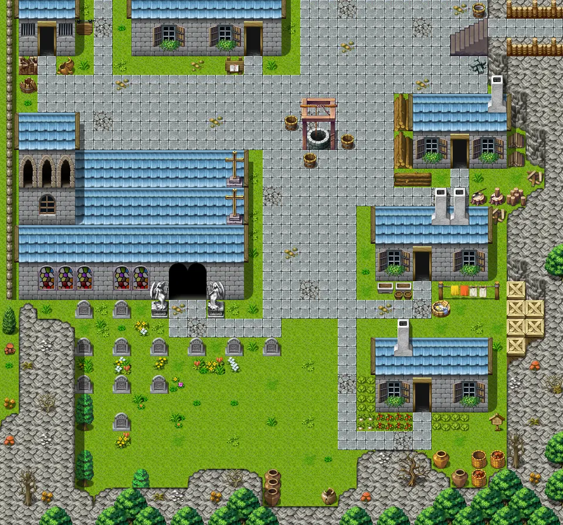

# Brimhaven2

30×28 tiles · part of [World1](index.md)

<label class="lg lg-spawn"><input type="checkbox" data-t="spawn" checked> Monsters / NPCs</label><label class="lg lg-mapchange"><input type="checkbox" data-t="mapchange" checked> Exit to another map</label><label class="lg lg-container"><input type="checkbox" data-t="container" checked> Container</label><label class="lg lg-sign"><input type="checkbox" data-t="sign" checked> Sign</label><label class="lg lg-rest"><input type="checkbox" data-t="rest" checked> Resting place</label><label class="lg lg-key"><input type="checkbox" data-t="key" checked> Blocked / needs key or quest</label><label class="lg lg-script"><input type="checkbox" data-t="script"> Scripted event</label><label class="lg lg-replace"><input type="checkbox" data-t="replace"> Changes after a quest</label>

## Exits

- [Brimhaven2 farmhouse](brimhaven2_farmhouse.md)
- [Brimhaven2 laundry](brimhaven2_laundry.md)
- [Brimhaven2 woodcutter](brimhaven2_woodcutter.md)
- [Brimhaven4](brimhaven4.md)
- [Brimhaven8](brimhaven8.md)
- [Brimhaven church](brimhaven_church.md)
- [Brimhaven prison](brimhaven_prison.md)
- [Brimhaven school](brimhaven_school.md)

## Monsters & NPCs here

| Name | HP |
|---|---|
| [Peasant](../monsters/brv_farmer.md) | 0 |
| [Woodcutter](../monsters/brv_woodcutter.md) | 0 |
| [Peasant girl](../monsters/brv_farmer_girl.md) | 0 |
| [Commoner](../monsters/brv_villager6.md) | 0 |
| [Ito](../monsters/brv_guard_deputy.md) | 0 |
| [Commoner](../monsters/brv_villager7.md) | 0 |
| [Commoner](../monsters/brv_villager10.md) | 0 |
| [Commoner](../monsters/brv_villager8.md) | 0 |

<small>Map ID: `brimhaven2` · Data from v0.8.18</small>
