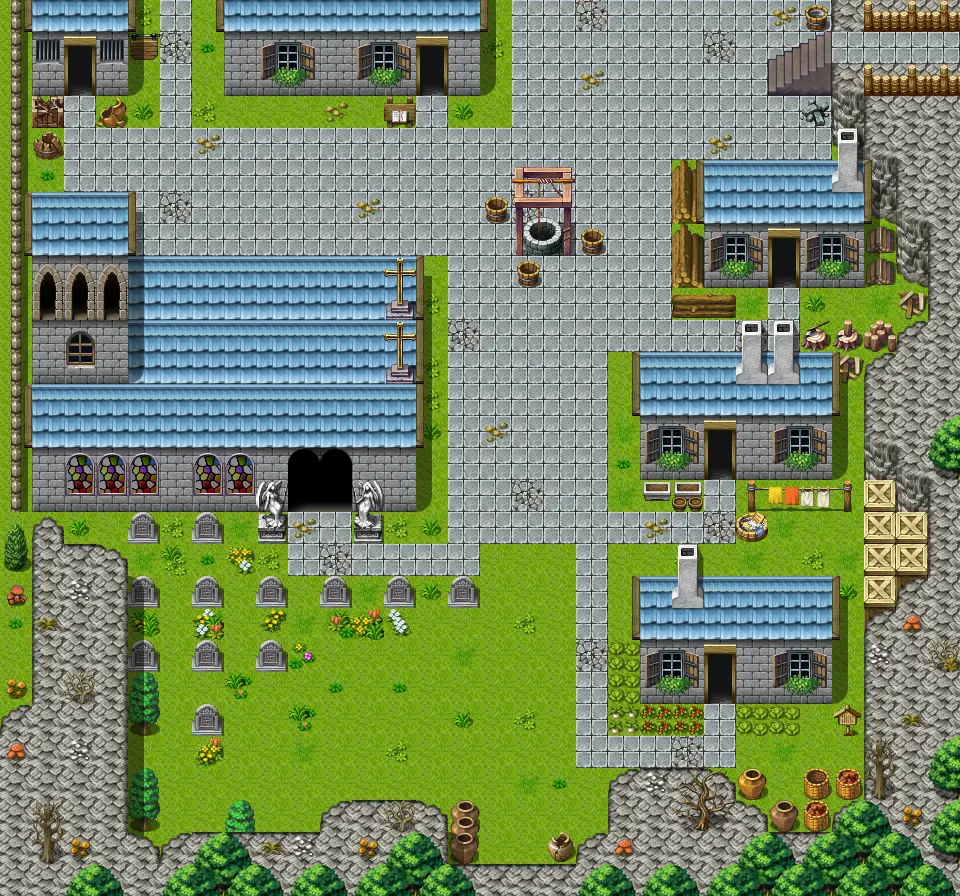
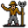
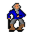
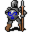

# Brimhaven 2

| | |
|---|---|
| **Map ID** | `brimhaven2` |
| **Region** | In Brimhaven (settlement) |
| **Type** | Indoors / underground |
| **Size** | 30×28 tiles |
| **World map** | [World 1](index.md) |
| **Introduced** | [v0.7.11](../versions/0.7.11.md) |
| **NPCs** | 8 |
| **Quests** | 2 |

**Brimhaven 2** is an indoor map, in Brimhaven (settlement). It has 8 NPCs, and no enemies. Exits lead to Brimhaven 4, Brimhaven 8, Brimhaven 2 farmhouse, Brimhaven 2 laundry and 4 more.

## Map

<label class="lg"><input type="checkbox" data-t="spawn" checked><b>Red</b>&nbsp;Monsters / NPCs</label><label class="lg"><input type="checkbox" data-t="mapchange" checked><b>Blue</b>&nbsp;Exit to another map</label><label class="lg"><input type="checkbox" data-t="container" checked><b>Yellow</b>&nbsp;Container (click to see contents)</label><label class="lg"><input type="checkbox" data-t="sign" checked><b>Purple</b>&nbsp;Sign</label><label class="lg"><input type="checkbox" data-t="rest" checked><b>Green</b>&nbsp;Resting place</label><label class="lg"><input type="checkbox" data-t="key" checked><b>Orange dashed</b>&nbsp;Blocked until a quest step / item</label><label class="lg"><input type="checkbox" data-t="script"><b>Grey dotted</b>&nbsp;Scripted event</label><label class="lg"><input type="checkbox" data-t="replace"><b>White dotted</b>&nbsp;Changes during a quest</label><label class="lg"><input type="checkbox" data-t="pin" checked><b>Numbers</b>&nbsp;Numbered key points (see the key below the map)</label>

<a class="pin pin-exit" href="#key-1" style="left:18.333%;top:1.786%" title="Exit (north): to [Brimhaven 4](brimhaven4.md)">1</a><a class="pin pin-exit" href="#key-1" style="left:66.667%;top:1.786%" title="Exit (north): to [Brimhaven 4](brimhaven4.md)">1</a><a class="pin pin-exit" href="#key-2" style="left:98.333%;top:5.357%" title="Exit (northeast): to [Brimhaven 8](brimhaven8.md)">2</a><a class="pin pin-exit" href="#key-3" style="left:75.000%;top:76.786%" title="Exit (stairs / passage): to [Brimhaven 2 farmhouse](brimhaven2_farmhouse.md)">3</a><a class="pin pin-exit" href="#key-4" style="left:75.000%;top:51.786%" title="Exit (stairs / passage): to [Brimhaven 2 laundry](brimhaven2_laundry.md)">4</a><a class="pin pin-exit" href="#key-5" style="left:81.667%;top:30.357%" title="Exit (stairs / passage): to [Brimhaven 2 woodcutter](brimhaven2_woodcutter.md)">5</a><a class="pin pin-exit" href="#key-6" style="left:33.333%;top:55.357%" title="Exit (stairs / passage): to [Brimhaven church](brimhaven_church.md)">6</a><a class="pin pin-exit" href="#key-7" style="left:8.333%;top:8.929%" title="Exit (stairs / passage): to [Brimhaven prison](brimhaven_prison.md)">7</a><a class="pin pin-exit" href="#key-8" style="left:45.000%;top:8.929%" title="Exit (stairs / passage): to [Brimhaven school](brimhaven_school.md)">8</a><a id="pin-npc-brv_villager10" class="pin pin-npc" href="#key-9" style="left:51.667%;top:33.929%" title="[Commoner](../../monsters/rg_villager1.md#v-brv_villager10): NPC">9</a><a id="pin-npc-brv_villager7" class="pin pin-npc" href="#key-10" style="left:25.000%;top:19.643%" title="[Commoner](../../monsters/rg_villager1.md#v-brv_villager7): NPC">10</a><a id="pin-npc-brv_villager6" class="pin pin-npc" href="#key-11" style="left:48.333%;top:48.214%" title="[Commoner](../../monsters/rg_villager1.md#v-brv_villager6): NPC">11</a><a id="pin-npc-brv_villager8" class="pin pin-npc" href="#key-12" style="left:41.667%;top:23.214%" title="[Commoner](../../monsters/rg_villager1.md#v-brv_villager8): NPC">12</a><a id="pin-npc-brv_guard_deputy" class="pin pin-npc" href="#key-13" style="left:5.000%;top:19.643%" title="[Ito](../../monsters/brv_guard_deputy.md): 1 quest">13</a><a id="pin-npc-brv_farmer" class="pin pin-npc" href="#key-14" style="left:81.667%;top:83.929%" title="[Peasant](../../monsters/brv_farmer.md): NPC">14</a><a id="pin-npc-brv_farmer_girl" class="pin pin-npc" href="#key-15" style="left:71.667%;top:80.357%" title="[Peasant girl](../../monsters/brv_farmer_girl.md): NPC">15</a><a id="pin-npc-brv_woodcutter" class="pin pin-npc" href="#key-16" style="left:85.000%;top:33.929%" title="[Woodcutter](../../monsters/woodcutter_0.md#v-brv_woodcutter): NPC">16</a><a class="pin pin-sign" href="#key-17" style="left:41.667%;top:69.643%" title="Sign: “Here lie Berri and his wife Dalyve.”">17</a><a class="pin pin-sign" href="#key-18" style="left:15.000%;top:62.500%" title="Sign: “RIP Boots. Died the thirteenth day of the twelveth month of ... [You can&#x27;t read the year, because it&#x27;s covered in moss] ”">18</a><a class="pin pin-sign" href="#key-19" style="left:21.667%;top:69.643%" title="Sign: “Here lies my wife. I bid her goodbye. She rests in peace, and now so do I.”">19</a><a class="pin pin-sign" href="#key-20" style="left:28.333%;top:69.643%" title="Sign: “The gravestone is old and worn. You can&#x27;t make out what it says.”">20</a><a class="pin pin-sign" href="#key-21" style="left:21.667%;top:62.500%" title="Sign: “Here lies a stranger, who came to Brimhaven after being attacked. Alas, we could not save him.”">21</a><a class="pin pin-sign" href="#key-22" style="left:15.000%;top:69.643%" title="Sign: “The epitaph is in a language you can&#x27;t read.”">22</a><a class="pin pin-sign" href="#key-23" style="left:15.000%;top:76.786%" title="Sign: “Zhyont. He never killed anyone that did not need killing.”">23</a><a class="pin pin-sign" href="#key-24" style="left:35.000%;top:69.643%" title="Sign: “Here lies Captain Fhoric. He died to protect our town, for which we will be forever grateful.”">24</a><a class="pin pin-sign" href="#key-25" style="left:21.667%;top:76.786%" title="Sign: A sign">25</a><a class="pin pin-sign" href="#key-26" style="left:48.333%;top:69.643%" title="Sign: “Here lies Fredd. A big rock fell on his head. ”">26</a><a class="pin pin-sign" href="#key-27" style="left:28.333%;top:76.786%" title="Sign: “Unknown. Found outside of town, close to the road. RIP.”">27</a><a class="pin pin-sign" href="#key-28" style="left:21.667%;top:83.929%" title="Sign: “Here lies Reptt, the money lender, who never did collect his debt.”">28</a><a class="pin pin-key" href="#key-29" style="left:41.667%;top:12.500%" title="Blocked passage: Unlocked during the quest: base_nondisplay (stage 2: “2=This stage is never set”)">29</a>

??? abstract "Key to the numbers on the map"

    | # | What | Details |
    |---|---|---|
    | 1 | Exit (north) | to [Brimhaven 4](brimhaven4.md) |
    | 2 | Exit (northeast) | to [Brimhaven 8](brimhaven8.md) |
    | 3 | Exit (stairs / passage) | to [Brimhaven 2 farmhouse](brimhaven2_farmhouse.md) |
    | 4 | Exit (stairs / passage) | to [Brimhaven 2 laundry](brimhaven2_laundry.md) |
    | 5 | Exit (stairs / passage) | to [Brimhaven 2 woodcutter](brimhaven2_woodcutter.md) |
    | 6 | Exit (stairs / passage) | to [Brimhaven church](brimhaven_church.md) |
    | 7 | Exit (stairs / passage) | to [Brimhaven prison](brimhaven_prison.md) |
    | 8 | Exit (stairs / passage) | to [Brimhaven school](brimhaven_school.md) |
    | 9 | [Commoner](../monsters/rg_villager1.md#v-brv_villager10) | NPC |
    | 10 | [Commoner](../monsters/rg_villager1.md#v-brv_villager7) | NPC |
    | 11 | [Commoner](../monsters/rg_villager1.md#v-brv_villager6) | NPC |
    | 12 | [Commoner](../monsters/rg_villager1.md#v-brv_villager8) | NPC |
    | 13 | [Ito](../monsters/brv_guard_deputy.md) | 1 quest |
    | 14 | [Peasant](../monsters/brv_farmer.md) | NPC |
    | 15 | [Peasant girl](../monsters/brv_farmer_girl.md) | NPC |
    | 16 | [Woodcutter](../monsters/woodcutter_0.md#v-brv_woodcutter) | NPC |
    | 17 | Sign | “Here lie Berri and his wife Dalyve.” |
    | 18 | Sign | “RIP Boots. Died the thirteenth day of the twelveth month of ... [You can't read the year, because it's covered in moss] ” |
    | 19 | Sign | “Here lies my wife. I bid her goodbye. She rests in peace, and now so do I.” |
    | 20 | Sign | “The gravestone is old and worn. You can't make out what it says.” |
    | 21 | Sign | “Here lies a stranger, who came to Brimhaven after being attacked. Alas, we could not save him.” |
    | 22 | Sign | “The epitaph is in a language you can't read.” |
    | 23 | Sign | “Zhyont. He never killed anyone that did not need killing.” |
    | 24 | Sign | “Here lies Captain Fhoric. He died to protect our town, for which we will be forever grateful.” |
    | 25 | Sign | A sign |
    | 26 | Sign | “Here lies Fredd. A big rock fell on his head. ” |
    | 27 | Sign | “Unknown. Found outside of town, close to the road. RIP.” |
    | 28 | Sign | “Here lies Reptt, the money lender, who never did collect his debt.” |
    | 29 | Blocked passage | Unlocked during the quest: base_nondisplay (stage 2: “2=This stage is never set”) |

Verified against v0.8.18 map data.

## Connections

| Direction | Leads to | Region there | Map # |
|---|---|---|---|
| North | [Brimhaven 4](brimhaven4.md) | Brimhaven | 1 |
| Northeast | [Brimhaven 8](brimhaven8.md) | Brimhaven | 2 |
| Stairs / passage | [Brimhaven 2 farmhouse](brimhaven2_farmhouse.md) | Brimhaven | 3 |
| Stairs / passage | [Brimhaven 2 laundry](brimhaven2_laundry.md) | Brimhaven | 4 |
| Stairs / passage | [Brimhaven 2 woodcutter](brimhaven2_woodcutter.md) | Brimhaven | 5 |
| Stairs / passage | [Brimhaven church](brimhaven_church.md) | Brimhaven | 6 |
| Stairs / passage | [Brimhaven prison](brimhaven_prison.md) | Brimhaven | 7 |
| Stairs / passage | [Brimhaven school](brimhaven_school.md) | Brimhaven | 8 |

## NPCs

- [Commoner](../monsters/rg_villager1.md#v-brv_villager10) (#9)
- [Commoner](../monsters/rg_villager1.md#v-brv_villager7) (#10)
- [Commoner](../monsters/rg_villager1.md#v-brv_villager6) (#11)
- [Commoner](../monsters/rg_villager1.md#v-brv_villager8) (#12)
- [Ito](../monsters/brv_guard_deputy.md) — quests: [A strange looking dagger](../quests/brv_dagger.md) (#13)
- [Peasant](../monsters/brv_farmer.md) (#14)
- [Peasant girl](../monsters/brv_farmer_girl.md) (#15)
- [Woodcutter](../monsters/woodcutter_0.md#v-brv_woodcutter) (#16)

## Quests

- [A strange looking dagger](../quests/brv_dagger.md): [Ito](../monsters/brv_guard_deputy.md) is involved; something on this map advances it
- [base_nondisplay](../quests/base_nondisplay.md): blocked passage opens at stage 2
- [Brimhaven multipurpose story flags (hidden flag)](../quests/brv_nondisplay_multipurpose.md): [Ito](../monsters/brv_guard_deputy.md) is involved
- [Brimhaven story flags 2 (hidden flag)](../quests/brv_nondisplay2.md): a scripted event can trigger here from stage 60

## Points of interest

- **Sign** (#17): “Here lie Berri and his wife Dalyve.”
- **Sign** (#18): “RIP Boots. Died the thirteenth day of the twelveth month of ... [You can't read the year, because it's covered in moss] ”
- **Sign** (#19): “Here lies my wife. I bid her goodbye. She rests in peace, and now so do I.”
- **Sign** (#20): “The gravestone is old and worn. You can't make out what it says.”
- **Sign** (#21): “Here lies a stranger, who came to Brimhaven after being attacked. Alas, we could not save him.”
- **Sign** (#22): “The epitaph is in a language you can't read.”
- **Sign** (#23): “Zhyont. He never killed anyone that did not need killing.”
- **Sign** (#24): “Here lies Captain Fhoric. He died to protect our town, for which we will be forever grateful.”
- **Sign** (#25): A sign
- **Sign** (#26): “Here lies Fredd. A big rock fell on his head. ”
- **Sign** (#27): “Unknown. Found outside of town, close to the road. RIP.”
- **Sign** (#28): “Here lies Reptt, the money lender, who never did collect his debt.”
- **Blocked passage** (#29): Unlocked during the quest: base_nondisplay (stage 2: “2=This stage is never set”)

## Version history

| Version | Change |
|---|---|
| [v0.7.11](../versions/0.7.11.md) | Added |
| [v0.7.12](../versions/0.7.12.md) | Map layout or objects changed |
| [v0.7.13](../versions/0.7.13.md) | Map layout or objects changed |
| [v0.8.2](../versions/0.8.2.md) | Map layout or objects changed |

Verified against v0.8.18 and every earlier release back to v0.7.0 (game data compared release by release).

## Community notes

<small>Written by players, not generated from game data. **Observations**: what players notice in-game · **Lore**: the in-world story · **Trivia**: real-world facts, references, development history · **Theory / speculation**: unconfirmed ideas; may just be unfinished content</small>

### Observations

*No notes yet. Contributions are welcome: [add a note](https://github.com/asdfghjkl628/Andor-s-Trail-Wikiiii/new/main/notes/maps?filename=brimhaven2.md&value=%23%23%20Observations%0A%0A%3C%21--%20what%20players%20notice%20in-game%20--%3E%0A%0A%23%23%20Lore%0A%0A%3C%21--%20the%20in-world%20story%20--%3E%0A%0A%23%23%20Trivia%0A%0A%3C%21--%20real-world%20facts%2C%20references%2C%20development%20history%20--%3E%0A%0A%23%23%20Theory%20/%20speculation%0A%0A%3C%21--%20unconfirmed%20ideas%3B%20may%20just%20be%20unfinished%20content%20--%3E%0A).*

### Lore

*No notes yet. Contributions are welcome: [add a note](https://github.com/asdfghjkl628/Andor-s-Trail-Wikiiii/new/main/notes/maps?filename=brimhaven2.md&value=%23%23%20Observations%0A%0A%3C%21--%20what%20players%20notice%20in-game%20--%3E%0A%0A%23%23%20Lore%0A%0A%3C%21--%20the%20in-world%20story%20--%3E%0A%0A%23%23%20Trivia%0A%0A%3C%21--%20real-world%20facts%2C%20references%2C%20development%20history%20--%3E%0A%0A%23%23%20Theory%20/%20speculation%0A%0A%3C%21--%20unconfirmed%20ideas%3B%20may%20just%20be%20unfinished%20content%20--%3E%0A).*

### Trivia

*No notes yet. Contributions are welcome: [add a note](https://github.com/asdfghjkl628/Andor-s-Trail-Wikiiii/new/main/notes/maps?filename=brimhaven2.md&value=%23%23%20Observations%0A%0A%3C%21--%20what%20players%20notice%20in-game%20--%3E%0A%0A%23%23%20Lore%0A%0A%3C%21--%20the%20in-world%20story%20--%3E%0A%0A%23%23%20Trivia%0A%0A%3C%21--%20real-world%20facts%2C%20references%2C%20development%20history%20--%3E%0A%0A%23%23%20Theory%20/%20speculation%0A%0A%3C%21--%20unconfirmed%20ideas%3B%20may%20just%20be%20unfinished%20content%20--%3E%0A).*

### Theory / speculation

*No notes yet. Contributions are welcome: [add a note](https://github.com/asdfghjkl628/Andor-s-Trail-Wikiiii/new/main/notes/maps?filename=brimhaven2.md&value=%23%23%20Observations%0A%0A%3C%21--%20what%20players%20notice%20in-game%20--%3E%0A%0A%23%23%20Lore%0A%0A%3C%21--%20the%20in-world%20story%20--%3E%0A%0A%23%23%20Trivia%0A%0A%3C%21--%20real-world%20facts%2C%20references%2C%20development%20history%20--%3E%0A%0A%23%23%20Theory%20/%20speculation%0A%0A%3C%21--%20unconfirmed%20ideas%3B%20may%20just%20be%20unfinished%20content%20--%3E%0A).*

??? info "Technical information"

    | | |
    |---|---|
    | Map ID | `brimhaven2` |
    | File | `res/xml/brimhaven2.tmx` |
    | Size | 30×28 tiles (960×896 px) |
    | outdoors property | – |
    | Layers drawn | ground, objects, above, top |
    | Tilesets | map_bed_1, map_border_1, map_bridge_1, map_bridge_2, map_broken_1, map_cavewall_1, map_cavewall_2, map_cavewall_3, map_cavewall_4, map_chair_table_1, map_chair_table_2, map_crate_1, map_cupboard_1, map_curtain_1, map_entrance_1, map_entrance_2, map_fence_1, map_fence_2, map_fence_3, map_fence_4, map_ground_1, map_ground_2, map_ground_3, map_ground_4, map_ground_5, map_ground_6, map_ground_7, map_ground_8, map_house_1, map_house_2, map_indoor_1, map_indoor_2, map_kitchen_1, map_outdoor_1, map_pillar_1, map_pillar_2, map_plant_1, map_plant_2, map_rock_1, map_rock_2, map_roof_1, map_roof_2, map_roof_3, map_shop_1, map_sign_ladder_1, map_table_1, map_trail_1, map_transition_1, map_transition_2, map_transition_3, map_transition_4, map_tree_1, map_tree_2, map_wall_1, map_wall_2, map_wall_3, map_wall_4, map_window_1, map_window_2 |
    | Map objects | sign: 12, mapchange: 9, spawn: 8, script: 1, key: 1 |
    | World map position | segment `world1`, x 395, y 290 |

<small>Data from v0.8.18</small>
