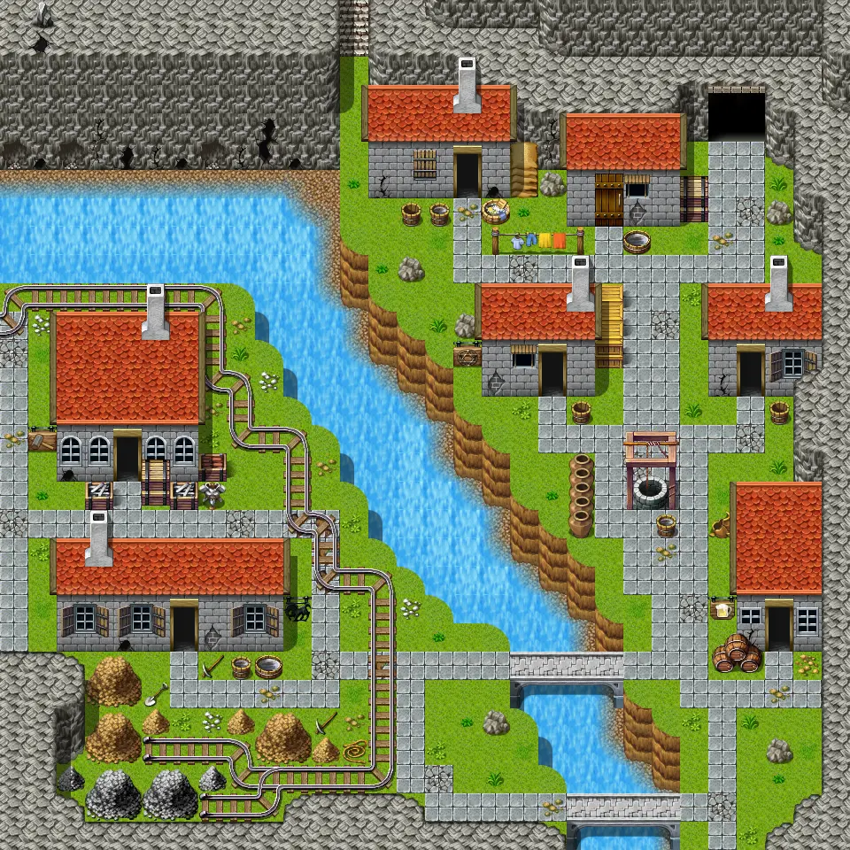
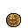

# Brimhaven3

30×30 tiles · part of [World1](index.md)

<label class="lg"><input type="checkbox" data-t="spawn" checked><b>Red</b>&nbsp;Monsters / NPCs</label><label class="lg"><input type="checkbox" data-t="mapchange" checked><b>Blue</b>&nbsp;Exit to another map</label><label class="lg"><input type="checkbox" data-t="container" checked><b>Yellow</b>&nbsp;Container (click to see contents)</label><label class="lg"><input type="checkbox" data-t="sign" checked><b>Purple</b>&nbsp;Sign</label><label class="lg"><input type="checkbox" data-t="rest" checked><b>Green</b>&nbsp;Resting place</label><label class="lg"><input type="checkbox" data-t="key" checked><b>Orange dashed</b>&nbsp;Blocked until a quest step / item</label><label class="lg"><input type="checkbox" data-t="script"><b>Grey dotted</b>&nbsp;Scripted event</label><label class="lg"><input type="checkbox" data-t="replace"><b>White dotted</b>&nbsp;Changes during a quest</label>

## Exits

- [Brimhaven1](brimhaven1.md)
- [Brimhaven6](brimhaven6.md)
- [Brimhaven7](brimhaven7.md)
- [Brimhaven brother1](brimhaven_brother1.md)
- [Brimhaven brother2](brimhaven_brother2.md)
- [Brimhaven employee](brimhaven_employee.md)
- [Brimhaven fortune teller](brimhaven_fortune_teller.md)
- [Brimhaven inn east](brimhaven_inn_east.md)
- [Brimhaven metalsmith](brimhaven_metalsmith.md)
- [Brimhaven tavern1](brimhaven_tavern1.md)

## Monsters & NPCs here

| Name | HP |
|---|---|
| [Playing children](../monsters/brv_playing_child1.md) | 0 |
| [Commoner](../monsters/brv_villager1.md) | 0 |
| [Playing child](../monsters/brv_playing_child3.md) | 0 |
| [Guard](../monsters/brv_exit_guard.md) | 0 |
| [Fisherman](../monsters/brv_fisher.md) | 0 |
| [Commoner](../monsters/brv_villager14.md) | 0 |
| [Fish](../monsters/brv_fish1.md) | 0 |
| [Playing child](../monsters/brv_playing_child2.md) | 0 |
| [Commoner](../monsters/brv_villager15.md) | 0 |
| [Playing child](../monsters/brv_playing_child4.md) | 0 |
| [Guard](../monsters/guard_advent.md) | 0 |
| [Fish](../monsters/brv_fish2.md) | 0 |
| [Ball](../monsters/brv_ball.md) | 0 |
| [Commoner](../monsters/brv_villager4.md) | 0 |

<small>Map ID: `brimhaven3` · Data from v0.8.18</small>
