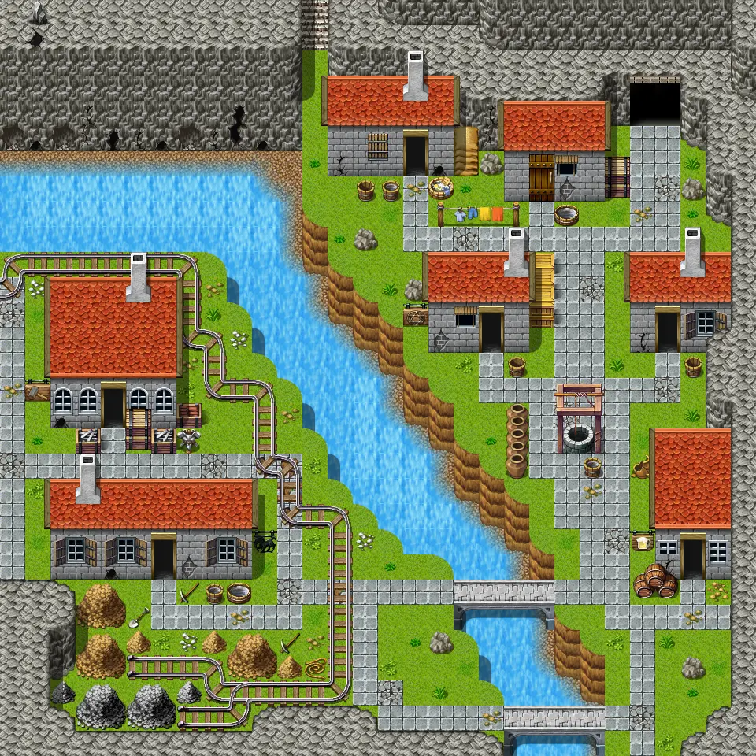
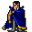

# Brimhaven 3

| | |
|---|---|
| **Map ID** | `brimhaven3` |
| **Region** | In Brimhaven (settlement) |
| **Type** | Indoors / underground |
| **Size** | 30×30 tiles |
| **World map** | [World 1](index.md) |
| **Introduced** | [v0.7.11](../versions/0.7.11.md) |
| **NPCs** | 12 |
| **Quests** | 2 |

**Brimhaven 3** is an indoor map, in Brimhaven (settlement). It has 12 NPCs, and no enemies. Exits lead to Brimhaven 7, Brimhaven 1, Brimhaven 6, Brimhaven brother 1 and 6 more.

## Map

<label class="lg"><input type="checkbox" data-t="spawn" checked><b>Red</b>&nbsp;Monsters / NPCs</label><label class="lg"><input type="checkbox" data-t="mapchange" checked><b>Blue</b>&nbsp;Exit to another map</label><label class="lg"><input type="checkbox" data-t="container" checked><b>Yellow</b>&nbsp;Container (click to see contents)</label><label class="lg"><input type="checkbox" data-t="sign" checked><b>Purple</b>&nbsp;Sign</label><label class="lg"><input type="checkbox" data-t="rest" checked><b>Green</b>&nbsp;Resting place</label><label class="lg"><input type="checkbox" data-t="key" checked><b>Orange dashed</b>&nbsp;Blocked until a quest step / item</label><label class="lg"><input type="checkbox" data-t="script"><b>Grey dotted</b>&nbsp;Scripted event</label><label class="lg"><input type="checkbox" data-t="replace"><b>White dotted</b>&nbsp;Changes during a quest</label><label class="lg"><input type="checkbox" data-t="pin" checked><b>Numbers</b>&nbsp;Numbered key points (see the key below the map)</label>

<a class="pin pin-exit" href="#key-1" style="left:25.000%;top:1.667%" title="Exit (north): to [Brimhaven 7](brimhaven7.md)">1</a><a class="pin pin-exit" href="#key-2" style="left:1.667%;top:55.000%" title="Exit (west): to [Brimhaven 1](brimhaven1.md)">2</a><a class="pin pin-exit" href="#key-3" style="left:86.667%;top:15.000%" title="Exit (stairs / passage): to [Brimhaven 6](brimhaven6.md)">3</a><a class="pin pin-exit" href="#key-4" style="left:55.000%;top:21.667%" title="Exit (stairs / passage): to [Brimhaven brother 1](brimhaven_brother1.md)">4</a><a class="pin pin-exit" href="#key-5" style="left:71.667%;top:25.000%" title="Exit (stairs / passage): to [Brimhaven brother 2](brimhaven_brother2.md)">5</a><a class="pin pin-exit" href="#key-6" style="left:88.333%;top:45.000%" title="Exit (stairs / passage): to [Brimhaven employee](brimhaven_employee.md)">6</a><a class="pin pin-exit" href="#key-7" style="left:65.000%;top:45.000%" title="Exit (stairs / passage): to [Brimhaven fortune teller](brimhaven_fortune_teller.md)">7</a><a class="pin pin-exit" href="#key-8" style="left:21.667%;top:75.000%" title="Exit (stairs / passage): to [Brimhaven inn east](brimhaven_inn_east.md)">8</a><a class="pin pin-exit" href="#key-9" style="left:15.000%;top:55.000%" title="Exit (stairs / passage): to [Brimhaven metalsmith](brimhaven_metalsmith.md)">9</a><a class="pin pin-exit" href="#key-10" style="left:91.667%;top:75.000%" title="Exit (stairs / passage): to [Brimhaven tavern 1](brimhaven_tavern1.md)">10</a><a id="pin-npc-brv_ball" class="pin pin-npc" href="#key-11" style="left:85.000%;top:95.000%" title="[Ball](../../monsters/brv_ball.md): NPC">11</a><a id="pin-npc-brv_villager15" class="pin pin-npc" href="#key-12" style="left:28.333%;top:55.000%" title="[Commoner](../../monsters/rg_villager1.md#v-brv_villager15): NPC">12</a><a id="pin-npc-brv_villager14" class="pin pin-npc" href="#key-13" style="left:35.000%;top:78.333%" title="[Commoner](../../monsters/rg_villager1.md#v-brv_villager14): NPC">13</a><a id="pin-npc-brv_villager1" class="pin pin-npc" href="#key-14" style="left:75.000%;top:31.667%" title="[Commoner](../../monsters/rg_villager1.md#v-brv_villager1): NPC">14</a><a id="pin-npc-brv_villager4" class="pin pin-npc" href="#key-15" style="left:85.000%;top:58.333%" title="[Commoner](../../monsters/rg_villager1.md#v-brv_villager4): NPC">15</a><a id="pin-npc-brv_fisher" class="pin pin-npc" href="#key-16" style="left:65.000%;top:78.333%" title="[Fisherman](../../monsters/brv_fisher.md): NPC">16</a><a id="pin-npc-brv_exit_guard" class="pin pin-npc" href="#key-17" style="left:88.333%;top:18.333%" title="[Guard](../../monsters/guard.md#v-brv_exit_guard): 1 quest">17</a><a id="pin-npc-guard_advent" class="pin pin-npc" href="#key-18" style="left:25.000%;top:85.000%" title="[Guard](../../monsters/guard.md#v-guard_advent): NPC">18</a><a id="pin-npc-brv_playing_child2" class="pin pin-npc" href="#key-19" style="left:88.333%;top:88.333%" title="[Playing child](../../monsters/brv_playing_child2.md): NPC">19</a><a id="pin-npc-brv_playing_child4" class="pin pin-npc" href="#key-20" style="left:88.333%;top:91.667%" title="[Playing child](../../monsters/brv_playing_child2.md#v-brv_playing_child4): NPC">20</a><a id="pin-npc-brv_playing_child3" class="pin pin-npc" href="#key-21" style="left:85.000%;top:88.333%" title="[Playing child](../../monsters/brv_playing_child2.md#v-brv_playing_child3): NPC">21</a><a id="pin-npc-brv_playing_child1" class="pin pin-npc" href="#key-22" style="left:85.000%;top:98.333%" title="[Playing children](../../monsters/brv_playing_child1.md): NPC">22</a><a class="pin pin-script" href="#key-23" style="left:91.667%;top:78.333%" title="Quest trigger: Scripted event: advances the quest: hidden story flag “quest_burhczyd_nd” to stage 510 (“510=show oven in Brimhaven”)">23</a><a class="pin pin-replace" href="#key-24" style="left:71.886%;top:20.834%" title="Changes during a quest: This area changes during the quest: hidden story flag “brv_nondisplay_multipurpose” (stage 20: “brother2_door_opened”)">24</a><a class="pin pin-key" href="#key-25" style="left:66.667%;top:95.000%" title="Blocked passage: Unlocked during the quest: Search for Andor (stage 1: “My father Mikhail says that Andor has not been home since yesterday. I should go look for him in the village.”)">25</a><a class="pin pin-key" href="#key-25" style="left:70.000%;top:78.333%" title="Blocked passage: Unlocked during the quest: Search for Andor (stage 1: “My father Mikhail says that Andor has not been home since yesterday. I should go look for him in the village.”)">25</a><a class="pin pin-key" href="#key-26" style="left:73.349%;top:27.194%" title="Blocked passage: Unlocked during the quest: hidden story flag “brv_nondisplay_multipurpose” (stage 20: “brother2_door_opened”)">26</a><a class="pin pin-key" href="#key-27" style="left:86.886%;top:12.500%" title="Blocked passage: Closed off once you reach this point in the quest: hidden story flag “brv_nondisplay” (stage 100: “Leaving Brimhaven is forbidden”)">27</a><a class="pin pin-key" href="#key-28" style="left:82.066%;top:97.814%" title="Blocked passage: Unlocked during the quest: hidden story flag “brv_nondisplay” (stage 143: “Never true”)">28</a>

??? abstract "Key to the numbers on the map"

    | # | What | Details |
    |---|---|---|
    | 1 | Exit (north) | to [Brimhaven 7](brimhaven7.md) |
    | 2 | Exit (west) | to [Brimhaven 1](brimhaven1.md) |
    | 3 | Exit (stairs / passage) | to [Brimhaven 6](brimhaven6.md) |
    | 4 | Exit (stairs / passage) | to [Brimhaven brother 1](brimhaven_brother1.md) |
    | 5 | Exit (stairs / passage) | to [Brimhaven brother 2](brimhaven_brother2.md) |
    | 6 | Exit (stairs / passage) | to [Brimhaven employee](brimhaven_employee.md) |
    | 7 | Exit (stairs / passage) | to [Brimhaven fortune teller](brimhaven_fortune_teller.md) |
    | 8 | Exit (stairs / passage) | to [Brimhaven inn east](brimhaven_inn_east.md) |
    | 9 | Exit (stairs / passage) | to [Brimhaven metalsmith](brimhaven_metalsmith.md) |
    | 10 | Exit (stairs / passage) | to [Brimhaven tavern 1](brimhaven_tavern1.md) |
    | 11 | [Ball](../monsters/brv_ball.md) | NPC |
    | 12 | [Commoner](../monsters/rg_villager1.md#v-brv_villager15) | NPC |
    | 13 | [Commoner](../monsters/rg_villager1.md#v-brv_villager14) | NPC |
    | 14 | [Commoner](../monsters/rg_villager1.md#v-brv_villager1) | NPC |
    | 15 | [Commoner](../monsters/rg_villager1.md#v-brv_villager4) | NPC |
    | 16 | [Fisherman](../monsters/brv_fisher.md) | NPC |
    | 17 | [Guard](../monsters/guard.md#v-brv_exit_guard) | 1 quest |
    | 18 | [Guard](../monsters/guard.md#v-guard_advent) | NPC |
    | 19 | [Playing child](../monsters/brv_playing_child2.md) | NPC |
    | 20 | [Playing child](../monsters/brv_playing_child2.md#v-brv_playing_child4) | NPC |
    | 21 | [Playing child](../monsters/brv_playing_child2.md#v-brv_playing_child3) | NPC |
    | 22 | [Playing children](../monsters/brv_playing_child1.md) | NPC |
    | 23 | Quest trigger | Scripted event: advances the quest: hidden story flag “quest_burhczyd_nd” to stage 510 (“510=show oven in Brimhaven”) |
    | 24 | Changes during a quest | This area changes during the quest: hidden story flag “brv_nondisplay_multipurpose” (stage 20: “brother2_door_opened”) |
    | 25 | Blocked passage | Unlocked during the quest: Search for Andor (stage 1: “My father Mikhail says that Andor has not been home since yesterday. I should go look for him in the village.”) |
    | 26 | Blocked passage | Unlocked during the quest: hidden story flag “brv_nondisplay_multipurpose” (stage 20: “brother2_door_opened”) |
    | 27 | Blocked passage | Closed off once you reach this point in the quest: hidden story flag “brv_nondisplay” (stage 100: “Leaving Brimhaven is forbidden”) |
    | 28 | Blocked passage | Unlocked during the quest: hidden story flag “brv_nondisplay” (stage 143: “Never true”) |

Verified against v0.8.18 map data.

## Connections

| Direction | Leads to | Region there | Map # |
|---|---|---|---|
| North | [Brimhaven 7](brimhaven7.md) | Brimhaven | 1 |
| West | [Brimhaven 1](brimhaven1.md) | Brimhaven | 2 |
| Stairs / passage | [Brimhaven 6](brimhaven6.md) | Brimhaven | 3 |
| Stairs / passage | [Brimhaven brother 1](brimhaven_brother1.md) | Brimhaven | 4 |
| Stairs / passage | [Brimhaven brother 2](brimhaven_brother2.md) | Brimhaven | 5 |
| Stairs / passage | [Brimhaven employee](brimhaven_employee.md) | Brimhaven | 6 |
| Stairs / passage | [Brimhaven fortune teller](brimhaven_fortune_teller.md) | Brimhaven | 7 |
| Stairs / passage | [Brimhaven inn east](brimhaven_inn_east.md) | Brimhaven | 8 |
| Stairs / passage | [Brimhaven metalsmith](brimhaven_metalsmith.md) | Brimhaven | 9 |
| Stairs / passage | [Brimhaven tavern 1](brimhaven_tavern1.md) | Brimhaven | 10 |

## NPCs

- [Ball](../monsters/brv_ball.md) (#11)
- [Commoner](../monsters/rg_villager1.md#v-brv_villager15) (#12)
- [Commoner](../monsters/rg_villager1.md#v-brv_villager14) (#13)
- [Commoner](../monsters/rg_villager1.md#v-brv_villager1) (#14)
- [Commoner](../monsters/rg_villager1.md#v-brv_villager4) (#15)
- [Fisherman](../monsters/brv_fisher.md) (#16)
- [Guard](../monsters/guard.md#v-brv_exit_guard) — quests: [Much water](../quests/brv_flood.md) (#17)
- [Guard](../monsters/guard.md#v-guard_advent) (#18)
- [Playing child](../monsters/brv_playing_child2.md) (#19)
- [Playing child](../monsters/brv_playing_child2.md#v-brv_playing_child4) (#20)
- [Playing child](../monsters/brv_playing_child2.md#v-brv_playing_child3) (#21)
- [Playing children](../monsters/brv_playing_child1.md) (#22)

**Scenery:** [Fish](../monsters/brv_fish1.md), [Fish](../monsters/brv_fish1.md#v-brv_fish2)

## Quests

- [Much water](../quests/brv_flood.md): [Guard](../monsters/guard.md#v-brv_exit_guard) is involved; something on this map advances it
- [Search for Andor](../quests/andor.md): blocked passage opens at stage 1
- [Brimhaven multipurpose story flags (hidden flag)](../quests/brv_nondisplay_multipurpose.md): blocked passage opens at stage 20; part of the map changes at stage 20; something on this map advances it
- [Brimhaven story flags (hidden flag)](../quests/brv_nondisplay.md): blocked passage closes at stage 100; blocked passage opens at stage 143
- [Young merchant story flags (hidden flag)](../quests/quest_burhczyd_nd.md): something on this map advances it; stepping on a trigger here sets stage 510

## Points of interest

- **Quest trigger** (#23): Scripted event: advances the quest: hidden story flag “quest_burhczyd_nd” to stage 510 (“510=show oven in Brimhaven”)
- **Changes during a quest** (#24): This area changes during the quest: hidden story flag “brv_nondisplay_multipurpose” (stage 20: “brother2_door_opened”)
- **Blocked passage** (#25): Unlocked during the quest: Search for Andor (stage 1: “My father Mikhail says that Andor has not been home since yesterday. I should go look for him in the village.”)
- **Blocked passage** (#26): Unlocked during the quest: hidden story flag “brv_nondisplay_multipurpose” (stage 20: “brother2_door_opened”)
- **Blocked passage** (#27): Closed off once you reach this point in the quest: hidden story flag “brv_nondisplay” (stage 100: “Leaving Brimhaven is forbidden”)
- **Blocked passage** (#28): Unlocked during the quest: hidden story flag “brv_nondisplay” (stage 143: “Never true”)

## Version history

| Version | Change |
|---|---|
| [v0.7.11](../versions/0.7.11.md) | Added |
| [v0.7.13](../versions/0.7.13.md) | Map layout or objects changed |
| [v0.8.2](../versions/0.8.2.md) | Map layout or objects changed |

Verified against v0.8.18 and every earlier release back to v0.7.0 (game data compared release by release).

## Community notes

<small>Written by players, not generated from game data. **Observations**: what players notice in-game · **Lore**: the in-world story · **Trivia**: real-world facts, references, development history · **Theory / speculation**: unconfirmed ideas; may just be unfinished content</small>

### Observations

*No notes yet. Contributions are welcome: [add a note](https://github.com/asdfghjkl628/Andor-s-Trail-Wikiiii/new/main/notes/maps?filename=brimhaven3.md&value=%23%23%20Observations%0A%0A%3C%21--%20what%20players%20notice%20in-game%20--%3E%0A%0A%23%23%20Lore%0A%0A%3C%21--%20the%20in-world%20story%20--%3E%0A%0A%23%23%20Trivia%0A%0A%3C%21--%20real-world%20facts%2C%20references%2C%20development%20history%20--%3E%0A%0A%23%23%20Theory%20/%20speculation%0A%0A%3C%21--%20unconfirmed%20ideas%3B%20may%20just%20be%20unfinished%20content%20--%3E%0A).*

### Lore

*No notes yet. Contributions are welcome: [add a note](https://github.com/asdfghjkl628/Andor-s-Trail-Wikiiii/new/main/notes/maps?filename=brimhaven3.md&value=%23%23%20Observations%0A%0A%3C%21--%20what%20players%20notice%20in-game%20--%3E%0A%0A%23%23%20Lore%0A%0A%3C%21--%20the%20in-world%20story%20--%3E%0A%0A%23%23%20Trivia%0A%0A%3C%21--%20real-world%20facts%2C%20references%2C%20development%20history%20--%3E%0A%0A%23%23%20Theory%20/%20speculation%0A%0A%3C%21--%20unconfirmed%20ideas%3B%20may%20just%20be%20unfinished%20content%20--%3E%0A).*

### Trivia

*No notes yet. Contributions are welcome: [add a note](https://github.com/asdfghjkl628/Andor-s-Trail-Wikiiii/new/main/notes/maps?filename=brimhaven3.md&value=%23%23%20Observations%0A%0A%3C%21--%20what%20players%20notice%20in-game%20--%3E%0A%0A%23%23%20Lore%0A%0A%3C%21--%20the%20in-world%20story%20--%3E%0A%0A%23%23%20Trivia%0A%0A%3C%21--%20real-world%20facts%2C%20references%2C%20development%20history%20--%3E%0A%0A%23%23%20Theory%20/%20speculation%0A%0A%3C%21--%20unconfirmed%20ideas%3B%20may%20just%20be%20unfinished%20content%20--%3E%0A).*

### Theory / speculation

*No notes yet. Contributions are welcome: [add a note](https://github.com/asdfghjkl628/Andor-s-Trail-Wikiiii/new/main/notes/maps?filename=brimhaven3.md&value=%23%23%20Observations%0A%0A%3C%21--%20what%20players%20notice%20in-game%20--%3E%0A%0A%23%23%20Lore%0A%0A%3C%21--%20the%20in-world%20story%20--%3E%0A%0A%23%23%20Trivia%0A%0A%3C%21--%20real-world%20facts%2C%20references%2C%20development%20history%20--%3E%0A%0A%23%23%20Theory%20/%20speculation%0A%0A%3C%21--%20unconfirmed%20ideas%3B%20may%20just%20be%20unfinished%20content%20--%3E%0A).*

??? info "Technical information"

    | | |
    |---|---|
    | Map ID | `brimhaven3` |
    | File | `res/xml/brimhaven3.tmx` |
    | Size | 30×30 tiles (960×960 px) |
    | outdoors property | – |
    | Layers drawn | ground, objects, above, top |
    | Tilesets | map_bed_1, map_border_1, map_bridge_1, map_bridge_2, map_broken_1, map_cavewall_1, map_cavewall_2, map_cavewall_3, map_cavewall_4, map_chair_table_1, map_chair_table_2, map_crate_1, map_cupboard_1, map_curtain_1, map_entrance_1, map_entrance_2, map_fence_1, map_fence_2, map_fence_3, map_fence_4, map_ground_1, map_ground_2, map_ground_3, map_ground_4, map_ground_5, map_ground_6, map_ground_7, map_ground_8, map_guynmart, map_house_1, map_house_2, map_indoor_1, map_indoor_2, map_kitchen_1, map_outdoor_1, map_pillar_1, map_pillar_2, map_plant_1, map_plant_2, map_rock_1, map_rock_2, map_roof_1, map_roof_2, map_roof_3, map_shop_1, map_sign_ladder_1, map_table_1, map_trail_1, map_transition_1, map_transition_2, map_transition_3, map_transition_4, map_transition_5, map_tree_1, map_tree_2, map_wall_1, map_wall_2, map_wall_3, map_wall_4, map_window_1, map_window_2 |
    | Map objects | spawn: 14, mapchange: 10, key: 5, script: 1, replace: 1 |
    | World map position | segment `world1`, x 457, y 265 |

<small>Data from v0.8.18</small>
