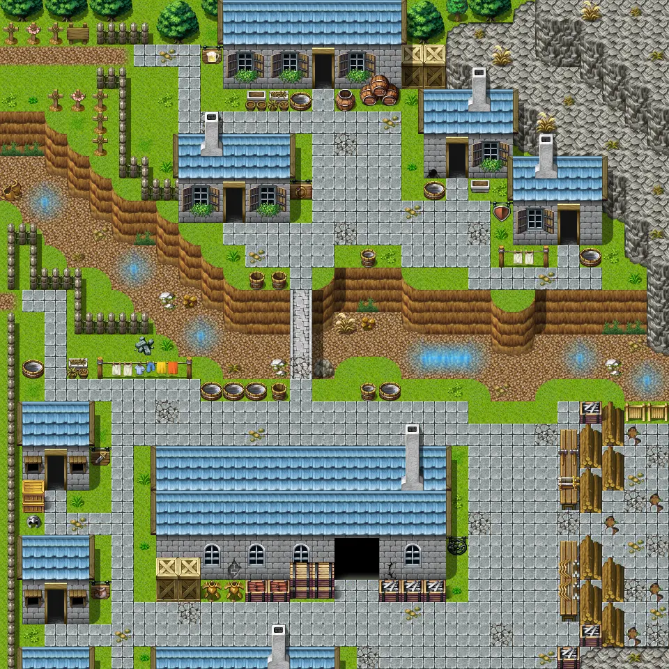
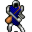

# Brimhaven4

30×30 tiles · part of [World1](index.md)

<label class="lg"><input type="checkbox" data-t="spawn" checked><b>Red</b>&nbsp;Monsters / NPCs</label><label class="lg"><input type="checkbox" data-t="mapchange" checked><b>Blue</b>&nbsp;Exit to another map</label><label class="lg"><input type="checkbox" data-t="container" checked><b>Yellow</b>&nbsp;Container (click to see contents)</label><label class="lg"><input type="checkbox" data-t="sign" checked><b>Purple</b>&nbsp;Sign</label><label class="lg"><input type="checkbox" data-t="rest" checked><b>Green</b>&nbsp;Resting place</label><label class="lg"><input type="checkbox" data-t="key" checked><b>Orange dashed</b>&nbsp;Blocked until a quest step / item</label><label class="lg"><input type="checkbox" data-t="script"><b>Grey dotted</b>&nbsp;Scripted event</label><label class="lg"><input type="checkbox" data-t="replace"><b>White dotted</b>&nbsp;Changes during a quest</label>

## Exits

- [Brimhaven1](brimhaven1.md)
- [Brimhaven2](brimhaven2.md)
- [Brimhaven4](brimhaven4.md)
- [Brimhaven anakis house](brimhaven_anakis_house.md)
- [Brimhaven armor1](brimhaven_armor1.md)
- [Brimhaven general1](brimhaven_general1.md)
- [Brimhaven shop](brimhaven_shop.md)
- [Brimhaven tavern west](brimhaven_tavern_west.md)
- [Brimhaven warehouse](brimhaven_warehouse.md)
- [Brimhaven weapon1](brimhaven_weapon1.md)
- [Waytobrimhaven3](waytobrimhaven3.md)
- [Waytobrimhaven6](waytobrimhaven6.md)

## Monsters & NPCs here

| Name | HP |
|---|---|
| [Commoner](../monsters/brv_villager1.md) | 0 |
| [Commoner](../monsters/brv_villager5.md) | 0 |
| [Guard](../monsters/brv_exit_guard.md) | 0 |
| [Feygard soldier](../monsters/patrol_roaming.md) | 0 |
| [Mustura](../monsters/brv_guard_captain.md) | 0 |
| [Guard](../monsters/brv_shop_guard.md) | 0 |
| [Commoner](../monsters/brv_villager2.md) | 0 |
| [Ogea](../monsters/brv_villager3.md) | 0 |
| [Commoner](../monsters/brv_villager4.md) | 0 |

<small>Map ID: `brimhaven4` · Data from v0.8.18</small>
