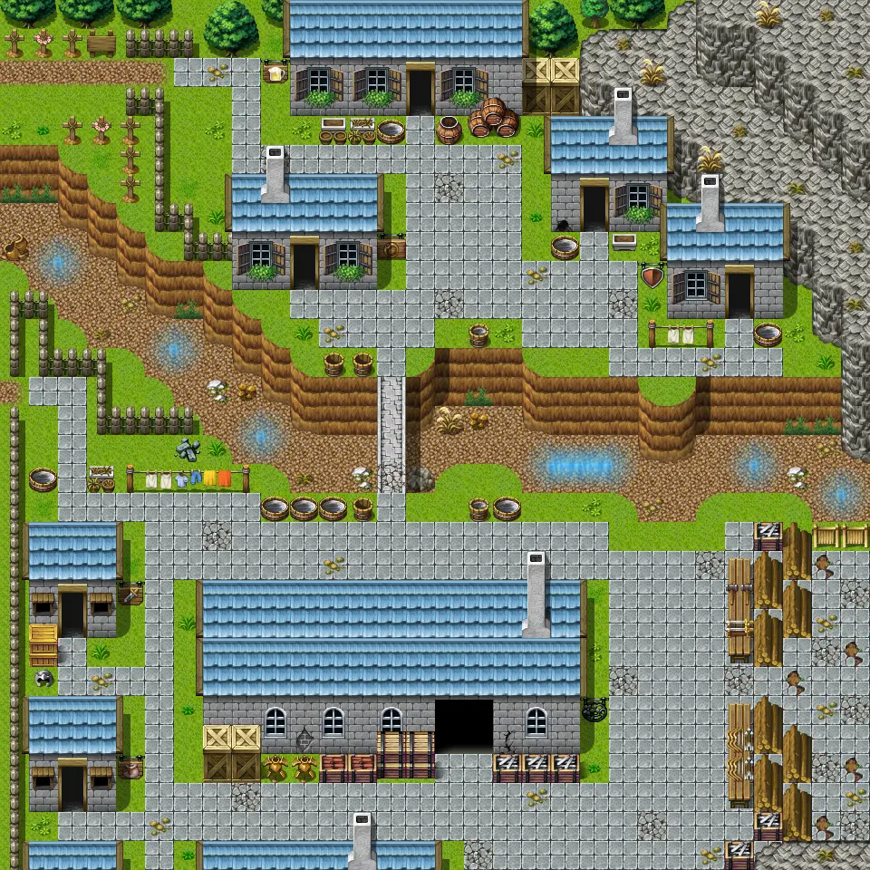

# Brimhaven4

| | |
|---|---|
| **Map ID** | `brimhaven4` |
| **Region** | In Brimhaven (settlement) |
| **Type** | Indoors / underground |
| **Size** | 30×30 tiles |
| **World map** | [World1](index.md) |
| **Introduced** | [v0.7.11](../versions/0.7.11.md) |
| **NPCs** | 9 |
| **Quests** | 3 |

**Brimhaven4** is an indoor map, in Brimhaven (settlement). It has 9 NPCs, and no enemies. Exits lead to Brimhaven1, Brimhaven2, Waytobrimhaven3, Waytobrimhaven6 and 8 more.

## Map

<label class="lg"><input type="checkbox" data-t="spawn" checked><b>Red</b>&nbsp;Monsters / NPCs</label><label class="lg"><input type="checkbox" data-t="mapchange" checked><b>Blue</b>&nbsp;Exit to another map</label><label class="lg"><input type="checkbox" data-t="container" checked><b>Yellow</b>&nbsp;Container (click to see contents)</label><label class="lg"><input type="checkbox" data-t="sign" checked><b>Purple</b>&nbsp;Sign</label><label class="lg"><input type="checkbox" data-t="rest" checked><b>Green</b>&nbsp;Resting place</label><label class="lg"><input type="checkbox" data-t="key" checked><b>Orange dashed</b>&nbsp;Blocked until a quest step / item</label><label class="lg"><input type="checkbox" data-t="script"><b>Grey dotted</b>&nbsp;Scripted event</label><label class="lg"><input type="checkbox" data-t="replace"><b>White dotted</b>&nbsp;Changes during a quest</label><label class="lg"><input type="checkbox" data-t="pin" checked><b>Numbers</b>&nbsp;Numbered key points (see the key below the map)</label>

<a class="pin pin-exit" href="#key-1" style="left:98.333%;top:56.667%" title="Exit (east): to [Brimhaven1](brimhaven1.md)">1</a><a class="pin pin-exit" href="#key-1" style="left:98.333%;top:80.000%" title="Exit (east): to [Brimhaven1](brimhaven1.md)">1</a><a class="pin pin-exit" href="#key-2" style="left:66.667%;top:98.333%" title="Exit (south): to [Brimhaven2](brimhaven2.md)">2</a><a class="pin pin-exit" href="#key-2" style="left:18.333%;top:98.333%" title="Exit (south): to [Brimhaven2](brimhaven2.md)">2</a><a class="pin pin-exit" href="#key-3" style="left:1.667%;top:25.000%" title="Exit (west): to [Waytobrimhaven3](waytobrimhaven3.md)">3</a><a class="pin pin-exit" href="#key-3" style="left:1.667%;top:11.667%" title="Exit (west): to [Waytobrimhaven3](waytobrimhaven3.md)">3</a><a class="pin pin-exit" href="#key-4" style="left:1.667%;top:45.000%" title="Exit (west): to [Waytobrimhaven6](waytobrimhaven6.md)">4</a><a class="pin pin-exit" href="#key-5" style="left:51.667%;top:51.667%" title="Exit (stairs / passage): to [Brimhaven4](brimhaven4.md)">5</a><a class="pin pin-exit" href="#key-5" style="left:38.333%;top:51.667%" title="Exit (stairs / passage): to [Brimhaven4](brimhaven4.md)">5</a><a class="pin pin-exit" href="#key-6" style="left:68.333%;top:25.000%" title="Exit (stairs / passage): to [Brimhaven anakis house](brimhaven_anakis_house.md)">6</a><a class="pin pin-exit" href="#key-7" style="left:85.000%;top:35.000%" title="Exit (stairs / passage): to [Brimhaven armor1](brimhaven_armor1.md)">7</a><a class="pin pin-exit" href="#key-8" style="left:8.333%;top:91.667%" title="Exit (stairs / passage): to [Brimhaven general1](brimhaven_general1.md)">8</a><a class="pin pin-exit" href="#key-9" style="left:35.000%;top:31.667%" title="Exit (stairs / passage): to [Brimhaven shop](brimhaven_shop.md)">9</a><a class="pin pin-exit" href="#key-10" style="left:48.333%;top:11.667%" title="Exit (stairs / passage): to [Brimhaven tavern west](brimhaven_tavern_west.md)">10</a><a class="pin pin-exit" href="#key-11" style="left:53.333%;top:85.000%" title="Exit (stairs / passage): to [Brimhaven warehouse](brimhaven_warehouse.md)">11</a><a class="pin pin-exit" href="#key-12" style="left:8.333%;top:71.667%" title="Exit (stairs / passage): to [Brimhaven weapon1](brimhaven_weapon1.md)">12</a><a id="pin-npc-brv_villager2" class="pin pin-npc" href="#key-13" style="left:38.333%;top:65.000%" title="[Commoner](../../monsters/rg_villager1.md#v-brv_villager2): NPC">13</a><a id="pin-npc-brv_villager4" class="pin pin-npc" href="#key-14" style="left:25.000%;top:11.667%" title="[Commoner](../../monsters/rg_villager1.md#v-brv_villager4): NPC">14</a><a id="pin-npc-brv_villager1" class="pin pin-npc" href="#key-15" style="left:55.000%;top:21.667%" title="[Commoner](../../monsters/rg_villager1.md#v-brv_villager1): NPC">15</a><a id="pin-npc-brv_villager5" class="pin pin-npc" href="#key-16" style="left:18.333%;top:88.333%" title="[Commoner](../../monsters/rg_villager1.md#v-brv_villager5): NPC">16</a><a id="pin-npc-patrol_roaming" class="pin pin-npc" href="#key-17" style="left:58.333%;top:65.000%" title="[Feygard soldier](../../monsters/patrol_roaming.md): NPC">17</a><a id="pin-npc-brv_shop_guard" class="pin pin-npc" href="#key-18" style="left:31.667%;top:35.000%" title="[Guard](../../monsters/guard.md#v-brv_shop_guard): NPC">18</a><a id="pin-npc-brv_exit_guard" class="pin pin-npc" href="#key-19" style="left:5.000%;top:8.333%" title="[Guard](../../monsters/guard.md#v-brv_exit_guard): 1 quest">19</a><a id="pin-npc-brv_guard_captain" class="pin pin-npc" href="#key-20" style="left:55.000%;top:91.667%" title="[Mustura](../../monsters/brv_guard_captain.md): 2 quests">20</a><a id="pin-npc-brv_villager3" class="pin pin-npc" href="#key-21" style="left:81.667%;top:88.333%" title="[Ogea](../../monsters/brv_villager3.md): 1 quest">21</a><a class="pin pin-script" href="#key-22" style="left:48.333%;top:61.667%" title="Quest trigger: Scripted event: advances the quest: hidden story flag “brv_nondisplay” to stage 142 (“Confiscated bonemeals”) (+1 more quest(s))">22</a><a class="pin pin-sign" href="#key-23" style="left:11.667%;top:5.000%" title="Sign: “Welcome to Brimhaven”">23</a><a class="pin pin-key" href="#key-24" style="left:48.553%;top:57.500%" title="Blocked passage: Closed off once you reach this point in the quest: hidden story flag “brv_nondisplay” (stage 140: “Movement blocked by the Feygard patrol”)">24</a><a class="pin pin-key" href="#key-25" style="left:1.886%;top:9.167%" title="Blocked passage: Closed off once you reach this point in the quest: hidden story flag “brv_nondisplay” (stage 100: “Leaving Brimhaven is forbidden”)">25</a><a class="pin pin-key" href="#key-25" style="left:1.886%;top:42.500%" title="Blocked passage: Closed off once you reach this point in the quest: hidden story flag “brv_nondisplay” (stage 100: “Leaving Brimhaven is forbidden”)">25</a><a class="pin pin-replace" href="#key-26" style="left:50.000%;top:40.000%" title="Changes during a quest: This area changes during the quest: hidden story flag “brv_nondisplay” (stage 83: “83=stage-3 flood”)">26</a><a class="pin pin-replace" href="#key-27" style="left:50.219%;top:37.500%" title="Changes during a quest: This area changes during the quest: hidden story flag “brv_nondisplay” (stage 89: “89=End flood”)">27</a>

??? abstract "Key to the numbers on the map"

    | # | What | Details |
    |---|---|---|
    | 1 | Exit (east) | to [Brimhaven1](brimhaven1.md) |
    | 2 | Exit (south) | to [Brimhaven2](brimhaven2.md) |
    | 3 | Exit (west) | to [Waytobrimhaven3](waytobrimhaven3.md) |
    | 4 | Exit (west) | to [Waytobrimhaven6](waytobrimhaven6.md) |
    | 5 | Exit (stairs / passage) | to [Brimhaven4](brimhaven4.md) |
    | 6 | Exit (stairs / passage) | to [Brimhaven anakis house](brimhaven_anakis_house.md) |
    | 7 | Exit (stairs / passage) | to [Brimhaven armor1](brimhaven_armor1.md) |
    | 8 | Exit (stairs / passage) | to [Brimhaven general1](brimhaven_general1.md) |
    | 9 | Exit (stairs / passage) | to [Brimhaven shop](brimhaven_shop.md) |
    | 10 | Exit (stairs / passage) | to [Brimhaven tavern west](brimhaven_tavern_west.md) |
    | 11 | Exit (stairs / passage) | to [Brimhaven warehouse](brimhaven_warehouse.md) |
    | 12 | Exit (stairs / passage) | to [Brimhaven weapon1](brimhaven_weapon1.md) |
    | 13 | [Commoner](../monsters/rg_villager1.md#v-brv_villager2) | NPC |
    | 14 | [Commoner](../monsters/rg_villager1.md#v-brv_villager4) | NPC |
    | 15 | [Commoner](../monsters/rg_villager1.md#v-brv_villager1) | NPC |
    | 16 | [Commoner](../monsters/rg_villager1.md#v-brv_villager5) | NPC |
    | 17 | [Feygard soldier](../monsters/patrol_roaming.md) | NPC |
    | 18 | [Guard](../monsters/guard.md#v-brv_shop_guard) | NPC |
    | 19 | [Guard](../monsters/guard.md#v-brv_exit_guard) | 1 quest |
    | 20 | [Mustura](../monsters/brv_guard_captain.md) | 2 quests |
    | 21 | [Ogea](../monsters/brv_villager3.md) | 1 quest |
    | 22 | Quest trigger | Scripted event: advances the quest: hidden story flag “brv_nondisplay” to stage 142 (“Confiscated bonemeals”) (+1 more quest(s)) |
    | 23 | Sign | “Welcome to Brimhaven” |
    | 24 | Blocked passage | Closed off once you reach this point in the quest: hidden story flag “brv_nondisplay” (stage 140: “Movement blocked by the Feygard patrol”) |
    | 25 | Blocked passage | Closed off once you reach this point in the quest: hidden story flag “brv_nondisplay” (stage 100: “Leaving Brimhaven is forbidden”) |
    | 26 | Changes during a quest | This area changes during the quest: hidden story flag “brv_nondisplay” (stage 83: “83=stage-3 flood”) |
    | 27 | Changes during a quest | This area changes during the quest: hidden story flag “brv_nondisplay” (stage 89: “89=End flood”) |

Verified against v0.8.18 map data.

## Connections

| Direction | Leads to | Region there | Map # |
|---|---|---|---|
| East | [Brimhaven1](brimhaven1.md) | Brimhaven | 1 |
| South | [Brimhaven2](brimhaven2.md) | Brimhaven | 2 |
| West | [Waytobrimhaven3](waytobrimhaven3.md) | Brimhaven | 3 |
| West | [Waytobrimhaven6](waytobrimhaven6.md) | Brimhaven | 4 |
| Stairs / passage | [Brimhaven4](brimhaven4.md) | Brimhaven | 5 |
| Stairs / passage | [Brimhaven anakis house](brimhaven_anakis_house.md) | Brimhaven | 6 |
| Stairs / passage | [Brimhaven armor1](brimhaven_armor1.md) | Brimhaven | 7 |
| Stairs / passage | [Brimhaven general1](brimhaven_general1.md) | Brimhaven | 8 |
| Stairs / passage | [Brimhaven shop](brimhaven_shop.md) | Brimhaven | 9 |
| Stairs / passage | [Brimhaven tavern west](brimhaven_tavern_west.md) | Brimhaven | 10 |
| Stairs / passage | [Brimhaven warehouse](brimhaven_warehouse.md) | Brimhaven | 11 |
| Stairs / passage | [Brimhaven weapon1](brimhaven_weapon1.md) | Brimhaven | 12 |

## NPCs

- [Commoner](../monsters/rg_villager1.md#v-brv_villager2) (#13)
- [Commoner](../monsters/rg_villager1.md#v-brv_villager4) (#14)
- [Commoner](../monsters/rg_villager1.md#v-brv_villager1) (#15)
- [Commoner](../monsters/rg_villager1.md#v-brv_villager5) (#16)
- [Feygard soldier](../monsters/patrol_roaming.md) (#17)
- [Guard](../monsters/guard.md#v-brv_shop_guard) (#18)
- [Guard](../monsters/guard.md#v-brv_exit_guard) — quests: [Much water](../quests/brv_flood.md) (#19)
- [Mustura](../monsters/brv_guard_captain.md) — quests: [A place to forge](../quests/place_to_forge.md), [Much water](../quests/brv_flood.md) (#20)
- [Ogea](../monsters/brv_villager3.md) — quests: [A strange looking dagger](../quests/brv_dagger.md) (#21)

## Quests

- [A place to forge](../quests/place_to_forge.md): [Mustura](../monsters/brv_guard_captain.md) is involved
- [A strange looking dagger](../quests/brv_dagger.md): [Ogea](../monsters/brv_villager3.md) is involved
- [Much water](../quests/brv_flood.md): [Guard](../monsters/guard.md#v-brv_exit_guard) is involved; [Mustura](../monsters/brv_guard_captain.md) is involved; something on this map advances it
- [brv_nondisplay (hidden flag)](../quests/brv_nondisplay.md): [Feygard soldier](../monsters/patrol_roaming.md) is involved; [Mustura](../monsters/brv_guard_captain.md) is involved; blocked passage closes at stage 100; blocked passage closes at stage 140; part of the map changes at stage 83; part of the map changes at stage 89; something on this map advances it; stepping on a trigger here sets stage 140; stepping on a trigger here sets stage 142
- [bwmfill_nondisplay (hidden flag)](../quests/bwmfill_nondisplay.md): something on this map advances it; stepping on a trigger here sets stage 40; stepping on a trigger here sets stage 41; stepping on a trigger here sets stage 42; stepping on a trigger here sets stage 43
- [hidden_undertell (hidden flag)](../quests/undertell_hidden.md): [Mustura](../monsters/brv_guard_captain.md) is involved

## Points of interest

- **Quest trigger** (#22): Scripted event: advances the quest: hidden story flag “brv_nondisplay” to stage 142 (“Confiscated bonemeals”) (+1 more quest(s))
- **Sign** (#23): “Welcome to Brimhaven”
- **Blocked passage** (#24): Closed off once you reach this point in the quest: hidden story flag “brv_nondisplay” (stage 140: “Movement blocked by the Feygard patrol”)
- **Blocked passage** (#25): Closed off once you reach this point in the quest: hidden story flag “brv_nondisplay” (stage 100: “Leaving Brimhaven is forbidden”)
- **Changes during a quest** (#26): This area changes during the quest: hidden story flag “brv_nondisplay” (stage 83: “83=stage-3 flood”)
- **Changes during a quest** (#27): This area changes during the quest: hidden story flag “brv_nondisplay” (stage 89: “89=End flood”)

## Version history

| Version | Change |
|---|---|
| [v0.7.11](../versions/0.7.11.md) | Added |
| [v0.8.2](../versions/0.8.2.md) | Map layout or objects changed |

Verified against v0.8.18 and every earlier release back to v0.7.0 (game data compared release by release).

## Community notes

<small>Written by players, not generated from game data. **Observations**: what players notice in-game · **Lore**: the in-world story · **Trivia**: real-world facts, references, development history · **Theory / speculation**: unconfirmed ideas; may just be unfinished content</small>

### Observations

*No notes yet. Contributions are welcome: [add a note](https://github.com/asdfghjkl628/Andor-s-Trail-Wikiiii/new/main/notes/maps?filename=brimhaven4.md&value=%23%23%20Observations%0A%0A%3C%21--%20what%20players%20notice%20in-game%20--%3E%0A%0A%23%23%20Lore%0A%0A%3C%21--%20the%20in-world%20story%20--%3E%0A%0A%23%23%20Trivia%0A%0A%3C%21--%20real-world%20facts%2C%20references%2C%20development%20history%20--%3E%0A%0A%23%23%20Theory%20/%20speculation%0A%0A%3C%21--%20unconfirmed%20ideas%3B%20may%20just%20be%20unfinished%20content%20--%3E%0A).*

### Lore

*No notes yet. Contributions are welcome: [add a note](https://github.com/asdfghjkl628/Andor-s-Trail-Wikiiii/new/main/notes/maps?filename=brimhaven4.md&value=%23%23%20Observations%0A%0A%3C%21--%20what%20players%20notice%20in-game%20--%3E%0A%0A%23%23%20Lore%0A%0A%3C%21--%20the%20in-world%20story%20--%3E%0A%0A%23%23%20Trivia%0A%0A%3C%21--%20real-world%20facts%2C%20references%2C%20development%20history%20--%3E%0A%0A%23%23%20Theory%20/%20speculation%0A%0A%3C%21--%20unconfirmed%20ideas%3B%20may%20just%20be%20unfinished%20content%20--%3E%0A).*

### Trivia

*No notes yet. Contributions are welcome: [add a note](https://github.com/asdfghjkl628/Andor-s-Trail-Wikiiii/new/main/notes/maps?filename=brimhaven4.md&value=%23%23%20Observations%0A%0A%3C%21--%20what%20players%20notice%20in-game%20--%3E%0A%0A%23%23%20Lore%0A%0A%3C%21--%20the%20in-world%20story%20--%3E%0A%0A%23%23%20Trivia%0A%0A%3C%21--%20real-world%20facts%2C%20references%2C%20development%20history%20--%3E%0A%0A%23%23%20Theory%20/%20speculation%0A%0A%3C%21--%20unconfirmed%20ideas%3B%20may%20just%20be%20unfinished%20content%20--%3E%0A).*

### Theory / speculation

*No notes yet. Contributions are welcome: [add a note](https://github.com/asdfghjkl628/Andor-s-Trail-Wikiiii/new/main/notes/maps?filename=brimhaven4.md&value=%23%23%20Observations%0A%0A%3C%21--%20what%20players%20notice%20in-game%20--%3E%0A%0A%23%23%20Lore%0A%0A%3C%21--%20the%20in-world%20story%20--%3E%0A%0A%23%23%20Trivia%0A%0A%3C%21--%20real-world%20facts%2C%20references%2C%20development%20history%20--%3E%0A%0A%23%23%20Theory%20/%20speculation%0A%0A%3C%21--%20unconfirmed%20ideas%3B%20may%20just%20be%20unfinished%20content%20--%3E%0A).*

??? info "Technical information"

    | | |
    |---|---|
    | Map ID | `brimhaven4` |
    | File | `res/xml/brimhaven4.tmx` |
    | Size | 30×30 tiles (960×960 px) |
    | outdoors property | – |
    | Layers drawn | ground, objects, above, top |
    | Tilesets | map_bed_1, map_border_1, map_bridge_1, map_bridge_2, map_broken_1, map_cavewall_1, map_cavewall_2, map_cavewall_3, map_cavewall_4, map_chair_table_1, map_chair_table_2, map_crate_1, map_cupboard_1, map_curtain_1, map_entrance_1, map_entrance_2, map_fence_1, map_fence_2, map_fence_3, map_fence_4, map_ground_1, map_ground_2, map_ground_3, map_ground_4, map_ground_5, map_ground_6, map_ground_7, map_ground_8, map_guynmart, map_house_1, map_house_2, map_indoor_1, map_indoor_2, map_kitchen_1, map_outdoor_1, map_pillar_1, map_pillar_2, map_plant_1, map_plant_2, map_rock_1, map_rock_2, map_roof_1, map_roof_2, map_roof_3, map_shop_1, map_sign_ladder_1, map_table_1, map_trail_1, map_transition_1, map_transition_2, map_transition_3, map_transition_4, map_tree_1, map_tree_2, map_wall_1, map_wall_2, map_wall_3, map_wall_4, map_window_1, map_window_2 |
    | Map objects | mapchange: 16, spawn: 10, key: 3, replace: 2, script: 1, sign: 1 |
    | World map position | segment `world1`, x 395, y 259 |

<small>Data from v0.8.18</small>
