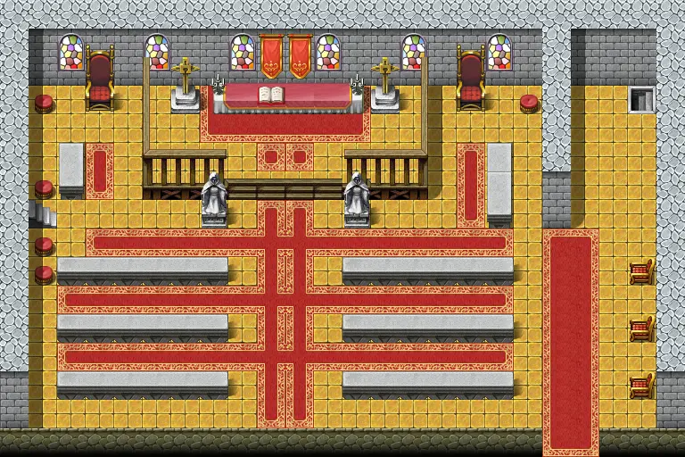
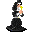
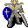

# Brimhaven church

| | |
|---|---|
| **Map ID** | `brimhaven_church` |
| **Region** | In Brimhaven (settlement) |
| **Type** | Indoors / underground |
| **Size** | 24×16 tiles |
| **Introduced** | [v0.7.11](../versions/0.7.11.md) |
| **NPCs** | 4 |
| **Quests** | 2 |

**Brimhaven church** is an indoor map, in Brimhaven (settlement). It has 4 NPCs, and no enemies. Exits lead to Brimhaven church basement, Brimhaven2, Brimhaven church upstairs.

## Map

<label class="lg"><input type="checkbox" data-t="spawn" checked><b>Red</b>&nbsp;Monsters / NPCs</label><label class="lg"><input type="checkbox" data-t="mapchange" checked><b>Blue</b>&nbsp;Exit to another map</label><label class="lg"><input type="checkbox" data-t="container" checked><b>Yellow</b>&nbsp;Container (click to see contents)</label><label class="lg"><input type="checkbox" data-t="sign" checked><b>Purple</b>&nbsp;Sign</label><label class="lg"><input type="checkbox" data-t="rest" checked><b>Green</b>&nbsp;Resting place</label><label class="lg"><input type="checkbox" data-t="key" checked><b>Orange dashed</b>&nbsp;Blocked until a quest step / item</label><label class="lg"><input type="checkbox" data-t="script"><b>Grey dotted</b>&nbsp;Scripted event</label><label class="lg"><input type="checkbox" data-t="replace"><b>White dotted</b>&nbsp;Changes during a quest</label><label class="lg"><input type="checkbox" data-t="pin" checked><b>Numbers</b>&nbsp;Numbered key points (see the key below the map)</label>

<a class="pin pin-exit" href="#key-1" style="left:93.750%;top:21.875%" title="Exit (east): to [Brimhaven church basement](brimhaven_church_basement.md)">1</a><a class="pin pin-exit" href="#key-2" style="left:83.333%;top:96.875%" title="Exit (south): to [Brimhaven2](brimhaven2.md)">2</a><a class="pin pin-exit" href="#key-3" style="left:6.250%;top:46.875%" title="Exit (west): to [Brimhaven church upstairs](brimhaven_church_upstairs.md)">3</a><a id="pin-npc-brimhaven_church_guard" class="pin pin-npc" href="#key-4" style="left:93.750%;top:40.625%" title="[Church guard](../../monsters/brimhaven_church_guard.md): NPC">4</a><a id="pin-npc-fangwurm" class="pin pin-npc" href="#key-5" style="left:35.417%;top:28.125%" title="[Fangwurm](../../monsters/fangwurm.md): 1 quest">5</a><a id="pin-npc-chapelgoer" class="pin pin-npc" href="#key-6" style="left:31.250%;top:65.625%" title="[Mourning woman](../../monsters/chapelgoer.md): NPC">6</a><a id="pin-npc-brv_churchman" class="pin pin-npc" href="#key-7" style="left:14.583%;top:3.125%" title="[Seviron](../../monsters/brv_churchman.md): 1 quest">7</a><a class="pin pin-script" href="#key-8" style="left:14.583%;top:50.000%" title="Quest trigger: Scripted event: advances the quest: nondisplay_bhvt to stage 40">8</a><a class="pin pin-key" href="#key-9" style="left:6.524%;top:42.188%" title="Blocked passage: Closed off once you reach this point in the quest: hidden story flag “brv_nondisplay2” (stage 60: “60=banned fromtower”)">9</a>

??? abstract "Key to the numbers on the map"

    | # | What | Details |
    |---|---|---|
    | 1 | Exit (east) | to [Brimhaven church basement](brimhaven_church_basement.md) |
    | 2 | Exit (south) | to [Brimhaven2](brimhaven2.md) |
    | 3 | Exit (west) | to [Brimhaven church upstairs](brimhaven_church_upstairs.md) |
    | 4 | [Church guard](../monsters/brimhaven_church_guard.md) | NPC |
    | 5 | [Fangwurm](../monsters/fangwurm.md) | 1 quest |
    | 6 | [Mourning woman](../monsters/chapelgoer.md) | NPC |
    | 7 | [Seviron](../monsters/brv_churchman.md) | 1 quest |
    | 8 | Quest trigger | Scripted event: advances the quest: nondisplay_bhvt to stage 40 |
    | 9 | Blocked passage | Closed off once you reach this point in the quest: hidden story flag “brv_nondisplay2” (stage 60: “60=banned fromtower”) |

Verified against v0.8.18 map data.

## Connections

| Direction | Leads to | Region there | Map # |
|---|---|---|---|
| East | [Brimhaven church basement](brimhaven_church_basement.md) | – | 1 |
| South | [Brimhaven2](brimhaven2.md) | Brimhaven | 2 |
| West | [Brimhaven church upstairs](brimhaven_church_upstairs.md) | – | 3 |

## NPCs

- [Church guard](../monsters/brimhaven_church_guard.md) (#4)
- [Fangwurm](../monsters/fangwurm.md) — quests: [A quick glance](../quests/quick_glance.md) (#5)
- [Mourning woman](../monsters/chapelgoer.md) (#6)
- [Seviron](../monsters/brv_churchman.md) — quests: [A cat and mouse game](../quests/cat_and_mouse.md) (#7)

## Quests

- [A cat and mouse game](../quests/cat_and_mouse.md): [Seviron](../monsters/brv_churchman.md) is involved
- [A quick glance](../quests/quick_glance.md): [Fangwurm](../monsters/fangwurm.md) is involved
- [brv_nondisplay2 (hidden flag)](../quests/brv_nondisplay2.md): blocked passage closes at stage 60
- [quick_glance_hidden_found_statue (hidden flag)](../quests/quick_glance_hidden_found_statue.md): [Fangwurm](../monsters/fangwurm.md) is involved

## Points of interest

- **Quest trigger** (#8): Scripted event: advances the quest: nondisplay_bhvt to stage 40
- **Blocked passage** (#9): Closed off once you reach this point in the quest: hidden story flag “brv_nondisplay2” (stage 60: “60=banned fromtower”)

## Version history

| Version | Change |
|---|---|
| [v0.7.11](../versions/0.7.11.md) | Added |
| [v0.7.12](../versions/0.7.12.md) | Map layout or objects changed |
| [v0.8.2](../versions/0.8.2.md) | Map layout or objects changed |

Verified against v0.8.18 and every earlier release back to v0.7.0 (game data compared release by release).

## Community notes

<small>Written by players, not generated from game data. **Observations**: what players notice in-game · **Lore**: the in-world story · **Trivia**: real-world facts, references, development history · **Theory / speculation**: unconfirmed ideas; may just be unfinished content</small>

### Observations

*No notes yet. Contributions are welcome: [add a note](https://github.com/asdfghjkl628/Andor-s-Trail-Wikiiii/new/main/notes/maps?filename=brimhaven_church.md&value=%23%23%20Observations%0A%0A%3C%21--%20what%20players%20notice%20in-game%20--%3E%0A%0A%23%23%20Lore%0A%0A%3C%21--%20the%20in-world%20story%20--%3E%0A%0A%23%23%20Trivia%0A%0A%3C%21--%20real-world%20facts%2C%20references%2C%20development%20history%20--%3E%0A%0A%23%23%20Theory%20/%20speculation%0A%0A%3C%21--%20unconfirmed%20ideas%3B%20may%20just%20be%20unfinished%20content%20--%3E%0A).*

### Lore

*No notes yet. Contributions are welcome: [add a note](https://github.com/asdfghjkl628/Andor-s-Trail-Wikiiii/new/main/notes/maps?filename=brimhaven_church.md&value=%23%23%20Observations%0A%0A%3C%21--%20what%20players%20notice%20in-game%20--%3E%0A%0A%23%23%20Lore%0A%0A%3C%21--%20the%20in-world%20story%20--%3E%0A%0A%23%23%20Trivia%0A%0A%3C%21--%20real-world%20facts%2C%20references%2C%20development%20history%20--%3E%0A%0A%23%23%20Theory%20/%20speculation%0A%0A%3C%21--%20unconfirmed%20ideas%3B%20may%20just%20be%20unfinished%20content%20--%3E%0A).*

### Trivia

*No notes yet. Contributions are welcome: [add a note](https://github.com/asdfghjkl628/Andor-s-Trail-Wikiiii/new/main/notes/maps?filename=brimhaven_church.md&value=%23%23%20Observations%0A%0A%3C%21--%20what%20players%20notice%20in-game%20--%3E%0A%0A%23%23%20Lore%0A%0A%3C%21--%20the%20in-world%20story%20--%3E%0A%0A%23%23%20Trivia%0A%0A%3C%21--%20real-world%20facts%2C%20references%2C%20development%20history%20--%3E%0A%0A%23%23%20Theory%20/%20speculation%0A%0A%3C%21--%20unconfirmed%20ideas%3B%20may%20just%20be%20unfinished%20content%20--%3E%0A).*

### Theory / speculation

*No notes yet. Contributions are welcome: [add a note](https://github.com/asdfghjkl628/Andor-s-Trail-Wikiiii/new/main/notes/maps?filename=brimhaven_church.md&value=%23%23%20Observations%0A%0A%3C%21--%20what%20players%20notice%20in-game%20--%3E%0A%0A%23%23%20Lore%0A%0A%3C%21--%20the%20in-world%20story%20--%3E%0A%0A%23%23%20Trivia%0A%0A%3C%21--%20real-world%20facts%2C%20references%2C%20development%20history%20--%3E%0A%0A%23%23%20Theory%20/%20speculation%0A%0A%3C%21--%20unconfirmed%20ideas%3B%20may%20just%20be%20unfinished%20content%20--%3E%0A).*

??? info "Technical information"

    | | |
    |---|---|
    | Map ID | `brimhaven_church` |
    | File | `res/xml/brimhaven_church.tmx` |
    | Size | 24×16 tiles (768×512 px) |
    | outdoors property | – |
    | Layers drawn | ground, objects, above |
    | Tilesets | map_bed_1, map_border_1, map_bridge_1, map_bridge_2, map_broken_1, map_cavewall_1, map_cavewall_2, map_cavewall_3, map_cavewall_4, map_chair_table_1, map_chair_table_2, map_crate_1, map_cupboard_1, map_curtain_1, map_entrance_1, map_entrance_2, map_fence_1, map_fence_2, map_fence_3, map_fence_4, map_ground_1, map_ground_2, map_ground_3, map_ground_4, map_ground_5, map_ground_6, map_ground_7, map_ground_8, map_house_1, map_house_2, map_indoor_1, map_indoor_2, map_kitchen_1, map_outdoor_1, map_pillar_1, map_pillar_2, map_plant_1, map_plant_2, map_rock_1, map_rock_2, map_roof_1, map_roof_2, map_roof_3, map_shop_1, map_sign_ladder_1, map_table_1, map_trail_1, map_transition_1, map_transition_2, map_transition_3, map_transition_4, map_transition_5, map_tree_1, map_tree_2, map_wall_1, map_wall_2, map_wall_3, map_wall_4, map_window_1, map_window_2 |
    | Map objects | spawn: 4, mapchange: 3, script: 1, key: 1 |
    | World map position | – |

<small>Data from v0.8.18</small>
