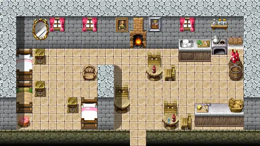
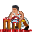

# Brimhaven inn east

| | |
|---|---|
| **Map ID** | `brimhaven_inn_east` |
| **Region** | In Brimhaven (settlement) |
| **Type** | Indoors / underground |
| **Size** | 16×9 tiles |
| **Introduced** | [v0.7.11](../versions/0.7.11.md) |
| **NPCs** | 5 |
| **Enemy types** | 3 |
| **Quests** | 1 |

**Brimhaven inn east** is an indoor map, in Brimhaven (settlement). It has 5 NPCs and 3 kinds of enemy. Exits lead to Brimhaven3.

## Map

<label class="lg"><input type="checkbox" data-t="spawn" checked><b>Red</b>&nbsp;Monsters / NPCs</label><label class="lg"><input type="checkbox" data-t="mapchange" checked><b>Blue</b>&nbsp;Exit to another map</label><label class="lg"><input type="checkbox" data-t="container" checked><b>Yellow</b>&nbsp;Container (click to see contents)</label><label class="lg"><input type="checkbox" data-t="sign" checked><b>Purple</b>&nbsp;Sign</label><label class="lg"><input type="checkbox" data-t="rest" checked><b>Green</b>&nbsp;Resting place</label><label class="lg"><input type="checkbox" data-t="key" checked><b>Orange dashed</b>&nbsp;Blocked until a quest step / item</label><label class="lg"><input type="checkbox" data-t="script"><b>Grey dotted</b>&nbsp;Scripted event</label><label class="lg"><input type="checkbox" data-t="replace"><b>White dotted</b>&nbsp;Changes during a quest</label><label class="lg"><input type="checkbox" data-t="pin" checked><b>Numbers</b>&nbsp;Numbered key points (see the key below the map)</label>

<a class="pin pin-exit" href="#key-1" style="left:53.125%;top:94.444%" title="Exit (south): to [Brimhaven3](brimhaven3.md)">1</a><a id="pin-npc-brv_butcher" class="pin pin-npc" href="#key-2" style="left:90.625%;top:61.111%" title="[Butcher](../../monsters/brv_butcher.md): NPC">2</a><a id="pin-npc-brv_inn_guest" class="pin pin-npc" href="#key-3" style="left:53.125%;top:61.111%" title="[Guest](../../monsters/brv_inn_guest.md): NPC">3</a><a id="pin-npc-melona" class="pin pin-npc" href="#key-4" style="left:71.875%;top:61.111%" title="[Melona](../../monsters/melona.md): shopkeeper">4</a><a id="pin-npc-quiet_thief" class="pin pin-npc" href="#key-5" style="left:53.125%;top:38.889%" title="[Pixtumn](../../monsters/quiet_thief.md): shopkeeper, 1 quest">5</a><a id="pin-npc-brv_cleaning" class="pin pin-npc" href="#key-6" style="left:28.125%;top:38.889%" title="[Room service](../../monsters/brv_cleaning.md): NPC">6</a><a class="pin pin-rest" href="#key-7" style="left:9.375%;top:50.000%" title="Resting place: Rest here to heal and set your respawn point">7</a><a class="pin pin-rest" href="#key-7" style="left:9.375%;top:72.222%" title="Resting place: Rest here to heal and set your respawn point">7</a><a class="pin pin-rest" href="#key-7" style="left:34.375%;top:83.333%" title="Resting place: Rest here to heal and set your respawn point">7</a><a class="pin pin-key" href="#key-8" style="left:9.786%;top:41.668%" title="Blocked passage: Unlocked during the quest: hidden story flag “nondisplay_2” (stage 230: “bought Brimhaven bed”)">8</a><a class="pin pin-key" href="#key-8" style="left:9.786%;top:63.890%" title="Blocked passage: Unlocked during the quest: hidden story flag “nondisplay_2” (stage 230: “bought Brimhaven bed”)">8</a><a class="pin pin-key" href="#key-8" style="left:34.786%;top:75.001%" title="Blocked passage: Unlocked during the quest: hidden story flag “nondisplay_2” (stage 230: “bought Brimhaven bed”)">8</a><a class="pin pin-script" href="#key-9" style="left:50.000%;top:50.000%" title="Quest trigger: Scripted event: advances the quest: hidden story flag “brv_dagger_nondisplay” to stage 20 (“Purchased knife”)">9</a><a class="pin pin-script" href="#key-10" style="left:46.990%;top:66.013%" title="Quest trigger: Scripted event: advances the quest: hidden story flag “brv_nondisplay” to stage 1 (“butcher state”)">10</a><a class="pin pin-replace" href="#key-11" style="left:91.036%;top:52.779%" title="Changes during a quest: This area changes during the quest: hidden story flag “brv_nondisplay” (stage 1: “butcher state”)">11</a><a class="pin pin-replace" href="#key-12" style="left:93.779%;top:68.423%" title="Changes during a quest: This area changes back during the quest: hidden story flag “brv_nondisplay” (stage 1: “butcher state”)">12</a>

??? abstract "Key to the numbers on the map"

    | # | What | Details |
    |---|---|---|
    | 1 | Exit (south) | to [Brimhaven3](brimhaven3.md) |
    | 2 | [Butcher](../monsters/brv_butcher.md) | NPC |
    | 3 | [Guest](../monsters/brv_inn_guest.md) | NPC |
    | 4 | [Melona](../monsters/melona.md) | shopkeeper |
    | 5 | [Pixtumn](../monsters/quiet_thief.md) | shopkeeper, 1 quest |
    | 6 | [Room service](../monsters/brv_cleaning.md) | NPC |
    | 7 | Resting place | Rest here to heal and set your respawn point |
    | 8 | Blocked passage | Unlocked during the quest: hidden story flag “nondisplay_2” (stage 230: “bought Brimhaven bed”) |
    | 9 | Quest trigger | Scripted event: advances the quest: hidden story flag “brv_dagger_nondisplay” to stage 20 (“Purchased knife”) |
    | 10 | Quest trigger | Scripted event: advances the quest: hidden story flag “brv_nondisplay” to stage 1 (“butcher state”) |
    | 11 | Changes during a quest | This area changes during the quest: hidden story flag “brv_nondisplay” (stage 1: “butcher state”) |
    | 12 | Changes during a quest | This area changes back during the quest: hidden story flag “brv_nondisplay” (stage 1: “butcher state”) |

Verified against v0.8.18 map data.

## Connections

| Direction | Leads to | Region there | Map # |
|---|---|---|---|
| South | [Brimhaven3](brimhaven3.md) | Brimhaven | 1 |

## NPCs

- [Butcher](../monsters/brv_butcher.md) (#2)
- [Guest](../monsters/brv_inn_guest.md) (#3)
- [Melona](../monsters/melona.md) — shopkeeper (#4)
- [Pixtumn](../monsters/quiet_thief.md) — shopkeeper — quests: [A strange looking dagger](../quests/brv_dagger.md) (#5)
- [Room service](../monsters/brv_cleaning.md) (#6)

## Enemies

| Enemy | HP | Damage | Up to | Notes |
|---|---|---|---|---|
| [Pixtumn](../monsters/quiet_thief.md#v-quiet_thief_2) | 0 | 0–0 | 1 | – |
| [Pixtumn](../monsters/quiet_thief.md#v-quiet_thief_1) | 0 | 0–0 | 1 | – |
| [Pixtumn](../monsters/quiet_thief.md#v-quiet_thief_3) | 0 | 0–0 | 1 | – |

<small>“Up to” is the most that can be alive at once from the spawn areas on this map.</small>

## Items & containers

**Shops:** [Melona](../monsters/melona.md), [Pixtumn](../monsters/quiet_thief.md)

## Quests

- [A strange looking dagger](../quests/brv_dagger.md): [Pixtumn](../monsters/quiet_thief.md) is involved
- [brv_dagger_nondisplay (hidden flag)](../quests/brv_dagger_nondisplay.md): [Pixtumn](../monsters/quiet_thief.md) is involved; something on this map advances it; stepping on a trigger here sets stage 10; stepping on a trigger here sets stage 20
- [brv_nondisplay (hidden flag)](../quests/brv_nondisplay.md): part of the map changes at stage 1; something on this map advances it; stepping on a trigger here sets stage 1
- [Placeholder for hidden quest stages 2 (not displayed) (hidden flag)](../quests/nondisplay_2.md): [Melona](../monsters/melona.md) is involved; blocked passage opens at stage 230

## Points of interest

- **Resting place** (#7): Rest here to heal and set your respawn point
- **Blocked passage** (#8): Unlocked during the quest: hidden story flag “nondisplay_2” (stage 230: “bought Brimhaven bed”)
- **Quest trigger** (#9): Scripted event: advances the quest: hidden story flag “brv_dagger_nondisplay” to stage 20 (“Purchased knife”)
- **Quest trigger** (#10): Scripted event: advances the quest: hidden story flag “brv_nondisplay” to stage 1 (“butcher state”)
- **Changes during a quest** (#11): This area changes during the quest: hidden story flag “brv_nondisplay” (stage 1: “butcher state”)
- **Changes during a quest** (#12): This area changes back during the quest: hidden story flag “brv_nondisplay” (stage 1: “butcher state”)

## Version history

| Version | Change |
|---|---|
| [v0.7.11](../versions/0.7.11.md) | Added |
| [v0.8.4](../versions/0.8.4.md) | Map layout or objects changed |

Verified against v0.8.18 and every earlier release back to v0.7.0 (game data compared release by release).

## Community notes

<small>Written by players, not generated from game data. **Observations**: what players notice in-game · **Lore**: the in-world story · **Trivia**: real-world facts, references, development history · **Theory / speculation**: unconfirmed ideas; may just be unfinished content</small>

### Observations

*No notes yet. Contributions are welcome: [add a note](https://github.com/asdfghjkl628/Andor-s-Trail-Wikiiii/new/main/notes/maps?filename=brimhaven_inn_east.md&value=%23%23%20Observations%0A%0A%3C%21--%20what%20players%20notice%20in-game%20--%3E%0A%0A%23%23%20Lore%0A%0A%3C%21--%20the%20in-world%20story%20--%3E%0A%0A%23%23%20Trivia%0A%0A%3C%21--%20real-world%20facts%2C%20references%2C%20development%20history%20--%3E%0A%0A%23%23%20Theory%20/%20speculation%0A%0A%3C%21--%20unconfirmed%20ideas%3B%20may%20just%20be%20unfinished%20content%20--%3E%0A).*

### Lore

*No notes yet. Contributions are welcome: [add a note](https://github.com/asdfghjkl628/Andor-s-Trail-Wikiiii/new/main/notes/maps?filename=brimhaven_inn_east.md&value=%23%23%20Observations%0A%0A%3C%21--%20what%20players%20notice%20in-game%20--%3E%0A%0A%23%23%20Lore%0A%0A%3C%21--%20the%20in-world%20story%20--%3E%0A%0A%23%23%20Trivia%0A%0A%3C%21--%20real-world%20facts%2C%20references%2C%20development%20history%20--%3E%0A%0A%23%23%20Theory%20/%20speculation%0A%0A%3C%21--%20unconfirmed%20ideas%3B%20may%20just%20be%20unfinished%20content%20--%3E%0A).*

### Trivia

*No notes yet. Contributions are welcome: [add a note](https://github.com/asdfghjkl628/Andor-s-Trail-Wikiiii/new/main/notes/maps?filename=brimhaven_inn_east.md&value=%23%23%20Observations%0A%0A%3C%21--%20what%20players%20notice%20in-game%20--%3E%0A%0A%23%23%20Lore%0A%0A%3C%21--%20the%20in-world%20story%20--%3E%0A%0A%23%23%20Trivia%0A%0A%3C%21--%20real-world%20facts%2C%20references%2C%20development%20history%20--%3E%0A%0A%23%23%20Theory%20/%20speculation%0A%0A%3C%21--%20unconfirmed%20ideas%3B%20may%20just%20be%20unfinished%20content%20--%3E%0A).*

### Theory / speculation

*No notes yet. Contributions are welcome: [add a note](https://github.com/asdfghjkl628/Andor-s-Trail-Wikiiii/new/main/notes/maps?filename=brimhaven_inn_east.md&value=%23%23%20Observations%0A%0A%3C%21--%20what%20players%20notice%20in-game%20--%3E%0A%0A%23%23%20Lore%0A%0A%3C%21--%20the%20in-world%20story%20--%3E%0A%0A%23%23%20Trivia%0A%0A%3C%21--%20real-world%20facts%2C%20references%2C%20development%20history%20--%3E%0A%0A%23%23%20Theory%20/%20speculation%0A%0A%3C%21--%20unconfirmed%20ideas%3B%20may%20just%20be%20unfinished%20content%20--%3E%0A).*

??? info "Technical information"

    | | |
    |---|---|
    | Map ID | `brimhaven_inn_east` |
    | File | `res/xml/brimhaven_inn_east.tmx` |
    | Size | 16×9 tiles (512×288 px) |
    | outdoors property | – |
    | Layers drawn | ground, objects, above, top |
    | Tilesets | map_bed_1, map_border_1, map_bridge_1, map_bridge_2, map_broken_1, map_cavewall_1, map_cavewall_2, map_cavewall_3, map_cavewall_4, map_chair_table_1, map_chair_table_2, map_crate_1, map_cupboard_1, map_curtain_1, map_entrance_1, map_entrance_2, map_fence_1, map_fence_2, map_fence_3, map_fence_4, map_ground_1, map_ground_2, map_ground_3, map_ground_4, map_ground_5, map_ground_6, map_ground_7, map_ground_8, map_house_1, map_house_2, map_indoor_1, map_indoor_2, map_kitchen_1, map_outdoor_1, map_pillar_1, map_pillar_2, map_plant_1, map_plant_2, map_rock_1, map_rock_2, map_roof_1, map_roof_2, map_roof_3, map_shop_1, map_sign_ladder_1, map_table_1, map_trail_1, map_transition_1, map_transition_2, map_transition_3, map_transition_4, map_transition_5, map_tree_1, map_tree_2, map_wall_1, map_wall_2, map_wall_3, map_wall_4, map_window_1, map_window_2 |
    | Map objects | spawn: 8, rest: 3, key: 3, script: 2, replace: 2, mapchange: 1 |
    | World map position | – |

<small>Data from v0.8.18</small>
